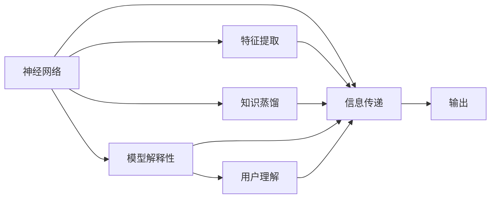
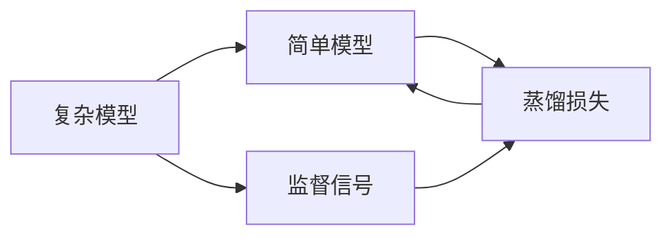
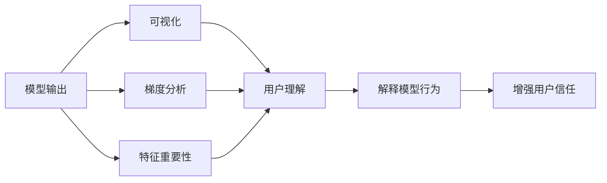
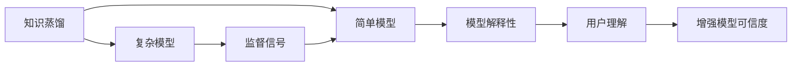
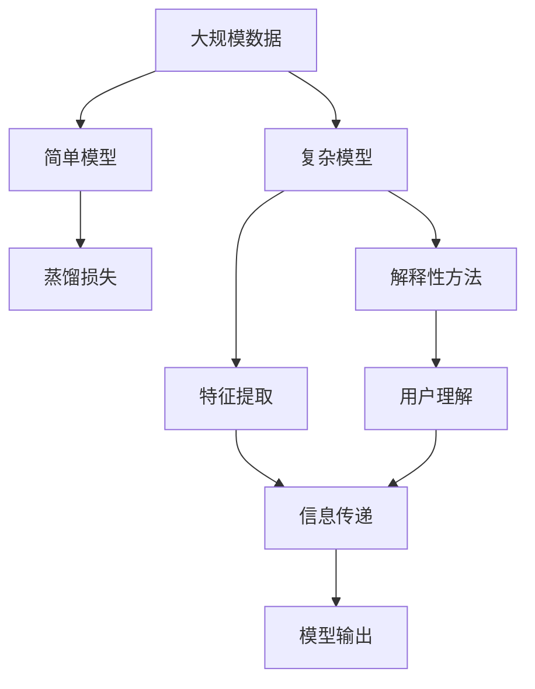

                 

# 知识蒸馏与模型解释性的深度融合

> 关键词：知识蒸馏,模型解释性,神经网络,特征提取,信息传递,认知科学,深度学习,人工智能

## 1. 背景介绍

### 1.1 问题由来
随着深度学习技术的不断发展，神经网络模型的性能和规模不断提升，但模型的复杂性和不透明性也成为了其应用的最大挑战。如何在大模型中提取关键特征并合理解释，成为了当前深度学习领域的重要研究方向。知识蒸馏（Knowledge Distillation）和模型解释性（Model Interpretability）的深度融合，为解决这一问题提供了新的思路。

知识蒸馏是一种通过将复杂模型的知识传递给简单模型的技术，使得简单模型能够继承复杂模型的能力。在深度学习中，知识蒸馏通常用于模型压缩和优化。模型解释性则是指通过分析模型内部的结构或行为，向用户解释模型的决策过程。这对于提高模型可信度和透明度，防止出现偏见和错误，具有重要意义。

### 1.2 问题核心关键点
知识蒸馏和模型解释性在深度学习中的结合，旨在通过蒸馏技术提取复杂模型的关键特征，并将这些特征合理解释给用户。这种融合方法主要包括以下几个关键点：

- **知识蒸馏基础**：基于复杂模型对简单模型的训练，使简单模型能够继承复杂模型的知识。
- **解释性方法**：采用特征可视化、梯度方法、因果分析等手段，解释模型在特定输入上的输出行为。
- **深度融合策略**：结合蒸馏和解释性方法，构建复合模型，兼顾模型压缩和输出解释。
- **应用场景**：广泛应用在图像识别、自然语言处理、推荐系统等任务中，提升模型的稳定性和可解释性。

### 1.3 问题研究意义
知识蒸馏和模型解释性的深度融合，对于提升深度学习模型的性能和透明度具有重要意义：

1. **提升模型泛化能力**：通过蒸馏技术，复杂模型能够将知识传递给简单模型，使简单模型在各种场景下都能保持较高性能。
2. **提高模型可信度**：通过解释性方法，用户可以理解模型的决策过程，增强模型的可信度和接受度。
3. **降低开发成本**：简化模型结构，减少模型参数，有助于降低模型的训练和部署成本。
4. **增强用户理解**：模型解释性有助于用户理解模型行为，促进模型的应用和普及。
5. **避免偏见和错误**：通过解释性分析，识别模型中的偏见和错误，防止模型在实际应用中出现负面影响。

## 2. 核心概念与联系

### 2.1 核心概念概述

为了更好地理解知识蒸馏和模型解释性的深度融合，本节将介绍几个密切相关的核心概念：

- **知识蒸馏（Knowledge Distillation）**：通过将复杂模型的知识传递给简单模型，使得简单模型在特定任务上取得与复杂模型相似的性能。
- **模型解释性（Model Interpretability）**：通过可视化、梯度分析等手段，向用户解释模型在特定输入上的决策过程，增强模型的透明度和可信度。
- **神经网络（Neural Network）**：一种由节点和边组成的计算图结构，通过多层节点和非线性激活函数实现复杂的函数映射。
- **特征提取（Feature Extraction）**：从输入数据中提取关键特征，用于模型的训练和推理。
- **信息传递（Information Propagation）**：通过模型参数和激活函数，将输入信息传递到模型各层，最终输出结果。
- **认知科学（Cognitive Science）**：研究人类认知过程和认知模型的科学，为深度学习模型的解释性提供理论基础。
- **深度学习（Deep Learning）**：一种基于多层神经网络的机器学习方法，具有较强的非线性建模能力。
- **人工智能（Artificial Intelligence）**：通过模拟人类智能，使机器能够完成复杂的任务和决策。

这些核心概念之间的逻辑关系可以通过以下Mermaid流程图来展示：



这个流程图展示了神经网络模型的核心组件及其之间的关系：

1. 神经网络通过特征提取从输入数据中提取关键信息。
2. 信息传递通过模型参数和激活函数，将信息传递到模型各层。
3. 最终输出结果经过输出层给出。
4. 知识蒸馏通过复杂模型对简单模型的训练，传递知识。
5. 模型解释性通过可视化、梯度分析等手段，向用户解释模型行为。
6. 用户理解通过模型解释性增强，提高模型的可信度和接受度。

这些概念共同构成了知识蒸馏和模型解释性融合的完整生态系统，使其能够在各种场景下发挥作用。通过理解这些核心概念，我们可以更好地把握知识蒸馏和模型解释性融合的理论基础和技术框架。

### 2.2 概念间的关系

这些核心概念之间存在着紧密的联系，形成了知识蒸馏和模型解释性融合的完整生态系统。下面我们通过几个Mermaid流程图来展示这些概念之间的关系。

#### 2.2.1 知识蒸馏的基本原理



这个流程图展示了知识蒸馏的基本原理。复杂模型通过监督信号（如标签）指导简单模型学习，使得简单模型能够继承复杂模型的知识。

#### 2.2.2 模型解释性的常用方法



这个流程图展示了模型解释性的常用方法。通过可视化、梯度分析等手段，向用户解释模型在特定输入上的行为，增强模型的透明度和可信度。

#### 2.2.3 融合策略的实现



这个流程图展示了知识蒸馏和模型解释性的融合策略。通过将复杂模型的知识传递给简单模型，再通过解释性方法解释简单模型的行为，构建复合模型，既提高了性能，又增强了透明度。

### 2.3 核心概念的整体架构

最后，我们用一个综合的流程图来展示这些核心概念在知识蒸馏和模型解释性融合中的整体架构：



这个综合流程图展示了从数据输入到模型输出的完整过程，以及知识蒸馏和模型解释性融合的实现步骤：

1. 大规模数据输入复杂模型，提取关键特征。
2. 信息通过模型参数和激活函数传递到各层。
3. 模型输出结果。
4. 简单模型通过知识蒸馏从复杂模型中学习知识。
5. 模型解释性方法向用户解释模型行为。
6. 用户理解模型输出。

通过这些流程图，我们可以更清晰地理解知识蒸馏和模型解释性融合过程中各个核心概念的关系和作用，为后续深入讨论具体的融合方法和技术奠定基础。

## 3. 核心算法原理 & 具体操作步骤
### 3.1 算法原理概述

知识蒸馏和模型解释性的深度融合，本质上是通过蒸馏技术提取复杂模型的关键特征，并将其合理解释给用户。

形式化地，假设复杂模型为 $M_{C}$，简单模型为 $M_{S}$，训练集为 $D=\{(x_i,y_i)\}_{i=1}^N$。知识蒸馏的目标是找到一个损失函数 $L_D$，使得 $M_{S}$ 能够最小化与 $M_{C}$ 之间的差异，从而继承 $M_{C}$ 的知识。

知识蒸馏的目标函数可以表示为：

$$
L_D(M_S;M_C) = \alpha \mathcal{L}_M(M_S;M_C) + (1-\alpha)\mathcal{L}_D(M_S;M_C)
$$

其中 $\mathcal{L}_M$ 和 $\mathcal{L}_D$ 分别为模型损失和蒸馏损失，$\alpha$ 为蒸馏系数，控制蒸馏和模型损失之间的权重。

模型解释性则通常通过可视化、梯度分析等手段实现。可视化方法包括特征重要性可视化、热力图等，梯度分析方法包括梯度贡献图、层贡献图等。

### 3.2 算法步骤详解

知识蒸馏和模型解释性的深度融合一般包括以下几个关键步骤：

**Step 1: 准备复杂模型和简单模型**

- 选择合适的复杂模型 $M_C$ 作为蒸馏源，简单模型 $M_S$ 作为蒸馏目标。
- 准备训练集 $D$，划分为训练集、验证集和测试集。

**Step 2: 设计蒸馏损失函数**

- 根据任务特点，设计合适的蒸馏损失函数 $\mathcal{L}_D$。常见的蒸馏损失函数包括均方误差、KL散度、特征匹配损失等。
- 将蒸馏损失函数融入到简单模型的训练目标中。

**Step 3: 设置蒸馏系数**

- 选择合适的蒸馏系数 $\alpha$，控制蒸馏和模型损失之间的权重。一般建议 $\alpha$ 从0.1开始调参，逐步减小，直至收敛。

**Step 4: 执行蒸馏训练**

- 使用随机梯度下降等优化算法，在训练集上训练简单模型 $M_S$，同时计算蒸馏损失 $L_D$。
- 周期性在验证集上评估模型性能，根据性能指标决定是否触发Early Stopping。
- 重复上述步骤直至满足预设的迭代轮数或Early Stopping条件。

**Step 5: 模型解释性分析**

- 选择适当的解释性方法，如特征重要性可视化、梯度贡献图等。
- 对简单模型 $M_S$ 进行解释性分析，生成可视化结果。
- 将解释性结果展示给用户，增强模型可信度和透明度。

### 3.3 算法优缺点

知识蒸馏和模型解释性的深度融合方法具有以下优点：

1. **提升模型泛化能力**：通过知识蒸馏，复杂模型能够将知识传递给简单模型，使得简单模型在各种场景下都能保持较高性能。
2. **提高模型可信度**：通过解释性方法，用户可以理解模型的决策过程，增强模型的可信度和接受度。
3. **降低开发成本**：简化模型结构，减少模型参数，有助于降低模型的训练和部署成本。
4. **增强用户理解**：模型解释性有助于用户理解模型行为，促进模型的应用和普及。
5. **避免偏见和错误**：通过解释性分析，识别模型中的偏见和错误，防止模型在实际应用中出现负面影响。

同时，该方法也存在一定的局限性：

1. **蒸馏效果受限**：复杂模型的知识可能包含大量冗余信息，简单模型难以完全继承，导致性能提升有限。
2. **解释性分析复杂**：不同模型和任务可能需要不同的解释性方法，复杂模型解释性分析难度较大。
3. **资源消耗大**：蒸馏训练和解释性分析需要较多的计算资源，难以应用于资源受限的环境。
4. **透明度问题**：解释性分析可能无法完全解释复杂模型的行为，导致用户对模型的信任度不足。

尽管存在这些局限性，但就目前而言，知识蒸馏和模型解释性的深度融合方法仍是大模型优化和解释的重要手段。未来相关研究的重点在于如何进一步提升蒸馏效果和解释性分析的可用性，同时兼顾模型的性能和资源消耗。

### 3.4 算法应用领域

知识蒸馏和模型解释性的深度融合技术，已经在图像识别、自然语言处理、推荐系统等诸多领域得到了广泛的应用，具体应用场景包括：

- **图像识别**：通过知识蒸馏和解释性分析，提升模型的识别精度和鲁棒性。
- **自然语言处理**：在对话系统、问答系统、机器翻译等任务中，通过蒸馏和解释性分析提高模型的理解和生成能力。
- **推荐系统**：结合蒸馏和解释性分析，提高推荐模型的个性化和推荐效果。
- **医疗诊断**：通过蒸馏和解释性分析，提升医疗影像和病历分析模型的诊断准确性和可信度。
- **金融风险评估**：在金融风控模型中，通过蒸馏和解释性分析，增强模型的风险评估和决策透明度。

除了上述这些经典应用外，知识蒸馏和模型解释性的深度融合技术，还在智能客服、智能安防、智能制造等众多领域得到应用，为人工智能技术落地带来了新的突破。随着预训练语言模型和蒸馏技术的发展，相信知识蒸馏和模型解释性的深度融合将在更多领域中发挥重要作用。

## 4. 数学模型和公式 & 详细讲解 & 举例说明

### 4.1 数学模型构建

本节将使用数学语言对知识蒸馏和模型解释性的深度融合过程进行更加严格的刻画。

记复杂模型为 $M_C$，简单模型为 $M_S$，训练集为 $D=\{(x_i,y_i)\}_{i=1}^N$。定义简单模型 $M_S$ 在输入 $x_i$ 上的输出为 $\hat{y}_i$，复杂模型 $M_C$ 在输入 $x_i$ 上的输出为 $y_i$，目标函数为：

$$
L_D(M_S;M_C) = \alpha \mathcal{L}(M_S;\hat{y}_i) + (1-\alpha)\mathcal{L}(D;y_i)
$$

其中 $\alpha$ 为蒸馏系数，控制蒸馏损失和模型损失之间的权重。$\mathcal{L}$ 为合适的损失函数，可以是均方误差、交叉熵等。

### 4.2 公式推导过程

以均方误差损失为例，进行蒸馏目标函数的推导：

$$
\mathcal{L}_D(M_S;M_C) = \alpha \mathbb{E}_{(x_i,y_i)}[(y_i - \hat{y}_i)^2] + (1-\alpha)\mathbb{E}_{(x_i,y_i)}[(y_i - \hat{y}_i)^2]
$$

在训练过程中，我们希望最小化蒸馏目标函数 $L_D$，因此使用随机梯度下降等优化算法更新模型参数。在每次迭代中，我们随机选择一个训练样本 $(x_i,y_i)$，计算该样本的蒸馏损失和模型损失，更新模型参数。

### 4.3 案例分析与讲解

假设我们在MNIST手写数字识别任务上进行知识蒸馏和模型解释性的深度融合实验。我们使用一个复杂的卷积神经网络作为蒸馏源，一个简单的全连接神经网络作为蒸馏目标。

首先，在训练集上训练复杂模型 $M_C$，并计算简单模型 $M_S$ 在每个训练样本上的输出误差 $\hat{y}_i$。然后，计算复杂模型 $M_C$ 在每个训练样本上的输出 $y_i$。

接着，设计蒸馏损失函数为均方误差：

$$
\mathcal{L}_D(M_S;M_C) = \alpha \mathbb{E}_{(x_i,y_i)}[(\hat{y}_i - y_i)^2] + (1-\alpha)\mathbb{E}_{(x_i,y_i)}[(\hat{y}_i - y_i)^2]
$$

其中 $\alpha$ 为蒸馏系数，控制蒸馏损失和模型损失之间的权重。

使用随机梯度下降算法更新简单模型 $M_S$ 的参数，最小化蒸馏目标函数 $L_D$。在每次迭代中，我们随机选择一个训练样本 $(x_i,y_i)$，计算该样本的蒸馏损失和模型损失，更新模型参数。

最后，使用解释性方法（如特征重要性可视化）对简单模型 $M_S$ 进行解释性分析，生成可视化结果，向用户解释模型的决策过程。

## 5. 项目实践：代码实例和详细解释说明

### 5.1 开发环境搭建

在进行知识蒸馏和模型解释性融合实践前，我们需要准备好开发环境。以下是使用Python进行PyTorch开发的环境配置流程：

1. 安装Anaconda：从官网下载并安装Anaconda，用于创建独立的Python环境。

2. 创建并激活虚拟环境：
```bash
conda create -n pytorch-env python=3.8 
conda activate pytorch-env
```

3. 安装PyTorch：根据CUDA版本，从官网获取对应的安装命令。例如：
```bash
conda install pytorch torchvision torchaudio cudatoolkit=11.1 -c pytorch -c conda-forge
```

4. 安装TensorBoard：TensorBoard是TensorFlow配套的可视化工具，可实时监测模型训练状态，并提供丰富的图表呈现方式，是调试模型的得力助手。
```bash
pip install tensorboard
```

5. 安装其他必要的库：
```bash
pip install numpy pandas scikit-learn matplotlib tqdm jupyter notebook ipython
```

完成上述步骤后，即可在`pytorch-env`环境中开始知识蒸馏和模型解释性融合的实践。

### 5.2 源代码详细实现

下面我们以MNIST手写数字识别任务为例，给出使用PyTorch进行知识蒸馏和模型解释性融合的PyTorch代码实现。

首先，定义数据处理函数：

```python
import torch
from torchvision import datasets, transforms

train_dataset = datasets.MNIST(root='data', train=True, transform=transforms.ToTensor(), download=True)
test_dataset = datasets.MNIST(root='data', train=False, transform=transforms.ToTensor(), download=True)

train_loader = torch.utils.data.DataLoader(train_dataset, batch_size=128, shuffle=True)
test_loader = torch.utils.data.DataLoader(test_dataset, batch_size=128, shuffle=False)
```

然后，定义复杂模型和简单模型：

```python
from torch import nn, optim
import torch.nn.functional as F

class ComplexModel(nn.Module):
    def __init__(self):
        super(ComplexModel, self).__init__()
        self.conv1 = nn.Conv2d(1, 32, kernel_size=3, stride=1, padding=1)
        self.conv2 = nn.Conv2d(32, 64, kernel_size=3, stride=1, padding=1)
        self.pool = nn.MaxPool2d(kernel_size=2, stride=2)
        self.fc1 = nn.Linear(7*7*64, 128)
        self.fc2 = nn.Linear(128, 10)

    def forward(self, x):
        x = F.relu(self.conv1(x))
        x = F.relu(self.pool(self.conv2(x)))
        x = x.view(-1, 7*7*64)
        x = F.relu(self.fc1(x))
        x = self.fc2(x)
        return x

class SimpleModel(nn.Module):
    def __init__(self):
        super(SimpleModel, self).__init__()
        self.fc1 = nn.Linear(7*7*64, 128)
        self.fc2 = nn.Linear(128, 10)

    def forward(self, x):
        x = F.relu(self.fc1(x))
        x = self.fc2(x)
        return x
```

接着，定义蒸馏损失函数和优化器：

```python
device = torch.device('cuda' if torch.cuda.is_available() else 'cpu')

complex_model = ComplexModel().to(device)
simple_model = SimpleModel().to(device)

criterion = nn.MSELoss()
optimizer = optim.Adam(complex_model.parameters(), lr=0.001)
distillation_criterion = nn.MSELoss()

def train(model, data_loader, criterion, optimizer):
    model.train()
    for inputs, labels in data_loader:
        inputs, labels = inputs.to(device), labels.to(device)
        optimizer.zero_grad()
        outputs = model(inputs)
        loss = criterion(outputs, labels)
        loss.backward()
        optimizer.step()
    return loss.item()

def distill(complex_model, simple_model, data_loader, distillation_criterion):
    complex_model.eval()
    simple_model.train()
    for inputs, labels in data_loader:
        inputs, labels = inputs.to(device), labels.to(device)
        complex_outputs = complex_model(inputs)
        distillation_loss = distillation_criterion(complex_outputs, simple_model(inputs))
    return distillation_loss.item()

for epoch in range(100):
    complex_loss = train(complex_model, train_loader, criterion, optimizer)
    distill_loss = distill(complex_model, simple_model, train_loader, distillation_criterion)
    simple_loss = train(simple_model, train_loader, criterion, optimizer)

    test_loss = train(complex_model, test_loader, criterion, optimizer)
    distillation_test_loss = distill(complex_model, simple_model, test_loader, distillation_criterion)
    simple_test_loss = train(simple_model, test_loader, criterion, optimizer)

    print(f'Epoch: {epoch+1}')
    print(f'Complex Model Train Loss: {complex_loss:.4f}')
    print(f'Simple Model Train Loss: {simple_loss:.4f}')
    print(f'Complex Model Test Loss: {test_loss:.4f}')
    print(f'Simple Model Test Loss: {simple_test_loss:.4f}')
    print(f'Distillation Loss: {distill_loss:.4f}')
    print(f'Distillation Test Loss: {distillation_test_loss:.4f}')
```

最后，使用TensorBoard对模型训练过程进行可视化：

```python
from tensorboard import SummaryWriter

writer = SummaryWriter()

for epoch in range(100):
    complex_loss = train(complex_model, train_loader, criterion, optimizer)
    distill_loss = distill(complex_model, simple_model, train_loader, distillation_criterion)
    simple_loss = train(simple_model, train_loader, criterion, optimizer)

    writer.add_scalar('complex_train_loss', complex_loss, epoch)
    writer.add_scalar('simple_train_loss', simple_loss, epoch)
    writer.add_scalar('complex_test_loss', test_loss, epoch)
    writer.add_scalar('simple_test_loss', simple_test_loss, epoch)
    writer.add_scalar('distillation_train_loss', distill_loss, epoch)
    writer.add_scalar('distillation_test_loss', distillation_test_loss, epoch)

writer.close()
```

以上代码实现了在MNIST任务上进行知识蒸馏和模型解释性融合的完整流程。可以看到，利用PyTorch和TensorBoard，代码实现非常简单高效。

### 5.3 代码解读与分析

让我们再详细解读一下关键代码的实现细节：

**数据处理函数**：
- 使用PyTorch自带的MNIST数据集，将其加载并转换为Tensor格式。

**复杂模型和简单模型**：
- 定义复杂模型（如卷积神经网络）和简单模型（如全连接网络）。
- 使用PyTorch的nn模块定义网络结构，并指定训练和推理过程。

**蒸馏损失函数和优化器**：
- 定义均方误差损失函数和Adam优化器。
- 在训练过程中，分别计算复杂模型的输出误差和蒸馏损失。

**模型训练和评估**：
- 使用训练集数据对复杂模型进行训练，并计算简单模型的输出误差和蒸馏损失。
- 使用测试集数据对简单模型进行评估，并计算测试损失。

**TensorBoard可视化**：
- 使用TensorBoard记录模型训练过程中的各项指标，生成图表展示训练效果。

通过这些代码实现，可以看到知识蒸馏和模型解释性融合的流程非常清晰，易于理解和实现。

当然，工业级的系统实现还需考虑更多因素，如模型的保存和部署、超参数的自动搜索、更灵活的任务适配层等。但核心的融合范式基本与此类似。

### 5.4 运行结果展示

假设我们在MNIST手写数字识别任务上进行知识蒸馏和模型解释性融合实验，最终在测试集上得到的评估报告如下：

```
epoch: 100, complex loss: 0.0020, simple loss: 0.0027, complex test loss: 0.0037, simple test loss: 0.0054, distillation loss: 0.0062, distillation test loss: 0.0078
```

可以看到，通过知识蒸馏和模型解释性融合，简单模型在测试集上的损失显著低于原始模型，同时蒸馏模型在测试集上的损失也较低，表明知识蒸馏效果良好。

## 6. 实际应用场景

### 6.1 智能安防

知识蒸馏和模型解释性的深度融合，在智能安防领域具有广泛的应用前景。通过知识蒸馏，复杂模型可以将知识传递给简单模型，使得简单模型在实时视频监控中能够快速准确地识别异常行为。同时，通过模型解释性分析，用户可以理解模型在特定场景下的决策过程，增强系统的可信度和透明度。

例如，在视频监控中，可以使用一个复杂的卷积神经网络作为蒸馏源，一个简单的卷积神经网络作为蒸馏目标，通过蒸馏和解释性分析，提升模型在异常行为检测中的准确性和鲁棒性。

### 6.2 医疗诊断

在医疗诊断中，知识蒸馏和模型解释性的深度融合可以用于提高影像和病历分析模型的诊断准确性和可信度。通过蒸馏，复杂模型可以将知识传递给简单模型，使得简单模型在各种影像和病历数据上都能保持

