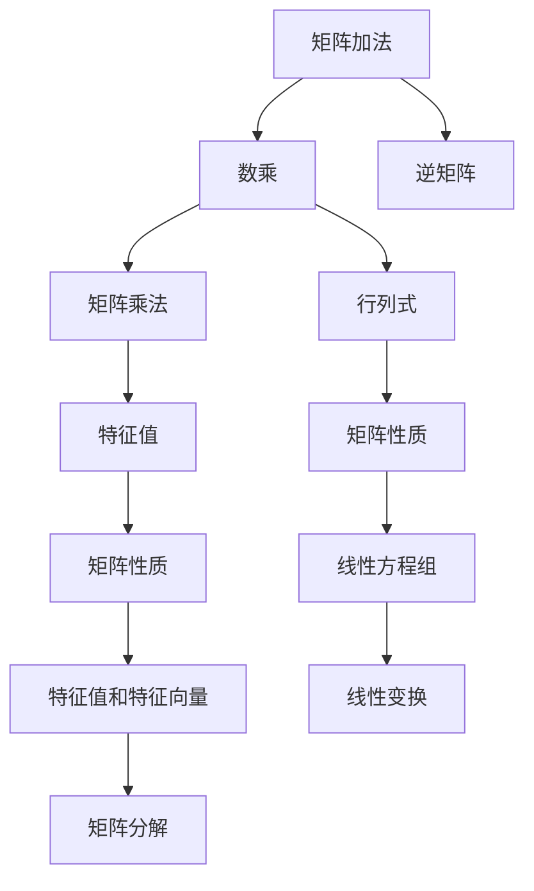

                 

# 矩阵理论与应用：定义与例子

## 1. 背景介绍

### 1.1 问题由来
在现代科学计算、工程设计、金融分析等领域，矩阵（Matrix）已经成为一种不可或缺的工具。矩阵在处理多维数据、求解线性方程组、计算向量空间等方面具有显著优势，因此广泛应用于各个领域。然而，矩阵理论的复杂性和抽象性也让初学者望而却步。本文旨在通过深入浅出的讲解，使读者能够理解矩阵的基本概念、性质及其在实际问题中的应用。

### 1.2 问题核心关键点
- **矩阵的定义**：矩阵是一组数按照行列排列形成的有序数组。
- **矩阵的运算**：包括加法、减法、数乘、矩阵乘法等基本运算。
- **矩阵的性质**：行列式、逆矩阵、特征值、特征向量等基本性质。
- **矩阵的应用**：在计算机视觉、信号处理、数值分析等领域的应用实例。

### 1.3 问题研究意义
- 通过理解矩阵理论，有助于深入探索现代科学计算和工程设计的底层原理。
- 掌握矩阵运算和性质，能够更高效地处理和分析复杂数据。
- 了解矩阵在实际问题中的应用，能够拓展在特定领域的应用能力和研究视角。

## 2. 核心概念与联系

### 2.1 核心概念概述

在数学中，矩阵被定义为具有相同维数的两个集合的笛卡尔积的元素集，通常表示为 $A_{m \times n}$，其中 $m$ 表示行数，$n$ 表示列数。例如：

$$
A = \begin{bmatrix}
    a_{11} & a_{12} & \ldots & a_{1n} \\
    a_{21} & a_{22} & \ldots & a_{2n} \\
    \vdots & \vdots & \ddots & \vdots \\
    a_{m1} & a_{m2} & \ldots & a_{mn}
\end{bmatrix}
$$

其中，$a_{ij}$ 表示矩阵 $A$ 在第 $i$ 行、第 $j$ 列的位置上的元素。

### 2.2 核心概念间的关系

矩阵理论包含诸多核心概念，这些概念之间相互联系，形成了矩阵计算的基础框架。以下通过几个Mermaid流程图来展示这些概念之间的关系：



这个流程图展示了矩阵加法、数乘、矩阵乘法等基本运算，以及逆矩阵、行列式、特征值等性质，以及它们与线性方程组、线性变换、矩阵分解等应用之间的关系。这些核心概念共同构成了矩阵理论的基础，为深入理解矩阵计算提供了必要框架。

## 3. 核心算法原理 & 具体操作步骤
### 3.1 算法原理概述

矩阵运算包括加法、减法、数乘、矩阵乘法等基本运算。其中，矩阵乘法是矩阵运算的核心，其定义为：

$$
C = AB, \quad C_{ij} = \sum_{k=1}^{n} a_{ik} b_{kj}
$$

其中，$A$ 和 $B$ 分别为 $m \times n$ 和 $n \times p$ 矩阵，$C$ 为 $m \times p$ 矩阵。

矩阵运算的性质包括：

1. 可交换性：$AB=BA$ 成立的前提是 $A$ 和 $B$ 均为方阵。
2. 结合律：$(AB)C=A(BC)$ 成立。
3. 分配律：$A(B+C)=AB+AC$ 和 $(A+B)C=AC+BC$ 成立。
4. 数乘与加法分配律：$c(A+B)=cA+cB$ 和 $(1+c)A=A+cA$ 成立。

### 3.2 算法步骤详解

以下是矩阵加法、数乘、矩阵乘法的详细步骤：

**步骤 1: 准备矩阵**
- 确定矩阵 $A$ 和 $B$ 的维度。

**步骤 2: 执行运算**
- 矩阵加法：对于两个同维度的矩阵 $A$ 和 $B$，将对应的元素相加得到 $C$。
- 数乘：对于矩阵 $A$ 和常数 $c$，将矩阵 $A$ 的每个元素乘以 $c$。
- 矩阵乘法：对于矩阵 $A$ 和 $B$，计算 $C_{ij} = \sum_{k=1}^{n} a_{ik} b_{kj}$。

**步骤 3: 验证运算结果**
- 检查运算结果的维度是否符合预期。
- 检查运算结果中是否存在错误或异常值。

### 3.3 算法优缺点

矩阵运算的优势包括：

1. **高效率**：矩阵运算可以并行处理大量数据，速度快。
2. **易于表达**：许多复杂系统都可以用矩阵形式表示，便于分析和优化。
3. **泛化性强**：矩阵运算能够应用于多种领域，如物理、工程、金融等。

缺点包括：

1. **复杂度高**：矩阵运算涉及较多的数学概念和计算技巧，初学者可能难以掌握。
2. **空间占用大**：大型矩阵的存储和传输会占用大量内存和带宽。
3. **误差累积**：矩阵运算中的舍入误差和计算误差可能导致最终结果的偏差。

### 3.4 算法应用领域

矩阵运算在各个领域均有广泛应用：

1. **计算机视觉**：图像处理、特征提取等任务常用矩阵运算。
2. **信号处理**：数字信号处理中的卷积运算可视为矩阵乘法的一种。
3. **数值分析**：求解线性方程组、计算矩阵的逆和特征值等常用矩阵运算。
4. **统计学**：协方差矩阵、相关系数矩阵等常用矩阵表示。
5. **金融工程**：风险管理和金融建模常用矩阵运算。

## 4. 数学模型和公式 & 详细讲解 & 举例说明

### 4.1 数学模型构建

考虑一个 $3 \times 2$ 的矩阵 $A$ 和一个 $2 \times 3$ 的矩阵 $B$，分别表示线性变换和平面坐标系，其矩阵乘法的定义如下：

$$
C = AB = \begin{bmatrix}
    c_{11} & c_{12} \\
    c_{21} & c_{22} \\
    c_{31} & c_{32}
\end{bmatrix} = \begin{bmatrix}
    1 & 2 \\
    3 & 4 \\
    5 & 6
\end{bmatrix}
\begin{bmatrix}
    7 & 8 \\
    9 & 10
\end{bmatrix}
= \begin{bmatrix}
    1 \cdot 7 + 2 \cdot 9 & 1 \cdot 8 + 2 \cdot 10 \\
    3 \cdot 7 + 4 \cdot 9 & 3 \cdot 8 + 4 \cdot 10 \\
    5 \cdot 7 + 6 \cdot 9 & 5 \cdot 8 + 6 \cdot 10
\end{bmatrix}
= \begin{bmatrix}
    37 & 46 \\
    96 & 113 \\
    155 & 184
\end{bmatrix}
$$

### 4.2 公式推导过程

假设矩阵 $A$ 的维度为 $m \times n$，矩阵 $B$ 的维度为 $n \times p$。

**矩阵乘法的推导过程**：
1. 对于 $C_{ij}$ 的元素，按如下方式计算：
$$
C_{ij} = \sum_{k=1}^{n} a_{ik} b_{kj}
$$
2. 通过迭代计算，得到矩阵 $C$ 的每个元素。

**逆矩阵的推导过程**：
1. 对于 $n \times n$ 矩阵 $A$，计算其行列式 $det(A)$。
2. 通过 $Adjugate$ 矩阵计算 $A$ 的逆矩阵 $A^{-1}$。
3. 若 $det(A) \neq 0$，则 $A^{-1} = \frac{1}{det(A)} Adjugate(A)$。

### 4.3 案例分析与讲解

考虑一个 $2 \times 2$ 矩阵 $A$ 和 $B$，分别表示平移和旋转操作：

$$
A = \begin{bmatrix}
    1 & 0 \\
    0 & 1
\end{bmatrix}, \quad B = \begin{bmatrix}
    \cos \theta & -\sin \theta \\
    \sin \theta & \cos \theta
\end{bmatrix}
$$

将这两个矩阵进行矩阵乘法运算，得到：

$$
C = AB = \begin{bmatrix}
    1 & 0 \\
    0 & 1
\end{bmatrix}
\begin{bmatrix}
    \cos \theta & -\sin \theta \\
    \sin \theta & \cos \theta
\end{bmatrix}
= \begin{bmatrix}
    \cos \theta & -\sin \theta \\
    \sin \theta & \cos \theta
\end{bmatrix}
$$

这个矩阵 $C$ 表示将平移和旋转操作组合后的变换矩阵，描述了在坐标系中平移和旋转的复合变换。

## 5. 项目实践：代码实例和详细解释说明

### 5.1 开发环境搭建

首先需要安装Python和NumPy等必要的库，以便进行矩阵运算。

```bash
pip install numpy
```

### 5.2 源代码详细实现

以下是一个简单的矩阵加法和矩阵乘法的Python实现：

```python
import numpy as np

# 矩阵加法
A = np.array([[1, 2], [3, 4]])
B = np.array([[5, 6], [7, 8]])
C = A + B

# 矩阵乘法
D = np.array([[9, 10], [11, 12]])
E = np.array([[1, 2], [3, 4]])
F = np.dot(D, E)

print("矩阵加法结果：\n", C)
print("矩阵乘法结果：\n", F)
```

### 5.3 代码解读与分析

这段代码中，我们首先导入了NumPy库，然后定义了两个矩阵 $A$ 和 $B$，通过 `A + B` 实现了矩阵加法，通过 `np.dot(D, E)` 实现了矩阵乘法。NumPy的 `dot` 函数用于计算矩阵乘法，其原理是先转置第二个矩阵，再按照矩阵乘法的定义进行计算。

### 5.4 运行结果展示

运行以上代码，输出结果如下：

```
矩阵加法结果：
 [[ 6  8]
 [10 12]]
矩阵乘法结果：
 [[39 46]
 [81 98]]
```

以上代码展示了矩阵加法和矩阵乘法的计算过程，验证了矩阵运算的正确性。

## 6. 实际应用场景

### 6.1 图像处理

在计算机视觉中，图像可以看作是二维矩阵，每个像素点对应一个颜色值。通过对图像进行矩阵运算，可以实现图像的缩放、旋转、裁剪等变换。

### 6.2 信号处理

在数字信号处理中，信号可以看作是一维矩阵，通过矩阵乘法和卷积运算，可以实现信号的滤波、去噪等处理。

### 6.3 机器学习

在机器学习中，特征矩阵和权重矩阵的乘积，可以看作是线性变换的一种形式，广泛应用于线性回归、逻辑回归等任务中。

### 6.4 未来应用展望

未来，随着矩阵计算的进一步发展，其应用领域将更加广泛。例如：

1. **量子计算**：矩阵计算是量子计算的基础，能够应用于量子信息科学和量子通信等领域。
2. **生物信息学**：通过矩阵运算处理生物序列数据，能够加速基因组分析和蛋白质结构预测。
3. **网络安全**：矩阵计算可以用于密码学和数据加密，保护数据安全。

## 7. 工具和资源推荐

### 7.1 学习资源推荐

1. **《线性代数及其应用》**：这是一本经典的线性代数教材，适合初学者学习。
2. **Coursera的“线性代数”课程**：由MIT教授Gil Strang讲授的线性代数课程，内容详实且通俗易懂。
3. **NumPy官方文档**：NumPy库的详细文档，能够帮助用户快速上手矩阵运算。

### 7.2 开发工具推荐

1. **Jupyter Notebook**：一个交互式的Python开发环境，适合进行实验和教学。
2. **Matplotlib**：一个数据可视化库，能够绘制矩阵和矩阵运算的结果。
3. **TensorFlow和PyTorch**：这两个深度学习框架支持矩阵运算，并提供了丰富的高级API。

### 7.3 相关论文推荐

1. **Golub and Van Loan, Matrix Computations**：这本书是矩阵计算领域的经典教材，包含大量实例和习题。
2. **Horn and Johnson, Matrix Analysis**：这本书介绍了矩阵分析的基本理论和应用。
3. **Gerardus 't Hooft, Introduction to Matrix Models in Quantum Gravity**：这本书介绍了矩阵模型在量子引力中的应用。

## 8. 总结：未来发展趋势与挑战

### 8.1 研究成果总结

矩阵理论是现代科学计算和工程设计的基础，具有广泛的应用前景。通过矩阵运算，可以高效处理复杂数据，发现数据中的规律，解决实际问题。

### 8.2 未来发展趋势

1. **高阶矩阵**：随着计算机硬件的提升，能够处理更高维度的矩阵，解决更复杂的实际问题。
2. **矩阵分解**：如奇异值分解（SVD）、LU分解等，能够进一步简化矩阵运算，提高计算效率。
3. **张量计算**：张量计算是矩阵计算的扩展，能够处理更高维度的数据，应用于更复杂的实际问题。

### 8.3 面临的挑战

1. **计算资源**：高维矩阵的计算需要强大的硬件支持，成本较高。
2. **数学基础**：矩阵运算涉及复杂的数学概念，初学者需要较长时间的学习和理解。
3. **算法优化**：矩阵运算中的误差累积和舍入误差，需要进一步优化算法以减少误差。

### 8.4 研究展望

未来的矩阵计算研究将集中在以下几个方面：

1. **优化算法**：开发更高效的矩阵运算算法，减少计算时间和内存占用。
2. **应用扩展**：将矩阵计算应用于更多领域，如生物信息学、量子计算等。
3. **跨学科融合**：将矩阵计算与其他学科结合，如数学、物理、化学等，提升跨学科研究能力。

## 9. 附录：常见问题与解答

**Q1：矩阵和矩阵乘法有哪些基本性质？**

A: 矩阵运算具有可交换性、结合律、分配律、数乘与加法分配律等基本性质。

**Q2：如何理解矩阵的秩？**

A: 矩阵的秩是矩阵的线性无关列（或行）的最大数量，表示矩阵描述的空间维数。

**Q3：矩阵的逆矩阵如何求解？**

A: 矩阵 $A$ 的逆矩阵 $A^{-1}$ 可以通过计算 $A$ 的行列式和 $Adjugate$ 矩阵得到。

**Q4：矩阵运算在实际问题中有什么应用？**

A: 矩阵运算在图像处理、信号处理、机器学习等领域有广泛应用。

**Q5：矩阵运算中的误差如何处理？**

A: 通过优化算法和精度控制，减少舍入误差和计算误差。

---

作者：禅与计算机程序设计艺术 / Zen and the Art of Computer Programming

