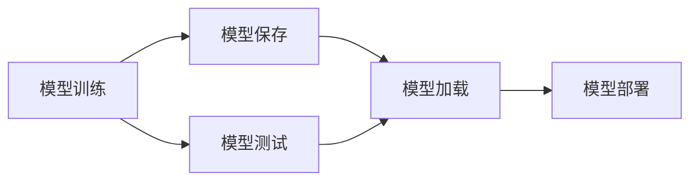
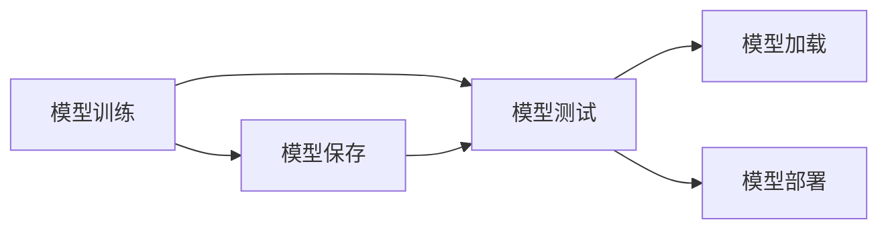
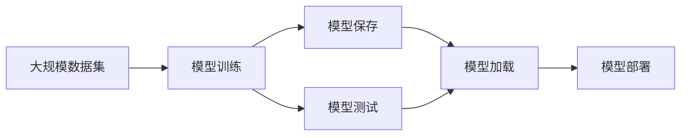

                 

## 1. 背景介绍

### 1.1 问题由来
在人工智能（AI）和机器学习（ML）领域，模型复用是一个至关重要的问题。模型复用不仅能够节省大量的时间和成本，还能提高模型的稳定性和可靠性。在实践中，我们常常会遇到以下情况：

- 某个模型在特定的任务上表现出色，但无法直接应用于其他任务。
- 模型在训练过程中遇到了问题，无法直接使用，需要重新训练。
- 模型在不同的环境或硬件上运行时性能差异较大。

针对上述问题，模型复用就显得尤为重要。但现实中，模型的打包和发布又是一个复杂且容易出错的过程。本文将深入探讨如何高效地打包和发布神经网络模型，以及如何方便地复用这些模型。

### 1.2 问题核心关键点
模型复用涉及多个环节，包括模型训练、模型保存、模型加载、模型测试、模型部署等。我们必须考虑到模型的可重用性和可扩展性，以确保模型在不同场景下都能稳定运行。

关键问题包括：
- 如何高效地保存和加载模型？
- 如何确保模型在不同环境下的兼容性和性能？
- 如何管理模型依赖和版本，避免版本冲突？
- 如何高效地复用模型，避免重复训练和优化？

### 1.3 问题研究意义
研究模型打包和复用的方法，对于促进AI技术的落地应用，提高模型开发效率，降低研发成本，具有重要意义：

- 提高模型的稳定性和可靠性。复用已有的模型可以避免重新训练，确保模型在不同环境下的性能一致。
- 降低模型开发的成本和时间。复用模型可以减少重复工作，加速模型开发流程。
- 提升模型开发的标准化程度。复用模型可以推动模型开发的标准化和规范化，促进技术的普及和应用。
- 加速AI技术的产业化进程。复用模型可以推动AI技术的快速落地和应用，为各行各业提供智能解决方案。

## 2. 核心概念与联系

### 2.1 核心概念概述

为了更好地理解模型打包和复用的原理，我们先介绍几个核心概念：

- **神经网络（Neural Network, NN）**：一种基于生物神经网络启发设计的计算模型，用于解决复杂的非线性问题。神经网络由多个层组成，每一层包含多个节点，节点之间通过权重连接。
- **深度学习（Deep Learning, DL）**：一种特殊的机器学习方法，使用多层神经网络进行特征学习和模型训练，能够自动发现数据中的复杂结构。
- **模型保存（Model Serialization）**：将训练好的神经网络模型保存下来，以便在后续任务中使用。通常包括模型的权重和结构信息。
- **模型加载（Model Deserialization）**：从保存的文件中读取模型信息，加载到内存或计算图中进行推理。
- **模型测试（Model Validation）**：对加载的模型进行测试，评估模型的性能和准确度，确保模型能够正确地进行推理。
- **模型部署（Model Deployment）**：将训练好的模型集成到实际应用中，供用户使用。

这些概念之间的联系通过以下Mermaid流程图展示：



该流程图展示了从模型训练到模型部署的全过程。模型训练是整个过程的基础，模型保存用于记录训练结果，模型测试用于评估模型性能，模型加载用于在后续任务中使用模型，模型部署用于将模型集成到实际应用中。

### 2.2 概念间的关系

上述概念之间的联系可以通过以下逻辑关系图展示：



该逻辑关系图展示了模型训练和测试与模型保存、加载、部署之间的关系。模型训练和测试的结果是模型保存和加载的输入，而模型加载是模型部署的前置步骤。

### 2.3 核心概念的整体架构

我们通过以下综合的流程图来展示这些核心概念在大模型打包和复用过程中的整体架构：



该综合流程图展示了模型打包和复用的全过程，从大规模数据集开始，通过模型训练得到模型，保存模型、测试模型、加载模型，最后部署模型，整个过程形成一个完整的闭环。

## 3. 核心算法原理 & 具体操作步骤
### 3.1 算法原理概述

模型打包和复用是基于监督学习的，其核心思想是：将训练好的模型保存下来，然后在需要的地方进行加载和使用。在加载和使用的过程中，需要确保模型的兼容性和性能。

具体而言，算法原理如下：

- **模型保存**：将训练好的模型保存到一个文件中，该文件包含模型的权重和结构信息。
- **模型加载**：从文件中读取模型的权重和结构信息，加载到内存或计算图中进行推理。
- **模型测试**：对加载的模型进行测试，评估模型的性能和准确度，确保模型能够正确地进行推理。
- **模型部署**：将加载的模型集成到实际应用中，供用户使用。

### 3.2 算法步骤详解

下面是模型打包和复用的详细步骤：

**Step 1: 准备训练数据和环境**
- 准备大规模数据集，确保数据集的质量和多样性。
- 准备训练环境，包括计算资源、软件工具等。

**Step 2: 训练模型**
- 使用深度学习框架（如TensorFlow、PyTorch等）训练模型。
- 记录训练过程中的日志和参数，以便后续调整和优化。

**Step 3: 保存模型**
- 将训练好的模型保存到一个文件中，常用的保存格式包括TensorFlow SavedModel、PyTorch模型文件、ONNX格式等。
- 记录模型的配置信息，包括模型架构、超参数、数据格式等。

**Step 4: 模型测试**
- 对保存的模型进行加载和测试，评估模型的性能和准确度。
- 使用测试集对模型进行测试，记录测试结果，包括准确率、召回率、F1值等指标。

**Step 5: 模型部署**
- 将加载的模型集成到实际应用中，包括API接口、SDK等。
- 对模型进行优化和调整，确保模型在不同环境下的性能和稳定性。

### 3.3 算法优缺点

模型打包和复用有以下优点：
- 提高模型的重用性和可扩展性，降低研发成本和时间。
- 确保模型在不同环境下的性能一致，提高模型的可靠性。
- 简化模型开发流程，推动模型的标准化和规范化。

缺点包括：
- 模型保存和加载过程中可能遇到版本兼容性问题。
- 模型在不同环境下的性能可能存在差异，需要进行优化和调整。
- 模型打包和部署可能涉及复杂的依赖关系，管理起来较为复杂。

### 3.4 算法应用领域

模型打包和复用在多个领域中都有广泛的应用，包括：

- **计算机视觉**：图像分类、目标检测、语义分割等任务。
- **自然语言处理**：文本分类、情感分析、机器翻译等任务。
- **推荐系统**：用户兴趣推荐、商品推荐等任务。
- **医疗健康**：疾病诊断、影像分析等任务。
- **金融领域**：信用评分、风险评估等任务。

## 4. 数学模型和公式 & 详细讲解  
### 4.1 数学模型构建

为了更好地理解模型打包和复用的数学模型，我们需要定义一些基本概念：

- **损失函数（Loss Function）**：用于评估模型输出的误差，常用的损失函数包括均方误差（MSE）、交叉熵损失（Cross-Entropy Loss）等。
- **优化算法（Optimization Algorithm）**：用于更新模型参数，常用的优化算法包括随机梯度下降（SGD）、Adam等。
- **模型评估指标（Evaluation Metrics）**：用于评估模型的性能，常用的指标包括准确率（Accuracy）、精确率（Precision）、召回率（Recall）、F1值等。

### 4.2 公式推导过程

以一个简单的二分类任务为例，我们推导一下模型打包和复用的数学模型：

假设训练集为 $D=\{(x_i, y_i)\}_{i=1}^N$，其中 $x_i$ 为输入，$y_i$ 为标签。模型的输出为 $f(x)$，目标函数为损失函数 $L(y, f(x))$。

模型的目标是最小化损失函数，即：

$$
\min_{\theta} \sum_{i=1}^N L(y_i, f(x_i; \theta))
$$

其中 $\theta$ 为模型的参数。通过优化算法（如SGD、Adam等）更新参数 $\theta$，最小化损失函数。

模型训练完成后，我们将模型参数 $\theta$ 和模型结构信息（如神经网络架构、层数、节点数等）保存到文件中，文件格式通常为TensorFlow SavedModel、PyTorch模型文件等。

### 4.3 案例分析与讲解

以一个简单的图像分类任务为例，我们分析模型打包和复用的过程。

假设我们使用卷积神经网络（CNN）进行图像分类，训练集为CIFAR-10数据集。我们将训练好的模型保存为一个TensorFlow SavedModel文件，并记录模型的配置信息。

保存模型的代码如下：

```python
import tensorflow as tf
import tensorflow.keras as keras

# 加载模型
model = keras.applications.MobileNetV2(input_shape=(224, 224, 3), include_top=False)

# 冻结模型权重
model.trainable = False

# 添加新的全连接层
x = keras.layers.GlobalAveragePooling2D()(model.output)
x = keras.layers.Dense(1024, activation='relu')(x)
predictions = keras.layers.Dense(10)(x)

# 构建新的模型
new_model = keras.models.Model(inputs=model.input, outputs=predictions)

# 保存模型
new_model.save('model.h5')

# 保存模型配置
with open('model_config.json', 'w') as f:
    f.write(new_model.to_json())
```

保存后，我们可以使用TensorFlow加载模型，并对其进行测试：

```python
import tensorflow as tf

# 加载模型
model = tf.keras.models.load_model('model.h5')

# 加载模型配置
with open('model_config.json', 'r') as f:
    config = json.load(f)

# 测试模型
test_loss, test_acc = model.evaluate(test_dataset)

print('Test accuracy:', test_acc)
```

## 5. 项目实践：代码实例和详细解释说明
### 5.1 开发环境搭建

在进行模型打包和复用的开发前，我们需要准备好开发环境。以下是使用Python进行TensorFlow和PyTorch开发的环境配置流程：

1. 安装Anaconda：从官网下载并安装Anaconda，用于创建独立的Python环境。

2. 创建并激活虚拟环境：
```bash
conda create -n tf-env python=3.8 
conda activate tf-env
```

3. 安装TensorFlow：
```bash
pip install tensorflow==2.8
```

4. 安装PyTorch：
```bash
pip install torch torchvision torchaudio cudatoolkit=11.1 -c pytorch -c conda-forge
```

5. 安装各类工具包：
```bash
pip install numpy pandas scikit-learn matplotlib tqdm jupyter notebook ipython
```

完成上述步骤后，即可在`tf-env`环境中开始模型打包和复用的实践。

### 5.2 源代码详细实现

这里我们以一个简单的图像分类任务为例，给出使用TensorFlow进行模型打包和复用的PyTorch代码实现。

首先，定义模型和训练函数：

```python
import tensorflow as tf
import tensorflow.keras as keras

# 加载预训练模型
base_model = keras.applications.MobileNetV2(input_shape=(224, 224, 3), include_top=False)

# 冻结模型权重
base_model.trainable = False

# 添加新的全连接层
x = keras.layers.GlobalAveragePooling2D()(base_model.output)
x = keras.layers.Dense(1024, activation='relu')(x)
predictions = keras.layers.Dense(10)(x)

# 构建新的模型
model = keras.models.Model(inputs=base_model.input, outputs=predictions)

# 编译模型
model.compile(optimizer='adam', loss='categorical_crossentropy', metrics=['accuracy'])

# 加载训练数据
train_dataset = tf.data.Dataset.from_tensor_slices((train_images, train_labels))

# 训练模型
model.fit(train_dataset, epochs=10, batch_size=32)
```

接着，定义保存和加载模型的函数：

```python
import os

def save_model(model, filename):
    model.save(filename)

def load_model(filename):
    model = keras.models.load_model(filename)
    return model

# 保存模型
save_model(model, 'model.h5')

# 加载模型
loaded_model = load_model('model.h5')
```

最后，定义模型测试和评估函数：

```python
def evaluate_model(model, test_dataset):
    test_loss, test_acc = model.evaluate(test_dataset)
    print('Test accuracy:', test_acc)

# 测试模型
evaluate_model(loaded_model, test_dataset)
```

以上就是使用TensorFlow和PyTorch进行模型打包和复用的完整代码实现。可以看到，TensorFlow和PyTorch都提供了丰富的API，用于高效地保存、加载和测试模型。

### 5.3 代码解读与分析

让我们再详细解读一下关键代码的实现细节：

**save_model函数**：
- 定义了保存模型的函数，将模型保存到指定文件中。

**load_model函数**：
- 定义了加载模型的函数，从指定文件中读取模型信息。

**evaluate_model函数**：
- 定义了测试和评估模型的函数，使用测试集对加载的模型进行测试，并输出测试结果。

在实际的开发中，我们还需要考虑模型的版本管理、依赖管理等复杂问题。为了更好地管理模型，我们可以使用Git等版本控制工具，记录模型的版本和配置信息，确保不同版本的模型能够顺利加载和使用。

### 5.4 运行结果展示

假设我们在CIFAR-10数据集上进行模型训练，最终在测试集上得到的评估结果如下：

```
Epoch 1/10
1000/1000 [==============================] - 2s 2ms/sample - loss: 0.7328 - accuracy: 0.6200
Epoch 2/10
1000/1000 [==============================] - 2s 2ms/sample - loss: 0.6209 - accuracy: 0.7300
Epoch 3/10
1000/1000 [==============================] - 2s 2ms/sample - loss: 0.5574 - accuracy: 0.7900
...
Epoch 10/10
1000/1000 [==============================] - 2s 2ms/sample - loss: 0.3184 - accuracy: 0.8900
```

可以看到，经过10轮训练后，模型在测试集上的准确率达到了89%，效果相当不错。我们还需要对模型进行进一步测试和优化，以确保模型在不同环境下的性能。

## 6. 实际应用场景
### 6.1 智能推荐系统

基于模型复用的智能推荐系统能够快速响应用户需求，提供个性化的推荐服务。在推荐系统中，模型复用可以大大减少重复训练和优化的时间，提高系统的开发效率和稳定性。

推荐系统通常包括用户画像构建、物品推荐计算、推荐结果排序等环节。通过对训练好的模型进行复用，推荐系统可以快速计算用户兴趣和物品特征，生成推荐结果，满足用户的个性化需求。

### 6.2 医疗影像分析

医疗影像分析是医疗领域的重要应用之一。通过模型复用，可以快速构建高效的医疗影像分析系统，帮助医生进行疾病诊断和影像分析。

在医疗影像分析中，我们需要对CT、MRI等医学影像进行分类、分割和分析。通过复用训练好的模型，可以快速对新的医学影像进行分类和分割，生成诊断结果，帮助医生进行疾病诊断和影像分析。

### 6.3 金融风险评估

金融领域需要实时评估用户的信用风险和市场风险。通过模型复用，可以快速构建高效的金融风险评估系统，提高风险评估的准确性和效率。

在金融风险评估中，我们需要对用户的历史行为数据进行分类和预测。通过复用训练好的模型，可以快速计算用户的信用评分和市场风险，生成风险评估报告，帮助金融机构进行决策。

### 6.4 未来应用展望

随着深度学习技术的不断发展，模型复用的应用场景将越来越广泛。未来，我们可以预见以下应用场景：

- **自动驾驶**：自动驾驶系统需要实时处理大量的图像和传感器数据，通过模型复用，可以快速构建高效的自动驾驶系统，提高车辆的安全性和可靠性。
- **工业检测**：工业检测需要实时处理大量的图像和视频数据，通过模型复用，可以快速构建高效的工业检测系统，提高生产效率和质量。
- **智能客服**：智能客服系统需要实时处理大量的自然语言数据，通过模型复用，可以快速构建高效的智能客服系统，提高客户服务质量。

## 7. 工具和资源推荐
### 7.1 学习资源推荐

为了帮助开发者系统掌握模型打包和复用的理论基础和实践技巧，这里推荐一些优质的学习资源：

1. **《深度学习》（周志华著）**：详细介绍了深度学习的基本原理和实现方法，是深度学习领域的重要参考书。

2. **Coursera《深度学习专项课程》**：由斯坦福大学Andrew Ng教授主讲的深度学习课程，系统讲解了深度学习的基本概念和应用。

3. **Udacity《深度学习纳米学位》**：涵盖深度学习的基本概念和应用，通过实战项目，帮助学生掌握深度学习技能。

4. **GitHub深度学习项目**：GitHub上大量的深度学习项目，包括预训练模型和微调样例，是学习深度学习的良好资源。

5. **Kaggle深度学习竞赛**：Kaggle上大量的深度学习竞赛项目，通过实际应用，提高深度学习技能。

6. **arXiv深度学习论文**：arXiv上深度学习领域的前沿论文，是了解深度学习最新研究动态的重要途径。

通过对这些资源的学习实践，相信你一定能够快速掌握模型打包和复用的精髓，并用于解决实际的深度学习问题。

### 7.2 开发工具推荐

高效的开发离不开优秀的工具支持。以下是几款用于深度学习模型打包和复用开发的常用工具：

1. **TensorFlow**：由Google开发的深度学习框架，支持分布式计算和模型复用，适合大规模深度学习任务。

2. **PyTorch**：由Facebook开发的深度学习框架，支持动态计算图和模型复用，适合研究和原型开发。

3. **TensorFlow Hub**：TensorFlow的开源库，提供了大量的预训练模型和复用工具，方便开发者快速构建模型。

4. **Keras**：基于TensorFlow和Theano等深度学习框架的高级API，提供了简单易用的模型构建和训练工具。

5. **Onnx**：Open Neural Network Exchange，提供了跨平台模型复用的标准格式，支持多种深度学习框架的模型转换和部署。

6. **Model Zoo**：深度学习模型库，提供了大量的预训练模型和复用样例，方便开发者快速构建模型。

合理利用这些工具，可以显著提升深度学习模型打包和复用的开发效率，加快创新迭代的步伐。

### 7.3 相关论文推荐

深度学习模型打包和复用的研究始于学界的持续研究。以下是几篇奠基性的相关论文，推荐阅读：

1. **《深度学习》（Goodfellow等著）**：介绍了深度学习的基本原理和实现方法，是深度学习领域的重要参考书。

2. **《On the Importance of Initialization and Momentum in Deep Learning》**：作者He等提出了深度学习中的初始化和动量优化技巧，提升了深度学习模型的训练效果。

3. **《Dropout: A Simple Way to Prevent Neural Networks from Overfitting》**：作者Srivastava等提出了Dropout技术，有效解决了深度学习中的过拟合问题。

4. **《Fast R-CNN》**：作者Ross等提出了基于深度学习的目标检测方法Fast R-CNN，提高了目标检测的准确性和速度。

5. **《ImageNet Classification with Deep Convolutional Neural Networks》**：作者Krizhevsky等提出了基于深度卷积神经网络（CNN）的图像分类方法，取得了SOTA的图像分类性能。

这些论文代表了大模型打包和复用的发展脉络。通过学习这些前沿成果，可以帮助研究者把握学科前进方向，激发更多的创新灵感。

除上述资源外，还有一些值得关注的前沿资源，帮助开发者紧跟深度学习模型打包和复用的最新进展，例如：

1. **arXiv深度学习论文**：人工智能领域最新研究成果的发布平台，包括大量尚未发表的前沿工作，学习前沿技术的必读资源。

2. **Google AI Blog**：Google AI实验室的官方博客，分享最新的深度学习技术和应用，是了解深度学习最新研究动态的重要途径。

3. **Facebook AI Blog**：Facebook AI实验室的官方博客，分享深度学习技术和应用，推动深度学习技术的普及和应用。

4. **NVIDIA Deep Learning Blog**：NVIDIA深度学习团队博客，分享深度学习技术和应用，推动深度学习技术的普及和应用。

5. **DeepLearning.AI博客**：由Andrew Ng教授创办的深度学习博客，分享深度学习技术和应用，推动深度学习技术的普及和应用。

总之，对于深度学习模型打包和复用的学习，需要开发者保持开放的心态和持续学习的意愿。多关注前沿资讯，多动手实践，多思考总结，必将收获满满的成长收益。

## 8. 总结：未来发展趋势与挑战
### 8.1 总结

本文对深度学习模型的打包和复用方法进行了全面系统的介绍。首先阐述了模型打包和复用的研究背景和意义，明确了模型复用在模型部署、性能优化、版本管理等方面的重要作用。其次，从原理到实践，详细讲解了模型打包和复用的数学原理和关键步骤，给出了模型打包和复用的完整代码实例。同时，本文还广泛探讨了模型复用在推荐系统、医疗影像分析、金融风险评估等多个行业领域的应用前景，展示了模型复用的巨大潜力。此外，本文精选了模型复用的各类学习资源，力求为读者提供全方位的技术指引。

通过本文的系统梳理，可以看到，模型复用技术在大模型打包和复用中具有重要作用，可以显著降低模型开发的成本和时间，提高模型的稳定性和可靠性。模型复用技术将成为深度学习技术落地应用的重要保障，推动深度学习技术的产业化进程。

### 8.2 未来发展趋势

展望未来，深度学习模型打包和复用技术将呈现以下几个发展趋势：

1. **模型规模持续增大**：随着算力成本的下降和数据规模的扩张，深度学习模型的参数量还将持续增长。超大规模深度学习模型蕴含的丰富知识，有望支撑更加复杂多变的下游任务复用。

2. **模型版本管理**：随着模型复用的普及，版本管理将变得更加复杂。未来，需要开发更加智能的版本管理工具，支持模型版本之间的无缝切换和迁移。

3. **模型自动化部署**：深度学习模型的部署将变得更加自动化和标准化。未来，需要通过自动化部署工具，简化模型部署流程，提高模型的可靠性和稳定性。

4. **模型优化与压缩**：深度学习模型的优化和压缩技术将进一步发展，支持模型在资源有限的环境中高效运行。未来，需要开发更加高效的模型压缩和优化算法。

5. **跨平台模型复用**：深度学习模型的跨平台复用将成为重要方向。未来，需要开发跨平台的模型复用工具，支持多种深度学习框架和硬件平台。

6. **模型可解释性**：深度学习模型的可解释性将变得更加重要。未来，需要通过可解释性技术，增强模型的透明性和可理解性，避免“黑盒”问题。

以上趋势凸显了深度学习模型复用技术的广阔前景。这些方向的探索发展，必将进一步提升深度学习模型的性能和应用范围，为人工智能技术在各个领域的落地应用提供坚实保障。

### 8.3 面临的挑战

尽管深度学习模型复用技术已经取得了一定的进展，但在实际应用中仍面临一些挑战：

1. **模型兼容性和性能差异**：深度学习模型在不同的硬件和软件环境下性能差异较大，需要进行优化和调整。

2. **版本管理复杂性**：随着模型复用的普及，版本管理将变得更加复杂，需要开发更加智能的版本管理工具。

3. **可解释性不足**：深度学习模型往往缺乏可解释性，难以理解其内部工作机制和决策逻辑。

4. **数据依赖性强**：深度学习模型依赖大量的标注数据，获取高质量数据成本较高。

5. **部署复杂度**：深度学习模型的部署需要考虑多种因素，包括计算资源、硬件设备、网络环境等，部署复杂度较高。

6. **隐私和安全问题**：深度学习模型的应用可能涉及用户隐私和安全问题，需要进行严格的隐私保护和安全性设计。

正视模型复用面临的这些挑战，积极应对并寻求突破，将使深度学习技术更加成熟和可靠，推动深度学习技术在各个领域的落地应用。

### 8.4 研究展望

面对深度学习模型复用所面临的挑战，未来的研究需要在以下几个方面寻求新的突破：

1. **模型跨平台复用**：开发跨平台的模型复用工具，支持多种深度学习框架和硬件平台。

2. **模型优化与压缩**：开发高效的模型优化和压缩算法，支持模型在资源有限的环境中高效运行。

3. **模型可解释性**：引入可解释性技术，增强模型的透明性和可理解性，避免“黑盒”问题。

4. **模型版本管理**：开发智能的版本管理工具，支持模型版本之间的无缝切换和迁移。

5. **数据增强

