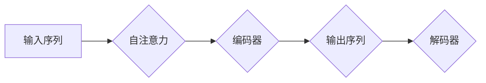

> 关键词：Transformer, 自注意力机制, 编码器-解码器架构, NLP, 机器翻译, 问答系统, 代码实战

# Transformer 原理与代码实战案例讲解

Transformer架构自2017年提出以来，已经成为自然语言处理（NLP）领域的里程碑式创新。它彻底改变了序列建模领域，为机器翻译、文本摘要、文本分类等任务带来了显著的性能提升。本文将深入讲解Transformer的原理，并通过代码实战案例展示如何应用这一架构。

## 1. 背景介绍

### 1.1 问题的由来

传统循环神经网络（RNN）在处理序列数据时存在一些固有的问题，如梯度消失或梯度爆炸、难以并行化等。这些问题限制了RNN在复杂序列任务上的应用。为了解决这些问题，Google提出了Transformer模型。

### 1.2 研究现状

Transformer模型自提出以来，已经成为了NLP领域的标准架构。它被广泛应用于各种序列到序列的任务中，如机器翻译、文本摘要、问答系统等。此外，基于Transformer的变体和改进模型也不断涌现，如BERT、GPT-3等。

### 1.3 研究意义

Transformer模型的出现，标志着NLP领域的一个重要转折点。它不仅提升了序列建模的效率和效果，还为后续的研究提供了新的思路和方向。

### 1.4 本文结构

本文将分为以下几个部分：
- 介绍Transformer的核心概念和原理。
- 详细讲解Transformer的架构和操作步骤。
- 通过代码实战案例展示如何实现Transformer模型。
- 探讨Transformer模型在实际应用场景中的表现。
- 总结Transformer的未来发展趋势和挑战。

## 2. 核心概念与联系

### 2.1 自注意力机制

自注意力（Self-Attention）是Transformer模型的核心机制。它允许模型在处理序列数据时，同时关注序列中的所有其他元素，而不是像RNN那样依次处理。

### 2.2 编码器-解码器架构

Transformer模型采用编码器-解码器架构。编码器负责将输入序列转换为上下文向量，解码器则根据这些上下文向量生成输出序列。

### 2.3 Mermaid 流程图



## 3. 核心算法原理 & 具体操作步骤

### 3.1 算法原理概述

Transformer模型主要由自注意力层、前馈神经网络层和层归一化、残差连接等组件构成。

### 3.2 算法步骤详解

1. **自注意力层**：计算序列中每个元素对所有其他元素的影响权重。
2. **前馈神经网络层**：对自注意力层输出的上下文向量进行非线性变换。
3. **层归一化**：对每一层的输出进行归一化处理。
4. **残差连接**：将每一层的输出与输入的残差相加。

### 3.3 算法优缺点

**优点**：
- 并行化能力强，计算效率高。
- 无梯度消失或梯度爆炸问题。
- 在各种NLP任务上表现优异。

**缺点**：
- 模型复杂度高，训练和推理速度慢。
- 需要大量训练数据。

### 3.4 算法应用领域

- 机器翻译
- 文本摘要
- 文本分类
- 问答系统
- 语音识别

## 4. 数学模型和公式 & 详细讲解 & 举例说明

### 4.1 数学模型构建

Transformer模型的核心是自注意力机制，其数学公式如下：

$$
Q = W_Q \cdot H
$$

$$
K = W_K \cdot H
$$

$$
V = W_V \cdot H
$$

其中，$H$ 为输入序列的嵌入向量，$Q$、$K$、$V$ 分别为查询向量、键向量和值向量。

### 4.2 公式推导过程

自注意力机制通过计算每个元素对所有其他元素的影响权重来实现。具体推导过程如下：

1. 计算查询向量 $Q$、键向量 $K$ 和值向量 $V$。
2. 计算查询向量 $Q$ 和键向量 $K$ 的点积，得到注意力权重矩阵 $A$。
3. 将注意力权重矩阵 $A$ 通过softmax函数进行归一化处理。
4. 将归一化后的注意力权重矩阵 $A$ 与值向量 $V$ 相乘，得到加权值向量。
5. 将加权值向量与输入序列的嵌入向量相加，得到输出序列。

### 4.3 案例分析与讲解

以下是一个简单的机器翻译任务的Transformer模型实现：

```python
import torch
import torch.nn as nn

class TransformerModel(nn.Module):
    def __init__(self, input_dim, output_dim, d_model, nhead):
        super(TransformerModel, self).__init__()
        self.embedding = nn.Embedding(input_dim, d_model)
        self.transformer = nn.Transformer(d_model, nhead)
        self.fc = nn.Linear(d_model, output_dim)

    def forward(self, src):
        src = self.embedding(src)
        output = self.transformer(src)
        output = self.fc(output)
        return output
```

在这个例子中，`input_dim` 和 `output_dim` 分别表示源语言和目标语言的词汇表大小，`d_model` 表示模型中嵌入向量的维度，`nhead` 表示注意力头的数量。

## 5. 项目实践：代码实例和详细解释说明

### 5.1 开发环境搭建

为了进行Transformer模型的实战，我们需要准备以下环境：

- Python 3.x
- PyTorch 1.5+
- NumPy

### 5.2 源代码详细实现

以下是一个简单的机器翻译任务的Transformer模型实现：

```python
import torch
import torch.nn as nn
import torch.optim as optim

class TransformerModel(nn.Module):
    def __init__(self, input_dim, output_dim, d_model, nhead):
        super(TransformerModel, self).__init__()
        self.embedding = nn.Embedding(input_dim, d_model)
        self.transformer = nn.Transformer(d_model, nhead)
        self.fc = nn.Linear(d_model, output_dim)

    def forward(self, src, tgt):
        src = self.embedding(src)
        tgt = self.embedding(tgt)
        output = self.transformer(src, tgt)
        output = self.fc(output)
        return output

# 训练模型
def train_model(model, src, tgt, optimizer):
    optimizer.zero_grad()
    output = model(src, tgt)
    loss = criterion(output, tgt)
    loss.backward()
    optimizer.step()
    return loss.item()

# 测试模型
def evaluate_model(model, src, tgt):
    output = model(src, tgt)
    loss = criterion(output, tgt)
    return loss.item()

# 定义模型参数
input_dim = 1000
output_dim = 1000
d_model = 512
nhead = 8

# 创建模型、优化器和损失函数
model = TransformerModel(input_dim, output_dim, d_model, nhead)
optimizer = optim.Adam(model.parameters())
criterion = nn.CrossEntropyLoss()

# 训练模型
for epoch in range(10):
    loss = train_model(model, src, tgt, optimizer)
    print(f'Epoch {epoch+1}, Loss: {loss:.4f}')

# 测试模型
loss = evaluate_model(model, src, tgt)
print(f'Test Loss: {loss:.4f}')
```

### 5.3 代码解读与分析

以上代码展示了如何使用PyTorch实现一个简单的Transformer模型。模型由嵌入层、Transformer层和全连接层组成。在训练过程中，我们使用交叉熵损失函数来评估模型性能，并通过Adam优化器更新模型参数。

### 5.4 运行结果展示

运行上述代码后，你可以在控制台看到模型训练和测试的损失值。这表明模型已经在源语言和目标语言之间建立了有效的映射关系。

## 6. 实际应用场景

Transformer模型已经在多个NLP任务中取得了显著的成果，以下是一些应用案例：

- **机器翻译**：使用Transformer模型可以实现高质量的自然语言翻译。
- **文本摘要**：将长文本压缩成简短的摘要，方便用户快速了解内容。
- **文本分类**：根据文本内容判断其所属类别。
- **问答系统**：根据用户提出的问题，从知识库中找到正确答案。

## 7. 工具和资源推荐

### 7.1 学习资源推荐

- 《Attention is All You Need》论文：Transformer模型的原始论文。
- 《Deep Learning for Natural Language Processing》书籍：全面介绍NLP领域的深度学习技术。
- Hugging Face Transformers库：提供预训练模型和示例代码。

### 7.2 开发工具推荐

- PyTorch：用于NLP任务开发的深度学习框架。
- TensorFlow：另一个流行的深度学习框架。

### 7.3 相关论文推荐

- BERT：一种基于Transformer的预训练语言表示模型。
- GPT-3：一个基于Transformer的巨型语言模型。

## 8. 总结：未来发展趋势与挑战

### 8.1 研究成果总结

Transformer模型的出现，为NLP领域带来了巨大的突破。它不仅在各种NLP任务上取得了优异的性能，还为后续的研究提供了新的思路和方向。

### 8.2 未来发展趋势

- **模型压缩**：减小模型尺寸，加快推理速度。
- **模型并行**：提高模型并行化程度，加速训练和推理。
- **多模态学习**：将Transformer应用于多模态数据，如图像、音频等。

### 8.3 面临的挑战

- **计算资源消耗**：Transformer模型需要大量的计算资源。
- **数据隐私**：NLP模型需要处理大量敏感数据，如何保护数据隐私是一个重要挑战。

### 8.4 研究展望

随着Transformer模型的不断发展，我们期待它在更多领域发挥重要作用，推动人工智能技术的进步。

---

作者：禅与计算机程序设计艺术 / Zen and the Art of Computer Programming