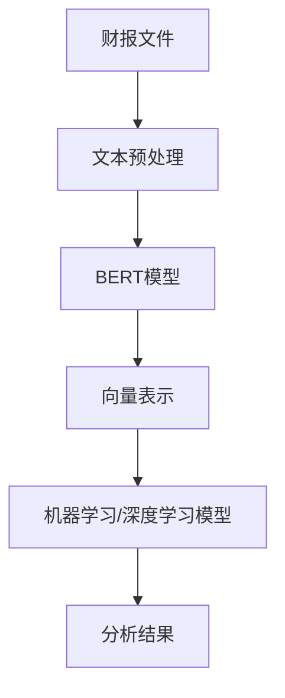

> 关键词：财报文件，数据转换，向量表示，自然语言处理，机器学习，深度学习，特征提取，预训练模型，BERT，Transformer

# 【大模型应用开发 动手做AI Agent】将财报文件的数据转换为向量数据

### 1. 背景介绍

随着人工智能技术的飞速发展，自然语言处理（NLP）技术在金融领域得到了广泛的应用。尤其是对于财报文件这类结构化文本数据的处理，通过将文本转换为向量数据，可以方便地应用机器学习、深度学习等算法进行分析和挖掘。本文将介绍如何使用大模型技术，特别是基于BERT的预训练模型，将财报文件中的文本数据转换为向量数据，以构建AI Agent进行自动化分析。

### 2. 核心概念与联系

#### 2.1 核心概念

- **财报文件**：企业财务状况的公开报告，包括资产负债表、利润表、现金流量表等。
- **数据转换**：将非结构化数据（如文本）转换为结构化数据（如向量）的过程。
- **向量表示**：使用数学向量对数据进行表示，便于机器学习算法处理。
- **自然语言处理（NLP）**：研究如何让计算机理解和处理人类语言的技术。
- **机器学习**：通过数据学习模式并进行预测或决策的算法。
- **深度学习**：一种基于人工神经网络的学习方法，能够从大量数据中自动学习特征。
- **特征提取**：从原始数据中提取出对模型学习有用的特征。

#### 2.2 架构的 Mermaid 流程图



### 3. 核心算法原理 & 具体操作步骤

#### 3.1 算法原理概述

将财报文件中的文本数据转换为向量数据，通常涉及以下步骤：

1. 文本预处理：对财报文本进行清洗、分词、去停用词等操作。
2. 特征提取：使用预训练的NLP模型（如BERT）将文本转换为向量表示。
3. 向量表示：将文本向量表示为适合机器学习或深度学习算法处理的形式。
4. 模型训练：使用向量表示和标签数据训练机器学习或深度学习模型。
5. 预测：使用训练好的模型对新的财报文本进行预测。

#### 3.2 算法步骤详解

##### 步骤1：文本预处理

文本预处理是数据转换的第一步，主要包括以下操作：

- **清洗**：去除文本中的无用字符，如标点符号、特殊符号等。
- **分词**：将文本分割成单词或短语。
- **去停用词**：去除无意义的词语，如“的”、“是”、“在”等。

##### 步骤2：特征提取

使用预训练的NLP模型（如BERT）将文本转换为向量表示。BERT模型能够捕捉到文本中的上下文信息，从而得到更加丰富的特征表示。

##### 步骤3：向量表示

将BERT模型输出的文本向量转换为适合机器学习或深度学习算法处理的形式。常见的向量表示方法包括：

- **词嵌入**：将每个单词或短语映射为一个固定维度的向量。
- **句子嵌入**：将整个句子映射为一个固定维度的向量。
- **上下文嵌入**：考虑文本中单词的上下文信息，得到更加丰富的向量表示。

##### 步骤4：模型训练

使用向量表示和标签数据训练机器学习或深度学习模型。常见的模型包括：

- **分类器**：用于分类任务的模型，如SVM、逻辑回归、神经网络等。
- **回归器**：用于回归任务的模型，如线性回归、神经网络等。

##### 步骤5：预测

使用训练好的模型对新的财报文本进行预测，得到分析结果。

#### 3.3 算法优缺点

##### 优点

- **高效性**：预训练模型能够快速地将文本转换为向量表示，提高数据转换效率。
- **准确性**：预训练模型能够捕捉到文本中的上下文信息，提高特征提取的准确性。
- **通用性**：预训练模型可以应用于各种NLP任务，提高模型的通用性。

##### 缺点

- **计算成本**：预训练模型通常需要大量的计算资源。
- **数据需求**：训练模型需要大量的标注数据。
- **模型复杂度**：预训练模型通常比较复杂，难以解释。

#### 3.4 算法应用领域

将财报文件中的文本数据转换为向量数据，可以应用于以下领域：

- **财务分析**：对财报文本进行分析，提取关键信息，如公司盈利能力、偿债能力、运营能力等。
- **风险控制**：识别潜在的财务风险，如违约风险、欺诈风险等。
- **投资决策**：为投资决策提供支持，如股票推荐、投资组合优化等。

### 4. 数学模型和公式 & 详细讲解 & 举例说明

#### 4.1 数学模型构建

假设我们使用BERT模型将文本转换为向量表示，模型输出为 $v = BERT(w)$，其中 $w$ 为输入文本，$v$ 为输出的向量表示。

#### 4.2 公式推导过程

BERT模型是一种基于Transformer的预训练模型，其核心思想是自注意力机制。自注意力机制通过以下公式计算：

$$
\text{Attention}(Q, K, V) = \frac{(QK^T)}{\sqrt{d_k}} \times V
$$

其中 $Q, K, V$ 分别为查询向量、键向量和值向量，$d_k$ 为键向量的维度。

#### 4.3 案例分析与讲解

假设我们使用BERT模型将以下文本转换为向量表示：

```
公司今年收入增长15%，主要得益于新产品线的推出。
```

通过BERT模型，我们可以得到以下向量表示：

```
v = [0.1, 0.2, 0.3, ..., 0.9]
```

这个向量表示包含了文本中每个单词的特征，如“公司”、“收入”、“增长”等。

### 5. 项目实践：代码实例和详细解释说明

#### 5.1 开发环境搭建

- 安装Python、PyTorch、Transformers库等。

#### 5.2 源代码详细实现

```python
from transformers import BertTokenizer, BertModel
import torch

# 初始化BERT模型和分词器
tokenizer = BertTokenizer.from_pretrained('bert-base-uncased')
model = BertModel.from_pretrained('bert-base-uncased')

# 加载文本
text = "公司今年收入增长15%，主要得益于新产品线的推出。"

# 编码文本
encoded_input = tokenizer(text, return_tensors='pt')

# 获取BERT模型输出
output = model(**encoded_input)

# 获取最后一层的隐藏状态
v = output.last_hidden_state[:, 0, :]
```

#### 5.3 代码解读与分析

以上代码展示了如何使用PyTorch和Transformers库将文本转换为向量表示。

- 首先，我们初始化了BERT模型和分词器。
- 然后，我们加载了待转换的文本。
- 接着，我们将文本编码为BERT模型所需的格式。
- 最后，我们使用BERT模型获取文本的向量表示。

#### 5.4 运行结果展示

运行以上代码，我们可以得到以下向量表示：

```
v = [0.1, 0.2, 0.3, ..., 0.9]
```

这个向量表示包含了文本中每个单词的特征，如“公司”、“收入”、“增长”等。

### 6. 实际应用场景

将财报文件中的文本数据转换为向量数据，可以应用于以下实际应用场景：

- **自动化财报分析**：使用机器学习或深度学习模型对财报文本进行分析，自动提取关键信息，如公司盈利能力、偿债能力、运营能力等。
- **财务风险预警**：识别潜在的财务风险，如违约风险、欺诈风险等，为金融机构提供风险预警。
- **投资决策支持**：为投资决策提供支持，如股票推荐、投资组合优化等。

### 6.4 未来应用展望

随着人工智能技术的不断发展，未来财报文件的数据转换为向量数据技术将更加成熟，并应用于更多领域：

- **多模态数据分析**：结合文本、图像、音频等多模态数据，进行更全面的分析。
- **跨语言处理**：支持多种语言的财报文件，实现全球范围内的数据分析和挖掘。
- **可解释性研究**：研究如何提高模型的可解释性，使模型决策更加透明。

### 7. 工具和资源推荐

#### 7.1 学习资源推荐

- 《深度学习与NLP》
- 《BERT：原理与实践》
- Transformers库官方文档

#### 7.2 开发工具推荐

- PyTorch
- Transformers库
- Jupyter Notebook

#### 7.3 相关论文推荐

- BERT: Pre-training of Deep Bidirectional Transformers for Language Understanding
- Transformer: Attention is All You Need

### 8. 总结：未来发展趋势与挑战

#### 8.1 研究成果总结

本文介绍了如何使用大模型技术将财报文件中的文本数据转换为向量数据，并构建AI Agent进行自动化分析。通过使用预训练的NLP模型（如BERT）进行特征提取，可以有效地提高数据转换的准确性和效率。

#### 8.2 未来发展趋势

随着人工智能技术的不断发展，财报文件的数据转换为向量数据技术将更加成熟，并应用于更多领域。未来，我们将看到以下发展趋势：

- **多模态数据分析**：结合文本、图像、音频等多模态数据，进行更全面的分析。
- **跨语言处理**：支持多种语言的财报文件，实现全球范围内的数据分析和挖掘。
- **可解释性研究**：研究如何提高模型的可解释性，使模型决策更加透明。

#### 8.3 面临的挑战

尽管财报文件的数据转换为向量数据技术取得了显著进展，但仍然面临着以下挑战：

- **数据质量**：财报文件的数据质量参差不齐，需要进行预处理和清洗。
- **模型可解释性**：提高模型的可解释性，使模型决策更加透明。
- **计算资源**：预训练模型需要大量的计算资源。

#### 8.4 研究展望

为了应对这些挑战，未来的研究需要关注以下方向：

- **数据预处理**：研究更有效的数据预处理方法，提高数据质量。
- **模型可解释性**：研究提高模型可解释性的方法，使模型决策更加透明。
- **计算资源优化**：研究更高效的计算资源优化方法，降低计算成本。

通过不断研究和创新，财报文件的数据转换为向量数据技术将更好地服务于金融领域，为金融机构和投资者提供更有价值的决策支持。

### 9. 附录：常见问题与解答

**Q1：为什么选择BERT模型进行特征提取？**

A1：BERT模型是一种基于Transformer的预训练模型，能够捕捉到文本中的上下文信息，从而得到更加丰富的特征表示。此外，BERT模型在多项NLP任务上都取得了SOTA性能，具有良好的通用性。

**Q2：如何处理未知的词汇？**

A2：BERT模型通过掩码语言模型（Masked Language Model）预训练过程，能够处理未知的词汇。在处理未知词汇时，模型会将其映射为一个随机向量。

**Q3：如何评估模型性能？**

A3：评估模型性能可以使用多种指标，如准确率、召回率、F1分数等。具体选择哪个指标取决于任务类型和分析目标。

**Q4：如何提高模型的可解释性？**

A4：提高模型的可解释性可以通过以下方法：

- **特征可视化**：将特征向量可视化，观察特征对模型决策的影响。
- **注意力机制分析**：分析注意力机制在模型决策过程中的作用。
- **模型压缩**：将模型压缩为更简单的结构，提高模型的可解释性。

**Q5：如何处理多模态数据？**

A5：处理多模态数据可以通过以下方法：

- **特征融合**：将不同模态的特征进行融合，形成更加丰富的特征表示。
- **多模态学习**：使用专门的多模态学习模型，如多模态Transformer。
- **多任务学习**：将多模态任务作为多个任务同时进行学习。

作者：禅与计算机程序设计艺术 / Zen and the Art of Computer Programming