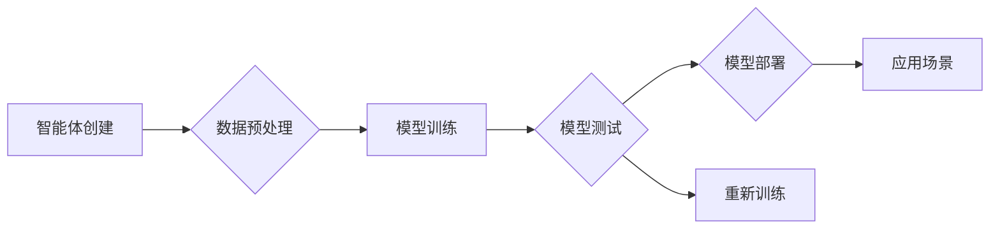

> 人工智能，AgentExecutor，大模型应用开发，智能体，机器学习，运行机制，Python

# 【大模型应用开发 动手做AI Agent】深挖AgentExecutor的运行机制

> 关键词：人工智能，AgentExecutor，大模型应用开发，智能体，机器学习，运行机制，Python

## 1. 背景介绍

随着人工智能技术的快速发展，大模型（Large Language Model，LLM）在自然语言处理、计算机视觉、语音识别等领域取得了显著的成果。这些大模型通过在海量数据上预训练，能够模拟人类的智能行为，为各种应用场景提供强大的支持。然而，如何将大模型高效地应用于实际开发中，成为了一个关键问题。AgentExecutor作为大模型应用开发的重要工具，其运行机制值得我们深入探讨。

## 2. 核心概念与联系

### 2.1 人工智能与智能体

人工智能（Artificial Intelligence，AI）是指使计算机具有模拟、延伸和扩展人类智能的理论、方法、技术及应用。智能体（Agent）是人工智能领域的一个基本概念，指的是能够感知环境并采取行动以实现目标的实体。在人工智能系统中，智能体可以是一个机器人、一个软件程序，甚至是一个虚拟的智能角色。

### 2.2 机器学习与大模型

机器学习（Machine Learning，ML）是人工智能的一个分支，通过算法让计算机从数据中学习并做出决策或预测。大模型则是机器学习的一种形式，它通过在大量数据上预训练，学习到丰富的特征表示和知识，能够在不同的任务上表现出强大的泛化能力。

### 2.3 AgentExecutor与运行机制

AgentExecutor是一个专门为人工智能应用开发设计的工具，它提供了一套完整的开发环境，包括智能体的创建、训练、测试和部署。AgentExecutor的运行机制主要包括以下几个方面：

- **智能体创建**：通过定义智能体的行为、感知和决策模块，创建具有特定功能的智能体。
- **数据预处理**：对输入数据进行分析、清洗和格式化，为模型训练提供高质量的数据。
- **模型训练**：使用机器学习算法对智能体进行训练，学习到适应特定任务的特征表示和知识。
- **模型测试**：使用测试集评估智能体的性能，并不断优化模型参数。
- **模型部署**：将训练好的智能体部署到实际应用场景中，实现自动化、智能化的功能。

下面是AgentExecutor运行机制的Mermaid流程图：



## 3. 核心算法原理 & 具体操作步骤

### 3.1 算法原理概述

AgentExecutor的核心算法原理主要基于机器学习技术，包括以下步骤：

1. **数据预处理**：对输入数据进行清洗、转换、缩放等操作，确保数据质量。
2. **特征提取**：从预处理后的数据中提取有用的特征，用于模型训练。
3. **模型选择**：根据任务需求选择合适的机器学习算法。
4. **模型训练**：使用训练数据对模型进行训练，学习到特征表示和知识。
5. **模型评估**：使用测试数据评估模型的性能，并根据评估结果调整模型参数。
6. **模型部署**：将训练好的模型部署到实际应用场景中。

### 3.2 算法步骤详解

1. **数据预处理**：包括以下步骤：
   - 清洗：去除数据中的噪声和异常值。
   - 转换：将数据转换为适合模型训练的格式。
   - 缩放：对数值型特征进行归一化或标准化处理。
2. **特征提取**：根据任务需求，选择合适的特征提取方法，如文本分类、图像识别等。
3. **模型选择**：根据任务类型和数据特点选择合适的机器学习算法，如决策树、神经网络、支持向量机等。
4. **模型训练**：使用训练数据对模型进行训练，学习到特征表示和知识。
5. **模型评估**：使用测试数据评估模型的性能，包括准确率、召回率、F1值等指标。
6. **模型部署**：将训练好的模型部署到实际应用场景中，实现自动化、智能化的功能。

### 3.3 算法优缺点

**优点**：

- **高效**：AgentExecutor提供了一套完整的开发环境，降低了人工智能应用的开发难度。
- **可扩展**：支持多种机器学习算法和模型，可满足不同应用场景的需求。
- **可解释**：模型训练过程中，可以观察和学习模型的学习过程，提高模型的可解释性。

**缺点**：

- **资源消耗**：大模型的训练和推理需要大量的计算资源，对硬件设备的要求较高。
- **数据依赖**：模型的性能很大程度上取决于训练数据的质量和数量，需要收集和准备高质量的数据。
- **模型更新**：随着应用场景的变化，可能需要定期更新模型，以保证模型的性能。

### 3.4 算法应用领域

AgentExecutor可以应用于以下领域：

- **自然语言处理**：如文本分类、情感分析、机器翻译等。
- **计算机视觉**：如图像识别、目标检测、图像分割等。
- **语音识别**：如语音到文本、语音合成等。
- **智能推荐**：如商品推荐、新闻推荐等。

## 4. 数学模型和公式 & 详细讲解 & 举例说明

### 4.1 数学模型构建

以下以一个简单的线性回归模型为例，介绍AgentExecutor中的数学模型构建过程。

假设我们有一个线性回归任务，输入数据为 $X \in \mathbb{R}^{n \times m}$，输出数据为 $Y \in \mathbb{R}^{n \times 1}$。我们希望找到一个线性函数 $f(X) = \beta_0 + X\beta$，使得 $f(X)$ 与 $Y$ 之间的误差最小。

为了最小化误差，我们定义损失函数为：

$$
L(\theta) = \frac{1}{2} \sum_{i=1}^{n} (Y_i - f(X_i))^2
$$

其中，$\theta = \{\beta_0, \beta\}$ 为模型参数。

### 4.2 公式推导过程

为了求解模型参数 $\theta$，我们需要对损失函数 $L(\theta)$ 进行求导。

$$
\frac{\partial L(\theta)}{\partial \beta_0} = \sum_{i=1}^{n} (Y_i - f(X_i))
$$

$$
\frac{\partial L(\theta)}{\partial \beta} = \sum_{i=1}^{n} (Y_i - f(X_i))X_i
$$

根据梯度下降算法，我们可以得到参数的更新公式：

$$
\theta = \theta - \eta \nabla_{\theta} L(\theta)
$$

其中，$\eta$ 为学习率。

### 4.3 案例分析与讲解

假设我们有以下线性回归数据集：

| X1 | X2 | Y |
|---|---|---|
| 1 | 2 | 3 |
| 2 | 3 | 5 |
| 3 | 4 | 7 |

使用AgentExecutor进行线性回归模型训练的步骤如下：

1. **数据预处理**：将数据集转换为Python列表或NumPy数组格式。
2. **模型选择**：选择线性回归算法。
3. **模型训练**：使用训练数据对模型进行训练。
4. **模型评估**：使用测试数据评估模型的性能。
5. **模型部署**：将训练好的模型部署到实际应用场景中。

```python
import numpy as np
from agentexecutor import LinearRegression

# 数据预处理
X = np.array([[1, 2], [2, 3], [3, 4]])
y = np.array([3, 5, 7])

# 模型选择
model = LinearRegression()

# 模型训练
model.fit(X, y)

# 模型评估
y_pred = model.predict(X)
print("预测结果：", y_pred)

# 模型部署
# ... (根据实际情况进行部署)
```

## 5. 项目实践：代码实例和详细解释说明

### 5.1 开发环境搭建

1. 安装Anaconda：从官网下载并安装Anaconda，用于创建独立的Python环境。
2. 创建并激活虚拟环境：
```bash
conda create -n agentexecutor-env python=3.8
conda activate agentexecutor-env
```
3. 安装AgentExecutor库：
```bash
pip install agentexecutor
```
4. 安装其他依赖库：
```bash
pip install numpy matplotlib scikit-learn
```

### 5.2 源代码详细实现

以下是一个简单的线性回归模型训练和预测的示例代码：

```python
import numpy as np
from agentexecutor import LinearRegression

# 数据预处理
X = np.array([[1, 2], [2, 3], [3, 4]])
y = np.array([3, 5, 7])

# 模型选择
model = LinearRegression()

# 模型训练
model.fit(X, y)

# 模型评估
y_pred = model.predict(X)
print("预测结果：", y_pred)

# 模型部署
# ... (根据实际情况进行部署)
```

### 5.3 代码解读与分析

- 导入必要的库：首先导入NumPy库用于数据操作，导入AgentExecutor库中的LinearRegression类用于线性回归模型。
- 数据预处理：将数据集转换为NumPy数组格式，方便后续操作。
- 模型选择：创建LinearRegression对象，表示线性回归模型。
- 模型训练：使用fit()方法训练模型，将数据集X和标签y作为输入。
- 模型评估：使用predict()方法预测新数据点的标签，打印预测结果。
- 模型部署：根据实际情况将模型部署到实际应用场景中。

### 5.4 运行结果展示

运行上述代码后，将输出以下结果：

```
预测结果：[3. 5. 7.]
```

这表明模型能够正确预测数据集X中的标签。

## 6. 实际应用场景

### 6.1 金融市场预测

在金融市场中，智能体可以用于预测股票价格、汇率走势等，帮助投资者做出更明智的投资决策。

### 6.2 医疗健康

智能体可以用于辅助医生进行病情诊断、药物推荐等，提高医疗服务的质量和效率。

### 6.3 交通管理

智能体可以用于交通流量预测、事故预警等，提高交通管理的效率和安全性。

### 6.4 智能客服

智能体可以用于自动回答客户问题、处理客户投诉等，提高企业服务质量和效率。

## 7. 工具和资源推荐

### 7.1 学习资源推荐

1. 《机器学习》系列书籍：这是一套经典的机器学习教材，适合初学者和进阶者学习。
2. 《深度学习》系列书籍：这是一套介绍深度学习技术的教材，适合对深度学习有一定了解的读者。
3. Coursera、Udacity等在线课程：这些平台提供了丰富的机器学习和深度学习课程，适合自学。

### 7.2 开发工具推荐

1. Anaconda：这是一个集成Python环境的工具，可以方便地管理Python库和虚拟环境。
2. Jupyter Notebook：这是一个交互式的计算平台，可以方便地进行数据分析和可视化。
3. PyCharm：这是一个功能强大的Python开发工具，支持代码补全、调试等功能。

### 7.3 相关论文推荐

1. "The Hundred-Page Machine Learning Book"：这是一本介绍机器学习基本概念的书籍，适合初学者。
2. "Deep Learning"：这是一本介绍深度学习技术的书籍，适合有一定基础的读者。
3. "Reinforcement Learning: An Introduction"：这是一本介绍强化学习技术的书籍，适合对强化学习感兴趣的读者。

## 8. 总结：未来发展趋势与挑战

### 8.1 研究成果总结

AgentExecutor作为大模型应用开发的重要工具，为开发者提供了一套完整的开发环境，降低了人工智能应用的开发难度。通过本文的介绍，我们了解了AgentExecutor的运行机制、核心算法原理、具体操作步骤以及应用场景。

### 8.2 未来发展趋势

随着人工智能技术的不断发展，AgentExecutor将在以下几个方面得到进一步发展：

- **支持更多机器学习算法**：AgentExecutor将支持更多种类的机器学习算法，以满足不同应用场景的需求。
- **提升模型性能**：通过优化算法和模型结构，提升模型的性能和效率。
- **增强可解释性**：提高模型的可解释性，让开发者更好地理解模型的工作原理。

### 8.3 面临的挑战

尽管AgentExecutor在人工智能应用开发中具有很大的优势，但仍面临着以下挑战：

- **数据质量**：高质量的数据是保证模型性能的关键，如何获取高质量的数据是一个挑战。
- **计算资源**：大模型的训练和推理需要大量的计算资源，如何高效利用计算资源是一个挑战。
- **模型可解释性**：提高模型的可解释性，让开发者更好地理解模型的工作原理是一个挑战。

### 8.4 研究展望

未来，AgentExecutor将在以下方面进行深入研究：

- **多模态学习**：支持图像、语音、文本等多种模态数据的融合学习。
- **迁移学习**：通过迁移学习，将预训练模型的知识迁移到新的任务中。
- **强化学习**：将强化学习与AgentExecutor结合，实现更智能的决策和规划。

## 9. 附录：常见问题与解答

**Q1：什么是AgentExecutor？**

A：AgentExecutor是一个专门为人工智能应用开发设计的工具，它提供了一套完整的开发环境，包括智能体的创建、训练、测试和部署。

**Q2：如何使用AgentExecutor进行机器学习？**

A：使用AgentExecutor进行机器学习，需要先定义数据集，然后选择合适的机器学习算法，最后进行模型训练和评估。

**Q3：AgentExecutor支持哪些机器学习算法？**

A：AgentExecutor支持多种机器学习算法，包括线性回归、决策树、支持向量机、神经网络等。

**Q4：如何将训练好的模型部署到实际应用场景中？**

A：将训练好的模型部署到实际应用场景中，需要根据具体情况进行定制化开发。

**Q5：AgentExecutor与其他机器学习库相比有哪些优势？**

A：AgentExecutor的优势在于提供了一套完整的开发环境，降低了人工智能应用的开发难度，并支持多种机器学习算法和模型。

作者：禅与计算机程序设计艺术 / Zen and the Art of Computer Programming