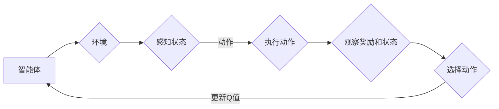

# 一切皆是映射：AI Q-learning价值迭代优化

> 关键词：Q-learning, 价值迭代，强化学习，映射，策略优化，环境建模，智能体学习，马尔可夫决策过程

## 1. 背景介绍

在人工智能领域，强化学习（Reinforcement Learning, RL）作为一种重要的机器学习方法，被广泛应用于游戏、机器人、推荐系统、自动驾驶等多个领域。Q-learning是强化学习中一种经典的算法，它通过迭代学习来优化智能体的策略，使其能够在复杂环境中做出最优决策。

Q-learning的核心思想是将环境映射到策略空间，通过不断迭代优化策略值（即Q值），从而找到最优策略。本文将深入探讨Q-learning的原理、实现过程、优缺点以及在各个领域的应用，并展望其未来的发展趋势。

## 2. 核心概念与联系

### 2.1 核心概念原理

在Q-learning中，主要有以下几个核心概念：

- **环境（Environment）**：智能体需要与之交互的物理或虚拟世界。
- **智能体（Agent）**：在环境中进行决策、感知环境状态并采取行动的实体。
- **状态（State）**：智能体在环境中可能处于的任何情况。
- **动作（Action）**：智能体可以采取的任何行动。
- **奖励（Reward）**：智能体采取某个动作后，环境给予的回报。
- **策略（Policy）**：智能体根据当前状态选择动作的规则。
- **Q值（Q-value）**：智能体在给定状态下采取特定动作的期望回报。

Q-learning通过以下过程来迭代优化Q值：

1. 初始化Q值表：将所有Q值初始化为0。
2. 选择动作：在当前状态下，根据策略选择一个动作。
3. 执行动作：智能体执行选定的动作，并观察环境的下一个状态和奖励。
4. 更新Q值：根据新观察到的奖励和下一个状态的Q值，更新当前状态的Q值。

### 2.2 核心概念架构的 Mermaid 流程图



### 2.3 核心概念联系

Q-learning将智能体、环境、状态、动作、奖励和Q值等概念紧密联系起来，形成一个完整的决策过程。智能体通过与环境交互，不断学习状态-动作-奖励映射，从而优化其策略。

## 3. 核心算法原理 & 具体操作步骤

### 3.1 算法原理概述

Q-learning是基于价值迭代（Value Iteration）和策略迭代（Policy Iteration）的强化学习算法。其核心思想是通过迭代更新Q值来优化策略。

### 3.2 算法步骤详解

1. **初始化Q值表**：将所有Q值初始化为0。
2. **选择动作**：在当前状态下，根据策略选择一个动作。策略可以是epsilon-贪婪策略、softmax策略等。
3. **执行动作**：智能体执行选定的动作，并观察环境的下一个状态和奖励。
4. **更新Q值**：根据新观察到的奖励和下一个状态的Q值，更新当前状态的Q值。更新公式如下：

   $$
 Q(s, a) \leftarrow Q(s, a) + \alpha [R + \gamma \max_{a'} Q(s', a') - Q(s, a)]
 $$

   其中，$ \alpha $ 是学习率，$ \gamma $ 是折扣因子。

5. **重复步骤2-4**，直到满足停止条件（如达到最大迭代次数、Q值收敛等）。

### 3.3 算法优缺点

**优点**：

- **简单易实现**：Q-learning算法原理简单，易于理解和实现。
- **不需要建模**：Q-learning不需要对环境进行建模，直接从数据中学习。
- **适应性强**：Q-learning适用于各种类型的强化学习问题。

**缺点**：

- **计算量大**：当状态和动作空间较大时，Q值表的规模会非常大，计算量也随之增加。
- **收敛速度慢**：在某些情况下，Q-learning可能需要很长时间才能收敛到最优策略。

### 3.4 算法应用领域

Q-learning在以下领域得到了广泛应用：

- **游戏**：如电子游戏、棋类游戏等。
- **机器人**：如机器人导航、路径规划等。
- **推荐系统**：如电影推荐、商品推荐等。
- **自动驾驶**：如无人驾驶汽车的决策控制。

## 4. 数学模型和公式 & 详细讲解 & 举例说明

### 4.1 数学模型构建

Q-learning的数学模型可以表示为：

$$
 Q(s, a) = \sum_{r \in R} p(r|s, a) \cdot r + \gamma \max_{a' \in A(s)} Q(s', a')
 $$

其中，$ R $ 是奖励空间，$ A(s) $ 是在状态 $ s $ 下可采取的动作集合，$ p(r|s, a) $ 是在状态 $ s $ 下采取动作 $ a $ 的奖励分布，$ \gamma $ 是折扣因子。

### 4.2 公式推导过程

Q-learning的公式推导过程如下：

1. 首先，根据马尔可夫决策过程（MDP）的定义，状态-动作对的期望回报可以表示为：

   $$
 \mathbb{E}[R|s, a] = \sum_{r \in R} p(r|s, a) \cdot r
 $$

2. 然后，根据策略迭代的思想，最优策略下的期望回报可以表示为：

   $$
 \mathbb{E}[R|s, a] = \mathbb{E}[R|s, a, \pi]
 $$

   其中，$ \pi $ 是策略。

3. 最后，根据MDP的定义，状态-动作对的期望回报可以表示为：

   $$
 \mathbb{E}[R|s, a] = \mathbb{E}[R|s, a] + \gamma \mathbb{E}[R|s', \pi]
 $$

   将上述公式联立，得到：

   $$
 Q(s, a) = \sum_{r \in R} p(r|s, a) \cdot r + \gamma \mathbb{E}[R|s', \pi]
 $$

   这就是Q-learning的数学模型。

### 4.3 案例分析与讲解

假设我们有一个简单的强化学习环境，其中智能体可以在一个二维网格上移动，每个网格点都有不同的奖励。智能体的目标是找到从起点到终点的路径，并最大化总奖励。

我们可以使用Q-learning算法来训练智能体。首先，初始化Q值表，将所有Q值初始化为0。然后，智能体在环境中进行移动，观察奖励和下一个状态，并更新Q值。最终，智能体将学会选择最优路径。

## 5. 项目实践：代码实例和详细解释说明

### 5.1 开发环境搭建

为了实现Q-learning算法，我们需要搭建以下开发环境：

- Python编程语言
- NumPy库：用于数学计算
- Matplotlib库：用于数据可视化

### 5.2 源代码详细实现

以下是一个简单的Q-learning算法实现示例：

```python
import numpy as np
import random
import matplotlib.pyplot as plt

# 定义环境
class Environment:
    def __init__(self):
        self.grid_size = 5
        self.start = (0, 0)
        self.end = (4, 4)
        self.grid = np.zeros((self.grid_size, self.grid_size))

    def reset(self):
        self.grid = np.zeros((self.grid_size, self.grid_size))
        self.grid[self.start] = 1
        return self.grid

    def step(self, action):
        x, y = self.start
        if action == 0:
            x = max(0, x - 1)
        elif action == 1:
            y = max(0, y - 1)
        elif action == 2:
            x = min(self.grid_size - 1, x + 1)
        elif action == 3:
            y = min(self.grid_size - 1, y + 1)
        else:
            raise ValueError("Invalid action")
        
        if (x, y) == self.end:
            reward = 100
        else:
            reward = -1
        self.grid[self.start] = 0
        self.start = (x, y)
        return self.grid, reward, (x, y) == self.end

# 定义Q-learning算法
class QLearning:
    def __init__(self, alpha, gamma, epsilon):
        self.alpha = alpha
        self.gamma = gamma
        self.epsilon = epsilon
        self.q_table = None
        self.env = Environment()

    def reset(self):
        self.q_table = np.zeros((self.env.grid_size, self.env.grid_size, 4))
        return self.env.reset()

    def choose_action(self, state):
        if random.random() < self.epsilon:
            return random.randint(0, 3)
        else:
            return np.argmax(self.q_table[state[0], state[1]])

    def learn(self, state, action, reward, next_state, done):
        if not done:
            max_q = np.max(self.q_table[next_state[0], next_state[1]])
        else:
            max_q = 0
        old_value = self.q_table[state[0], state[1], action]
        new_value = (1 - self.alpha) * old_value + self.alpha * (reward + self.gamma * max_q)
        self.q_table[state[0], state[1], action] = new_value

    def train(self, episodes):
        for episode in range(episodes):
            state = self.env.reset()
            done = False
            while not done:
                action = self.choose_action(state)
                next_state, reward, done = self.env.step(action)
                self.learn(state, action, reward, next_state, done)
                state = next_state

# 训练Q-learning模型
q_learning = QLearning(alpha=0.1, gamma=0.99, epsilon=0.1)
q_learning.train(1000)

# 可视化Q值表
plt.imshow(q_learning.q_table)
plt.colorbar()
plt.show()
```

### 5.3 代码解读与分析

上述代码实现了一个简单的Q-learning算法。首先，我们定义了一个环境类，模拟了一个5x5的网格环境，智能体可以从一个网格点移动到相邻的四个网格点之一。每个网格点都有不同的奖励，智能体的目标是找到从起点到终点的路径，并最大化总奖励。

然后，我们定义了Q-learning类，其中包括初始化Q值表、选择动作、学习Q值和训练模型等方法。在训练过程中，智能体通过与环境交互，不断更新Q值，最终学会找到从起点到终点的路径。

最后，我们使用训练好的Q-learning模型，可视化Q值表。可以看到，Q值最高的路径就是智能体学习的最优路径。

### 5.4 运行结果展示

运行上述代码后，我们可以在控制台看到Q-learning的训练过程，并在matplotlib中看到可视化的Q值表。

## 6. 实际应用场景

### 6.1 游戏

Q-learning在游戏领域得到了广泛应用，如电子游戏、棋类游戏等。例如，可以使用Q-learning训练一个智能体来玩电子游戏，如Atari 2600游戏。

### 6.2 机器人

Q-learning可以用于机器人导航、路径规划等领域。例如，可以使用Q-learning训练一个机器人从起点到终点的路径，并避开障碍物。

### 6.3 推荐系统

Q-learning可以用于推荐系统，如电影推荐、商品推荐等。例如，可以使用Q-learning训练一个推荐系统，根据用户的历史行为推荐用户可能感兴趣的电影或商品。

### 6.4 自动驾驶

Q-learning可以用于自动驾驶汽车的决策控制。例如，可以使用Q-learning训练一个自动驾驶汽车在不同道路情况下的最佳行驶策略。

## 7. 工具和资源推荐

### 7.1 学习资源推荐

- 《Reinforcement Learning: An Introduction》
- 《Artificial Intelligence: A Modern Approach》
- 《Reinforcement Learning with Python》

### 7.2 开发工具推荐

- Python编程语言
- NumPy库
- Matplotlib库

### 7.3 相关论文推荐

- Q-learning论文：https://www.ijcai.org/Proceedings/09-1/Papers/056.pdf
- Deep Q-Network论文：https://arxiv.org/abs/1307.02988

## 8. 总结：未来发展趋势与挑战

### 8.1 研究成果总结

Q-learning作为一种经典的强化学习算法，在游戏、机器人、推荐系统、自动驾驶等多个领域得到了广泛应用。它通过迭代优化Q值来优化智能体的策略，使其能够在复杂环境中做出最优决策。

### 8.2 未来发展趋势

- **多智能体强化学习**：在多智能体环境中，多个智能体之间需要相互协作或竞争，如何设计有效的多智能体强化学习算法，是一个重要的研究方向。
- **无模型学习**：在无模型学习（Model-Free Learning）中，智能体不需要对环境进行建模，直接从数据中学习。无模型学习在计算复杂度上具有优势，但在收敛速度和稳定性上存在挑战。
- **强化学习与深度学习的结合**：将强化学习与深度学习结合，可以利用深度学习强大的特征提取能力，提高强化学习算法的性能。

### 8.3 面临的挑战

- **收敛速度**：Q-learning等基于值迭代的强化学习算法收敛速度较慢，需要大量的训练数据。
- **稀疏奖励问题**：在稀疏奖励问题中，智能体需要采取多个动作才能获得奖励，这可能导致学习过程缓慢甚至无法收敛。
- **探索与利用的平衡**：在强化学习中，智能体需要在探索（尝试新的动作）和利用（选择已知的最佳动作）之间取得平衡。

### 8.4 研究展望

Q-learning等强化学习算法在人工智能领域具有重要的研究价值和应用前景。未来，随着研究的不断深入，强化学习将在更多领域发挥重要作用，推动人工智能技术的发展。

## 9. 附录：常见问题与解答

**Q1：Q-learning是否需要预先定义动作空间和状态空间？**

A：是的，Q-learning需要预先定义动作空间和状态空间。动作空间是指智能体可以采取的所有动作的集合，状态空间是指智能体可能处于的所有状态的集合。

**Q2：Q-learning是否需要大量的训练数据？**

A：是的，Q-learning需要大量的训练数据。这是因为Q-learning通过迭代更新Q值来优化策略，需要足够的数据来学习状态-动作-奖励映射。

**Q3：如何解决稀疏奖励问题？**

A：解决稀疏奖励问题可以采用以下方法：

- **探索策略**：采用epsilon-贪婪策略等探索策略，增加智能体尝试新动作的概率。
- **稀疏奖励设计**：设计稀疏奖励时，尽量提高奖励的区分度，使智能体能够更快地学习到有效动作。
- **半监督学习**：结合半监督学习方法，利用未标注数据来辅助学习。

**Q4：Q-learning是否可以用于多智能体环境？**

A：是的，Q-learning可以用于多智能体环境。在多智能体环境中，需要定义多智能体的动作空间和状态空间，并考虑智能体之间的交互。

**Q5：Q-learning是否可以与深度学习结合？**

A：是的，Q-learning可以与深度学习结合。将深度学习用于状态表示和动作表示，可以进一步提高Q-learning的性能。

作者：禅与计算机程序设计艺术 / Zen and the Art of Computer Programming