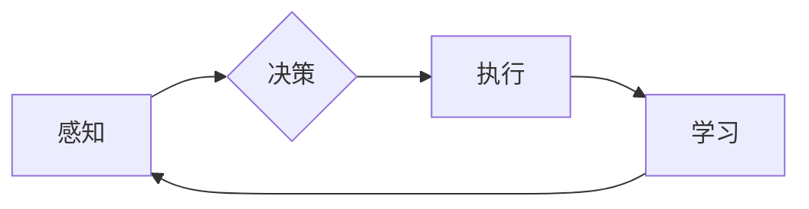

> 关键词：AI Agent, 人工智能代理, 机器学习, 强化学习, 智能决策, 交互式系统, 自动化

# AI Agent: AI的下一个风口 实验背景与目的

AI Agent，或称人工智能代理，是近年来人工智能领域的热门研究方向。它代表着人工智能发展的一个新趋势，有望引领下一波技术革新。本文将深入探讨AI Agent的实验背景、目的，以及其核心概念、算法原理、应用场景和未来发展趋势。

## 1. 背景介绍

### 1.1 人工智能发展历程

从最初的符号主义到连接主义，再到如今的深度学习，人工智能经历了漫长的发展历程。随着计算能力的提升和算法的改进，人工智能在图像识别、语音识别、自然语言处理等领域取得了显著成果。然而，这些成果大多局限于特定任务，缺乏跨任务的能力和自主学习的能力。

### 1.2 AI Agent的兴起

随着强化学习等技术的进步，AI Agent的概念应运而生。AI Agent是一种能够自主感知环境、做出决策、并不断学习优化的智能实体。它代表了人工智能从“做什么”到“怎么做”的转变，具有广泛的应用前景。

## 2. 核心概念与联系

### 2.1 AI Agent的核心概念

- **感知**：AI Agent通过传感器收集环境信息，如摄像头、麦克风等，以了解周围环境。
- **决策**：基于感知到的信息，AI Agent使用算法选择最佳行动策略。
- **执行**：AI Agent将决策转化为实际行动，如控制机器人执行任务。
- **学习**：通过与环境交互，AI Agent不断优化其决策策略。

### 2.2 Mermaid 流程图



### 2.3 核心概念之间的联系

感知、决策、执行和学习是AI Agent的核心概念，它们相互联系、相互影响。感知为决策提供信息，决策指导执行，执行的结果反馈给学习，从而不断优化AI Agent的性能。

## 3. 核心算法原理 & 具体操作步骤

### 3.1 算法原理概述

AI Agent的算法原理主要包括以下几种：

- **监督学习**：通过大量标记数据进行训练，学习输入到输出的映射关系。
- **强化学习**：通过与环境的交互，学习最优的行动策略。
- **深度学习**：利用神经网络对数据进行建模，提高感知、决策和学习的准确性。

### 3.2 算法步骤详解

1. **数据收集**：收集与任务相关的数据，如环境图像、传感器数据等。
2. **模型设计**：设计适合任务需求的感知、决策和学习模型。
3. **训练模型**：使用收集到的数据训练模型，优化模型参数。
4. **模型评估**：评估模型的性能，如准确率、召回率等。
5. **部署模型**：将训练好的模型部署到实际应用场景中。

### 3.3 算法优缺点

- **优点**：AI Agent能够自主学习和适应环境，具有较好的灵活性和通用性。
- **缺点**：AI Agent的训练过程复杂，需要大量数据和计算资源。

### 3.4 算法应用领域

AI Agent可以应用于各种场景，如：

- **机器人控制**：控制机器人完成各种任务，如清洁、搬运、手术等。
- **自动驾驶**：自动驾驶汽车在复杂交通环境下做出安全、高效的驾驶决策。
- **游戏AI**：设计智能对手，提升游戏体验。
- **智能客服**：提供24小时不间断的智能客服服务。

## 4. 数学模型和公式 & 详细讲解 & 举例说明

### 4.1 数学模型构建

AI Agent的数学模型主要包括以下几种：

- **马尔可夫决策过程（MDP）**：描述了决策者在不确定环境中做出最优决策的过程。
- **策略梯度算法**：通过优化策略梯度来学习最优策略。
- **深度Q网络（DQN）**：利用深度学习技术解决强化学习问题。

### 4.2 公式推导过程

以MDP为例，其数学模型可以表示为：

$$
V(s) = \max_{a} \sum_{s'} P(s'|s,a) \cdot [R(s,a,s') + \gamma V(s')]
$$

其中，$V(s)$ 表示状态 $s$ 的价值函数，$R(s,a,s')$ 表示从状态 $s$ 在采取行动 $a$ 后转移到状态 $s'$ 的奖励，$P(s'|s,a)$ 表示在状态 $s$ 采取行动 $a$ 后转移到状态 $s'$ 的概率，$\gamma$ 为折现系数。

### 4.3 案例分析与讲解

以自动驾驶为例，我们可以使用MDP模型描述自动驾驶过程中的决策问题。将车辆所在位置、速度、方向等作为状态，将加速、减速、转向等作为动作，将道路状况、天气等作为奖励。通过训练MDP模型，可以使自动驾驶汽车在复杂交通环境下做出安全、高效的驾驶决策。

## 5. 项目实践：代码实例和详细解释说明

### 5.1 开发环境搭建

为了方便演示，我们使用Python编程语言和PyTorch深度学习框架进行AI Agent的开发。

### 5.2 源代码详细实现

以下是一个简单的AI Agent示例代码，使用了PyTorch和OpenAI的Gym库：

```python
import gym
import torch
import torch.nn as nn
import torch.optim as optim

# 定义环境
env = gym.make('CartPole-v0')

# 定义神经网络
class QNetwork(nn.Module):
    def __init__(self, input_size, output_size):
        super(QNetwork, self).__init__()
        self.fc1 = nn.Linear(input_size, 128)
        self.fc2 = nn.Linear(128, output_size)

    def forward(self, x):
        x = torch.relu(self.fc1(x))
        return self.fc2(x)

# 初始化模型和优化器
q_network = QNetwork(input_size=4, output_size=2)
optimizer = optim.Adam(q_network.parameters(), lr=0.01)

# 训练模型
def train(q_network, optimizer, env, epochs=100):
    for epoch in range(epochs):
        state = env.reset()
        done = False
        while not done:
            # 选择动作
            state_tensor = torch.FloatTensor(state).unsqueeze(0)
            q_values = q_network(state_tensor)
            action = q_values.argmax().item()
            state, reward, done, _ = env.step(action)
            # 更新网络
            reward_tensor = torch.FloatTensor([reward])
            target = reward_tensor + 0.99 * torch.max(q_network(torch.FloatTensor(next_state)).detach())
            td_loss = F.smooth_l1_loss(q_values, target)
            optimizer.zero_grad()
            td_loss.backward()
            optimizer.step()
        print(f"Epoch {epoch+1}, reward: {reward}")

# 运行训练
train(q_network, optimizer, env)
```

### 5.3 代码解读与分析

以上代码定义了一个简单的Q网络，并使用Gym库中的CartPole环境进行训练。在训练过程中，Q网络不断学习最优的策略，使CartPole能够在环境中保持平衡。

### 5.4 运行结果展示

运行上述代码，可以看到CartPole在环境中保持平衡的时间逐渐延长，最终能够稳定地停留在平衡位置。

## 6. 实际应用场景

### 6.1 机器人控制

AI Agent可以用于控制机器人完成各种任务，如清洁、搬运、手术等。例如，可以训练一个AI Agent控制机器人进行家庭清洁，让机器人能够自主地规划清洁路径、识别地面污渍，并执行清洁操作。

### 6.2 自动驾驶

自动驾驶汽车是AI Agent的典型应用场景。通过收集大量道路图像和传感器数据，训练AI Agent能够识别道路标志、车辆、行人等，并在复杂交通环境下做出安全、高效的驾驶决策。

### 6.3 智能客服

AI Agent可以用于智能客服系统，提供24小时不间断的客服服务。通过分析用户咨询内容和历史交互记录，AI Agent能够理解用户意图，并给出准确的答复。

## 7. 工具和资源推荐

### 7.1 学习资源推荐

- 《Reinforcement Learning: An Introduction》
- 《Deep Reinforcement Learning》
- 《Artificial Intelligence: A Modern Approach》

### 7.2 开发工具推荐

- PyTorch
- TensorFlow
- OpenAI Gym

### 7.3 相关论文推荐

- "Deep Reinforcement Learning: An Overview" by David Silver
- "Human-Level Control through Deep Reinforcement Learning" by Volodymyr Mnih et al.
- "Asynchronous Methods for Deep Reinforcement Learning" by John Schulman et al.

## 8. 总结：未来发展趋势与挑战

### 8.1 研究成果总结

AI Agent作为一种新兴的人工智能技术，在机器人控制、自动驾驶、智能客服等领域展现出巨大的潜力。通过不断优化算法、提高模型性能，AI Agent有望在未来得到更广泛的应用。

### 8.2 未来发展趋势

- **多智能体系统**：研究多个AI Agent之间的协作和竞争，实现更复杂的任务。
- **强化学习与深度学习的结合**：利用深度学习技术提高强化学习模型的性能。
- **可解释AI Agent**：研究可解释AI Agent，提高模型的可信度和可接受度。

### 8.3 面临的挑战

- **数据收集和处理**：收集高质量的数据，并对其进行有效处理。
- **计算资源**：训练AI Agent需要大量的计算资源。
- **安全性和伦理**：确保AI Agent的行为符合伦理和安全标准。

### 8.4 研究展望

随着人工智能技术的不断发展，AI Agent有望在未来实现更加智能化的应用。通过不断克服挑战，AI Agent将为人类社会带来更多的便利和福祉。

## 9. 附录：常见问题与解答

**Q1：AI Agent与机器人有什么区别？**

A：AI Agent是一种能够自主学习和适应环境的智能实体，而机器人是一种机械装置，通过AI Agent来执行任务。

**Q2：如何评估AI Agent的性能？**

A：评估AI Agent的性能可以通过多种指标，如准确率、召回率、F1值等。

**Q3：AI Agent在哪些领域具有应用前景？**

A：AI Agent可以应用于机器人控制、自动驾驶、智能客服、游戏AI等多个领域。

**Q4：如何训练AI Agent？**

A：训练AI Agent需要收集大量数据，并使用合适的算法进行训练。

**Q5：AI Agent的安全性如何保证？**

A：确保AI Agent的安全性需要从算法、数据、应用等多个方面进行考虑。

---

作者：禅与计算机程序设计艺术 / Zen and the Art of Computer Programming