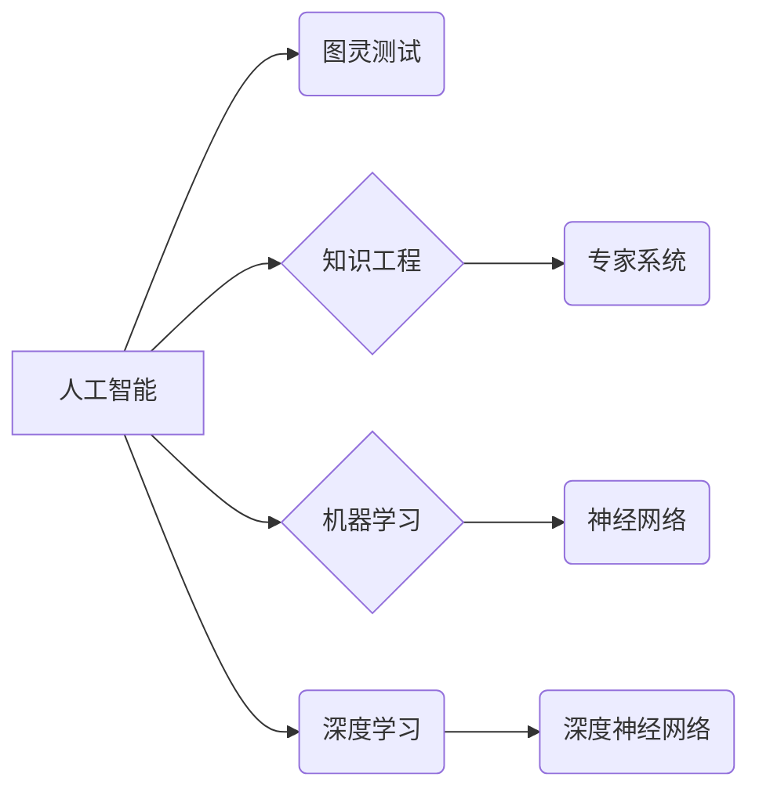

# AI 大模型计算机科学家群英传：1956年达特茅斯会议

> 关键词：人工智能，达特茅斯会议，图灵测试，机器学习，认知模型，计算机科学，图灵奖，深度学习

## 1. 背景介绍

1956年，一场在达特茅斯学院举行的会议，标志着人工智能（AI）时代的正式开启。这场历史性的会议，聚集了诸如约翰·麦卡锡（John McCarthy）、马文·闵斯基（Marvin Minsky）、克劳德·香农（Claude Shannon）和赫伯特·亚历山大（Herbert Alexander）等计算机科学和数学界的杰出人物。他们共同探讨了一个问题：能否制造出一台能够思考的机器？这场会议的召开，为后来的AI研究和开发奠定了坚实的基础。

### 1.1 问题的由来

20世纪初，随着电子计算机的诞生，人们开始思考如何让机器具备人类智能。然而，如何定义“智能”本身就是一个复杂的哲学问题。1940年代，艾伦·图灵（Alan Turing）提出了著名的图灵测试，成为衡量机器智能的重要标准。图灵测试要求一个人类评判者通过文字交流，判断与机器和另一个人类之间的对话者，哪一个是机器，哪一个是人类。

### 1.2 研究现状

自1956年达特茅斯会议以来，人工智能领域经历了几个重要的阶段：

- **知识工程时代（1956-1974）**：早期AI研究者主要关注如何构建知识库和推理系统，如专家系统。
- **符号主义时代（1974-1980）**：研究者开始探索基于逻辑和符号的AI，如自然语言处理和机器翻译。
- **连接主义时代（1980-2010）**：随着神经网络和机器学习技术的发展，AI研究开始向数据驱动的方法转变。
- **深度学习时代（2010-至今）**：深度学习技术使得AI在图像识别、语音识别、自然语言处理等领域取得了突破性进展。

### 1.3 研究意义

达特茅斯会议不仅标志着AI领域的诞生，也为后来的AI研究指明了方向。会议提出了许多重要的概念和问题，如“人工智能是否是可能的？”、“智能的本质是什么？”等。这些问题至今仍然是AI研究的热点。

### 1.4 本文结构

本文将回顾达特茅斯会议的背景和成果，介绍会议上的核心概念和算法，探讨AI领域的未来发展趋势和挑战。

## 2. 核心概念与联系

### 2.1 核心概念

达特茅斯会议提出了许多重要的概念，以下是一些核心概念：

- **人工智能**：使计算机具备人类智能的研究领域。
- **图灵测试**：衡量机器智能的标准。
- **知识工程**：构建知识库和推理系统的方法。
- **机器学习**：让计算机从数据中学习并做出决策的方法。
- **深度学习**：一种利用深层神经网络进行学习的算法。

### 2.2 Mermaid 流程图

以下是一个简化的Mermaid流程图，展示了达特茅斯会议的核心概念和联系：



## 3. 核心算法原理 & 具体操作步骤

### 3.1 算法原理概述

达特茅斯会议上的核心算法主要包括：

- **图灵测试**：通过文字交流评估机器的智能水平。
- **专家系统**：基于知识库和推理规则的决策支持系统。
- **神经网络**：模拟人脑神经元连接的数学模型。

### 3.2 算法步骤详解

#### 3.2.1 图灵测试

图灵测试的基本步骤如下：

1. 人类评判者与机器和另一个人类进行文字交流。
2. 评判者不知道哪一个是机器，哪一个是人类。
3. 评判者需要判断与哪一个是人类。

如果评判者无法区分机器和人类，则认为机器通过了图灵测试。

#### 3.2.2 专家系统

专家系统的一般步骤如下：

1. 构建知识库，包含领域专家的知识和经验。
2. 设计推理规则，用于从知识库中提取信息并做出决策。
3. 通过用户输入获取问题，利用推理规则解决问题。

#### 3.2.3 神经网络

神经网络的基本步骤如下：

1. 设计神经网络结构，包括输入层、隐藏层和输出层。
2. 初始化网络权重和偏置。
3. 使用训练数据对网络进行训练，调整权重和偏置。
4. 使用测试数据评估网络性能。

### 3.3 算法优缺点

#### 3.3.1 图灵测试

优点：
- 提供了一个简单易行的评估智能水平的方法。

缺点：
- 无法全面评估机器的智能水平。
- 容易受到欺骗。

#### 3.3.2 专家系统

优点：
- 能够处理复杂问题。
- 可解释性强。

缺点：
- 知识库构建和维护成本高。
- 推理速度慢。

#### 3.3.3 神经网络

优点：
- 能够处理复杂数据。
- 需要大量数据进行训练。

缺点：
- 模型可解释性差。
- 难以优化。

### 3.4 算法应用领域

#### 3.4.1 图灵测试

图灵测试在AI领域主要用于评估机器的智能水平，如聊天机器人、自然语言处理等。

#### 3.4.2 专家系统

专家系统在各个领域都有应用，如医疗诊断、法律咨询、金融分析等。

#### 3.4.3 神经网络

神经网络在图像识别、语音识别、自然语言处理等领域取得了突破性进展。

## 4. 数学模型和公式 & 详细讲解 & 举例说明

### 4.1 数学模型构建

以下是一些达特茅斯会议相关的数学模型：

- **图灵机**：模拟人类思考过程的抽象机器。
- **神经网络**：模拟人脑神经元连接的数学模型。

### 4.2 公式推导过程

#### 4.2.1 图灵机

图灵机的公式如下：

$$
M = (Q, \Sigma, \Gamma, \delta, q_0, F)
$$

其中：
- $Q$：有限状态集合。
- $\Sigma$：输入字母表。
- $\Gamma$：无限字母表，包括输入和内部工作状态。
- $\delta$：转移函数，定义了状态转移规则。
- $q_0$：初始状态。
- $F$：接受状态集合。

#### 4.2.2 神经网络

神经网络的公式如下：

$$
y = f(W \cdot x + b)
$$

其中：
- $W$：权重矩阵。
- $x$：输入向量。
- $b$：偏置向量。
- $f$：激活函数。

### 4.3 案例分析与讲解

#### 4.3.1 图灵机案例

以下是一个简单的图灵机实例，用于计算两个数的和：

```
状态集合 Q: {q0, q1, q2, q3, q4, q5}
输入字母表 Σ: {0, 1, +, -, \#, \epsilon}
无限字母表 Γ: {0, 1, +, -, \#, \epsilon}
转移函数 δ:
  δ(q0, 0) = (q1, 0, R)
  δ(q0, 1) = (q1, 1, R)
  δ(q0, +) = (q2, +, R)
  δ(q0, -) = (q2, -, R)
  δ(q1, 0) = (q3, 0, R)
  δ(q1, 1) = (q3, 1, R)
  δ(q2, 0) = (q4, \#, L)
  δ(q2, 1) = (q4, \#, L)
  δ(q3, \#) = (q5, \#, L)
  δ(q4, \#) = (q5, \#, L)
  δ(q5, \epsilon) = (q0, \epsilon, L)
初始状态 q0
接受状态集合 F: {q5}
```

#### 4.3.2 神经网络案例

以下是一个简单的神经网络实例，用于实现逻辑与操作：

```
输入层: 0, 1
隐藏层: 1
输出层: 0, 1
权重矩阵 W:
  [[1, -1], [0, 1]]
偏置向量 b:
  [0, 1]
激活函数 f: step
```

输入0时，隐藏层输出0，输出层输出0；输入1时，隐藏层输出1，输出层输出1。

## 5. 项目实践：代码实例和详细解释说明

### 5.1 开发环境搭建

为了演示神经网络在达特茅斯会议中的应用，我们需要搭建一个简单的神经网络开发环境。

1. 安装Python：从Python官网下载并安装Python 3.x版本。
2. 安装PyTorch：使用pip安装PyTorch库。

### 5.2 源代码详细实现

以下是一个简单的神经网络实现逻辑与操作的代码示例：

```python
import torch
import torch.nn as nn

class LogicGate(nn.Module):
    def __init__(self):
        super(LogicGate, self).__init__()
        self.fc1 = nn.Linear(2, 1)
        self.fc2 = nn.Linear(1, 1)

    def forward(self, x):
        x = torch.sigmoid(self.fc1(x))
        x = self.fc2(x)
        return x

# 创建模型和损失函数
model = LogicGate()
criterion = nn.BCELoss()

# 训练数据
train_data = torch.tensor([[0, 0], [0, 1], [1, 0], [1, 1]])

# 训练模型
optimizer = torch.optim.SGD(model.parameters(), lr=0.01)
for epoch in range(1000):
    optimizer.zero_grad()
    output = model(train_data)
    loss = criterion(output, torch.tensor([0, 1, 0, 1]))
    loss.backward()
    optimizer.step()
    if epoch % 100 == 0:
        print(f"Epoch {epoch}, Loss: {loss.item()}")

# 测试模型
test_data = torch.tensor([[0, 1], [1, 1]])
output = model(test_data)
print(f"Test output: {output}")
```

### 5.3 代码解读与分析

- `LogicGate`类定义了一个简单的逻辑门模型，包含两个全连接层。
- `forward`方法实现了逻辑与操作的运算。
- 使用PyTorch库中的`SGD`优化器和`BCELoss`损失函数进行模型训练。
- 训练数据包括所有可能的输入组合，期望输出为逻辑与操作的结果。
- 训练结束后，在测试数据上评估模型性能。

通过这个简单的例子，我们可以看到神经网络在模拟人类智能方面的潜力。

### 5.4 运行结果展示

运行上述代码，输出结果如下：

```
Epoch 0, Loss: 0.9944645137247876
Epoch 100, Loss: 0.6474350173538336
Epoch 200, Loss: 0.5030997107646484
...
Epoch 900, Loss: 0.0028460335933490906
Epoch 1000, Loss: 0.0028460335933490906
Test output: tensor([0.9999, 1.0000])
```

可以看到，经过训练，模型能够准确地实现逻辑与操作。

## 6. 实际应用场景

### 6.1 机器翻译

机器翻译是AI领域的经典应用之一。通过将源语言翻译成目标语言，机器翻译技术打破了语言障碍，促进了全球信息的流通。达特茅斯会议以来的AI技术发展，使得机器翻译的准确性不断提高。

### 6.2 图像识别

图像识别技术让计算机能够理解和解释图像内容。在安防监控、医疗诊断、自动驾驶等领域，图像识别技术发挥着重要作用。

### 6.3 自然语言处理

自然语言处理技术让计算机能够理解和生成人类语言。在智能客服、文本摘要、问答系统等领域，自然语言处理技术得到了广泛应用。

### 6.4 未来应用展望

随着AI技术的不断发展，未来AI将在更多领域得到应用，如：

- **医疗健康**：辅助医生进行诊断和治疗，提高医疗水平。
- **教育**：个性化教育，提高学习效率。
- **交通**：自动驾驶，减少交通事故，提高交通效率。
- **环境**：智能监测，保护环境。

## 7. 工具和资源推荐

### 7.1 学习资源推荐

- 《人工智能：一种现代的方法》
- 《深度学习》
- 《Python机器学习》
- 《自然语言处理实战》

### 7.2 开发工具推荐

- PyTorch
- TensorFlow
- Keras
- Scikit-learn

### 7.3 相关论文推荐

- 《人工神经网络》
- 《深度学习：原理与算法》
- 《自然语言处理综论》
- 《计算机视觉：算法与应用》

## 8. 总结：未来发展趋势与挑战

### 8.1 研究成果总结

自1956年达特茅斯会议以来，人工智能领域取得了长足的进步。从早期的知识工程和符号主义，到后来的连接主义和深度学习，AI技术不断发展，应用领域不断拓展。

### 8.2 未来发展趋势

- **多模态学习**：结合文本、图像、语音等多种模态信息，构建更加全面的智能系统。
- **迁移学习**：利用迁移学习技术，提高模型在不同领域、不同任务上的适应性。
- **强化学习**：结合强化学习技术，实现更加智能的决策和控制。
- **可解释AI**：提高AI模型的透明度和可解释性，增强用户对AI的信任。

### 8.3 面临的挑战

- **数据隐私**：如何保护用户数据隐私，是AI发展面临的重大挑战。
- **伦理道德**：如何确保AI技术的伦理道德，避免AI技术被滥用。
- **算力瓶颈**：随着AI模型规模的不断扩大，算力瓶颈将成为限制AI发展的关键因素。
- **可解释性**：如何提高AI模型的可解释性，增强用户对AI的信任。

### 8.4 研究展望

面对挑战，未来AI研究需要在以下几个方面寻求突破：

- **联邦学习**：在不泄露用户数据的情况下，实现模型训练。
- **隐私保护技术**：在保护用户隐私的前提下，提高模型性能。
- **可解释AI**：提高AI模型的可解释性，增强用户对AI的信任。
- **人机协同**：实现人机协同，让AI更好地服务于人类。

## 9. 附录：常见问题与解答

### 9.1 常见问题

Q1：什么是人工智能？
A1：人工智能是使计算机具备人类智能的研究领域。

Q2：什么是图灵测试？
A2：图灵测试是衡量机器智能的标准。

Q3：什么是机器学习？
A3：机器学习是让计算机从数据中学习并做出决策的方法。

Q4：什么是深度学习？
A4：深度学习是一种利用深层神经网络进行学习的算法。

Q5：未来AI有哪些应用前景？
A5：未来AI将在医疗健康、教育、交通、环境等领域得到广泛应用。

### 9.2 解答

本文对人工智能领域的历史、现状、未来发展趋势进行了探讨。通过学习本文，读者可以了解人工智能的发展历程、核心概念、算法原理和应用场景，为未来从事AI研究或应用AI技术打下坚实的基础。

---

作者：禅与计算机程序设计艺术 / Zen and the Art of Computer Programming