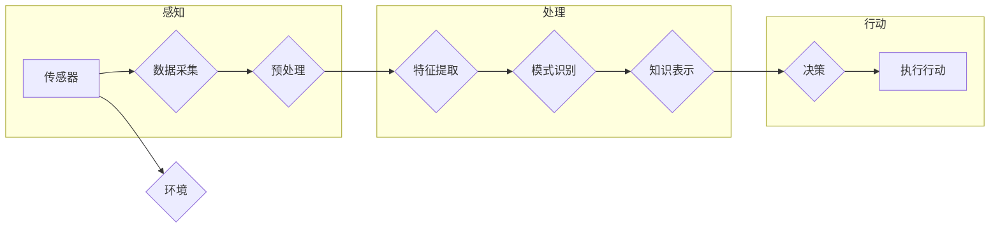

> 关键词：人工智能，智能体，感知机制，机器学习，深度学习，强化学习，知识表示，环境交互

# AI人工智能 Agent：理解和应用智能体的感知机制

智能体（Agent）是人工智能领域中的一个核心概念，代表着具有自主行为和决策能力的实体。在现实世界中，智能体需要通过感知环境来获取信息，并基于这些信息做出合理的决策。本文将深入探讨智能体的感知机制，分析其原理、算法、应用以及未来发展趋势。

## 1. 背景介绍

### 1.1 智能体的概念

智能体是具有感知、推理、决策和行动能力的实体。在人工智能领域，智能体可以是一个机器人、一个软件程序，或者是一个系统。智能体的核心特征包括：

- **感知**：从环境中获取信息。
- **推理**：基于感知信息进行逻辑思考和判断。
- **决策**：根据推理结果做出选择。
- **行动**：执行决策结果。

### 1.2 智能体的感知机制

感知是智能体与环境交互的第一步，也是智能体决策和行动的基础。感知机制涉及如何将环境中的信息转换为智能体可以理解和处理的数据。

### 1.3 智能体感知的重要性

智能体的感知能力直接影响其决策和行动的准确性。一个高效的感知机制可以帮助智能体更好地适应环境，提高其生存和成功的概率。

## 2. 核心概念与联系

### 2.1 感知机制的 Mermaid 流程图



### 2.2 关键概念

- **传感器**：用于从环境中获取信息的物理或虚拟设备。
- **数据采集**：从传感器获取原始数据的过程。
- **预处理**：对原始数据进行清洗、去噪、归一化等操作，使其适合进一步处理。
- **特征提取**：从预处理后的数据中提取对任务有用的特征。
- **模式识别**：识别数据中的模式或结构。
- **知识表示**：将模式或结构表示为智能体可以理解和处理的形式。
- **决策**：基于知识表示进行逻辑思考和判断，做出选择。
- **执行行动**：根据决策结果执行行动。

## 3. 核心算法原理 & 具体操作步骤

### 3.1 算法原理概述

智能体的感知机制通常包含以下几个步骤：

1. **数据采集**：通过传感器获取环境信息。
2. **预处理**：对原始数据进行清洗和转换，使其适合后续处理。
3. **特征提取**：从预处理后的数据中提取有用的特征。
4. **模式识别**：使用机器学习或深度学习算法识别数据中的模式。
5. **知识表示**：将识别出的模式表示为智能体可以理解和处理的形式。
6. **决策**：基于知识表示进行逻辑思考和判断，做出选择。
7. **执行行动**：根据决策结果执行行动。

### 3.2 算法步骤详解

1. **数据采集**：智能体通过传感器（如摄像头、麦克风、传感器阵列等）从环境中获取信息。
2. **预处理**：对传感器获取的原始数据进行预处理，包括去噪、归一化、特征缩放等操作，以提高后续处理的质量。
3. **特征提取**：使用特征提取算法（如主成分分析、自编码器等）从预处理后的数据中提取有用的特征。
4. **模式识别**：使用机器学习或深度学习算法（如支持向量机、神经网络等）识别数据中的模式。
5. **知识表示**：将识别出的模式表示为智能体可以理解和处理的形式，如决策树、规则或概率模型。
6. **决策**：基于知识表示进行逻辑思考和判断，做出选择。
7. **执行行动**：根据决策结果执行行动，如移动、发送消息或激活其他设备。

### 3.3 算法优缺点

**优点**：

- **适应性**：智能体可以根据环境变化调整其感知机制，以适应不同的任务和场景。
- **鲁棒性**：智能体可以通过预处理和特征提取等技术提高其感知机制的鲁棒性，减少噪声和干扰的影响。
- **可扩展性**：智能体的感知机制可以扩展到新的任务和场景，只需调整或扩展相应的算法和模型。

**缺点**：

- **计算成本**：感知机制的算法和模型通常需要大量的计算资源。
- **数据依赖**：智能体的感知能力取决于传感器质量和数据质量。
- **黑盒问题**：深度学习模型等黑盒模型可能难以解释其感知过程，导致决策和行动缺乏透明性。

### 3.4 算法应用领域

智能体的感知机制在许多领域都有广泛的应用，包括：

- **机器人**：机器人使用传感器感知环境，并根据感知信息进行导航、避障、抓取等操作。
- **自动驾驶**：自动驾驶汽车使用摄像头、雷达等传感器感知道路情况，并根据感知信息进行驾驶决策。
- **医疗诊断**：智能系统使用医学图像处理技术感知患者病情，并进行初步诊断。
- **智能家居**：智能家居系统使用传感器感知家庭环境，并根据感知信息进行设备控制。

## 4. 数学模型和公式 & 详细讲解 & 举例说明

### 4.1 数学模型构建

智能体的感知机制可以建模为一个输入-输出系统。输入为传感器数据，输出为智能体的决策或行动。

### 4.2 公式推导过程

假设智能体的感知模型为 $f$，输入为 $x$，输出为 $y$，则：

$$
y = f(x)
$$

其中，$x$ 为传感器数据，$y$ 为智能体的决策或行动。

### 4.3 案例分析与讲解

以下以自动驾驶汽车的感知机制为例，分析其数学模型。

**输入**：来自摄像头、雷达、激光雷达等传感器的数据。

**输出**：驾驶决策，如加速、减速、转向等。

**数学模型**：

自动驾驶汽车的感知模型可以建模为一个多输入多输出的非线性系统。例如，可以使用卷积神经网络（CNN）处理摄像头数据，使用雷达数据处理距离信息，使用激光雷达数据进行三维空间定位。

## 5. 项目实践：代码实例和详细解释说明

### 5.1 开发环境搭建

为了实现自动驾驶汽车的感知机制，需要搭建以下开发环境：

- 操作系统：Linux
- 编程语言：Python
- 机器学习框架：TensorFlow或PyTorch
- 传感器数据预处理库：OpenCV
- 3D点云处理库：PCL（Point Cloud Library）

### 5.2 源代码详细实现

以下是一个使用TensorFlow和OpenCV实现自动驾驶汽车感知机制的简单示例：

```python
import cv2
import tensorflow as tf

def preprocess_sensor_data(sensor_data):
    # 传感器数据预处理
    # ...

def extract_features(sensor_data):
    # 特征提取
    # ...

def build_model():
    # 构建感知模型
    # ...

def main():
    sensor_data = preprocess_sensor_data(...)
    features = extract_features(sensor_data)
    model = build_model()
    predictions = model(features)
    # 执行决策
    # ...

if __name__ == "__main__":
    main()
```

### 5.3 代码解读与分析

以上代码展示了自动驾驶汽车感知机制的实现框架。首先，从传感器获取数据并进行预处理。然后，提取特征并将其输入到感知模型中。最后，根据模型的输出执行相应的决策。

### 5.4 运行结果展示

运行以上代码将生成自动驾驶汽车的感知模型，并根据传感器数据生成驾驶决策。

## 6. 实际应用场景

### 6.1 自动驾驶

自动驾驶汽车是智能体感知机制的经典应用场景。通过集成多种传感器（如摄像头、雷达、激光雷达等），自动驾驶汽车可以感知周围环境，并根据感知信息进行安全驾驶。

### 6.2 智能机器人

智能机器人使用传感器感知环境，并根据感知信息进行导航、避障、抓取等操作。例如，工业机器人可以通过感知传感器数据来调整其动作，以完成特定的任务。

### 6.3 智能家居

智能家居系统使用传感器感知家庭环境，并根据感知信息进行设备控制。例如，智能灯泡可以感知环境光线强度，并根据光线强度调整亮度。

### 6.4 未来应用展望

随着传感器技术的进步和机器学习算法的发展，智能体的感知机制将更加高效、鲁棒。未来，智能体的感知机制将在更多领域得到应用，如：

- 智能医疗
- 智能交通
- 智能工厂
- 智能城市

## 7. 工具和资源推荐

### 7.1 学习资源推荐

- 《人工智能：一种现代的方法》
- 《深度学习》
- 《机器学习》
- 《概率图模型》

### 7.2 开发工具推荐

- TensorFlow
- PyTorch
- OpenCV
- PCL

### 7.3 相关论文推荐

- "Sensor Fusion: Why It Matters for Autonomous Vehicles"
- "Deep Learning for Sensor Fusion: A Survey"
- "A Review of Machine Learning Techniques for Robot Perception"

## 8. 总结：未来发展趋势与挑战

### 8.1 研究成果总结

本文深入探讨了智能体的感知机制，分析了其原理、算法、应用以及未来发展趋势。通过理解感知机制，我们可以设计出更加智能、高效的智能体，使其更好地适应环境，完成各种任务。

### 8.2 未来发展趋势

- **多传感器融合**：结合多种传感器数据，提高感知的全面性和准确性。
- **深度学习**：利用深度学习算法提高感知的鲁棒性和泛化能力。
- **知识表示**：将感知信息表示为智能体可以理解和处理的形式，提高决策和行动的效率。

### 8.3 面临的挑战

- **传感器成本**：高精度的传感器成本较高，限制了其应用范围。
- **数据处理**：大量传感器数据需要高效的数据处理算法。
- **模型解释性**：深度学习模型等黑盒模型难以解释其感知过程。

### 8.4 研究展望

随着技术的不断发展，智能体的感知机制将更加先进，为人工智能领域带来更多可能性。未来，我们将见证智能体在各个领域的广泛应用，为人类创造更加美好的未来。

## 9. 附录：常见问题与解答

**Q1：什么是多传感器融合？**

A：多传感器融合是指将来自多个传感器的数据集成起来，以获得更全面、准确的环境感知。常见的多传感器融合方法包括卡尔曼滤波、粒子滤波等。

**Q2：深度学习在感知机制中有什么作用？**

A：深度学习可以用于特征提取、模式识别和知识表示等环节，提高感知的鲁棒性和泛化能力。

**Q3：如何提高感知机制的鲁棒性？**

A：可以通过以下方法提高感知机制的鲁棒性：
- 使用高精度的传感器
- 优化数据预处理算法
- 使用鲁棒的机器学习算法
- 引入噪声和干扰抑制技术

**Q4：如何评估感知机制的性能？**

A：可以通过以下指标评估感知机制的性能：
- 准确率：正确识别目标的概率。
- 精确率：正确识别目标的比例。
- 召回率：被正确识别的目标的比例。
- 假正率：错误识别为正类的负类样本的比例。

**Q5：感知机制在哪些领域有应用？**

A：感知机制在自动驾驶、智能机器人、智能家居、智能医疗等领域有广泛的应用。

---

作者：禅与计算机程序设计艺术 / Zen and the Art of Computer Programming