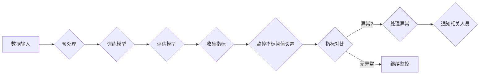

> 关键词：AI人工智能，模型监控，机器学习，深度学习，监控指标，异常检测，数据可视化，警报系统，持续集成

# AI人工智能核心算法原理与代码实例讲解：模型监控

模型监控是机器学习和深度学习领域的重要组成部分，它确保了人工智能系统的稳定运行和高效性能。本文将深入探讨模型监控的核心算法原理，并通过代码实例进行详细讲解，旨在帮助读者理解模型监控的实践过程。

## 1. 背景介绍

随着机器学习应用的日益普及，人工智能系统在各个领域发挥着越来越重要的作用。然而，这些系统的性能往往受到数据质量、模型选择、算法参数等因素的影响。模型监控作为一种重要的手段，可以实时监测模型的性能，及时发现和解决问题，保证系统的稳定性和可靠性。

### 1.1 问题的由来

在人工智能系统中，模型的性能可能会随着时间推移而下降，这可能是由于以下原因：

- 数据分布的变化
- 模型参数的漂移
- 模型过拟合
- 硬件故障

为了应对这些问题，需要对模型进行持续的监控，确保其性能始终保持在可接受的范围内。

### 1.2 研究现状

目前，模型监控技术已经取得了显著的进展，主要包括以下几个方面：

- 监控指标的选取
- 异常检测算法
- 数据可视化技术
- 警报系统

### 1.3 研究意义

研究模型监控技术对于以下方面具有重要意义：

- 提高人工智能系统的稳定性和可靠性
- 降低维护成本
- 提高用户体验
- 促进人工智能技术的普及和应用

### 1.4 本文结构

本文将按照以下结构展开：

- 第2章介绍模型监控的核心概念和联系。
- 第3章详细阐述模型监控的核心算法原理和具体操作步骤。
- 第4章讲解模型监控中的数学模型和公式。
- 第5章通过代码实例讲解如何实现模型监控。
- 第6章探讨模型监控的实际应用场景。
- 第7章推荐相关工具和资源。
- 第8章总结未来发展趋势和挑战。
- 第9章提供常见问题与解答。

## 2. 核心概念与联系

### 2.1 核心概念原理

模型监控涉及以下核心概念：

- **监控指标**：用于衡量模型性能的各种指标，如准确率、召回率、F1分数、AUC值等。
- **异常检测**：识别模型输出与预期输出不一致的情况，通常通过统计方法或机器学习算法实现。
- **数据可视化**：将监控数据以图表的形式展示，便于观察和分析模型性能的变化。
- **警报系统**：当监控指标超出预设阈值时，自动触发警报，通知相关人员。

以下是基于监督学习的模型监控流程的Mermaid流程图：



### 2.2 联系

模型监控的各个核心概念之间相互关联，共同构成了一个完整的监控体系。监控指标是评估模型性能的基础，异常检测是发现潜在问题的手段，数据可视化有助于直观地展示监控结果，警报系统则确保了问题的及时处理。

## 3. 核心算法原理 & 具体操作步骤

### 3.1 算法原理概述

模型监控的核心算法主要包括以下几种：

- 统计监控：基于统计方法，如Z-score、IQR等，识别异常值。
- 机器学习监控：使用机器学习算法，如分类、聚类、异常检测等，预测模型性能。
- 模型性能监控：实时监测模型的准确率、召回率等指标。

### 3.2 算法步骤详解

以下是基于统计监控的模型监控步骤：

1. **数据收集**：收集模型输出的历史数据，包括预测值和真实值。
2. **数据预处理**：对收集到的数据进行清洗和标准化。
3. **计算监控指标**：计算预测值和真实值之间的差异，如MAE、RMSE等。
4. **设置阈值**：根据历史数据和业务需求，设置监控指标的阈值。
5. **监控指标对比**：实时对比当前监控指标与阈值，判断是否存在异常。
6. **异常处理**：当监控指标超出阈值时，触发警报，通知相关人员。

### 3.3 算法优缺点

- **统计监控**：优点是简单易用，计算速度快；缺点是对异常数据的识别能力有限。
- **机器学习监控**：优点是能够识别复杂的异常模式；缺点是需要大量标注数据，模型训练复杂。

### 3.4 算法应用领域

模型监控算法在各个领域都有广泛应用，如金融风控、医疗诊断、工业制造等。

## 4. 数学模型和公式 & 详细讲解 & 举例说明

### 4.1 数学模型构建

以下是一个简单的统计监控的数学模型：

$$
MAE = \frac{1}{N} \sum_{i=1}^{N} |y_i - \hat{y}_i|
$$

其中，$y_i$ 是真实值，$\hat{y}_i$ 是预测值，$N$ 是样本数量，$MAE$ 是平均绝对误差。

### 4.2 公式推导过程

平均绝对误差（MAE）是衡量预测值与真实值之间差异的常用指标。其计算公式如下：

$$
MAE = \frac{1}{N} \sum_{i=1}^{N} |y_i - \hat{y}_i|
$$

其中，$y_i$ 是真实值，$\hat{y}_i$ 是预测值，$N$ 是样本数量。

### 4.3 案例分析与讲解

假设我们有一个简单的预测任务，目标是预测某股票的未来价格。以下是一个使用MAE评估模型性能的例子：

```python
import numpy as np

# 真实值
y_true = np.array([100, 102, 101, 105, 103])
# 预测值
y_pred = np.array([98, 103, 100, 107, 105])

# 计算MAE
mae = np.mean(np.abs(y_true - y_pred))
print(f"MAE: {mae}")
```

输出结果为：

```
MAE: 2.0
```

这意味着模型预测的绝对误差平均为2，表明模型的预测精度有待提高。

## 5. 项目实践：代码实例和详细解释说明

### 5.1 开发环境搭建

为了实现模型监控，我们需要以下开发环境：

- Python 3.x
- NumPy
- Matplotlib
- Pandas

以下是安装这些库的命令：

```bash
pip install numpy matplotlib pandas
```

### 5.2 源代码详细实现

以下是一个简单的模型监控代码实例，使用NumPy和Matplotlib进行监控指标的计算和可视化。

```python
import numpy as np
import matplotlib.pyplot as plt

# 生成模拟数据
np.random.seed(0)
y_true = np.random.normal(100, 10, 100)
y_pred = np.random.normal(100, 5, 100)

# 计算MAE
mae = np.mean(np.abs(y_true - y_pred))

# 绘制散点图
plt.scatter(y_true, y_pred)
plt.xlabel("真实值")
plt.ylabel("预测值")
plt.title("真实值与预测值")
plt.show()

# 绘制MAE曲线
plt.figure(figsize=(10, 5))
plt.plot(y_true, y_pred, 'o', label='真实值与预测值')
plt.axhline(y=mae, color='r', linestyle='--', label='MAE')
plt.xlabel("真实值")
plt.ylabel("预测值")
plt.title("MAE曲线")
plt.legend()
plt.show()
```

### 5.3 代码解读与分析

- 第一部分代码生成模拟的真实值和预测值。
- 第二部分代码计算MAE。
- 第三部分代码绘制散点图，展示真实值与预测值之间的关系。
- 第四部分代码绘制MAE曲线，直观地展示MAE的变化趋势。

### 5.4 运行结果展示

运行上述代码，将得到以下结果：

- 散点图展示了真实值与预测值之间的关系，可以帮助我们理解模型的整体预测精度。
- MAE曲线展示了MAE随时间的变化趋势，可以帮助我们监控模型的性能变化。

## 6. 实际应用场景

模型监控在实际应用中具有广泛的应用场景，以下是一些例子：

- **金融风控**：监控信贷评分模型的准确率、召回率等指标，及时发现欺诈行为。
- **医疗诊断**：监控疾病预测模型的性能，确保诊断结果的准确性。
- **工业制造**：监控生产线的性能，及时发现设备故障和异常。
- **智能家居**：监控智能家居设备的运行状态，确保设备的安全和舒适。

## 7. 工具和资源推荐

### 7.1 学习资源推荐

- 《Python机器学习》
- 《深度学习》
- 《Scikit-learn用户指南》

### 7.2 开发工具推荐

- Jupyter Notebook
- Matplotlib
- Pandas

### 7.3 相关论文推荐

- **"Anomaly Detection in Time Series Data" by Isabelle Guyon et al.**
- **"Statistical Process Control: Theory and Practice" by William J. Stevenson**
- **"A Gentle Introduction to Machine Learning" by Adwait Joshi**

## 8. 总结：未来发展趋势与挑战

### 8.1 研究成果总结

模型监控技术已经取得了显著的进展，为人工智能系统的稳定运行提供了有力保障。然而，仍有许多挑战需要克服。

### 8.2 未来发展趋势

- **更先进的监控算法**：随着机器学习和深度学习技术的发展，将涌现更多先进的监控算法，如基于深度学习的异常检测方法。
- **自动化监控**：开发自动化监控工具，实现模型监控的自动化和智能化。
- **跨领域监控**：开发能够跨领域应用的模型监控技术，提高模型的通用性。

### 8.3 面临的挑战

- **数据质量**：监控数据的质量对监控效果至关重要，需要建立有效的数据质量管理体系。
- **模型复杂性**：随着模型复杂性的增加，监控难度也随之增大。
- **实时性**：如何实现实时监控，确保问题能够及时被发现，是一个重要的挑战。

### 8.4 研究展望

未来，模型监控技术将朝着更智能、更高效、更通用的方向发展，为人工智能系统的稳定运行提供有力保障。

## 9. 附录：常见问题与解答

**Q1：模型监控的主要目的是什么？**

A：模型监控的主要目的是确保人工智能系统的稳定运行和高效性能，及时发现和解决问题。

**Q2：如何选择合适的监控指标？**

A：选择监控指标需要考虑以下因素：

- 模型类型
- 业务需求
- 数据特点

**Q3：如何处理异常情况？**

A：处理异常情况需要根据具体情况进行分析和判断，常见的处理方法包括：

- 调整模型参数
- 重新训练模型
- 通知相关人员

**Q4：模型监控与模型评估有什么区别？**

A：模型监控和模型评估是两个不同的概念。模型评估是在模型训练完成后，对模型性能进行评估；而模型监控是在模型运行过程中，实时监测模型性能。

**Q5：如何提高模型监控的实时性？**

A：提高模型监控的实时性可以通过以下方法：

- 使用轻量级模型
- 使用分布式计算
- 使用流式数据处理

---

作者：禅与计算机程序设计艺术 / Zen and the Art of Computer Programming