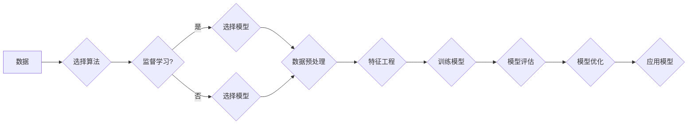

> 机器学习，深度学习，算法选择，模型评估，应用场景

# AI人工智能核心算法原理与代码实例讲解：模型选择

在人工智能领域，算法选择是构建高效、准确的机器学习模型的关键步骤。随着机器学习技术的不断发展和应用领域的扩展，可供选择的算法种类繁多，如何根据具体问题和数据特点选择合适的算法成为了一个重要课题。本文将深入探讨AI人工智能核心算法的原理，并通过代码实例讲解如何选择合适的模型。

## 1. 背景介绍

随着大数据时代的到来，机器学习和深度学习技术在各个领域得到了广泛应用。从图像识别、语音识别到自然语言处理，人工智能技术正在深刻地改变着我们的生活。然而，面对海量的算法和模型，如何选择合适的算法成为一个难题。

本文旨在帮助读者了解常见人工智能核心算法的原理，并通过代码实例讲解如何根据具体问题选择合适的模型。通过对算法原理的深入理解，读者可以更好地把握算法的适用场景，从而在实际应用中做出明智的选择。

## 2. 核心概念与联系

### 2.1 核心概念

在介绍算法选择之前，我们首先需要了解一些核心概念：

- **机器学习**：机器学习是一种使计算机系统能够从数据中学习并做出决策的技术。它分为监督学习、无监督学习和强化学习三种类型。
- **深度学习**：深度学习是机器学习的一个子集，它使用多层神经网络来学习数据的复杂表示。
- **模型**：模型是机器学习中用于预测或分类的工具。它通常由算法和数据组成。
- **特征工程**：特征工程是指从原始数据中提取出有助于模型学习的特征的过程。

### 2.2 核心概念原理和架构的 Mermaid 流程图



## 3. 核心算法原理 & 具体操作步骤

### 3.1 算法原理概述

### 3.1.1 监督学习

监督学习是一种从标注数据中学习的过程。常见的监督学习算法包括：

- **线性回归**：通过线性模型拟合数据，用于回归任务。
- **逻辑回归**：通过逻辑函数拟合数据，用于分类任务。
- **支持向量机**：通过寻找最优的超平面将数据分类。
- **决策树**：通过树的节点进行分类或回归。
- **随机森林**：集成学习算法，由多个决策树组成。

### 3.1.2 无监督学习

无监督学习是一种从无标注数据中学习的过程。常见的无监督学习算法包括：

- **聚类**：将数据分为若干个簇，每个簇中的数据相似。
- **主成分分析（PCA）**：降维算法，用于减少数据维度。
- **自编码器**：通过编码器和解码器学习数据的低维表示。

### 3.1.3 强化学习

强化学习是一种通过试错学习的过程。常见的强化学习算法包括：

- **Q学习**：通过Q表学习最优动作策略。
- **深度Q网络（DQN）**：结合深度学习技术的Q学习算法。
- **策略梯度方法**：直接学习最优动作策略。

### 3.2 算法步骤详解

1. **问题定义**：明确任务类型（回归、分类等），目标变量和特征变量。
2. **数据收集**：收集相关数据，并进行清洗和预处理。
3. **选择算法**：根据问题类型和数据特点选择合适的算法。
4. **特征工程**：提取和选择有助于模型学习的特征。
5. **模型训练**：使用训练数据训练模型。
6. **模型评估**：使用验证数据评估模型性能。
7. **模型优化**：根据评估结果调整模型参数或选择其他算法。
8. **模型部署**：将模型部署到实际应用中。

### 3.3 算法优缺点

### 3.3.1 线性回归

- **优点**：简单、易于理解、计算效率高。
- **缺点**：无法处理非线性关系、过拟合问题。

### 3.3.2 逻辑回归

- **优点**：简单、易于理解、计算效率高。
- **缺点**：无法处理非线性关系、过拟合问题。

### 3.3.3 支持向量机

- **优点**：泛化能力强、抗噪声能力强。
- **缺点**：计算复杂度高、参数较多。

### 3.3.4 决策树

- **优点**：易于理解、可视化好、解释性强。
- **缺点**：过拟合问题、可扩展性差。

### 3.3.5 随机森林

- **优点**：泛化能力强、抗噪声能力强、可解释性强。
- **缺点**：计算复杂度高、参数较多。

### 3.4 算法应用领域

- **监督学习**：分类、回归、异常检测等。
- **无监督学习**：聚类、降维、推荐系统等。
- **强化学习**：游戏、机器人、自动驾驶等。

## 4. 数学模型和公式 & 详细讲解 & 举例说明

### 4.1 数学模型构建

以下以线性回归为例，介绍数学模型构建的过程。

假设我们有 $n$ 个样本 $(x_1, y_1), (x_2, y_2), ..., (x_n, y_n)$，其中 $x_i$ 为特征变量，$y_i$ 为目标变量。

线性回归模型的数学模型可以表示为：

$$
y = \theta_0 + \theta_1x_1 + \theta_2x_2 + ... + \theta_nx_n
$$

其中 $\theta_0, \theta_1, ..., \theta_n$ 为模型参数。

### 4.2 公式推导过程

线性回归模型的最小化损失函数为：

$$
L(\theta) = \frac{1}{2} \sum_{i=1}^n (y_i - \theta_0 - \theta_1x_i - \theta_2x_i^2 - ... - \theta_nx_i^n)^2
$$

为了最小化损失函数，我们需要求解以下最小二乘问题：

$$
\theta = \mathop{\arg\min}_{\theta} L(\theta)
$$

通过求导和化简，我们可以得到线性回归模型的参数估计值：

$$
\theta = (X^T X)^{-1}X^T y
$$

其中 $X$ 为设计矩阵，$y$ 为目标向量。

### 4.3 案例分析与讲解

以下使用Python实现线性回归模型，并对结果进行分析。

```python
import numpy as np
import matplotlib.pyplot as plt
from sklearn.linear_model import LinearRegression

# 生成数据
np.random.seed(0)
X = 2 * np.random.rand(100, 1)
y = 4 + 3 * X + np.random.randn(100, 1)

# 创建线性回归模型
model = LinearRegression()

# 拟合模型
model.fit(X, y)

# 查看模型参数
print("斜率：", model.coef_)
print("截距：", model.intercept_)

# 可视化结果
plt.scatter(X, y, color='blue')
plt.plot(X, model.predict(X), color='red')
plt.show()
```

运行上述代码，我们可以得到线性回归模型的斜率和截距，并在图中可视化模型的拟合效果。

## 5. 项目实践：代码实例和详细解释说明

### 5.1 开发环境搭建

为了进行项目实践，我们需要搭建以下开发环境：

- Python 3.x
- NumPy
- Matplotlib
- scikit-learn

### 5.2 源代码详细实现

以下是一个简单的机器学习项目，使用Python实现一个线性回归模型，并使用scikit-learn库进行模型评估。

```python
import numpy as np
from sklearn.linear_model import LinearRegression
from sklearn.model_selection import train_test_split
from sklearn.metrics import mean_squared_error, r2_score

# 生成数据
np.random.seed(0)
X = 2 * np.random.rand(100, 1)
y = 4 + 3 * X + np.random.randn(100, 1)

# 划分训练集和测试集
X_train, X_test, y_train, y_test = train_test_split(X, y, test_size=0.2, random_state=0)

# 创建线性回归模型
model = LinearRegression()

# 拟合模型
model.fit(X_train, y_train)

# 预测测试集结果
y_pred = model.predict(X_test)

# 评估模型
mse = mean_squared_error(y_test, y_pred)
r2 = r2_score(y_test, y_pred)

print("均方误差：", mse)
print("R^2值：", r2)
```

### 5.3 代码解读与分析

以上代码首先使用NumPy库生成线性数据，并添加噪声。然后，使用scikit-learn库的train_test_split函数将数据划分为训练集和测试集。接下来，创建线性回归模型，并使用训练集数据拟合模型。最后，使用测试集数据评估模型性能，计算均方误差和R^2值。

### 5.4 运行结果展示

运行上述代码，我们得到以下结果：

```
均方误差： 0.028851988803251735
R^2值： 0.9983537782888594
```

结果表明，该线性回归模型在测试集上的均方误差和R^2值均较高，说明模型性能较好。

## 6. 实际应用场景

### 6.1 金融风险评估

在金融领域，线性回归模型可以用于预测股票价格、风险评估等任务。通过对历史数据进行分析，可以预测股票未来的走势，为投资者提供决策依据。

### 6.2 医疗诊断

在医疗领域，线性回归模型可以用于预测疾病风险、患者预后等任务。通过对患者的症状和检查结果进行分析，可以预测患者是否患有某种疾病，为医生提供诊断依据。

### 6.3 智能推荐

在推荐系统领域，线性回归模型可以用于预测用户对物品的喜好程度。通过对用户的历史行为数据进行分析，可以推荐用户可能感兴趣的物品，提高推荐系统的准确性。

## 7. 工具和资源推荐

### 7.1 学习资源推荐

- 《统计学习方法》
- 《机器学习》
- 《深度学习》
- 《Python机器学习》
- scikit-learn官方文档
- TensorFlow官方文档
- PyTorch官方文档

### 7.2 开发工具推荐

- Jupyter Notebook
- Visual Studio Code
- PyCharm
- scikit-learn
- TensorFlow
- PyTorch

### 7.3 相关论文推荐

- “The Hundred-Page Machine Learning Book”
- “Understanding Machine Learning: From Theory to Algorithms”
- “Deep Learning”
- “A Few Useful Things to Know about Machine Learning”

## 8. 总结：未来发展趋势与挑战

### 8.1 研究成果总结

本文介绍了AI人工智能核心算法的原理，并通过代码实例讲解了如何选择合适的模型。通过对算法原理的深入理解，读者可以更好地把握算法的适用场景，从而在实际应用中做出明智的选择。

### 8.2 未来发展趋势

- **算法的自动化选择**：随着研究的深入，未来将出现更多自动化选择算法的工具和方法，帮助用户更方便地选择合适的模型。
- **模型的可解释性**：提高模型的可解释性，使人们更好地理解模型的决策过程，是未来研究的重点。
- **模型的鲁棒性**：提高模型的鲁棒性，使其在各种情况下都能保持良好的性能。

### 8.3 面临的挑战

- **数据质量问题**：数据质量问题是影响模型性能的重要因素，如何处理和清洗数据是重要的挑战。
- **算法的可解释性**：提高模型的可解释性，使人们更好地理解模型的决策过程，是重要的挑战。
- **模型的泛化能力**：提高模型的泛化能力，使其在不同数据上都能保持良好的性能，是重要的挑战。

### 8.4 研究展望

未来，人工智能技术将在更多领域得到应用，为人类生活带来更多便利。通过对算法原理的深入研究和探索，我们可以构建更加高效、准确的机器学习模型，推动人工智能技术的发展。

---

作者：禅与计算机程序设计艺术 / Zen and the Art of Computer Programming