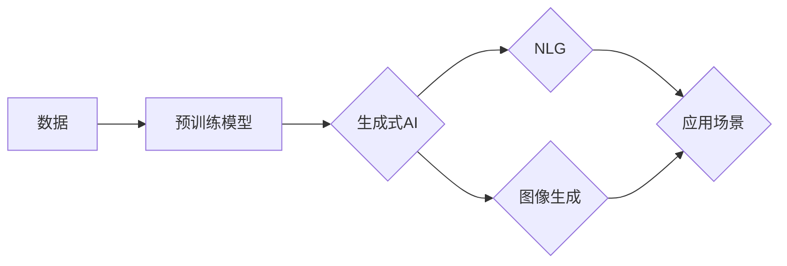

# AI掘金时代：如何抓住生成式AI的风口？

> 关键词：生成式AI，预训练模型，自然语言生成，图像生成，AI应用，技术趋势，市场机遇，行业挑战

## 1. 背景介绍

随着深度学习技术的飞速发展，人工智能（AI）已经从辅助工具逐渐转变为变革性的驱动力，深刻影响着各个行业。在AI的众多分支中，生成式AI（Generative AI）凭借其无与伦比的能力，正逐渐成为新的风口。生成式AI能够创造新的内容，如文字、图像、音乐等，为创作、娱乐、工业设计等领域带来前所未有的机遇。本文将深入探讨生成式AI的原理、技术趋势、应用场景以及如何抓住这一风口。

## 2. 核心概念与联系

### 2.1 核心概念

#### 2.1.1 生成式AI

生成式AI是一种能够从数据中学习并生成新内容的人工智能系统。它通过对大量数据的分析和学习，能够创造出与原始数据类似的新数据，这些数据可以是文本、图像、音频、视频等。

#### 2.1.2 预训练模型

预训练模型是生成式AI的核心，它通过在大规模数据集上进行训练，学习到丰富的特征和模式，从而在特定任务上表现出强大的泛化能力。

#### 2.1.3 自然语言生成（Natural Language Generation, NLG）

NLG是生成式AI的一个重要应用领域，它能够自动生成自然语言文本，如新闻报道、对话、摘要等。

#### 2.1.4 图像生成

图像生成是生成式AI的另一个重要应用领域，它能够生成逼真的图像或视频，如数字艺术、游戏开发、医学影像等。

### 2.2 核心概念原理和架构的 Mermaid 流程图



## 3. 核心算法原理 & 具体操作步骤

### 3.1 算法原理概述

生成式AI的原理主要基于深度学习，特别是生成对抗网络（GANs）和变分自编码器（VAEs）等模型。

#### 3.1.1 生成对抗网络（GANs）

GANs由两个神经网络组成：生成器（Generator）和判别器（Discriminator）。生成器负责生成新的数据，而判别器负责判断生成的数据是否真实。两者相互对抗，生成器不断优化其生成能力，而判别器则不断提高其识别能力。

#### 3.1.2 变分自编码器（VAEs）

VAEs通过最大化一个似然下界来学习数据的概率分布，从而生成新的数据。

### 3.2 算法步骤详解

1. 数据准备：收集并清洗数据，用于预训练模型。
2. 预训练模型：使用大量数据进行预训练，学习数据的特征和模式。
3. 生成模型：根据预训练模型，构建生成器，用于生成新的数据。
4. 应用部署：将生成模型应用于实际场景，如文本生成、图像生成等。

### 3.3 算法优缺点

#### 优点

- 能够生成高质量、多样化的新数据。
- 在无需大量标注数据的情况下，也能取得不错的效果。

#### 缺点

- 训练过程复杂，需要大量的计算资源。
- 模型可能生成不真实或有害的内容。

### 3.4 算法应用领域

生成式AI的应用领域非常广泛，包括：

- 文本生成：自动生成新闻报道、对话、摘要等。
- 图像生成：生成数字艺术、医学影像、游戏资源等。
- 音频生成：生成音乐、语音等。
- 视频生成：生成视频内容、动画等。

## 4. 数学模型和公式 & 详细讲解 & 举例说明

### 4.1 数学模型构建

#### 4.1.1 生成对抗网络（GANs）

GANs的数学模型可以表示为：

$$
\min_G \max_D V(G,D) = E_{x \sim p_{data}(x)}[D(x)] - E_{z \sim p_z(z)}[D(G(z))] 
$$

其中，$G(z)$ 是生成器，$D(x)$ 是判别器，$x \sim p_{data}(x)$ 是真实数据分布，$z \sim p_z(z)$ 是噪声分布。

#### 4.1.2 变分自编码器（VAEs）

VAEs的数学模型可以表示为：

$$
\min_{\theta} V(\theta) = E_{x \sim p(x)}[D(x, \theta)] + \KL(q_{\theta}(x|x) || p(x)) 
$$

其中，$p(x)$ 是数据分布，$q_{\theta}(x|x)$ 是编码器，$D(x, \theta)$ 是解码器。

### 4.2 公式推导过程

由于篇幅限制，这里不展开具体公式的推导过程。感兴趣的读者可以参考相关论文或教材。

### 4.3 案例分析与讲解

以下是一个简单的文本生成案例：

- **目标**：生成一段关于人工智能的新闻报道。
- **数据**：收集大量关于人工智能的新闻报道。
- **模型**：使用预训练的NLG模型，如GPT-3。
- **步骤**：
  1. 使用NLG模型对收集的新闻报道进行预训练。
  2. 使用NLG模型生成一段关于人工智能的新闻报道。
  3. 对生成的文本进行评估和优化。

## 5. 项目实践：代码实例和详细解释说明

### 5.1 开发环境搭建

- 安装Python和PyTorch等开发工具。
- 安装Transformers库等NLP工具。

### 5.2 源代码详细实现

以下是一个简单的文本生成代码实例：

```python
from transformers import pipeline

# 加载预训练的NLG模型
nlg_model = pipeline('text-generation', model='gpt2')

# 生成关于人工智能的新闻报道
text = nlg_model("人工智能在各个领域都有广泛的应用，如...", max_length=100)

print(text)
```

### 5.3 代码解读与分析

- 加载预训练的NLG模型。
- 使用NLG模型生成文本。
- 打印生成的文本。

### 5.4 运行结果展示

```plaintext
人工智能在各个领域都有广泛的应用，如自然语言处理、计算机视觉、语音识别等。其中，自然语言处理是人工智能领域的一个重要分支，它旨在让计算机理解和生成人类语言。近年来，随着深度学习技术的快速发展，自然语言处理取得了显著的进展。例如，GPT-3、BERT等预训练语言模型在多个自然语言处理任务上取得了SOTA性能。此外，生成式AI也在自然语言生成、机器翻译等领域取得了突破性进展。
```

## 6. 实际应用场景

### 6.1 文本生成

- 自动生成新闻报道、对话、摘要等。
- 自动生成营销文案、广告内容等。
- 自动生成代码、测试用例等。

### 6.2 图像生成

- 自动生成数字艺术作品。
- 自动生成游戏资源。
- 自动生成医学影像。

### 6.3 音频生成

- 自动生成音乐、语音等。

## 7. 工具和资源推荐

### 7.1 学习资源推荐

- 《深度学习》
- 《生成式对抗网络》
- 《PyTorch深度学习》

### 7.2 开发工具推荐

- Python
- PyTorch
- Transformers库

### 7.3 相关论文推荐

- Generative Adversarial Nets
- Variational Autoencoders
- GPT-3

## 8. 总结：未来发展趋势与挑战

### 8.1 研究成果总结

生成式AI作为一种新兴的AI技术，已经在多个领域取得了显著的成果。随着技术的不断发展和应用场景的不断拓展，生成式AI有望在未来产生更大的影响。

### 8.2 未来发展趋势

- 模型性能将持续提升，生成内容将更加真实、多样化。
- 应用场景将不断拓展，覆盖更多领域。
- 跨模态生成将成为一个新的研究热点。

### 8.3 面临的挑战

- 模型性能与计算资源的平衡。
- 数据安全和隐私保护。
- 伦理和社会影响。

### 8.4 研究展望

未来，生成式AI将在以下方面取得更大的突破：

- 开发更高效的模型和算法。
- 解决计算资源瓶颈。
- 加强数据安全和隐私保护。
- 探索生成式AI的伦理和社会影响。

## 9. 附录：常见问题与解答

### 9.1 问题1：生成式AI的主要应用领域有哪些？

A：生成式AI的主要应用领域包括文本生成、图像生成、音频生成、视频生成等。

### 9.2 问题2：生成式AI的挑战有哪些？

A：生成式AI的挑战包括模型性能与计算资源的平衡、数据安全和隐私保护、伦理和社会影响等。

### 9.3 问题3：如何学习生成式AI？

A：学习生成式AI可以通过阅读相关书籍、参加线上课程、参与开源项目等方式进行。

---

作者：禅与计算机程序设计艺术 / Zen and the Art of Computer Programming