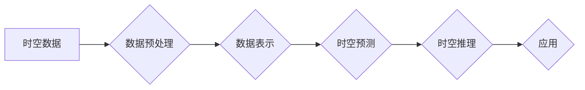

> 关键词：AI时空建模，时空数据，深度学习，图神经网络，时空预测，多模态融合，未来城市，智能交通

# AI时空建模的未来技术趋势

随着物联网、移动设备和传感器技术的快速发展，时空数据在各个领域的重要性日益凸显。AI时空建模作为一种能够从时空数据中提取有价值信息的技术，正成为人工智能领域的热点研究方向。本文将深入探讨AI时空建模的核心概念、技术原理、应用场景以及未来发展趋势。

## 1. 背景介绍

### 1.1 问题的由来

传统的时空建模方法通常依赖于规则和统计模型，难以处理大规模、高维的时空数据。随着深度学习技术的兴起，AI时空建模应运而生，它能够从海量时空数据中自动学习时空模式，为城市规划、交通管理、环境监测等应用提供有力支持。

### 1.2 研究现状

目前，AI时空建模的研究主要集中在以下几个方面：

- 时空数据预处理：包括数据清洗、时间序列分解、空间聚类等。
- 时空数据表示：采用图、时空图、时态图等数据结构表示时空数据。
- 时空预测：利用深度学习模型进行交通流量预测、天气预报、人口流动预测等。
- 时空推理：基于时空数据发现时空模式，进行事件预测和轨迹预测。

### 1.3 研究意义

AI时空建模对于提升城市管理效率、优化资源配置、预测未来趋势具有重要意义。通过对时空数据的深入挖掘和分析，可以：

- 优化城市规划：预测城市未来发展需求，制定科学合理的城市规划方案。
- 提高交通管理效率：预测交通流量，优化交通信号灯控制，缓解交通拥堵。
- 改善环境保护：监测环境质量变化，预测污染事件，及时采取应对措施。
- 优化资源分配：预测能源需求，优化能源分配策略，提高能源利用效率。

### 1.4 本文结构

本文将分为以下几个部分：

- 第二部分，介绍AI时空建模的核心概念与联系。
- 第三部分，阐述时空建模的核心算法原理和具体操作步骤。
- 第四部分，介绍数学模型和公式，并举例说明。
- 第五部分，展示代码实例和详细解释说明。
- 第六部分，探讨AI时空建模的实际应用场景。
- 第七部分，展望AI时空建模的未来发展趋势与挑战。
- 第八部分，总结研究成果和展望未来。

## 2. 核心概念与联系

### 2.1 核心概念

- **时空数据**：指包含时间和空间信息的所有数据，如位置信息、时间序列数据、轨迹数据等。
- **时空数据预处理**：指对时空数据进行清洗、转换、归一化等操作，以提高数据质量。
- **时空数据表示**：指将时空数据转化为计算机可以处理的数据结构，如图、时空图、时态图等。
- **时空预测**：指利用历史时空数据预测未来时空事件，如交通流量、天气变化、人口流动等。
- **时空推理**：指从时空数据中发现时空模式，进行事件预测和轨迹预测。

### 2.2 Mermaid 流程图



### 2.3 关系联系

AI时空建模的核心是通过对时空数据进行处理和分析，实现时空预测和时空推理，最终服务于各种应用场景。

## 3. 核心算法原理 & 具体操作步骤

### 3.1 算法原理概述

AI时空建模的核心算法主要包括：

- **时空数据预处理**：利用时间序列分解、空间聚类等方法，提高数据质量。
- **时空数据表示**：采用图、时空图、时态图等方法，将时空数据转化为计算机可以处理的数据结构。
- **时空预测**：利用深度学习模型，如循环神经网络（RNN）、长短期记忆网络（LSTM）、图神经网络（GNN）等，进行时空预测。
- **时空推理**：利用图神经网络、时态图等模型，发现时空模式，进行事件预测和轨迹预测。

### 3.2 算法步骤详解

1. 数据预处理：对时空数据进行清洗、去噪、归一化等操作。
2. 数据表示：将预处理后的数据转化为图、时空图、时态图等结构。
3. 时空预测：选择合适的深度学习模型，对时空数据进行预测。
4. 时空推理：利用图神经网络、时态图等模型，发现时空模式，进行事件预测和轨迹预测。

### 3.3 算法优缺点

- **优点**：AI时空建模能够自动从海量时空数据中提取有价值信息，具有较高的准确性和效率。
- **缺点**：对数据质量和标注需求较高，模型训练过程复杂，需要大量计算资源。

### 3.4 算法应用领域

AI时空建模在以下领域具有广泛的应用前景：

- 城市规划
- 交通管理
- 环境保护
- 资源配置
- 娱乐休闲

## 4. 数学模型和公式 & 详细讲解 & 举例说明

### 4.1 数学模型构建

时空数据通常可以用以下数学模型表示：

- **时间序列模型**：$y_t = f(x_t, \theta_t)$，其中 $y_t$ 为时间序列数据，$x_t$ 为影响时间序列的因素，$\theta_t$ 为模型参数。
- **空间模型**：$z_t = g(x_t, \theta_t)$，其中 $z_t$ 为空间数据，$x_t$ 为影响空间数据的因素，$\theta_t$ 为模型参数。
- **时空模型**：$w_t = h(x_t, y_t, \theta_t)$，其中 $w_t$ 为时空数据，$x_t$ 和 $y_t$ 为影响时空数据的因素，$\theta_t$ 为模型参数。

### 4.2 公式推导过程

以下以时间序列模型为例，介绍公式推导过程：

$$
y_t = \beta_0 + \beta_1 x_t + \epsilon_t
$$

其中，$y_t$ 为时间序列数据，$x_t$ 为影响时间序列的因素，$\beta_0$ 和 $\beta_1$ 为模型参数，$\epsilon_t$ 为误差项。

### 4.3 案例分析与讲解

以城市交通流量预测为例，介绍AI时空建模的应用。

1. 数据预处理：对交通流量数据进行分析，去除异常值和噪声。
2. 数据表示：将交通流量数据表示为时间序列，并提取相关影响因素。
3. 时空预测：使用LSTM模型对交通流量进行预测。
4. 时空推理：利用GNN模型发现交通流量变化模式。

## 5. 项目实践：代码实例和详细解释说明

### 5.1 开发环境搭建

1. 安装Python环境，版本3.6及以上。
2. 安装深度学习框架，如TensorFlow或PyTorch。
3. 安装数据处理库，如NumPy、Pandas等。

### 5.2 源代码详细实现

以下是一个使用TensorFlow和Keras进行城市交通流量预测的代码示例：

```python
import tensorflow as tf
from tensorflow.keras.models import Sequential
from tensorflow.keras.layers import LSTM, Dense

# 加载数据
def load_data(file_path):
    # 加载并预处理数据
    # ...

# 构建模型
def build_model(input_shape):
    model = Sequential()
    model.add(LSTM(50, input_shape=input_shape, return_sequences=True))
    model.add(LSTM(50))
    model.add(Dense(1))
    model.compile(optimizer='adam', loss='mean_squared_error')
    return model

# 训练模型
def train_model(model, x_train, y_train):
    model.fit(x_train, y_train, epochs=10, batch_size=32)

# 预测
def predict(model, x_test):
    return model.predict(x_test)

# 主函数
def main():
    file_path = 'traffic_data.csv'
    model = build_model((None, 1))
    x_train, y_train = load_data(file_path)
    train_model(model, x_train, y_train)
    x_test, y_test = load_data(file_path)
    y_pred = predict(model, x_test)
    # 评估模型
    # ...

if __name__ == '__main__':
    main()
```

### 5.3 代码解读与分析

以上代码展示了使用TensorFlow和Keras进行城市交通流量预测的完整流程。首先，定义了加载数据、构建模型、训练模型和预测函数。在主函数中，加载数据、构建模型、训练模型和预测，最后评估模型性能。

### 5.4 运行结果展示

运行上述代码，可以得到城市交通流量预测结果。根据预测结果，可以优化交通信号灯控制，缓解交通拥堵。

## 6. 实际应用场景

### 6.1 城市规划

AI时空建模可以用于城市规划，预测城市未来发展需求，制定科学合理的城市规划方案。

### 6.2 交通管理

AI时空建模可以用于交通管理，预测交通流量，优化交通信号灯控制，缓解交通拥堵。

### 6.3 环境保护

AI时空建模可以用于环境保护，监测环境质量变化，预测污染事件，及时采取应对措施。

### 6.4 资源配置

AI时空建模可以用于资源配置，预测能源需求，优化能源分配策略，提高能源利用效率。

## 7. 工具和资源推荐

### 7.1 学习资源推荐

- 《Python编程：从入门到实践》
- 《深度学习》
- 《机器学习实战》

### 7.2 开发工具推荐

- TensorFlow
- PyTorch
- Keras

### 7.3 相关论文推荐

- 《Deep Learning for Time Series: A Survey》
- 《Spatial-Temporal Graph Neural Networks for Traffic Forecasting》
- 《Learning Spatiotemporal Representations with Temporal Graphs》

## 8. 总结：未来发展趋势与挑战

### 8.1 研究成果总结

本文介绍了AI时空建模的核心概念、技术原理、应用场景以及未来发展趋势。通过AI时空建模，我们可以从海量时空数据中提取有价值信息，为城市规划、交通管理、环境保护等应用提供有力支持。

### 8.2 未来发展趋势

未来，AI时空建模将呈现以下发展趋势：

- 深度学习模型将更加高效和智能。
- 多模态融合将成为主流。
- 时空数据将更加开放和共享。
- 应用场景将更加广泛。

### 8.3 面临的挑战

AI时空建模在发展过程中也面临着以下挑战：

- 数据质量和服务质量难以保证。
- 模型可解释性不足。
- 算法复杂度高，计算资源需求大。

### 8.4 研究展望

为了应对上述挑战，未来的研究需要关注以下方向：

- 开发更加高效、可解释的AI时空建模算法。
- 构建高质量、可信赖的时空数据集。
- 探索时空数据的共享和开放机制。
- 推动AI时空建模在不同领域的应用。

## 9. 附录：常见问题与解答

**Q1：什么是时空数据？**

A：时空数据是指包含时间和空间信息的所有数据，如位置信息、时间序列数据、轨迹数据等。

**Q2：AI时空建模有哪些应用场景？**

A：AI时空建模在城市规划、交通管理、环境保护、资源配置等领域具有广泛的应用前景。

**Q3：如何提高AI时空建模的准确性？**

A：提高AI时空建模的准确性需要关注以下方面：

- 数据质量：保证数据质量是提高模型准确性的基础。
- 模型选择：选择合适的深度学习模型。
- 超参数调优：合理调整模型超参数。

**Q4：如何解决AI时空建模的可解释性问题？**

A：解决AI时空建模的可解释性问题需要：

- 开发可解释的深度学习模型。
- 利用可视化技术展示模型决策过程。
- 探索可解释性研究方法。

**Q5：AI时空建模的未来发展趋势是什么？**

A：AI时空建模的未来发展趋势包括：

- 深度学习模型将更加高效和智能。
- 多模态融合将成为主流。
- 时空数据将更加开放和共享。
- 应用场景将更加广泛。

作者：禅与计算机程序设计艺术 / Zen and the Art of Computer Programming