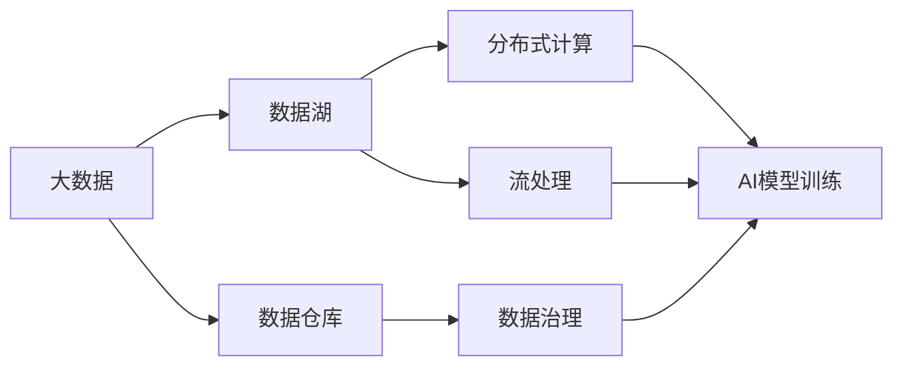

                 

# 大数据在AI发展中的角色

> 关键词：大数据,人工智能,机器学习,深度学习,数据挖掘,数据分析,数据平台,数据治理,AI生态,技术驱动,数据赋能,智能决策

## 1. 背景介绍

### 1.1 问题由来

近年来，大数据技术迅猛发展，成为推动人工智能(AI)、机器学习(ML)和深度学习(Deep Learning)等技术突破的关键因素之一。大数据不仅提供了海量的数据资源，还引入了各种先进的数据处理技术，为AI技术在各个领域的广泛应用提供了坚实的支持。

人工智能技术的进步离不开数据，尤其是高质量、多样化的数据。大数据技术为AI的发展提供了丰富的数据资源和高效的数据处理能力，使得AI模型能够进行更深入的分析和建模，从而实现更精准的预测和决策。

### 1.2 问题核心关键点

大数据在AI发展中的角色主要体现在以下几个方面：

- **数据源泉**：大数据提供了AI技术训练和优化的海量数据源，使得AI模型能够通过大量样本进行学习，提升模型的泛化能力和性能。
- **高效处理**：大数据技术通过分布式计算、并行处理、流处理等手段，极大地提高了数据处理的效率，降低了数据处理的成本。
- **多模态融合**：大数据涵盖了结构化、非结构化、半结构化等多种数据类型，支持多模态数据的融合，拓展了AI应用的边界。
- **实时分析**：大数据能够进行实时数据流的分析和处理，支持AI系统对动态变化的场景做出快速响应。
- **数据治理**：大数据技术推动了数据治理和数据质量管理的进步，使得AI系统能够更可靠地利用数据。

这些因素共同构成了大数据在AI发展中的核心地位。

### 1.3 问题研究意义

研究大数据在AI发展中的角色，对于理解AI技术的本质、提升AI应用的实际效果、推动AI技术的产业化进程，具有重要意义：

1. **理解AI本质**：大数据技术揭示了AI模型的本质在于数据驱动的统计和模式识别，而非单一算法的黑盒。
2. **提升AI效果**：通过数据的高质量、多样化和实时性，AI模型能够更准确地捕捉数据的特征，提升预测和决策的准确性。
3. **加速产业应用**：大数据技术为AI应用提供了高效、可靠的数据处理平台，加速了AI技术在各行各业的落地。
4. **数据赋能**：大数据技术帮助AI系统更好地利用数据，挖掘数据中的价值，赋能企业和行业，实现智能转型。
5. **技术驱动**：大数据技术推动了AI领域的技术进步，从数据收集、存储、处理到分析和建模，形成了一套完整的技术生态。

## 2. 核心概念与联系

### 2.1 核心概念概述

为了更好地理解大数据在AI发展中的角色，本节将介绍几个关键的大数据概念及其与AI的联系：

- **大数据**：指体量巨大、类型繁多、速度极快的数据集合，通过先进的数据处理技术，可以从这些数据中提取有价值的信息和知识。
- **数据仓库**：用于集中存储和管理企业内部和外部数据的系统，支持数据的查询、分析和报告。
- **数据湖**：不同于数据仓库，数据湖可以存储所有类型的数据，包括结构化、半结构化和非结构化数据，用于支持大数据分析和机器学习等任务。
- **分布式计算**：利用多台计算机并行处理大规模数据，提高数据处理的效率和可靠性。
- **流处理**：对实时数据流进行高效处理和分析，支持AI系统对动态数据进行实时响应。
- **数据治理**：包括数据质量管理、元数据管理、数据安全和隐私保护等，保障数据的可靠性和安全性。

这些概念之间存在紧密的联系，通过大数据技术，AI系统能够高效、可靠地处理和分析大量数据，从中提取有价值的信息和知识，支持AI模型的训练和优化。

### 2.2 概念间的关系

大数据和AI技术之间的联系可以通过以下Mermaid流程图来展示：



这个流程图展示了大数据技术在AI发展中的关键作用：

1. 大数据技术通过数据仓库、数据湖等手段，集中存储和管理数据，为AI模型的训练提供了数据源。
2. 分布式计算和流处理技术提高了数据处理的效率和实时性，支持AI系统对大规模数据进行高效分析。
3. 数据治理保障了数据的质量和安全，为AI系统提供了可靠的数据支撑。

这些技术手段共同构成了大数据在AI发展中的基础架构。

### 2.3 核心概念的整体架构

最后，我们用一个综合的流程图来展示大数据在AI发展中的整体架构：


这个综合流程图展示了大数据技术在AI模型开发、训练、优化、部署和应用服务全过程中的应用。

## 3. 核心算法原理 & 具体操作步骤

### 3.1 算法原理概述

大数据在AI发展中的核心算法原理主要围绕数据处理和特征工程展开。大数据技术通过高效的数据处理手段，对海量数据进行清洗、存储和分析，从中提取有价值的信息和特征，支持AI模型的训练和优化。

具体而言，大数据技术在AI中的应用包括以下几个关键环节：

1. **数据采集**：从各种数据源（如Web爬虫、传感器、社交媒体等）采集数据。
2. **数据清洗**：对数据进行去重、去噪、缺失值处理等预处理，保证数据质量。
3. **数据存储**：将清洗后的数据存储在分布式文件系统或数据库中，支持高效访问。
4. **数据治理**：通过元数据管理、数据质量监控等手段，保障数据的可靠性和安全性。
5. **特征工程**：从数据中提取特征，支持AI模型的训练。
6. **分布式计算**：利用多台计算机并行处理数据，提高计算效率。
7. **流处理**：对实时数据流进行高效处理，支持AI系统对动态数据进行实时响应。

### 3.2 算法步骤详解

以下是大数据在AI模型训练中的详细步骤：

**Step 1: 数据采集**

1. **数据源选择**：根据AI模型的需求，选择适合的数据源。数据源可以是公开数据集、企业内部数据、第三方数据提供商等。
2. **数据采集工具**：使用爬虫、API接口、数据库导出等工具进行数据采集。

**Step 2: 数据清洗**

1. **去重去噪**：去除重复和无关数据，过滤噪声和异常值。
2. **缺失值处理**：处理缺失数据，填补缺失值或删除缺失数据。
3. **数据标准化**：对数据进行标准化和归一化，保证数据的一致性和可比性。

**Step 3: 数据存储**

1. **选择存储系统**：根据数据类型和存储需求，选择合适的存储系统，如Hadoop、Spark、NoSQL数据库等。
2. **数据加载**：将清洗后的数据加载到存储系统中，支持高效访问。

**Step 4: 数据治理**

1. **元数据管理**：记录数据的来源、类型、格式等元信息，方便数据管理和使用。
2. **数据质量监控**：实时监控数据质量，及时发现和修复数据问题。
3. **数据安全和隐私保护**：保障数据的合法使用和隐私保护，符合法律法规要求。

**Step 5: 特征工程**

1. **特征提取**：从原始数据中提取特征，支持AI模型的训练。
2. **特征选择**：选择对模型性能影响较大的特征，去除冗余和无关特征。
3. **特征处理**：对特征进行标准化、归一化、编码等处理，提高特征质量。

**Step 6: 分布式计算**

1. **选择合适的计算框架**：根据数据量和工作负载，选择合适的计算框架，如Spark、Flink、Hadoop等。
2. **并行处理**：利用多台计算机并行处理数据，提高计算效率。
3. **负载均衡**：合理分配计算资源，均衡负载，防止计算瓶颈。

**Step 7: 流处理**

1. **选择合适的流处理框架**：根据数据流类型和工作负载，选择合适的流处理框架，如Storm、Spark Streaming等。
2. **实时处理**：对实时数据流进行高效处理，支持AI系统对动态数据进行实时响应。
3. **流监控**：实时监控流数据处理状态，及时发现和修复问题。

**Step 8: AI模型训练**

1. **选择合适的模型框架**：根据任务需求，选择合适的模型框架，如TensorFlow、PyTorch、MXNet等。
2. **数据加载**：从存储系统中加载数据，支持模型训练。
3. **模型训练**：使用数据进行模型训练，优化模型参数，提升模型性能。

**Step 9: 模型优化**

1. **超参数调优**：通过网格搜索、贝叶斯优化等方法，调整模型超参数，提升模型性能。
2. **模型集成**：通过集成多个模型，提升模型的泛化能力和鲁棒性。
3. **模型压缩**：通过剪枝、量化等方法，压缩模型参数，减少计算资源消耗。

**Step 10: 模型部署**

1. **模型导出**：将训练好的模型导出为可执行文件或库，支持部署和调用。
2. **服务化封装**：将模型封装为API服务或微服务，方便集成调用。
3. **弹性伸缩**：根据请求流量动态调整计算资源，平衡服务质量和成本。

**Step 11: 应用服务**

1. **服务监控**：实时监控服务运行状态，及时发现和修复问题。
2. **用户接口**：提供用户友好的接口，支持模型调用和结果展示。
3. **数据回传**：将模型预测结果回传到数据存储系统中，支持后续分析和优化。

### 3.3 算法优缺点

大数据在AI发展中具有以下优点：

1. **数据源丰富**：大数据技术提供了多种数据采集手段，支持多种数据源，为AI模型提供了丰富的数据资源。
2. **高效处理**：大数据技术通过分布式计算和流处理等手段，极大地提高了数据处理的效率和实时性。
3. **多模态融合**：大数据技术支持多模态数据的融合，拓展了AI应用的边界。
4. **数据治理**：大数据技术推动了数据治理和数据质量管理的进步，保障了数据的可靠性和安全性。

然而，大数据在AI发展中也存在一些缺点：

1. **数据质量**：大数据采集和处理过程中，难免存在数据噪声和错误，可能影响AI模型的性能。
2. **计算资源**：大数据处理和分析需要大量计算资源，可能带来高昂的成本。
3. **数据隐私**：大数据处理涉及大量敏感数据，可能带来数据隐私和安全问题。
4. **算法复杂性**：大数据技术的应用往往需要复杂的算法和工具支持，增加了AI模型开发的复杂性。

### 3.4 算法应用领域

大数据在AI发展中广泛应用于多个领域，具体包括：

1. **金融行业**：大数据技术在金融行业广泛应用，支持风险管理、客户关系管理、欺诈检测等任务。
2. **医疗健康**：大数据技术在医疗健康领域支持疾病预测、患者管理、医疗决策等任务。
3. **零售电商**：大数据技术在零售电商领域支持客户分析、推荐系统、供应链优化等任务。
4. **物流运输**：大数据技术在物流运输领域支持路径规划、配送优化、风险管理等任务。
5. **智能制造**：大数据技术在智能制造领域支持设备监控、生产调度、质量控制等任务。
6. **智慧城市**：大数据技术在智慧城市领域支持城市管理、公共安全、交通管理等任务。

## 4. 数学模型和公式 & 详细讲解 & 举例说明

### 4.1 数学模型构建

大数据在AI中的应用涉及多种数学模型和算法，以下列出几个典型的数学模型：

1. **线性回归模型**：用于处理数值型数据，支持预测和回归任务。
2. **决策树模型**：用于处理分类和回归任务，支持特征选择和数据压缩。
3. **随机森林模型**：支持多棵决策树的集成，提高模型的准确性和鲁棒性。
4. **支持向量机模型**：用于处理高维数据，支持分类和回归任务。
5. **神经网络模型**：用于处理复杂非线性数据，支持分类和回归任务。

### 4.2 公式推导过程

以线性回归模型为例，其公式推导过程如下：

设$y$为输出变量，$x$为输入变量，$\theta$为模型参数。线性回归模型的目标是最小化预测值和真实值之间的平方误差，即：

$$
\min_{\theta} \sum_{i=1}^n (y_i - \theta^T x_i)^2
$$

其中，$n$为样本数，$y_i$为第$i$个样本的真实值，$x_i$为第$i$个样本的特征向量。

通过求导和求解，可以得到线性回归模型的参数估计公式：

$$
\theta = (X^T X)^{-1} X^T y
$$

其中，$X$为样本特征矩阵，$y$为样本输出向量。

### 4.3 案例分析与讲解

以金融行业为例，大数据在风险管理中的应用如下：

1. **数据采集**：从交易系统、客户系统、市场系统等数据源采集数据。
2. **数据清洗**：清洗异常值和缺失值，处理噪声数据。
3. **数据存储**：将清洗后的数据存储在分布式文件系统中，支持高效访问。
4. **数据治理**：记录数据的来源、类型、格式等元信息，保障数据可靠性和安全性。
5. **特征工程**：提取客户行为、交易特征、市场指标等特征，支持风险预测。
6. **分布式计算**：利用多台计算机并行处理数据，提高计算效率。
7. **流处理**：对实时交易数据进行高效处理，支持实时风险监控。
8. **AI模型训练**：使用历史交易数据进行模型训练，优化模型参数。
9. **模型优化**：调整模型超参数，提升模型性能。
10. **模型部署**：将训练好的模型封装为API服务，支持实时调用。
11. **应用服务**：实时监控交易风险，提供风险预警和建议。

通过上述步骤，大数据技术在金融风险管理中实现了高效、可靠的数据处理和模型训练，支持实时风险监控和预警。

## 5. 项目实践：代码实例和详细解释说明

### 5.1 开发环境搭建

在进行大数据在AI模型训练的实践时，需要准备以下开发环境：

1. 安装Python：从官网下载并安装Python，建议使用3.x版本。
2. 安装数据处理库：安装Pandas、NumPy等数据处理库，支持数据清洗和分析。
3. 安装机器学习库：安装Scikit-Learn、TensorFlow等机器学习库，支持模型训练和优化。
4. 安装数据存储库：安装Hadoop、Spark等数据存储库，支持数据存储和处理。
5. 安装分布式计算库：安装Dask、Flink等分布式计算库，支持并行处理和流处理。
6. 安装Web服务库：安装Flask、Django等Web服务库，支持API服务部署。

### 5.2 源代码详细实现

以下是一个基于TensorFlow和Pandas进行线性回归模型训练的Python代码实现：

```python
import pandas as pd
import numpy as np
from sklearn.model_selection import train_test_split
import tensorflow as tf

# 读取数据
data = pd.read_csv('data.csv')

# 数据预处理
X = data.drop(['y'], axis=1).values
y = data['y'].values

# 划分训练集和测试集
X_train, X_test, y_train, y_test = train_test_split(X, y, test_size=0.2, random_state=42)

# 定义模型
model = tf.keras.Sequential([
    tf.keras.layers.Dense(1, input_shape=(X_train.shape[1],), activation='linear')
])

# 定义损失函数和优化器
loss = tf.keras.losses.MeanSquaredError()
optimizer = tf.keras.optimizers.Adam()

# 编译模型
model.compile(optimizer=optimizer, loss=loss)

# 训练模型
model.fit(X_train, y_train, epochs=100, batch_size=32, validation_data=(X_test, y_test))

# 评估模型
model.evaluate(X_test, y_test)
```

### 5.3 代码解读与分析

以上代码实现了基于TensorFlow和Pandas进行线性回归模型训练的流程。具体分析如下：

1. **数据读取**：使用Pandas读取数据文件，支持多种数据格式，如CSV、Excel等。
2. **数据预处理**：将数据集划分为特征和标签，并进行标准化和归一化处理。
3. **模型定义**：使用TensorFlow定义线性回归模型，支持多层神经网络。
4. **模型编译**：指定优化器和损失函数，配置模型的训练参数。
5. **模型训练**：使用训练集进行模型训练，设定训练轮数和批大小。
6. **模型评估**：使用测试集评估模型性能，输出损失函数和准确率等指标。

## 6. 实际应用场景

### 6.1 金融风险管理

大数据技术在金融行业支持风险管理的应用场景如下：

1. **信用评分**：利用客户历史交易数据和行为数据，进行信用评分，评估客户的信用风险。
2. **欺诈检测**：通过分析交易数据和客户行为数据，检测异常交易和欺诈行为。
3. **市场预测**：利用市场数据和客户行为数据，预测市场变化和价格波动。
4. **投资组合管理**：利用历史交易数据和市场数据，优化投资组合，提升投资收益。

### 6.2 医疗健康管理

大数据技术在医疗健康领域支持健康管理的应用场景如下：

1. **疾病预测**：利用患者历史医疗数据和行为数据，预测疾病的发生概率和进展情况。
2. **患者管理**：通过分析患者数据，制定个性化的治疗方案和管理策略。
3. **医疗决策**：利用医疗数据和专家知识，支持医疗决策和诊断。
4. **公共卫生**：利用公共卫生数据和社交媒体数据，预测流行病的传播和爆发趋势。

### 6.3 智能推荐系统

大数据技术在零售电商领域支持智能推荐系统的应用场景如下：

1. **用户行为分析**：通过分析用户行为数据，挖掘用户的兴趣和偏好。
2. **推荐算法优化**：利用推荐算法优化推荐结果，提升用户体验和满意度。
3. **个性化推荐**：根据用户历史行为和偏好，提供个性化的商品推荐。
4. **实时推荐**：通过流处理技术，实现实时推荐，提升推荐效果。

### 6.4 未来应用展望

未来，大数据技术在AI发展中的应用将更加广泛和深入，涵盖更多领域和任务。具体展望如下：

1. **多模态融合**：支持多模态数据融合，拓展AI应用的边界。
2. **实时处理**：支持实时数据处理，提升AI系统的响应速度和效率。
3. **数据治理**：推动数据治理和数据质量管理的进步，保障数据可靠性和安全性。
4. **跨领域应用**：支持跨领域应用的开发，提升AI技术的通用性和适用性。
5. **自动化决策**：支持自动化决策，提升AI系统的决策速度和准确性。

## 7. 工具和资源推荐

### 7.1 学习资源推荐

为了帮助开发者系统掌握大数据在AI发展中的应用，这里推荐一些优质的学习资源：

1. 《大数据技术与应用》系列书籍：全面介绍大数据技术及其在各个领域的应用，适合入门学习。
2. 《机器学习实战》系列书籍：详细讲解机器学习算法及其在实际项目中的应用，适合深入学习。
3. 《深度学习》系列课程：斯坦福大学和Coursera等平台提供的深度学习课程，涵盖多个热门主题。
4. Kaggle：全球最大的数据科学竞赛平台，提供丰富的数据集和开源项目，适合实战练习。
5. GitHub：全球最大的开源社区，提供大量的数据处理和AI模型代码，适合学习和分享。

通过对这些资源的学习实践，相信你一定能够快速掌握大数据在AI发展中的应用，并用于解决实际的AI问题。

### 7.2 开发工具推荐

高效的开发离不开优秀的工具支持。以下是几款用于大数据在AI模型训练开发的常用工具：

1. Jupyter Notebook：轻量级的交互式编程环境，支持Python等编程语言，适合数据处理和模型训练。
2. PySpark：基于Apache Spark的Python接口，支持大数据处理和分析，适合分布式计算。
3. Dask：基于分布式内存计算的Python库，支持大数据处理和流处理，适合并行计算。
4. TensorBoard：TensorFlow的可视化工具，支持模型训练和优化过程的可视化，适合模型调优。
5. Plotly：数据可视化库，支持多图表类型和交互式展示，适合数据分析和可视化。

合理利用这些工具，可以显著提升大数据在AI模型训练的开发效率，加快创新迭代的步伐。

### 7.3 相关论文推荐

大数据在AI发展中的研究源于学界的持续研究。以下是几篇奠基性的相关论文，推荐阅读：

1. "A Survey of Data Mining Techniques for Healthcare: From Data to Knowledge"（健康数据挖掘综述）
2. "An Overview of Business Intelligence Tools and Architectures"（商业智能工具和架构综述）
3. "A Survey of Big Data Technologies"（大数据技术综述）
4. "A Survey of Machine Learning for Credit Risk Assessment"（信用风险评估的机器学习综述）
5. "A Survey of Deep Learning in Healthcare"（医疗健康领域的深度学习综述）

这些论文代表了大数据在AI发展中的研究脉络。通过学习这些前沿成果，可以帮助研究者把握学科前进方向，激发更多的创新灵感。

除上述资源外，还有一些值得关注的前沿资源，帮助开发者紧跟大数据在AI发展中的最新进展，例如：

1. arXiv论文预印本：人工智能领域最新研究成果的发布平台，包括大量尚未发表的前沿工作，学习前沿技术的必读资源。
2. 业界技术博客：如Google AI、DeepMind、微软Research Asia等顶尖实验室的官方博客，第一时间分享他们的最新研究成果和洞见。
3. 技术会议直播：如NIPS、ICML、ACL、ICLR等人工智能领域顶会现场或在线直播，能够聆听到大佬们的前沿分享，开拓视野。
4. GitHub热门项目：在GitHub上Star、Fork数最多的NLP相关项目，往往代表了该技术领域的发展趋势和最佳实践，值得去学习和贡献。
5. 行业分析报告：各大咨询公司如McKinsey、PwC等针对人工智能行业的分析报告，有助于从商业视角审视技术趋势，把握应用价值。

总之，对于大数据在AI发展中的应用学习，需要开发者保持开放的心态和持续学习的意愿。多关注前沿资讯，多动手实践，多思考总结，必将收获满满的成长收益。

## 8. 总结：未来发展趋势与挑战

### 8.1 总结

本文对大数据在AI发展中的角色进行了全面系统的介绍。首先阐述了大数据技术在AI发展中的核心地位，明确了大数据技术为AI模型训练提供了丰富、高效的数据资源和处理能力。其次，从数据采集、数据清洗、数据存储、数据治理、特征工程、分布式计算、流处理等多个方面，详细讲解了大数据技术在AI模型训练中的关键步骤和操作。同时，本文还探讨了大数据在金融、医疗、电商等领域的实际应用，展示了大数据技术在AI发展中的广泛应用。

通过本文的系统梳理，可以看到，大数据技术为AI模型提供了丰富的数据资源和高效的处理能力，极大地推动了AI技术在各个领域的应用。未来，随着大数据技术的进一步发展，AI模型将能够处理更多类型、更大规模的数据，实现更深入、更全面的数据挖掘和分析。

### 8.2 未来发展趋势

未来，大数据在AI发展中将呈现以下几个发展趋势：

1. **数据源多样化**：大数据技术将支持更多类型的数据源，包括结构化、非结构化、半结构化数据，拓展AI应用的边界。
2. **计算能力增强**：随着计算硬件的发展，大数据技术将支持更高效的计算和处理，提升AI模型的训练速度和性能。
3. **数据治理完善**：大数据技术将推动数据治理和数据质量管理的进步，保障数据的可靠性和安全性。
4. **跨领域应用拓展**：大数据技术将支持跨领域应用的开发，提升AI技术的通用性和适用性。
5. **自动化决策加速**：大数据技术将支持自动化决策，提升AI系统的决策速度和准确性。
6. **数据隐私保护加强**：大数据技术将加强数据隐私保护，保障用户数据的安全和隐私。

### 8.3 面临的挑战

尽管大数据在AI发展中发挥了重要作用，但在应用过程中仍面临一些挑战：

1. **数据隐私**：大数据处理涉及大量敏感数据，可能带来数据隐私和安全问题。
2. **计算资源**：大数据处理需要大量计算资源，可能带来高昂的成本。
3. **数据质量**：大数据采集和处理过程中，难免存在数据噪声和错误，可能影响AI模型的性能。
4. **算法复杂性**：大数据技术的应用往往需要复杂的算法和工具支持，增加了AI模型开发的复杂性。
5. **跨领域

