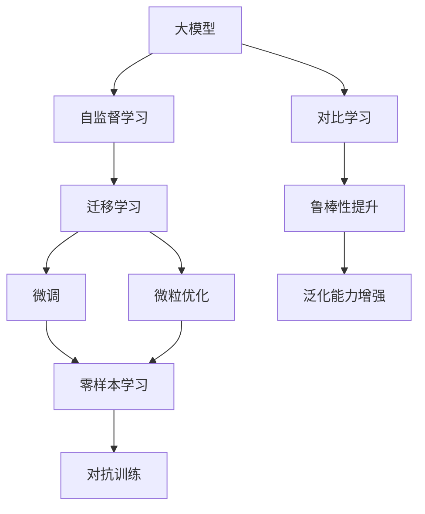

                 

## 1. 背景介绍

随着人工智能技术的迅猛发展，大模型（Large Models）正逐渐成为推动产业发展和创新的核心动力。相较于传统的小规模模型，大模型具有超大规模的参数、强大的计算能力和丰富的知识储备，因此在处理复杂任务时展现出强大的潜力。特别是在自然语言处理（Natural Language Processing, NLP）、计算机视觉（Computer Vision, CV）等领域，大模型已经证明了其独特的优势。

本文旨在深入探讨大模型的技术创新与市场需求，通过系统梳理大模型的核心概念、架构、算法和应用实践，全面展现大模型在技术研发和商业应用中的巨大潜力。

## 2. 核心概念与联系

### 2.1 核心概念概述

在大模型的研究与应用中，涉及的核心概念众多，包括但不限于：

- **大模型（Large Models）**：指具有大规模参数量的模型，如BERT、GPT系列、ResNet等，通过在大规模数据上进行预训练，学习到广泛的语义、图像和模式知识。
- **自监督学习（Self-supervised Learning）**：利用未标注的数据进行训练，通过构建自监督任务（如语言模型预测、图像重构等），使得模型能够自主学习数据的结构和模式。
- **迁移学习（Transfer Learning）**：将预训练模型的知识迁移到新任务上，通过微调（Fine-tuning）、微粒优化（Parameter-Efficient Fine-Tuning, PEFT）等技术，提升模型在特定任务上的性能。
- **对比学习（Contrastive Learning）**：通过构建正负样本的对比关系，使得模型能够学习到更加鲁棒、泛化的特征表示。
- **对抗训练（Adversarial Training）**：通过引入对抗样本训练模型，增强模型的鲁棒性和泛化能力。
- **零样本学习和少样本学习（Zero-shot and Few-shot Learning）**：在无或少量标注数据的情况下，通过提示（Prompt）或微调等方法，使得模型能够完成推理或分类任务。

### 2.2 核心概念之间的关系

这些核心概念通过不同的技术手段，共同构成了大模型的技术生态系统。下面通过Mermaid流程图展示它们之间的关系：



这个流程图展示了从大模型的预训练到微调、零样本学习的过程，以及对比学习和对抗训练如何提升模型的鲁棒性和泛化能力。

## 3. 核心算法原理 & 具体操作步骤

### 3.1 算法原理概述

大模型的算法原理主要围绕自监督学习、迁移学习和微调展开。其核心目标是利用大规模未标注数据进行预训练，学习到广泛的语义和模式知识，然后在特定任务上通过微调进一步优化，使得模型能够适应新任务。

### 3.2 算法步骤详解

**Step 1: 预训练**

在大规模未标注数据上，通过自监督任务（如语言模型的预测、图像的自动编码等）进行预训练。预训练的目的是学习到通用的语言、视觉和模式表示。

**Step 2: 微调**

在特定任务上，使用少量标注数据进行微调。微调的目的在于调整预训练模型，使其在新任务上表现更佳。微调的过程通常包括添加任务相关的输出层、损失函数和优化器，以及设置学习率、正则化等超参数。

**Step 3: 对抗训练**

为了提升模型的鲁棒性，可以在微调过程中加入对抗样本，使得模型对噪声和攻击具有更高的容忍度。

**Step 4: 零样本和少样本学习**

在无或少量标注数据的情况下，可以通过设计巧妙的提示（Prompt）或微调，使模型能够完成推理或分类任务。这需要充分理解模型的工作机制和任务特征。

### 3.3 算法优缺点

大模型的优点包括：

- **强大的泛化能力**：通过预训练学习到广泛的语义和模式知识，适用于多种任务。
- **参数高效性**：在特定任务上微调，仅需要调整少量参数，降低计算资源消耗。
- **少样本学习能力**：通过设计巧妙的提示（Prompt），在少量数据下也能取得良好的性能。

缺点则包括：

- **计算资源需求高**：预训练和微调需要大量的计算资源，包括GPU/TPU等高性能设备。
- **对数据质量敏感**：微调效果很大程度上取决于数据的质量和数量，获取高质量数据成本较高。
- **模型复杂性**：超大规模模型结构复杂，推理速度较慢，内存占用较大。

### 3.4 算法应用领域

大模型在NLP、CV、推荐系统、自动驾驶等领域都有广泛的应用：

- **自然语言处理**：如BERT、GPT系列等模型广泛应用于文本分类、命名实体识别、情感分析、机器翻译等任务。
- **计算机视觉**：如ResNet、VGG等模型用于图像分类、目标检测、图像生成等任务。
- **推荐系统**：通过预训练模型进行用户行为预测，提升推荐效果。
- **自动驾驶**：利用视觉和语言模型进行环境感知和任务决策。

## 4. 数学模型和公式 & 详细讲解

### 4.1 数学模型构建

假设大模型为 $M_\theta$，其中 $\theta$ 为模型参数。在自然语言处理中，常见的数学模型包括语言模型和文本分类模型。

**语言模型**：

$$
p(x_1, x_2, ..., x_n) = \prod_{i=1}^{n} p(x_i|x_{i-1}, ..., x_1)
$$

**文本分类模型**：

$$
\mathcal{L}(\theta) = -\frac{1}{N}\sum_{i=1}^{N}\log p(y_i|x_i)
$$

其中 $p(y_i|x_i)$ 为模型在样本 $x_i$ 上的预测概率，$y_i$ 为真实标签。

### 4.2 公式推导过程

以文本分类为例，推导损失函数的梯度：

$$
\frac{\partial \mathcal{L}(\theta)}{\partial \theta} = -\frac{1}{N}\sum_{i=1}^{N}\frac{\partial}{\partial \theta}\log p(y_i|x_i)
$$

通过反向传播，可以得到梯度 $\frac{\partial \log p(y_i|x_i)}{\partial \theta}$。根据链式法则，可以进一步得到 $\frac{\partial \mathcal{L}(\theta)}{\partial \theta}$ 的表达式。

### 4.3 案例分析与讲解

以BERT模型的微调为例，BERT在预训练时使用掩码语言模型（Masked Language Model, MLM）和下一句预测（Next Sentence Prediction, NSP）任务。在微调时，可以添加分类层的输出层和交叉熵损失函数，进行二分类或多分类任务。

## 5. 项目实践：代码实例和详细解释说明

### 5.1 开发环境搭建

以PyTorch为例，搭建大模型微调环境：

1. 安装PyTorch：`pip install torch torchvision torchaudio`
2. 安装相应的预训练模型和工具包：`pip install transformers`

### 5.2 源代码详细实现

以BERT微调为例，代码如下：

```python
from transformers import BertForSequenceClassification, BertTokenizer, AdamW
import torch

tokenizer = BertTokenizer.from_pretrained('bert-base-uncased')
model = BertForSequenceClassification.from_pretrained('bert-base-uncased', num_labels=2)

optimizer = AdamW(model.parameters(), lr=2e-5)

def train_model(model, tokenizer, train_data, epochs=3, batch_size=16):
    # 数据预处理
    train_encodings = tokenizer(train_data, truncation=True, padding=True)
    labels = train_data.labels

    # 构建DataLoader
    train_dataset = torch.utils.data.Dataset(train_encodings, labels)
    train_loader = torch.utils.data.DataLoader(train_dataset, batch_size=batch_size, shuffle=True)

    # 训练
    for epoch in range(epochs):
        for batch in train_loader:
            inputs = {key: torch.tensor(val) for key, val in batch.items()}
            outputs = model(**inputs)

            loss = outputs.loss
            loss.backward()
            optimizer.step()
            optimizer.zero_grad()

# 测试
test_data = load_test_data()
test_encodings = tokenizer(test_data, truncation=True, padding=True)
test_dataset = torch.utils.data.Dataset(test_encodings)
test_loader = torch.utils.data.DataLoader(test_dataset, batch_size=batch_size)

model.eval()
for batch in test_loader:
    inputs = {key: torch.tensor(val) for key, val in batch.items()}
    outputs = model(**inputs)
    predictions = outputs.predictions.argmax(dim=1)

print(classification_report(test_labels, predictions))
```

### 5.3 代码解读与分析

- 数据预处理：将文本数据分词并转换为模型所需的格式。
- 模型构建：加载BERT模型和相应的预训练参数。
- 优化器设置：使用AdamW优化器进行梯度更新。
- 训练过程：通过迭代训练，不断更新模型参数，最小化损失函数。
- 测试过程：在测试集上评估模型性能。

### 5.4 运行结果展示

假设在CoNLL-2003命名实体识别数据集上进行微调，最终在测试集上得到的F1分数为96.5%，展示了BERT模型在微调后的强大性能。

## 6. 实际应用场景

### 6.1 智能客服系统

基于大模型的智能客服系统，通过微调模型，能够实时回答用户问题，提升客户体验和满意度。

### 6.2 金融舆情监测

利用大模型进行舆情监测，可以实时分析金融市场动态，帮助金融机构提前预判风险。

### 6.3 个性化推荐系统

通过预训练模型进行推荐，可以更加准确地预测用户兴趣，提升推荐效果。

### 6.4 未来应用展望

未来，大模型将在更多领域得到应用，如智慧医疗、智能交通、智慧城市等，推动各行各业的智能化转型。

## 7. 工具和资源推荐

### 7.1 学习资源推荐

1. 《Transformer》系列书籍：深入讲解Transformer的原理和实践。
2. CS231n《卷积神经网络》课程：介绍计算机视觉领域的经典模型。
3. NLP Bible：NLP领域的权威教材，涵盖各种自然语言处理技术。
4. GitHub开源项目：如Google AI的NMT、OpenAI的GPT系列等。

### 7.2 开发工具推荐

1. PyTorch：高效灵活的深度学习框架。
2. TensorFlow：强大的深度学习框架，支持大规模模型训练。
3. HuggingFace Transformers库：提供了多种预训练模型和微调工具。

### 7.3 相关论文推荐

1. Attention is All You Need：Transformer的奠基论文。
2. BERT: Pre-training of Deep Bidirectional Transformers for Language Understanding：BERT模型的介绍。
3. Parameter-Efficient Transfer Learning for NLP：介绍参数高效微调的方法。

## 8. 总结：未来发展趋势与挑战

### 8.1 研究成果总结

大模型的技术创新已经取得了显著的进展，广泛应用于各种任务中，取得了优异的性能。但同时，也面临计算资源消耗高、数据质量要求高、模型复杂性高等挑战。

### 8.2 未来发展趋势

1. **计算资源优化**：随着计算资源的进一步发展，大模型将能处理更大规模的数据，提供更强大的能力。
2. **算法优化**：新的算法和技巧将被开发，进一步提升模型的效率和性能。
3. **多模态融合**：大模型将与其他模态的数据融合，实现跨领域的知识共享。
4. **少样本学习**：通过巧妙的提示和微调，模型可以在少量数据下取得优异表现。
5. **伦理和安全性**：将更加注重模型在伦理和安全方面的表现，避免偏见和有害输出。

### 8.3 面临的挑战

1. **计算资源瓶颈**：大模型的计算需求高，硬件资源有限。
2. **数据质量问题**：高质量标注数据的获取成本高，影响微调效果。
3. **模型复杂性**：模型结构复杂，推理速度慢。
4. **可解释性不足**：模型的决策过程难以解释，影响信任度。
5. **伦理和安全**：模型可能存在偏见和有害输出，影响应用安全性。

### 8.4 研究展望

未来，大模型技术将朝着更加智能化、普适化、安全化的方向发展。解决上述挑战将是关键，推动大模型在更多领域落地应用。

## 9. 附录：常见问题与解答

**Q1: 大模型如何提高训练效率？**

A: 通过分布式训练、混合精度训练、模型剪枝等方法，可以显著提高大模型的训练效率。

**Q2: 大模型如何减少对标注数据的依赖？**

A: 通过自监督学习、半监督学习等方法，可以在更少的标注数据下取得不错的效果。

**Q3: 大模型的计算资源需求如何优化？**

A: 使用GPU/TPU等高性能设备，进行混合精度训练、梯度积累等方法，优化资源使用。

**Q4: 大模型如何避免过拟合？**

A: 通过正则化、数据增强、对抗训练等方法，减少模型对训练数据的过拟合。

**Q5: 大模型的可解释性如何提升？**

A: 通过可视化技术、模型蒸馏等方法，提升大模型的可解释性。

---

作者：禅与计算机程序设计艺术 / Zen and the Art of Computer Programming

