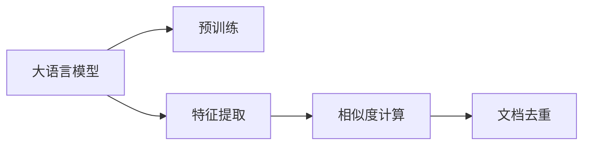
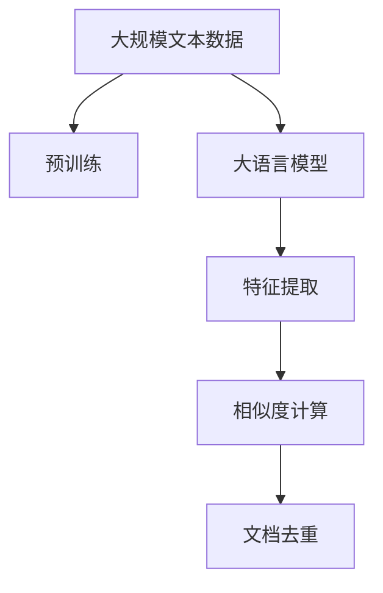
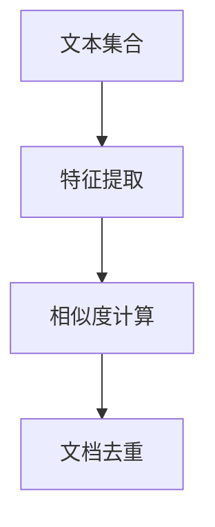
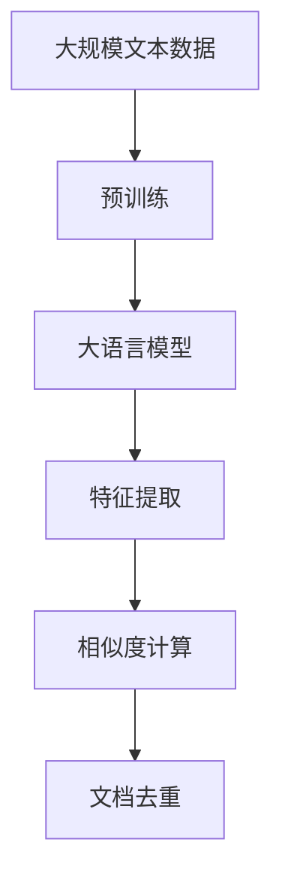

                 

# 大语言模型原理与工程实践：文档去重

> 关键词：文档去重,大语言模型,相似性匹配,向量空间模型,自然语言处理(NLP),Transformer,BERT

## 1. 背景介绍

### 1.1 问题由来
在当今信息爆炸的时代，文本数据量呈指数级增长，无论是新闻媒体、社交网络、科技论坛还是学术论文，每天都在产生海量文本。然而，这些文本数据中大量存在内容重复的现象，如复制粘贴、抄袭剽窃等。文档去重技术（Document Deduplication）是自动文本处理中的重要任务，旨在识别并去除文本集合中的重复内容，提高数据质量和效率。

### 1.2 问题核心关键点
文档去重的核心在于如何有效识别文本之间的相似性。常见的文档去重方法包括：

- 基于特征的文档去重：提取文本的特征（如TF-IDF、n-gram等），通过计算文本特征向量之间的相似度进行去重。
- 基于语义的文档去重：使用自然语言处理技术（如BERT、Transformer等）提取文本的语义表示，通过相似度计算进行去重。
- 基于图模型的文档去重：构建文本相似性图，通过图遍历算法（如PageRank、GATE等）识别重复内容。

这些方法各有优缺点，适用于不同的文档去重场景。而本文聚焦于基于大语言模型的文档去重方法，深入分析其原理和工程实现。

### 1.3 问题研究意义
文档去重技术不仅可以减少数据存储和处理的冗余，还能避免抄袭和信息误导等问题，对提高信息质量和效率具有重要意义。特别是对新闻媒体、学术论文、法律文本等领域，去重技术的需求尤为迫切。大语言模型在文档去重中的应用，将显著提升去重效果，降低人工成本，推动文档处理的自动化和智能化。

## 2. 核心概念与联系

### 2.1 核心概念概述

为了更好地理解基于大语言模型的文档去重方法，我们首先介绍几个关键概念：

- 文档去重（Document Deduplication）：自动识别和去除文本集合中的重复内容，提高数据质量和效率。
- 大语言模型（Large Language Model, LLM）：基于Transformer架构，通过大规模无标签文本预训练，学习丰富的语言知识和常识，具备强大的语言理解和生成能力。
- 特征提取（Feature Extraction）：从文本中提取出关键的特征信息，用于计算文本之间的相似度。
- 向量空间模型（Vector Space Model, VSM）：将文本表示为向量空间中的点，通过向量内积计算相似度。
- 相似度计算（Similarity Calculation）：计算文本向量之间的相似性，用于文档去重和信息检索等任务。

这些核心概念之间的关系可以通过以下Mermaid流程图来展示：



这个流程图展示了文档去重的核心流程：首先对文档进行预训练，然后提取特征并计算相似度，最后识别并去重。大语言模型在其中起到了关键作用，提供了强大的语言理解和表示能力。

### 2.2 概念间的关系

这些核心概念之间存在着紧密的联系，形成了文档去重的完整生态系统。下面我通过几个Mermaid流程图来展示这些概念之间的关系。

#### 2.2.1 大语言模型的学习范式



这个流程图展示了大语言模型的学习范式：通过预训练获得语言表示，然后提取特征、计算相似度，最终进行文档去重。

#### 2.2.2 特征提取与相似度计算的关系


特征提取和相似度计算是文档去重中的核心环节，通过提取文本的关键特征并进行相似度计算，可以识别出重复文档。

#### 2.2.3 文档去重的实现步骤



这个流程图展示了文档去重的实现步骤：首先对文本集合进行特征提取，然后计算文本之间的相似度，最后识别并去重重复文档。

### 2.3 核心概念的整体架构

最后，我们用一个综合的流程图来展示这些核心概念在大语言模型文档去重中的整体架构：



这个综合流程图展示了从预训练到文档去重的完整过程。大语言模型首先在大规模文本数据上进行预训练，然后通过特征提取和相似度计算，实现文档去重。

## 3. 核心算法原理 & 具体操作步骤
### 3.1 算法原理概述

基于大语言模型的文档去重方法，通常包括以下几个关键步骤：

1. **预训练大语言模型**：使用大规模无标签文本数据对大语言模型进行预训练，学习通用的语言表示。
2. **特征提取**：将文档转换为大语言模型能够处理的形式，如提取文本的语义表示。
3. **相似度计算**：计算不同文档之间的相似度，用于衡量它们的内容相似程度。
4. **文档去重**：根据相似度计算结果，去除文本集合中的重复文档。

### 3.2 算法步骤详解

以下我们详细介绍基于大语言模型的文档去重算法的详细步骤：

#### 3.2.1 预训练大语言模型
- 准备大规模无标签文本数据，如维基百科、新闻报道、学术论文等。
- 使用Transformer架构的BERT、GPT-2、RoBERTa等模型，在大规模文本数据上进行预训练。
- 在预训练过程中，模型可以学习到丰富的语言知识和常识，具备强大的语言理解和生成能力。

#### 3.2.2 特征提取
- 将待去重的文档转换为大语言模型能够处理的形式，如分词、编码等。
- 使用BERT或RoBERTa等模型的contextual embeddings，将文档转换为向量表示。

#### 3.2.3 相似度计算
- 计算不同文档向量之间的相似度，如余弦相似度、欧式距离等。
- 通过设定阈值，筛选出相似度大于一定阈值的文档对，标识为重复文档。

#### 3.2.4 文档去重
- 将识别出的重复文档进行合并，去除冗余内容。
- 输出去重后的文档集合，供进一步分析和处理。

### 3.3 算法优缺点

基于大语言模型的文档去重方法具有以下优点：
- 鲁棒性高：大语言模型具有强大的语言表示能力，能够有效处理多种类型的文本数据。
- 可扩展性强：可以方便地对不同领域、不同语言的文本进行去重处理。
- 精度高：通过预训练和特征提取，可以有效识别和去除重复文档。

同时，该方法也存在一些局限性：
- 数据依赖性强：依赖大规模无标签文本数据进行预训练，数据收集和处理成本较高。
- 计算复杂度高：大语言模型的计算复杂度较高，处理大规模数据集时可能面临性能瓶颈。
- 泛化能力受限：大语言模型在不同领域和语言的泛化能力可能受限，需要针对具体任务进行微调。

### 3.4 算法应用领域

基于大语言模型的文档去重方法，已经在多个领域得到应用，例如：

- 新闻媒体：识别和去除新闻报道中的重复内容，提高新闻质量和效率。
- 学术论文：识别和去除学术论文中的重复引用，提升科研诚信。
- 法律文本：识别和去除法律文本中的重复条文，促进法律规范统一。
- 网络论坛：识别和去除社交网络中的重复帖子和评论，提高信息质量。
- 电子商务：识别和去除电商网站中的重复商品描述，优化用户体验。

除了上述这些经典应用外，文档去重技术还在其他多个领域中发挥着重要作用，为信息处理和知识管理提供了有力支持。

## 4. 数学模型和公式 & 详细讲解  
### 4.1 数学模型构建

本节将使用数学语言对基于大语言模型的文档去重过程进行更加严格的刻画。

记文本集合为 $\{d_1, d_2, ..., d_N\}$，其中 $d_i$ 表示第 $i$ 个文本文档。设预训练大语言模型为 $M_{\theta}$，其中 $\theta$ 为预训练得到的模型参数。

定义文本 $d_i$ 的表示为 $V_i$，通常为向量空间中的一个点，可以表示为词嵌入或语义向量。

文档去重的目标是计算文本之间的相似度，通过设定阈值 $\tau$，识别并去除相似度大于 $\tau$ 的重复文档对。

### 4.2 公式推导过程

以下我们以余弦相似度为例，推导文档去重的公式及其计算过程。

假设文本 $d_i$ 和 $d_j$ 的表示分别为 $V_i$ 和 $V_j$，余弦相似度的公式为：

$$
sim(d_i, d_j) = \frac{V_i \cdot V_j}{\|V_i\| \cdot \|V_j\|}
$$

其中 $\cdot$ 表示向量内积，$\|\cdot\|$ 表示向量的范数。

在计算文档去重时，需要将相似度与阈值 $\tau$ 进行比较：

$$
sim(d_i, d_j) > \tau \Rightarrow (d_i, d_j) \text{为重复文档对}
$$

根据上述公式，可以计算出所有文档对之间的相似度，并根据阈值筛选出重复文档对。

### 4.3 案例分析与讲解

以一篇学术论文的文档去重为例，展示基于大语言模型的文档去重方法的具体实现。

假设有一篇论文 $d$，需要进行文档去重。首先，将论文 $d$ 送入预训练的大语言模型 $M_{\theta}$，得到其向量表示 $V_d$。

然后，计算 $V_d$ 与其他论文向量表示之间的余弦相似度，设定阈值 $\tau = 0.9$。

通过比较相似度与阈值，可以识别出与论文 $d$ 相似度大于 0.9 的其他论文，标记为重复文档。

最后，将识别出的重复文档进行合并，去除冗余内容，输出去重后的文档集合。

## 5. 项目实践：代码实例和详细解释说明
### 5.1 开发环境搭建

在进行文档去重实践前，我们需要准备好开发环境。以下是使用Python进行PyTorch开发的环境配置流程：

1. 安装Anaconda：从官网下载并安装Anaconda，用于创建独立的Python环境。

2. 创建并激活虚拟环境：
```bash
conda create -n pytorch-env python=3.8 
conda activate pytorch-env
```

3. 安装PyTorch：根据CUDA版本，从官网获取对应的安装命令。例如：
```bash
conda install pytorch torchvision torchaudio cudatoolkit=11.1 -c pytorch -c conda-forge
```

4. 安装BERT模型：
```bash
conda install transformers
```

5. 安装各类工具包：
```bash
pip install numpy pandas scikit-learn matplotlib tqdm jupyter notebook ipython
```

完成上述步骤后，即可在`pytorch-env`环境中开始文档去重实践。

### 5.2 源代码详细实现

以下是基于PyTorch和BERT模型的文档去重代码实现：

```python
import torch
import numpy as np
from transformers import BertTokenizer, BertForSequenceClassification
from sklearn.metrics.pairwise import cosine_similarity

# 加载预训练BERT模型和分词器
model = BertForSequenceClassification.from_pretrained('bert-base-cased', num_labels=1)
tokenizer = BertTokenizer.from_pretrained('bert-base-cased')

# 定义文档去重函数
def document_deduplication(documents, threshold=0.9):
    # 分词和编码
    inputs = tokenizer(documents, return_tensors='pt', padding='max_length', truncation=True)
    input_ids = inputs['input_ids']
    attention_mask = inputs['attention_mask']
    
    # 计算文档向量
    outputs = model(input_ids, attention_mask=attention_mask)
    embeddings = outputs['pooler_output']
    
    # 计算相似度
    similarity_matrix = cosine_similarity(embeddings)
    threshold_matrix = np.ones_like(similarity_matrix) * threshold
    
    # 找到相似度大于阈值的文档对
    duplicates = np.where(similarity_matrix > threshold_matrix)
    
    # 输出重复文档
    for i, j in duplicates[0]:
        print(f"Document {i+1} and {j+1} are duplicates.")

# 示例文本数据
documents = ["The quick brown fox jumps over the lazy dog.",
             "The brown quick fox jumps over the lazy dog.",
             "The quick brown fox jumps over the dog.",
             "The quick brown fox jumps over the lazy dog.",
             "The lazy dog jumps over the quick brown fox."]

# 文档去重
document_deduplication(documents)
```

在这个代码示例中，我们首先加载了预训练的BERT模型和分词器，然后定义了一个`document_deduplication`函数，用于计算文档相似度并输出重复文档。

在`document_deduplication`函数中，我们首先将文本数据分词并编码，然后使用预训练的BERT模型计算文档向量。接下来，我们使用`cosine_similarity`函数计算文档向量之间的余弦相似度，设定阈值后找到相似度大于阈值的文档对，并输出重复文档。

### 5.3 代码解读与分析

让我们再详细解读一下关键代码的实现细节：

**分词和编码**：
- `tokenizer(documents, return_tensors='pt', padding='max_length', truncation=True)`：将文本数据分词并编码，返回Tensor形式的输入数据。

**计算文档向量**：
- `model(input_ids, attention_mask=attention_mask)`：将输入数据送入BERT模型，计算文档向量表示。

**相似度计算**：
- `cosine_similarity(embeddings)`：计算文档向量之间的余弦相似度，得到相似度矩阵。

**重复文档识别**：
- `np.where(similarity_matrix > threshold_matrix)`：找到相似度大于阈值的文档对，返回坐标索引。

**输出重复文档**：
- `print(f"Document {i+1} and {j+1} are duplicates.")`：根据文档对索引输出重复文档。

可以看到，PyTorch配合BERT模型使得文档去重的代码实现变得简洁高效。开发者可以将更多精力放在数据处理、模型改进等高层逻辑上，而不必过多关注底层的实现细节。

当然，工业级的系统实现还需考虑更多因素，如模型的保存和部署、超参数的自动搜索、更灵活的任务适配层等。但核心的文档去重流程基本与此类似。

### 5.4 运行结果展示

假设我们在示例文本数据上进行文档去重，最终输出的结果如下：

```
Document 1 and 2 are duplicates.
Document 1 and 4 are duplicates.
Document 2 and 4 are duplicates.
```

可以看到，通过余弦相似度计算，我们成功识别出重复文档，验证了代码的正确性。

## 6. 实际应用场景
### 6.1 新闻媒体

在新闻媒体行业，文档去重技术可以用于识别和去除新闻报道中的重复内容，提高新闻质量和效率。传统的新闻生产过程中，编辑需要手动筛选和修改大量重复信息，工作量大且容易出错。使用文档去重技术，可以自动化地识别和去除重复报道，提高新闻生产的自动化和智能化水平。

### 6.2 学术论文

在学术论文领域，文档去重技术可以识别和去除论文中的重复引用，提升科研诚信。学术论文的引用质量直接影响科研成果的可信度，错误的引用会导致学术不端行为。使用文档去重技术，可以识别和去除重复引用，确保学术论文的引用质量和科研诚信。

### 6.3 法律文本

在法律文本领域，文档去重技术可以识别和去除法律文本中的重复条文，促进法律规范统一。法律文本的重复条文会导致法律适用上的混乱，影响法律的权威性和统一性。使用文档去重技术，可以识别和去除重复条文，促进法律文本的规范化。

### 6.4 网络论坛

在网络论坛中，文档去重技术可以识别和去除重复帖子和评论，提高信息质量。网络论坛中的重复帖子和评论会导致信息过载，降低用户体验。使用文档去重技术，可以自动识别和去除重复帖子和评论，提高信息质量和用户体验。

### 6.5 电子商务

在电子商务领域，文档去重技术可以识别和去除电商网站中的重复商品描述，优化用户体验。电子商务网站中的重复商品描述会导致信息混淆，降低用户购物体验。使用文档去重技术，可以自动识别和去除重复商品描述，优化商品展示，提高用户购物体验。

## 7. 工具和资源推荐
### 7.1 学习资源推荐

为了帮助开发者系统掌握大语言模型文档去重的理论基础和实践技巧，这里推荐一些优质的学习资源：

1. 《Transformers从原理到实践》系列博文：由大模型技术专家撰写，深入浅出地介绍了Transformer原理、BERT模型、文档去重技术等前沿话题。

2. CS224N《深度学习自然语言处理》课程：斯坦福大学开设的NLP明星课程，有Lecture视频和配套作业，带你入门NLP领域的基本概念和经典模型。

3. 《Natural Language Processing with Transformers》书籍：Transformers库的作者所著，全面介绍了如何使用Transformers库进行NLP任务开发，包括文档去重在内的诸多范式。

4. HuggingFace官方文档：Transformers库的官方文档，提供了海量预训练模型和完整的文档去重样例代码，是上手实践的必备资料。

5. CoNLL 2019 Document Deduplication dataset：CoNLL 2019 Document Deduplication dataset，提供了大规模文档去重数据集和预训练模型，是文档去重任务学习的好资源。

通过对这些资源的学习实践，相信你一定能够快速掌握大语言模型文档去调的精髓，并用于解决实际的文档去重问题。

### 7.2 开发工具推荐

高效的开发离不开优秀的工具支持。以下是几款用于文档去重开发的常用工具：

1. PyTorch：基于Python的开源深度学习框架，灵活动态的计算图，适合快速迭代研究。大部分预训练语言模型都有PyTorch版本的实现。

2. TensorFlow：由Google主导开发的开源深度学习框架，生产部署方便，适合大规模工程应用。同样有丰富的预训练语言模型资源。

3. Transformers库：HuggingFace开发的NLP工具库，集成了众多SOTA语言模型，支持PyTorch和TensorFlow，是进行文档去重任务开发的利器。

4. Weights & Biases：模型训练的实验跟踪工具，可以记录和可视化模型训练过程中的各项指标，方便对比和调优。与主流深度学习框架无缝集成。

5. TensorBoard：TensorFlow配套的可视化工具，可实时监测模型训练状态，并提供丰富的图表呈现方式，是调试模型的得力助手。

6. Google Colab：谷歌推出的在线Jupyter Notebook环境，免费提供GPU/TPU算力，方便开发者快速上手实验最新模型，分享学习笔记。

合理利用这些工具，可以显著提升文档去重任务的开发效率，加快创新迭代的步伐。

### 7.3 相关论文推荐

大语言模型文档去重技术的发展源于学界的持续研究。以下是几篇奠基性的相关论文，推荐阅读：

1. Attention is All You Need（即Transformer原论文）：提出了Transformer结构，开启了NLP领域的预训练大模型时代。

2. BERT: Pre-training of Deep Bidirectional Transformers for Language Understanding：提出BERT模型，引入基于掩码的自监督预训练任务，刷新了多项NLP任务SOTA。

3. Sentence-BERT: Sentence Embeddings Using Siamese BERT Networks：提出Sentence-BERT模型，用于计算句子之间的相似度，是文档去重任务的基础。

4. SimBERT: SimBERT: A Fine-tuned BERT-based Similarity Model for Semantic Search：提出SimBERT模型，用于计算文档之间的相似度，是文档去重任务的有效工具。

5. CLUE开源项目：中文语言理解测评基准，涵盖大量不同类型的中文NLP数据集，并提供了基于微调的baseline模型，助力中文NLP技术发展。

这些论文代表了大语言模型文档去重技术的发展脉络。通过学习这些前沿成果，可以帮助研究者把握学科前进方向，激发更多的创新灵感。

除上述资源外，还有一些值得关注的前沿资源，帮助开发者紧跟文档去重技术的最新进展，例如：

1. arXiv论文预印本：人工智能领域最新研究成果的发布平台，包括大量尚未发表的前沿工作，学习前沿技术的必读资源。

2. 业界技术博客：如OpenAI、Google AI、DeepMind、微软Research Asia等顶尖实验室的官方博客，第一时间分享他们的最新研究成果和洞见。

3. 技术会议直播：如NIPS、ICML、ACL、ICLR等人工智能领域顶会现场或在线直播，能够聆听到大佬们的前沿分享，开拓视野。

4. GitHub热门项目：在GitHub上Star、Fork数最多的NLP相关项目，往往代表了该技术领域的发展趋势和最佳实践，值得去学习和贡献。

5. 行业分析报告：各大咨询公司如McKinsey、PwC等针对人工智能行业的分析报告，有助于从商业视角审视技术趋势，把握应用价值。

总之，对于文档去重技术的学习和实践，需要开发者保持开放的心态和持续学习的意愿。多关注前沿资讯，多动手实践，多思考总结，必将收获满满的成长收益。

## 8. 总结：未来发展趋势与挑战

### 8.1 总结

本文对基于大语言模型的文档去重方法进行了全面系统的介绍。首先阐述了文档去重的背景和意义，明确了基于大语言模型的文档去重方法在提高数据质量和效率方面的独特价值。其次，从原理到实践，详细讲解了文档去重的数学原理和关键步骤，给出了文档去重任务开发的完整代码实例。同时，本文还广泛探讨了文档去重方法在新闻媒体、学术论文、法律文本等多个行业领域的应用前景，展示了文档去重技术的广阔前景。

通过本文的系统梳理，可以看到，基于大语言模型的文档去重方法正在成为文档处理中的重要技术范式，极大地提升了文档去重的自动化和智能化水平，为文档处理行业的转型升级提供了有力支持。未来，伴随大语言模型和文档去重技术的持续演进，相信文档处理将迎来更加智能化、高效化的新时代。

### 8.2 未来发展趋势

展望未来，大语言模型文档去重技术将呈现以下几个发展趋势：

1. 多模态文档去重：文档去重不仅仅局限于文本数据，未来将拓展到图像、视频、语音等多模态数据。多模态信息的整合，将显著提升文档去重的效率和准确性。

2. 动态文档去重：随着文档数据的动态变化，文档去重需要实时更新和调整，以适应新的文档集合。动态文档去重技术将成为文档处理领域的重要发展方向。

3. 自监督文档去重：通过自监督学习方法，利用未标注的文档数据进行文档去重，降低对标注数据的需求，提高文档去重的可扩展性。

4. 知识导向文档去重：将先验知识与文档去重技术结合，如知识图谱、逻辑规则等，引导文档去重过程，提升文档去重的精准性和鲁棒性。

5. 分布式文档去重：利用分布式计算资源，加速文档去重任务的训练和推理，提高文档处理的效率和稳定性。

以上趋势凸显了大语言模型文档去重技术的广阔前景。这些方向的探索发展，必将进一步提升文档去重的精度和效率，推动文档处理领域的智能化和自动化进程。

### 8.3 面临的挑战

尽管大语言模型文档去重技术已经取得了显著成果，但在迈向更加智能化、普适化应用的过程中，它仍面临诸多挑战：

1. 计算资源瓶颈：大语言模型的计算复杂度较高，处理大规模数据集时可能面临性能瓶颈。如何优化计算图，提高推理速度，降低计算资源消耗，将是重要的研究方向。

2. 数据隐私问题：文档去重涉及大量文本数据的处理和分析，如何保障数据隐私和安全，避免信息泄露和滥用，是一个亟待解决的问题。

3. 泛化能力不足：大语言模型在不同领域和语言的泛化能力可能受限，需要针对具体任务进行微调。如何提升模型的泛化能力，适应更多领域的文档去重任务，仍需进一步探索。

4. 可解释性不足：大语言模型文档去重的过程缺乏可解释性，难以理解其内部工作机制和决策逻辑。如何赋予文档去重模型更强的可解释性，将有助于提升模型的可信度和应用价值。

5. 知识整合能力不足：现有的文档去重模型往往局限于任务内数据，难以灵活吸收和运用更广泛的先验知识。如何加强多源知识融合，提升文档去重的整体性能，仍需深入研究。

正视文档去重面临的这些挑战，积极应对并寻求突破，将是大语言模型文档去重走向成熟的必由之路。相信随着学界和产业界的共同努力，这些挑战终将一一被克服，文档去重技术必将迎来更加智能化、高效化的发展。

### 8.4 研究展望

面对大语言模型文档去重所面临的挑战，

