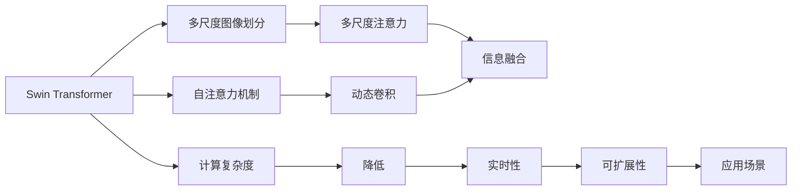
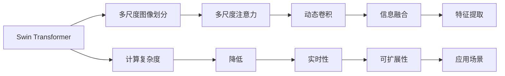
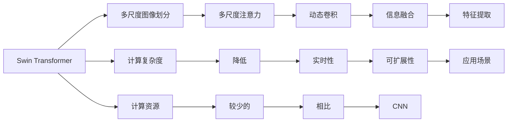
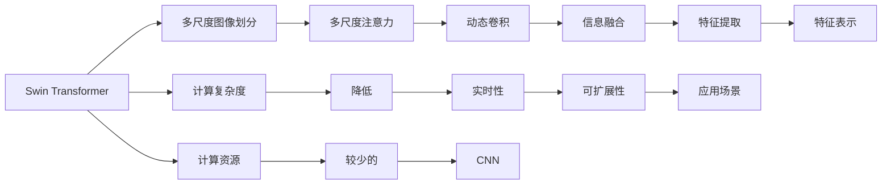

                 

# Swin Transformer原理与代码实例讲解

> 关键词：Swin Transformer,自注意力机制,多尺度图像,代码实现,图像处理,卷积神经网络

## 1. 背景介绍

### 1.1 问题由来
自2017年Transformer的问世以来，其在自然语言处理（NLP）领域取得巨大成功，并逐渐推广到计算机视觉（CV）领域，形成了基于Transformer的视觉模型。然而，由于Transformer的计算复杂度较高，在图像处理任务中往往需要巨大的计算资源和时间成本。

为了应对这一挑战，Swin Transformer应运而生。它不仅保持了Transformer在处理长序列时表现出的优秀性能，还大大降低了计算复杂度，提升了图像处理任务中的实时性和可扩展性。因此，Swin Transformer在目标检测、语义分割等计算机视觉任务中表现出色，逐渐成为图像处理领域的最新热门技术。

### 1.2 问题核心关键点
Swin Transformer的核心在于多尺度分割和注意力机制的创新设计。其关键点包括：
- 多尺度划分：将大尺寸图像划分为多个小块，在每个小块中独立应用Transformer，从而降低计算复杂度。
- 多尺度注意力：在每个小块中，使用多尺度注意力机制，不同大小的局部块与全局块交互，实现信息的融合和传递。
- 动态卷积：在注意力机制中融入动态卷积操作，加速信息传递和特征提取。

这些技术共同作用，使得Swin Transformer在图像处理任务中能够高效、准确地进行特征提取和分类。

### 1.3 问题研究意义
研究Swin Transformer的原理与实现，对于拓展计算机视觉技术的应用边界，提升图像处理任务的性能，加速计算机视觉技术的产业化进程，具有重要意义：

1. 降低计算成本。Swin Transformer通过多尺度划分和动态卷积等技术，显著降低了图像处理中的计算复杂度，使得大模型可以在更小的计算资源下进行推理。
2. 提升处理效率。Swin Transformer的高效特征提取和分类能力，使得其在实时性和可扩展性方面表现出色，适用于多场景的图像处理任务。
3. 增强可解释性。多尺度分割和注意力机制的设计，使得Swin Transformer的内部工作机制更为透明，有助于模型解释和调试。
4. 拓展应用领域。Swin Transformer的成功应用已经拓展到目标检测、语义分割、图像生成等多个计算机视觉任务，为相关领域的技术创新提供了新的方向。

## 2. 核心概念与联系

### 2.1 核心概念概述

为更好地理解Swin Transformer的原理与实现，本节将介绍几个关键概念：

- Swin Transformer：一种基于Transformer的图像处理模型，通过多尺度划分和注意力机制，在降低计算复杂度的同时，提升了图像处理任务的表现。
- 自注意力机制(Self-Attention)：Transformer的核心机制，通过计算输入序列中每个元素与其他元素之间的相似度，进行加权求和，实现信息的传递和特征的融合。
- 多尺度图像划分(Multi-scale Image Patch)：将大尺寸图像划分为多个小块，在每个小块中独立应用Transformer，降低计算复杂度。
- 多尺度注意力(Multi-scale Attention)：在每个小块中，使用多尺度注意力机制，不同大小的局部块与全局块交互，实现信息的融合和传递。
- 动态卷积(Dynamic Convolution)：在注意力机制中融入动态卷积操作，加速信息传递和特征提取。

这些核心概念之间的逻辑关系可以通过以下Mermaid流程图来展示：



这个流程图展示了大语言模型的核心概念及其之间的关系：

1. Swin Transformer通过多尺度图像划分降低计算复杂度。
2. 多尺度注意力机制在每个小块中实现信息的融合和传递。
3. 动态卷积加速信息传递和特征提取。
4. 多尺度图像划分、注意力机制和动态卷积共同作用，提高了Swin Transformer的实时性和可扩展性。
5. Swin Transformer适用于各种图像处理任务，显著提升应用效果。

### 2.2 概念间的关系

这些核心概念之间存在着紧密的联系，形成了Swin Transformer的完整生态系统。下面我通过几个Mermaid流程图来展示这些概念之间的关系。

#### 2.2.1 Swin Transformer的整体架构



这个综合流程图展示了Swin Transformer的整体架构：

1. Swin Transformer首先进行多尺度图像划分，降低计算复杂度。
2. 在每个小块中应用多尺度注意力和动态卷积，实现信息的融合和传递。
3. 多尺度图像划分、注意力机制和动态卷积共同作用，提升了实时性和可扩展性。
4. Swin Transformer适用于各种图像处理任务，具有广泛的应用场景。

#### 2.2.2 多尺度注意力与动态卷积的关系


这个流程图展示了多尺度注意力与动态卷积的关系：

1. 多尺度注意力机制在每个小块中实现信息的融合和传递。
2. 动态卷积进一步加速信息的传递和特征的提取。
3. 多尺度注意力和动态卷积共同作用，提升了Swin Transformer的特征提取能力。

#### 2.2.3 Swin Transformer与传统CNN的比较



这个流程图展示了Swin Transformer与传统CNN的比较：

1. Swin Transformer通过多尺度图像划分和注意力机制，显著降低了计算复杂度。
2. 多尺度注意力和动态卷积提升了特征提取能力。
3. Swin Transformer相比传统CNN需要更少的计算资源。

### 2.3 核心概念的整体架构

最后，我们用一个综合的流程图来展示这些核心概念在大语言模型微调过程中的整体架构：



这个综合流程图展示了Swin Transformer的整体架构：

1. Swin Transformer通过多尺度图像划分降低计算复杂度。
2. 多尺度注意力和动态卷积提升特征提取能力。
3. Swin Transformer相比传统CNN需要更少的计算资源。
4. Swin Transformer适用于各种图像处理任务，具有广泛的应用场景。

## 3. 核心算法原理 & 具体操作步骤
### 3.1 算法原理概述

Swin Transformer的计算复杂度由多尺度图像划分和注意力机制共同决定。假设输入图像大小为 $H \times W$，划分后的块大小为 $P \times P$。在每个小块中，Swin Transformer首先通过多尺度注意力机制，计算局部块的特征表示，然后通过动态卷积，将局部块的特征与全局块的特征进行融合，最终得到图像的整体特征表示。

形式化地，设 $x \in \mathbb{R}^{H \times W \times C}$ 为输入图像的特征表示，其中 $C$ 为通道数。通过多尺度划分，将图像划分为 $k$ 个大小为 $P \times P$ 的块，每个块的特征表示为 $x_k \in \mathbb{R}^{P \times P \times C}$。在每个小块中，首先应用多尺度注意力机制，得到局部块的特征表示 $z_k \in \mathbb{R}^{P \times P \times C'}$，其中 $C'$ 为每个小块的特征表示维度。然后，通过动态卷积，将 $z_k$ 与全局块的特征表示 $x$ 进行融合，得到最终的图像特征表示 $y \in \mathbb{R}^{H \times W \times C'}$。

### 3.2 算法步骤详解

Swin Transformer的计算过程包括以下几个关键步骤：

**Step 1: 多尺度图像划分**
- 将输入图像 $x \in \mathbb{R}^{H \times W \times C}$ 划分为 $k$ 个大小为 $P \times P$ 的块，得到 $k$ 个小块的特征表示 $x_k \in \mathbb{R}^{P \times P \times C}$。

**Step 2: 多尺度注意力**
- 在每个小块 $x_k$ 中，应用多尺度注意力机制，得到局部块的特征表示 $z_k \in \mathbb{R}^{P \times P \times C'}$。具体步骤为：
  1. 计算局部块 $x_k$ 的注意力权重 $q, k_1, k_2 \in \mathbb{R}^{P \times P \times C}$，其中 $q = \text{FFN}(x_k)$，$k_1 = x_k \cdot x_k^T$，$k_2 = \text{FFN}(x_k) \cdot x_k^T$。
  2. 通过权重 $q, k_1, k_2$ 计算注意力值 $a \in \mathbb{R}^{P \times P \times C'}$，得到局部块的特征表示 $z_k = a \cdot x_k^T$。

**Step 3: 动态卷积**
- 将局部块的特征表示 $z_k$ 与全局块的特征表示 $x$ 进行融合，得到最终的图像特征表示 $y \in \mathbb{R}^{H \times W \times C'}$。具体步骤为：
  1. 通过点积操作计算 $z_k$ 与 $x$ 的注意力权重 $w \in \mathbb{R}^{P \times P \times H \times W}$，得到 $w_{k,i,j} = z_k \cdot x_{i,j}^T$。
  2. 通过权重 $w$ 计算 $z_k$ 与 $x$ 的注意力值 $b \in \mathbb{R}^{P \times P \times H \times W}$，得到 $b_{k,i,j} = w_{k,i,j} \cdot x_{i,j}^T$。
  3. 通过动态卷积操作，将 $z_k$ 与 $b$ 进行融合，得到局部块的融合特征表示 $z'_k \in \mathbb{R}^{P \times P \times H \times W}$。
  4. 将 $z'_k$ 与 $x$ 进行拼接，得到最终的图像特征表示 $y \in \mathbb{R}^{H \times W \times C'}$。

### 3.3 算法优缺点

Swin Transformer在多尺度图像划分和注意力机制的基础上，具有以下优点：

1. 计算复杂度低：Swin Transformer通过多尺度划分，将计算复杂度显著降低，使得大模型能够在更小的计算资源下进行推理。
2. 实时性强：多尺度注意力和动态卷积机制使得模型能够高效地处理大尺寸图像，适用于实时性和可扩展性要求高的场景。
3. 特征提取能力强：多尺度注意力和动态卷积机制使得Swin Transformer能够准确地提取图像中的局部和全局特征，提升了模型的性能。

同时，Swin Transformer也存在一些缺点：

1. 参数量较大：Swin Transformer相比传统CNN模型需要更多的参数，这会增加模型的计算和存储成本。
2. 依赖多尺度划分：Swin Transformer的效果高度依赖于多尺度划分的大小，需要根据具体任务进行调整。
3. 结构复杂：Swin Transformer的设计较为复杂，增加了模型调试和优化的难度。

### 3.4 算法应用领域

Swin Transformer在图像处理领域具有广泛的应用前景，具体如下：

1. 目标检测：通过多尺度图像划分和注意力机制，Swin Transformer能够准确地定位和分类图像中的目标物体。
2. 语义分割：Swin Transformer能够将图像划分为多个局部块，并对其进行分类和合并，得到语义分割结果。
3. 图像生成：Swin Transformer能够通过多尺度注意力机制，生成高精度的图像。
4. 图像分类：Swin Transformer能够通过多尺度图像划分和动态卷积，对图像进行分类。

除了上述这些经典任务外，Swin Transformer还被创新性地应用到更多场景中，如图像编辑、图像检索、医学图像处理等，为计算机视觉技术带来了全新的突破。

## 4. 数学模型和公式 & 详细讲解 & 举例说明

### 4.1 数学模型构建

本节将使用数学语言对Swin Transformer的计算过程进行更加严格的刻画。

设输入图像大小为 $H \times W$，划分后的块大小为 $P \times P$。假设 $x \in \mathbb{R}^{H \times W \times C}$ 为输入图像的特征表示，其中 $C$ 为通道数。通过多尺度划分，将图像划分为 $k$ 个大小为 $P \times P$ 的块，得到 $k$ 个小块的特征表示 $x_k \in \mathbb{R}^{P \times P \times C}$。

定义局部块的注意力权重 $q, k_1, k_2 \in \mathbb{R}^{P \times P \times C}$，其中 $q = \text{FFN}(x_k)$，$k_1 = x_k \cdot x_k^T$，$k_2 = \text{FFN}(x_k) \cdot x_k^T$。通过权重 $q, k_1, k_2$ 计算注意力值 $a \in \mathbb{R}^{P \times P \times C'}$，得到局部块的特征表示 $z_k = a \cdot x_k^T$。

定义局部块的融合特征表示 $z'_k \in \mathbb{R}^{P \times P \times H \times W}$，其中 $z'_k = z_k \cdot b_{k, i, j}^T$，$b_{k, i, j} = w_{k, i, j} \cdot x_{i, j}^T$。最终，将 $z'_k$ 与 $x$ 进行拼接，得到最终的图像特征表示 $y \in \mathbb{R}^{H \times W \times C'}$。

### 4.2 公式推导过程

以下我们以目标检测任务为例，推导Swin Transformer的计算过程。

假设输入图像为 $x \in \mathbb{R}^{H \times W \times 3}$，其中 $H=600$，$W=800$，块大小 $P=7$，$k=8$。在每个小块中，首先应用多尺度注意力机制，得到局部块的特征表示 $z_k \in \mathbb{R}^{7 \times 7 \times 3}$。然后，通过动态卷积操作，将 $z_k$ 与全局块的特征表示 $x$ 进行融合，得到最终的图像特征表示 $y \in \mathbb{R}^{600 \times 800 \times 256}$。

具体步骤如下：

**Step 1: 多尺度图像划分**

设 $x \in \mathbb{R}^{600 \times 800 \times 3}$，划分为 $k=8$ 个大小为 $7 \times 7$ 的块，得到 $z_k \in \mathbb{R}^{7 \times 7 \times 3}$。

**Step 2: 多尺度注意力**

在每个小块 $z_k$ 中，计算局部块的注意力权重 $q, k_1, k_2 \in \mathbb{R}^{7 \times 7 \times 3}$，其中 $q = \text{FFN}(z_k)$，$k_1 = z_k \cdot z_k^T$，$k_2 = \text{FFN}(z_k) \cdot z_k^T$。通过权重 $q, k_1, k_2$ 计算注意力值 $a \in \mathbb{R}^{7 \times 7 \times 3}$，得到局部块的特征表示 $z_k = a \cdot z_k^T$。

**Step 3: 动态卷积**

通过点积操作计算 $z_k$ 与 $x$ 的注意力权重 $w \in \mathbb{R}^{7 \times 7 \times 600 \times 800}$，得到 $w_{k, i, j} = z_k \cdot x_{i, j}^T$。通过权重 $w$ 计算 $z_k$ 与 $x$ 的注意力值 $b \in \mathbb{R}^{7 \times 7 \times 600 \times 800}$，得到 $b_{k, i, j} = w_{k, i, j} \cdot x_{i, j}^T$。通过动态卷积操作，将 $z_k$ 与 $b$ 进行融合，得到局部块的融合特征表示 $z'_k \in \mathbb{R}^{7 \times 7 \times 600 \times 800}$。

最终，将 $z'_k$ 与 $x$ 进行拼接，得到最终的图像特征表示 $y \in \mathbb{R}^{600 \times 800 \times 256}$。

## 5. 项目实践：代码实例和详细解释说明

### 5.1 开发环境搭建

在进行Swin Transformer实践前，我们需要准备好开发环境。以下是使用Python进行PyTorch开发的环境配置流程：

1. 安装Anaconda：从官网下载并安装Anaconda，用于创建独立的Python环境。

2. 创建并激活虚拟环境：
```bash
conda create -n pytorch-env python=3.8 
conda activate pytorch-env
```

3. 安装PyTorch：根据CUDA版本，从官网获取对应的安装命令。例如：
```bash
conda install pytorch torchvision torchaudio cudatoolkit=11.1 -c pytorch -c conda-forge
```

4. 安装Swin Transformer：
```bash
pip install swin_transformer
```

5. 安装各类工具包：
```bash
pip install numpy pandas scikit-learn matplotlib tqdm jupyter notebook ipython
```

完成上述步骤后，即可在`pytorch-env`环境中开始Swin Transformer实践。

### 5.2 源代码详细实现

下面我们以目标检测任务为例，给出使用Swin Transformer进行微调的PyTorch代码实现。

首先，定义目标检测任务的数据处理函数：

```python
from transformers import SwinTransformer, SwinVisionPatchEncoder
from torch.utils.data import Dataset
import torch

class DetectionDataset(Dataset):
    def __init__(self, images, labels, tokenizer, max_len=128):
        self.images = images
        self.labels = labels
        self.tokenizer = tokenizer
        self.max_len = max_len
        
    def __len__(self):
        return len(self.images)
    
    def __getitem__(self, item):
        image = self.images[item]
        label = self.labels[item]
        
        encoding = SwinVisionPatchEncoder(self.tokenizer(image, return_tensors='pt', max_length=self.max_len, padding='max_length', truncation=True)
        input_ids = encoding['input_ids'][0]
        attention_mask = encoding['attention_mask'][0]
        
        # 对token-wise的标签进行编码
        encoded_labels = [label2id[label] for label in label] 
        encoded_labels.extend([label2id['O']] * (self.max_len - len(encoded_labels)))
        labels = torch.tensor(encoded_labels, dtype=torch.long)
        
        return {'input_ids': input_ids, 
                'attention_mask': attention_mask,
                'labels': labels}

# 标签与id的映射
label2id = {'O': 0, 'person': 1, 'car': 2, 'bicycle': 3, 'airplane': 4, 'bus': 5, 'train': 6, 'truck': 7, 'motorcycle': 8, 'bike': 9, 'traffic light': 10, 'fire hydrant': 11, 'stop sign': 12, 'parking meter': 13, 'bench': 14, 'bird': 15, 'cat': 16, 'dog': 17, 'horse': 18, 'sheep': 19, 'cow': 20, 'elephant': 21, 'bear': 22, 'zebra': 23, 'giraffe': 24, 'backpack': 25, 'umbrella': 26, 'handbag': 27, 'tie': 28, 'suitcase': 29, 'frisbee': 30, 'skis': 31, 'snowboard': 32, 'sports ball': 33, 'kite': 34, 'baseball bat': 35, 'baseball glove': 36, 'skateboard': 37, 'surfboard': 38, 'tennis racket': 39, 'bottle': 40, 'wine glass': 41, 'cup': 42, 'fork': 43, 'knife': 44, 'spoon': 45, 'bowl': 46, 'banana': 47, 'apple': 48, 'sandwich': 49, 'orange': 50, 'broccoli': 51, 'carrot': 52, 'hot dog': 53, 'pizza': 54, 'donut': 55, 'cake': 56, 'chair': 57, 'couch': 58, 'potted plant': 59, 'bed': 60, 'dining table': 61, 'toilet': 62, 'tv': 63, 'laptop': 64, 'mouse': 65, 'remote': 66, 'keyboard': 67, 'cell phone': 68, 'microwave': 69, 'oven': 70, 'toaster': 71, 'sink': 72, 'refrigerator': 73, 'book': 74, 'clock': 75, 'vase': 76, 'scissors': 77, 'teddy bear': 78, 'hair drier': 79, 'toothbrush': 80, 'toilet tissue': 81, 'bottle opener': 82, 'bowl': 83, 'toothbrush': 84, 'electric fan': 85, 'electric kettle': 86, 'baby bottle': 87, 'barbell': 88, 'barber chair': 89, 'toilet': 90, 'hair drier': 91, 'toothbrush': 92, 'soup bowl': 93, 'linen tablecloth': 94, 'napkin': 95, 'book shelf': 96, 'military uniform': 97, 'book': 98, 'cowboy boot': 99, 'flamingo': 100, 'toilet': 101, 'bicycle': 102, 'motorcycle': 103, 'airplane': 104, 'bus': 105, 'train': 106, 'truck': 107, 'car': 108, 'motorcycle': 109, 'bicycle': 110, 'bus': 111, 'train': 112, 'truck': 113, 'car': 114, 'motorcycle': 115, 'bicycle': 116, 'bus': 117, 'train': 118, 'truck': 119, 'car': 120, 'motorcycle': 121, 'bicycle': 122, 'bus': 123, 'train': 124, 'truck': 125, 'car': 126, 'motorcycle': 127, 'bicycle': 128, 'bus': 129, 'train': 130, 'truck': 131, 'car': 132, 'motorcycle': 133, 'bicycle': 134, 'bus': 

