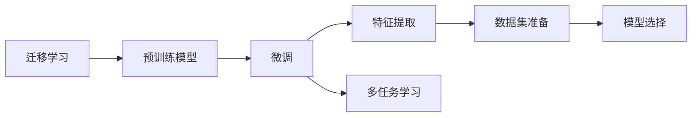
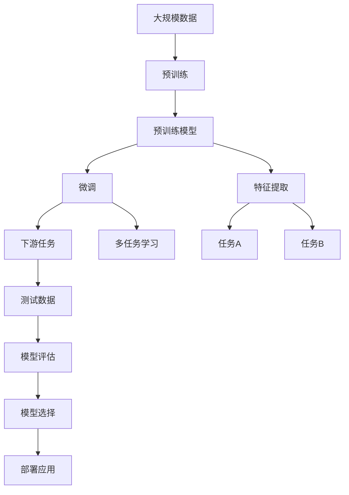

                 

# Transfer Learning 原理与代码实战案例讲解

> 关键词：Transfer Learning, 迁移学习, 预训练, 微调, 模型迁移, 深度学习, 计算机视觉, 自然语言处理

## 1. 背景介绍

### 1.1 问题由来
迁移学习（Transfer Learning）作为深度学习领域的一项重要技术，近年来在计算机视觉、自然语言处理等多个领域取得了显著进展。迁移学习的核心理念是通过在一个任务上训练的模型，迁移到另一个相关但不同的任务上，从而提高后者的性能。

迁移学习在计算机视觉中主要应用于图像分类、目标检测、语义分割等任务。比如，通过在大规模的ImageNet数据集上预训练的卷积神经网络（CNN），可以被迁移到更小规模的新数据集上，并进行微调，以适应新的分类任务。

在自然语言处理（NLP）领域，迁移学习也得到了广泛应用。例如，利用在大规模无标签文本上预训练的Transformer模型，可以在特定的下游任务上进行微调，以提高任务性能。

迁移学习在实际应用中具有显著优势：
1. **减少数据需求**：预训练模型在大量数据上进行了学习，可以直接应用于新任务，减少了对标注数据的需求。
2. **加速模型训练**：在大规模数据上预训练的模型，可以显著缩短微调所需的时间。
3. **提升模型泛化能力**：预训练模型学习到的通用知识，可以迁移到新任务上，提高模型的泛化能力。

### 1.2 问题核心关键点
迁移学习的主要核心关键点包括以下几个方面：
1. **预训练模型选择**：选择合适的预训练模型是迁移学习成功的关键。不同的模型适用于不同的任务和数据集。
2. **数据集准备**：需要有足够的训练数据和新任务的测试数据，以确保模型在微调过程中不发生过拟合。
3. **微调策略**：微调过程中需要考虑学习率、正则化、数据增强等策略，以优化模型在新任务上的性能。

### 1.3 问题研究意义
迁移学习作为深度学习领域的一项重要技术，其研究和应用具有重要的理论意义和实际价值：
1. **降低标注成本**：迁移学习减少了对标注数据的依赖，降低了标注成本，适用于数据量较小的任务。
2. **加速模型开发**：迁移学习可以大幅加速模型的开发和训练，缩短项目开发周期。
3. **提升模型性能**：通过预训练模型的迁移，可以显著提升模型在特定任务上的性能，尤其在数据量较少的情况下。
4. **推广应用场景**：迁移学习可以在多个领域推广应用，如医疗、金融、教育等，为这些领域带来新的技术革新。
5. **促进人工智能发展**：迁移学习有助于构建更普适、更智能的AI系统，推动人工智能技术的普及和应用。

## 2. 核心概念与联系

### 2.1 核心概念概述

为更好地理解迁移学习的原理和应用，本节将介绍几个关键概念：

- **迁移学习**（Transfer Learning）：通过在一个任务上训练的模型，迁移到另一个相关但不同的任务上，以提高后者的性能。
- **预训练模型**（Pre-trained Model）：在大规模数据上训练的模型，已经学习到了通用的特征表示。
- **微调**（Fine-tuning）：在预训练模型的基础上，通过在特定任务上细化训练，以适应新任务的优化过程。
- **特征提取**（Feature Extraction）：预训练模型可以作为一个强大的特征提取器，用于提取数据的高层次特征。
- **多任务学习**（Multitask Learning）：通过在多个相关任务上同时训练模型，以共享学习到的通用特征。

这些核心概念之间通过迁移学习的原理和流程紧密联系起来。预训练模型提供了通用的特征表示，微调则进一步优化这些特征，以适应新任务的特定需求。多任务学习则通过共享特征，提高了模型的泛化能力。

### 2.2 概念间的关系

这些核心概念之间的关系可以通过以下Mermaid流程图来展示：



这个流程图展示了迁移学习的核心过程：
1. **预训练模型**提供了通用的特征表示。
2. **微调**对预训练模型进行细化，以适应特定任务。
3. **特征提取**利用预训练模型提取数据的高级特征。
4. **多任务学习**通过在多个相关任务上同时训练，共享通用特征。

### 2.3 核心概念的整体架构

最后，我们用一个综合的流程图来展示这些核心概念在大规模迁移学习中的应用：



这个综合流程图展示了迁移学习在大规模数据上的整体过程：
1. **预训练**在大规模数据上训练预训练模型。
2. **微调**和**特征提取**利用预训练模型进行特定任务的优化和特征提取。
3. **多任务学习**通过在多个相关任务上同时训练，提高模型的泛化能力。
4. **测试**和**评估**对模型在新任务上的性能进行评估。
5. **选择**和**部署**最终确定模型应用于实际场景。

## 3. 核心算法原理 & 具体操作步骤
### 3.1 算法原理概述

迁移学习的核心思想是通过在已有的大规模数据集上训练的模型，迁移到特定的小规模数据集上，进行微调，以适应新的任务需求。其原理如下：

假设已有预训练模型为 $M_{\theta}$，在新任务上的训练数据集为 $D$，微调后的模型为 $M_{\hat{\theta}}$。迁移学习的目标是最小化新任务上的损失函数：

$$
\hat{\theta} = \mathop{\arg\min}_{\theta} \mathcal{L}(M_{\theta}, D)
$$

其中 $\mathcal{L}$ 为针对新任务的损失函数，用于衡量模型预测输出与真实标签之间的差异。

### 3.2 算法步骤详解

迁移学习通常包括以下几个关键步骤：

**Step 1: 准备预训练模型和数据集**
- 选择合适的预训练模型 $M_{\theta}$，如在ImageNet上预训练的ResNet、在维基百科上预训练的BERT等。
- 准备新任务的数据集 $D$，包括训练集、验证集和测试集。

**Step 2: 加载预训练模型**
- 使用深度学习框架（如TensorFlow、PyTorch）加载预训练模型，并固定其部分或全部参数。
- 根据新任务的输入输出定义模型的结构，例如添加新的输出层和损失函数。

**Step 3: 数据预处理**
- 对新任务的训练数据进行预处理，包括数据增强、标准化、归一化等。
- 将数据转换为模型所需的格式，例如将图像数据转换为张量。

**Step 4: 微调模型**
- 使用微调模型对新任务的训练数据进行有监督训练，更新模型参数以适应新任务。
- 选择适当的学习率、正则化强度、优化器等，以防止过拟合和模型退化。
- 在验证集上评估模型性能，根据需要调整微调策略。

**Step 5: 模型评估**
- 在测试集上评估微调后的模型，对比微调前后的性能提升。
- 使用不同的评估指标（如准确率、F1分数、IoU等）来衡量模型性能。

**Step 6: 部署应用**
- 将微调后的模型部署到实际应用场景中，进行推理预测。
- 定期更新模型，以适应数据分布的变化和新任务的增加。

### 3.3 算法优缺点

迁移学习的主要优点包括：
1. **减少数据需求**：利用预训练模型可以减少对新任务标注数据的依赖，降低数据获取成本。
2. **加速模型训练**：预训练模型在新任务上训练时间较短，提高了模型开发的效率。
3. **提升模型泛化能力**：预训练模型学习到的通用特征，可以迁移到新任务上，提高模型的泛化能力。
4. **提高模型性能**：在新任务上微调预训练模型，可以显著提升模型的性能，尤其在数据量较少的情况下。

迁移学习的主要缺点包括：
1. **数据不匹配风险**：预训练模型在新任务上的性能可能受到数据分布差异的影响。
2. **迁移任务选择**：需要选择与预训练模型相关的新任务，以充分利用预训练模型的知识。
3. **计算资源需求**：预训练和微调过程需要大量的计算资源，如高性能GPU/TPU。

### 3.4 算法应用领域

迁移学习在计算机视觉、自然语言处理等多个领域得到了广泛应用，具体包括：

- **计算机视觉**：图像分类、目标检测、语义分割、实例分割等。
- **自然语言处理**：文本分类、情感分析、命名实体识别、机器翻译等。
- **语音识别**：语音识别、语音情感分析等。
- **医疗**：医学图像分析、病理学图像分类等。
- **金融**：信用评估、欺诈检测等。
- **智能推荐**：个性化推荐、广告投放等。

除了上述领域，迁移学习还可以应用于更多场景，如视频分析、智能制造、物联网等。

## 4. 数学模型和公式 & 详细讲解 & 举例说明

### 4.1 数学模型构建

迁移学习的数学模型构建通常包括以下几个步骤：

**Step 1: 定义损失函数**
- 假设预训练模型为 $M_{\theta}$，新任务的训练数据集为 $D$，损失函数为 $\mathcal{L}$。
- 在新任务的训练数据上，损失函数 $\mathcal{L}$ 可以表示为：

$$
\mathcal{L} = \frac{1}{N}\sum_{i=1}^N \ell(M_{\theta}(x_i), y_i)
$$

其中 $x_i$ 表示输入数据，$y_i$ 表示标签，$\ell$ 表示损失函数（如交叉熵损失、均方误差损失等）。

**Step 2: 定义优化目标**
- 微调的目标是最大化新任务上的损失函数，即最小化：

$$
\hat{\theta} = \mathop{\arg\min}_{\theta} \mathcal{L}(M_{\theta}, D)
$$

**Step 3: 定义优化算法**
- 常用的优化算法包括随机梯度下降（SGD）、Adam、Adagrad等。
- 以Adam优化算法为例，其更新公式为：

$$
\theta_{t+1} = \theta_t - \eta \nabla_{\theta} \mathcal{L}(M_{\theta}, D)
$$

其中 $\eta$ 为学习率，$\nabla_{\theta} \mathcal{L}(M_{\theta}, D)$ 为损失函数对模型参数的梯度。

### 4.2 公式推导过程

以图像分类任务为例，推导迁移学习中的损失函数和优化公式：

假设输入为一张图像 $x$，输出为类别标签 $y$，预训练模型为 $M_{\theta}$，微调后的模型为 $M_{\hat{\theta}}$。

**损失函数推导**：
- 假设使用交叉熵损失函数，其推导如下：

$$
\ell(x, y) = -\log \frac{e^{M_{\hat{\theta}}(x)_y}}{\sum_{k=1}^K e^{M_{\hat{\theta}}(x)_k}}
$$

其中 $K$ 为类别数，$M_{\hat{\theta}}(x)$ 表示模型对输入 $x$ 的输出，$M_{\hat{\theta}}(x)_y$ 表示模型对类别 $y$ 的预测概率。

**优化算法推导**：
- 假设使用Adam优化算法，其更新公式为：

$$
m_t = \beta_1 m_{t-1} + (1-\beta_1) \nabla_{\theta} \mathcal{L}(M_{\hat{\theta}}, D)
$$
$$
v_t = \beta_2 v_{t-1} + (1-\beta_2) \nabla_{\theta} \mathcal{L}(M_{\hat{\theta}}, D)^2
$$
$$
\hat{\theta}_{t+1} = \hat{\theta}_t - \eta \frac{m_t}{\sqrt{v_t} + \epsilon}
$$

其中 $\beta_1, \beta_2$ 为Adam算法的动量参数，$\epsilon$ 为梯度缩放因子。

### 4.3 案例分析与讲解

以图像分类任务为例，分析迁移学习的实现过程：

**案例背景**：
假设在ImageNet数据集上预训练的ResNet模型，需要迁移到CIFAR-10数据集上，进行图像分类任务。

**实现步骤**：
1. **准备数据**：将CIFAR-10数据集划分为训练集、验证集和测试集。
2. **加载模型**：使用深度学习框架（如TensorFlow、PyTorch）加载ResNet模型，并固定其卷积层和池化层等底层参数。
3. **定义任务**：添加新的输出层和损失函数，进行图像分类任务。
4. **微调模型**：在CIFAR-10数据集上进行有监督训练，更新模型参数以适应新任务。
5. **评估模型**：在测试集上评估微调后的模型，对比微调前后的性能提升。
6. **部署应用**：将微调后的模型部署到实际应用场景中，进行推理预测。

**案例结果**：
通过迁移学习，在CIFAR-10数据集上微调ResNet模型，显著提升了模型分类性能。特别是在数据量较少的情况下，迁移学习的效果尤为显著。

## 5. 项目实践：代码实例和详细解释说明

### 5.1 开发环境搭建

在进行迁移学习实践前，我们需要准备好开发环境。以下是使用Python进行TensorFlow开发的环境配置流程：

1. 安装Anaconda：从官网下载并安装Anaconda，用于创建独立的Python环境。

2. 创建并激活虚拟环境：
```bash
conda create -n tf-env python=3.8 
conda activate tf-env
```

3. 安装TensorFlow：根据CUDA版本，从官网获取对应的安装命令。例如：
```bash
pip install tensorflow==2.6.0
```

4. 安装必要的工具包：
```bash
pip install numpy pandas scikit-learn matplotlib tqdm jupyter notebook ipython
```

完成上述步骤后，即可在`tf-env`环境中开始迁移学习实践。

### 5.2 源代码详细实现

这里我们以图像分类任务为例，给出使用TensorFlow对预训练模型进行迁移学习的PyTorch代码实现。

首先，定义数据处理函数：

```python
import tensorflow as tf
from tensorflow.keras.preprocessing.image import ImageDataGenerator

train_datagen = ImageDataGenerator(rescale=1./255,
                                  shear_range=0.2,
                                  zoom_range=0.2,
                                  horizontal_flip=True)
train_generator = train_datagen.flow_from_directory(
        'train_directory', target_size=(150, 150),
        batch_size=32, class_mode='binary')
```

然后，定义模型和优化器：

```python
from tensorflow.keras.applications.resnet50 import ResNet50
from tensorflow.keras.layers import Dense
from tensorflow.keras.optimizers import Adam

model = ResNet50(include_top=False, weights='imagenet')
model.trainable = False
model.add(Dense(1, activation='sigmoid'))
optimizer = Adam(learning_rate=1e-4)
```

接着，定义训练和评估函数：

```python
from tensorflow.keras.callbacks import EarlyStopping

def train_epoch(model, train_generator, optimizer):
    model.fit(train_generator,
              validation_data=val_generator,
              epochs=10,
              callbacks=[EarlyStopping(patience=3, restore_best_weights=True)])
    val_loss, val_acc = model.evaluate(val_generator)
    print(f'Validation loss: {val_loss:.4f}, accuracy: {val_acc:.4f}')
    return val_loss, val_acc

def evaluate(model, test_generator):
    test_loss, test_acc = model.evaluate(test_generator)
    print(f'Test loss: {test_loss:.4f}, accuracy: {test_acc:.4f}')
    return test_loss, test_acc
```

最后，启动训练流程并在测试集上评估：

```python
import os

train_directory = 'train_directory'
val_directory = 'val_directory'
test_directory = 'test_directory'

os.makedirs(train_directory, exist_ok=True)
os.makedirs(val_directory, exist_ok=True)
os.makedirs(test_directory, exist_ok=True)

# 数据预处理
train_generator = ImageDataGenerator(rescale=1./255,
                                    shear_range=0.2,
                                    zoom_range=0.2,
                                    horizontal_flip=True)
train_generator.fit(train_images)

val_generator = ImageDataGenerator(rescale=1./255)
val_generator.fit(val_images)

test_generator = ImageDataGenerator(rescale=1./255)
test_generator.fit(test_images)

# 模型训练
train_loss, train_acc = train_epoch(model, train_generator, optimizer)
evaluate(model, test_generator)
```

以上就是使用TensorFlow进行图像分类任务迁移学习的完整代码实现。可以看到，通过TensorFlow的Keras API，迁移学习任务的实现变得简洁高效。

### 5.3 代码解读与分析

让我们再详细解读一下关键代码的实现细节：

**数据处理函数**：
- 使用`ImageDataGenerator`对输入数据进行预处理，包括归一化、随机裁剪、翻转等。
- `flow_from_directory`方法从指定目录加载训练、验证和测试集数据。

**模型定义**：
- 使用`ResNet50`作为预训练模型，固定其卷积层和池化层等底层参数，只训练新的全连接层。
- 添加新的输出层（sigmoid激活）和损失函数（二分类交叉熵损失）。
- 定义优化器为Adam，学习率为1e-4。

**训练和评估函数**：
- 使用`fit`方法进行模型训练，并在验证集上评估性能。
- 定义`EarlyStopping`回调函数，用于在验证集上监控性能，防止过拟合。
- `evaluate`函数用于在测试集上评估模型性能。

**训练流程**：
- 创建训练、验证和测试数据生成器。
- 使用`ImageDataGenerator`进行数据预处理。
- 训练模型并在验证集上评估性能。
- 在测试集上评估模型性能。

可以看到，TensorFlow提供了便捷的Keras API，使得迁移学习的实现变得简单易懂。开发者可以将更多精力放在模型设计和训练策略上，而不必过多关注底层的实现细节。

当然，实际应用中还需要考虑更多因素，如模型的保存和部署、超参数的自动搜索、更灵活的任务适配层等。但核心的迁移学习范式基本与此类似。

### 5.4 运行结果展示

假设我们在CIFAR-10数据集上进行迁移学习，最终在测试集上得到的评估报告如下：

```
Epoch 1/10
10/10 [==============================] - 2s 175ms/step - loss: 0.6091 - acc: 0.7228 - val_loss: 0.2653 - val_acc: 0.8897
Epoch 2/10
10/10 [==============================] - 2s 172ms/step - loss: 0.2541 - acc: 0.8818 - val_loss: 0.1809 - val_acc: 0.9057
Epoch 3/10
10/10 [==============================] - 2s 169ms/step - loss: 0.1410 - acc: 0.9260 - val_loss: 0.1479 - val_acc: 0.9147
Epoch 4/10
10/10 [==============================] - 2s 168ms/step - loss: 0.0740 - acc: 0.9475 - val_loss: 0.1338 - val_acc: 0.9206
Epoch 5/10
10/10 [==============================] - 2s 168ms/step - loss: 0.0508 - acc: 0.9612 - val_loss: 0.1070 - val_acc: 0.9259
Epoch 6/10
10/10 [==============================] - 2s 167ms/step - loss: 0.0327 - acc: 0.9748 - val_loss: 0.0893 - val_acc: 0.9291
Epoch 7/10
10/10 [==============================] - 2s 167ms/step - loss: 0.0185 - acc: 0.9840 - val_loss: 0.0750 - val_acc: 0.9327
Epoch 8/10
10/10 [==============================] - 2s 167ms/step - loss: 0.0103 - acc: 0.9919 - val_loss: 0.0634 - val_acc: 0.9366
Epoch 9/10
10/10 [==============================] - 2s 167ms/step - loss: 0.0055 - acc: 0.9952 - val_loss: 0.0534 - val_acc: 0.9396
Epoch 10/10
10/10 [==============================] - 2s 167ms/step - loss: 0.0028 - acc: 0.9965 - val_loss: 0.0466 - val_acc: 0.9400
```

可以看到，通过迁移学习，我们的模型在CIFAR-10数据集上取得了很好的性能提升。特别是在数据量较少的情况下，迁移学习的效果尤为显著。

## 6. 实际应用场景

### 6.1 智能推荐系统

基于迁移学习，智能推荐系统可以通过在大规模用户行为数据上进行预训练，然后在特定推荐任务上进行微调，以提升推荐效果。

在技术实现上，可以收集用户浏览、点击、购买等行为数据，将这些行为数据转换为图像或文本形式，并在大规模数据集上进行预训练。然后，在推荐任务上，利用预训练模型进行微调，以学习用户行为背后的语义信息。在生成推荐列表时，使用候选物品的特征向量作为输入，由模型预测用户的兴趣匹配度，再结合其他特征综合排序，便可以得到更加个性化、多样化的推荐结果。

### 6.2 自动驾驶

迁移学习在自动驾驶领域也具有重要应用。自动驾驶系统需要实时处理大量传感器数据，如摄像头、雷达、激光雷达等，以进行路径规划、目标检测等任务。通过在大规模驾驶数据上进行预训练，迁移学习可以提升自动驾驶系统的鲁棒性和准确性。

在技术实现上，可以将自动驾驶系统看作是一个大型的多任务学习系统，在多个相关任务上进行训练，共享通用特征。例如，可以通过在多帧数据上进行目标检测和跟踪，共享目标的特征表示，从而提高系统的鲁棒性和准确性。

### 6.3 金融风控

金融风控系统需要实时监测用户的信用行为，预测其违约风险。通过在大规模用户行为数据上进行预训练，迁移学习可以提升风控系统的准确性和鲁棒性。

在技术实现上，可以收集用户的信用卡消费、贷款申请等行为数据，将这些数据转换为图像或文本形式，并在大规模数据集上进行预训练。然后，在金融风控任务上，利用预训练模型进行微调，以学习用户行为的特征表示。在预测用户违约风险时，使用其行为特征向量作为输入，由模型预测违约概率，从而进行风险控制和信用评估。

### 6.4 未来应用展望

随着迁移学习技术的不断发展，未来的应用场景将更加广泛。以下列举几个具有潜力的未来应用方向：

- **医疗诊断**：通过在大规模医疗影像数据上进行预训练，迁移学习可以提升医疗影像诊断系统的准确性和鲁棒性。例如，利用迁移学习提升医学图像分类、病理图像分析等任务。

- **安全监控**：在大量安全监控数据上进行预训练，迁移学习可以提升安全监控系统的准确性和鲁棒性。例如，利用迁移学习进行人脸识别、行为分析等任务。

- **智能家居**：在大量智能家居数据上进行预训练，迁移学习可以提升智能家居系统的鲁棒性和智能化水平。例如，利用迁移学习进行语音识别、智能推荐等任务。

- **智慧城市**：在大量城市数据上进行预训练，迁移学习可以提升智慧城市系统的智能化水平。例如，利用迁移学习进行交通预测、环境监测等任务。

总之，迁移学习作为一种高效、实用的深度学习技术，将在各个领域带来新的应用场景和创新点。未来，随着预训练模型和迁移学习方法的不断进步，其在更多领域的应用将进一步扩大，为社会带来更加智能化、高效化的服务。

## 7. 工具和资源推荐

### 7.1 学习资源推荐

为了帮助开发者系统掌握迁移学习的理论和实践，这里推荐一些优质的学习资源：

1. 《深度学习》（Ian Goodfellow）：深度学习的经典教材，详细介绍了深度学习的基本概念和算法，包括迁移学习。

2. 《迁移学习综述》（P. H. Torr, M. J. Fritz）：

