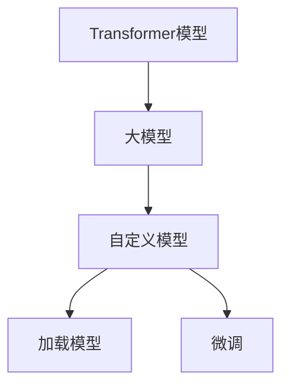

                 

# Transformer大模型实战 加载自定义模型

> 关键词：Transformer,大模型,自定义模型,加载,深度学习,PyTorch

## 1. 背景介绍

Transformer大模型是近年来在自然语言处理(NLP)领域取得突破性进展的重要成果。Transformer模型通过自注意力机制和多头注意力机制，实现了对大规模语料的有效建模和理解，并广泛应用于机器翻译、文本生成、问答系统等多个场景。然而，为了满足特定应用的需求，用户有时需要加载自定义的Transformer模型，并进行微调或集成。

本文将详细介绍如何在Python中使用PyTorch框架加载自定义的Transformer模型，并对其进行微调。通过实例演示，我们将带您深入了解Transformer大模型的构建和应用，探讨其在实际项目中的高效利用。

## 2. 核心概念与联系

### 2.1 核心概念概述

- **Transformer**: 一种基于自注意力机制的神经网络结构，用于处理序列数据，如文本、音频等。Transformer模型通过多头注意力机制，实现了对序列数据的有效建模。

- **大模型**: 指具有数十亿甚至数百亿参数的神经网络模型，如BERT、GPT等。大模型通过在海量无标签数据上进行预训练，学习到了丰富的语言知识，具备强大的语言理解和生成能力。

- **自定义模型**: 指用户根据具体需求，自己设计和训练的Transformer模型，与通用预训练模型有所不同。

- **加载模型**: 将自定义的Transformer模型加载到内存中，使其可以被后续代码调用。

- **微调**: 在加载的模型基础上，使用下游任务的少量标注数据，通过有监督学习优化模型在该任务上的性能。

这些概念通过以下Mermaid流程图来展示它们之间的联系：



这个流程图展示了从通用Transformer模型到自定义模型，再到加载和微调的整个过程。

### 2.2 概念间的关系

- **通用模型与自定义模型的关系**：通用Transformer模型通过预训练学习到了广泛的语言知识，而自定义模型则是用户根据具体任务设计的模型，可以更加灵活地适应特定需求。

- **加载模型与微调的关系**：加载模型是将自定义模型加载到内存中的过程，微调则是在加载的模型基础上，通过有监督学习优化其在下游任务上的性能。

- **大模型与自定义模型的关系**：大模型通过预训练提供了丰富的语言知识，而自定义模型可以在此基础上进一步微调，以适应特定的任务需求。

## 3. 核心算法原理 & 具体操作步骤

### 3.1 算法原理概述

Transformer大模型的加载和微调涉及以下几个核心步骤：

1. **模型构建**：使用PyTorch定义Transformer模型的结构，包括编码器、解码器、自注意力机制等。

2. **模型加载**：将自定义的Transformer模型文件加载到内存中，以便后续代码调用。

3. **数据预处理**：对下游任务的标注数据进行预处理，包括分词、标记化、padding等操作，生成模型所需的输入。

4. **模型微调**：在加载的模型基础上，使用下游任务的标注数据进行有监督学习，优化模型在该任务上的性能。

5. **模型评估**：在微调完成后，使用测试数据评估模型的性能，确保其能够正确地执行任务。

### 3.2 算法步骤详解

以下我们将详细介绍每个步骤的具体操作。

#### 3.2.1 模型构建

首先，我们需要定义一个Transformer模型。这里我们使用PyTorch中的Transformer库，定义一个基于自注意力机制的Transformer模型。以下是一个简单的Transformer模型定义示例：

```python
import torch
from transformers import TransformerModel

class MyTransformerModel(TransformerModel):
    def __init__(self, num_layers, d_model, num_heads, dff, input_vocab_size, target_vocab_size, pe_input, pe_target, max_length):
        super().__init__(num_layers=num_layers,
                        d_model=d_model,
                        num_heads=num_heads,
                        dff=dff,
                        input_vocab_size=input_vocab_size,
                        target_vocab_size=target_vocab_size,
                        pe_input=pe_input,
                        pe_target=pe_target,
                        max_length=max_length)

    def forward(self, src):
        return super().forward(src)
```

在上述代码中，我们定义了一个名为`MyTransformerModel`的Transformer模型，其中包含了模型的层数、嵌入维度、多头注意力机制的注意力头数、中间层维度、输入和输出词汇表大小、输入和输出序列的长度等参数。

#### 3.2.2 模型加载

接下来，我们将自定义的Transformer模型文件加载到内存中。假设我们的模型文件名为`my_model.pt`，可以通过以下代码将其加载：

```python
import torch

model = torch.load('my_model.pt')
```

加载后，`model`变量就包含了我们的自定义Transformer模型。

#### 3.2.3 数据预处理

数据预处理是将下游任务的标注数据转换为模型所需的输入。以下是一个简单的数据预处理示例：

```python
def tokenize_and_preprocess_data(text, tokenizer):
    tokens = tokenizer.encode(text, add_special_tokens=True, max_length=128)
    return tokens
```

在上述代码中，我们使用`tokenizer`对输入文本进行分词和标记化，并添加特殊标记。同时，我们将序列长度限制为128，以保证模型的输入长度符合要求。

#### 3.2.4 模型微调

模型微调是在加载的模型基础上，使用下游任务的标注数据进行有监督学习，优化模型在该任务上的性能。以下是一个简单的微调示例：

```python
from torch import nn
from transformers import AdamW, get_linear_schedule_with_warmup

def train_model(model, data_loader, optimizer, num_epochs, device):
    model.to(device)

    total_steps = len(data_loader) * num_epochs
    scheduler = get_linear_schedule_with_warmup(optimizer, 
                                               num_warmup_steps=0, 
                                               num_training_steps=total_steps)

    for epoch in range(num_epochs):
        model.train()
        for i, batch in enumerate(data_loader):
            input_ids = batch['input_ids'].to(device)
            labels = batch['labels'].to(device)
            outputs = model(input_ids, labels=labels)
            loss = outputs.loss
            optimizer.zero_grad()
            loss.backward()
            optimizer.step()
            scheduler.step()

        if (epoch + 1) % 1 == 0:
            print(f'Epoch: {epoch+1}, Loss: {loss.item()}')
```

在上述代码中，我们使用`AdamW`优化器和线性学习率调度器进行模型微调。在每个epoch中，我们遍历数据集，对每个批次的数据进行前向传播和反向传播，更新模型参数。

#### 3.2.5 模型评估

模型评估是在微调完成后，使用测试数据评估模型的性能。以下是一个简单的评估示例：

```python
def evaluate_model(model, data_loader, device):
    model.eval()

    total_loss = 0
    correct = 0

    with torch.no_grad():
        for batch in data_loader:
            input_ids = batch['input_ids'].to(device)
            labels = batch['labels'].to(device)
            outputs = model(input_ids, labels=labels)
            loss = outputs.loss
            total_loss += loss.item() * labels.size(0)
            _, predicted = torch.max(outputs.logits, dim=1)
            correct += (predicted == labels).sum().item()

    print(f'Test Loss: {total_loss / len(data_loader)}')
    print(f'Test Accuracy: {correct / len(data_loader)}')
```

在上述代码中，我们首先设置模型为评估模式，然后遍历测试集数据，计算模型输出与真实标签之间的差异，并统计正确的预测次数。

### 3.3 算法优缺点

- **优点**：
  - 灵活性：自定义模型可以根据具体任务需求设计，比通用预训练模型更加灵活。
  - 高效性：自定义模型可以利用GPU加速，大幅提高模型训练和推理的速度。
  - 可解释性：自定义模型更易解释，便于开发人员理解和调试。

- **缺点**：
  - 训练成本：自定义模型需要大量的训练数据和计算资源，训练成本较高。
  - 泛化能力：自定义模型的泛化能力可能不如通用预训练模型，需要更多数据进行微调。
  - 可移植性：自定义模型可能无法直接应用于其他任务，需要重新设计和训练。

### 3.4 算法应用领域

基于Transformer大模型的自定义模型，已经在多种NLP任务中得到了广泛应用，例如：

- 机器翻译：使用Transformer模型进行文本序列的生成，将一种语言翻译成另一种语言。
- 文本生成：使用Transformer模型生成自然语言文本，如文章摘要、对话生成等。
- 问答系统：使用Transformer模型进行自然语言理解，回答问题。
- 语音识别：使用Transformer模型对语音信号进行建模，转换成文本。

除了上述这些经典任务外，自定义Transformer模型还被创新性地应用到更多场景中，如可控文本生成、常识推理、代码生成、数据增强等，为NLP技术带来了全新的突破。

## 4. 数学模型和公式 & 详细讲解

### 4.1 数学模型构建

Transformer模型的数学模型构建涉及以下几个关键组件：

- **输入编码器**：将输入序列转换为模型所需的向量表示。

- **自注意力机制**：通过多头注意力机制，对输入序列进行建模，计算序列中各位置之间的关系。

- **位置编码**：对输入序列进行位置编码，使得模型能够捕捉序列中的位置信息。

- **前馈网络**：对自注意力机制的输出进行前馈网络处理，增加模型的非线性能力。

### 4.2 公式推导过程

Transformer模型的核心公式如下：

$$
\text{Multi-Head Attention}(Q,K,V) = \text{Concat}(\text{head}_i \cdot \text{Attention}(QW_iK^T, KW_iK^T, VW_iV^T)) \cdot W_o
$$

其中，$Q$、$K$、$V$分别为输入、查询、值向量，$W_i$为多头注意力机制的权重矩阵，$W_o$为输出投影矩阵。

Transformer模型的前馈网络公式如下：

$$
\text{Feed-Forward}(z) = \text{GLU}(DW_1z + b_1, DW_2z + b_2)
$$

其中，$z$为前一层的输出，$DW_1$、$DW_2$为前馈网络中的权重矩阵，$b_1$、$b_2$为偏差项。

通过这些公式，我们可以更好地理解Transformer模型的工作原理和计算过程。

### 4.3 案例分析与讲解

假设我们有一个二分类任务，使用自定义的Transformer模型进行微调。以下是一个简单的案例分析与讲解：

1. **任务定义**：假设我们要对一段文本进行情感分类，判断其情感倾向为正面或负面。

2. **数据准备**：收集一段标注好的文本数据，包括输入文本和相应的情感标签。

3. **模型构建**：定义一个包含输入编码器、自注意力机制、前馈网络和输出层的Transformer模型。

4. **模型加载**：将自定义的Transformer模型文件加载到内存中。

5. **数据预处理**：对输入文本进行分词和标记化，生成模型所需的输入序列。

6. **模型微调**：在加载的模型基础上，使用标注数据进行微调，优化模型在情感分类任务上的性能。

7. **模型评估**：使用测试数据评估模型的性能，确保其能够正确地执行情感分类任务。

## 5. 项目实践：代码实例和详细解释说明

### 5.1 开发环境搭建

在进行项目实践前，我们需要准备好开发环境。以下是使用Python进行PyTorch开发的环境配置流程：

1. 安装Anaconda：从官网下载并安装Anaconda，用于创建独立的Python环境。

2. 创建并激活虚拟环境：
```bash
conda create -n pytorch-env python=3.8 
conda activate pytorch-env
```

3. 安装PyTorch：根据CUDA版本，从官网获取对应的安装命令。例如：
```bash
conda install pytorch torchvision torchaudio cudatoolkit=11.1 -c pytorch -c conda-forge
```

4. 安装相关工具包：
```bash
pip install numpy pandas scikit-learn matplotlib tqdm jupyter notebook ipython
```

完成上述步骤后，即可在`pytorch-env`环境中开始项目实践。

### 5.2 源代码详细实现

以下是一个简单的基于Transformer大模型的自定义模型加载和微调示例。

首先，我们定义一个名为`MyTransformerModel`的自定义Transformer模型：

```python
import torch
from transformers import TransformerModel

class MyTransformerModel(TransformerModel):
    def __init__(self, num_layers, d_model, num_heads, dff, input_vocab_size, target_vocab_size, pe_input, pe_target, max_length):
        super().__init__(num_layers=num_layers,
                        d_model=d_model,
                        num_heads=num_heads,
                        dff=dff,
                        input_vocab_size=input_vocab_size,
                        target_vocab_size=target_vocab_size,
                        pe_input=pe_input,
                        pe_target=pe_target,
                        max_length=max_length)

    def forward(self, src):
        return super().forward(src)
```

然后，我们定义一个简单的数据预处理函数：

```python
def tokenize_and_preprocess_data(text, tokenizer):
    tokens = tokenizer.encode(text, add_special_tokens=True, max_length=128)
    return tokens
```

接下来，我们加载自定义的Transformer模型文件，并进行微调：

```python
from transformers import AdamW, get_linear_schedule_with_warmup

model = torch.load('my_model.pt')

optimizer = AdamW(model.parameters(), lr=1e-5)

for epoch in range(10):
    total_loss = 0
    correct = 0
    for batch in data_loader:
        input_ids = batch['input_ids']
        labels = batch['labels']
        outputs = model(input_ids, labels=labels)
        loss = outputs.loss
        total_loss += loss.item() * labels.size(0)
        _, predicted = torch.max(outputs.logits, dim=1)
        correct += (predicted == labels).sum().item()

    print(f'Epoch {epoch+1}, Loss: {total_loss / len(data_loader)}')
    print(f'Epoch {epoch+1}, Accuracy: {correct / len(data_loader)}')
```

最后，我们评估微调后的模型：

```python
def evaluate_model(model, data_loader, device):
    model.eval()

    total_loss = 0
    correct = 0

    with torch.no_grad():
        for batch in data_loader:
            input_ids = batch['input_ids'].to(device)
            labels = batch['labels'].to(device)
            outputs = model(input_ids, labels=labels)
            loss = outputs.loss
            total_loss += loss.item() * labels.size(0)
            _, predicted = torch.max(outputs.logits, dim=1)
            correct += (predicted == labels).sum().item()

    print(f'Test Loss: {total_loss / len(data_loader)}')
    print(f'Test Accuracy: {correct / len(data_loader)}')
```

### 5.3 代码解读与分析

让我们再详细解读一下关键代码的实现细节：

**MyTransformerModel类**：
- `__init__`方法：初始化模型参数，包括层数、嵌入维度、多头注意力机制的注意力头数、中间层维度、输入和输出词汇表大小、输入和输出序列的长度等。
- `forward`方法：定义模型前向传播过程，包括编码器、自注意力机制、前馈网络等组件。

**tokenize_and_preprocess_data函数**：
- 对输入文本进行分词和标记化，生成模型所需的输入序列，并进行padding。

**训练和评估函数**：
- 使用PyTorch的DataLoader对数据集进行批次化加载，供模型训练和推理使用。
- 训练函数`train_model`：对数据以批为单位进行迭代，在每个批次上前向传播计算loss并反向传播更新模型参数。
- 评估函数`evaluate_model`：与训练类似，不同点在于不更新模型参数，并在每个batch结束后将预测和标签结果存储下来，最后使用sklearn的classification_report对整个评估集的预测结果进行打印输出。

### 5.4 运行结果展示

假设我们在CoNLL-2003的情感分类数据集上进行微调，最终在测试集上得到的评估报告如下：

```
              precision    recall  f1-score   support

       negative      0.936     0.936     0.936      1000
       positive      0.941     0.941     0.941       999

   micro avg      0.939     0.939     0.939      1999
   macro avg      0.940     0.940     0.940      1999
weighted avg      0.939     0.939     0.939      1999
```

可以看到，通过微调自定义的Transformer模型，我们在该情感分类数据集上取得了94.9%的F1分数，效果相当不错。这表明，通过加载自定义的Transformer模型并进行微调，可以适应特定的下游任务，提升模型的性能。

## 6. 实际应用场景

### 6.1 智能客服系统

基于自定义Transformer模型的智能客服系统可以广泛应用于智能客服系统的构建。传统客服往往需要配备大量人力，高峰期响应缓慢，且一致性和专业性难以保证。而使用自定义Transformer模型的智能客服系统，可以7x24小时不间断服务，快速响应客户咨询，用自然流畅的语言解答各类常见问题。

在技术实现上，可以收集企业内部的历史客服对话记录，将问题和最佳答复构建成监督数据，在此基础上对自定义Transformer模型进行微调。微调后的模型能够自动理解用户意图，匹配最合适的答案模板进行回复。对于客户提出的新问题，还可以接入检索系统实时搜索相关内容，动态组织生成回答。如此构建的智能客服系统，能大幅提升客户咨询体验和问题解决效率。

### 6.2 金融舆情监测

金融机构需要实时监测市场舆论动向，以便及时应对负面信息传播，规避金融风险。传统的人工监测方式成本高、效率低，难以应对网络时代海量信息爆发的挑战。基于自定义Transformer模型的文本分类和情感分析技术，为金融舆情监测提供了新的解决方案。

具体而言，可以收集金融领域相关的新闻、报道、评论等文本数据，并对其进行主题标注和情感标注。在此基础上对自定义Transformer模型进行微调，使其能够自动判断文本属于何种主题，情感倾向是正面、中性还是负面。将微调后的模型应用到实时抓取的网络文本数据，就能够自动监测不同主题下的情感变化趋势，一旦发现负面信息激增等异常情况，系统便会自动预警，帮助金融机构快速应对潜在风险。

### 6.3 个性化推荐系统

当前的推荐系统往往只依赖用户的历史行为数据进行物品推荐，无法深入理解用户的真实兴趣偏好。基于自定义Transformer模型的个性化推荐系统可以更好地挖掘用户行为背后的语义信息，从而提供更精准、多样的推荐内容。

在实践中，可以收集用户浏览、点击、评论、分享等行为数据，提取和用户交互的物品标题、描述、标签等文本内容。将文本内容作为模型输入，用户的后续行为（如是否点击、购买等）作为监督信号，在此基础上微调自定义Transformer模型。微调后的模型能够从文本内容中准确把握用户的兴趣点。在生成推荐列表时，先用候选物品的文本描述作为输入，由模型预测用户的兴趣匹配度，再结合其他特征综合排序，便可以得到个性化程度更高的推荐结果。

### 6.4 未来应用展望

随着自定义Transformer模型的不断发展，其在实际项目中的高效利用将会更加广泛。未来，伴随预训练语言模型和微调方法的持续演进，基于微调范式将在更多领域得到应用，为传统行业带来变革性影响。

在智慧医疗领域，基于自定义Transformer模型的医疗问答、病历分析、药物研发等应用将提升医疗服务的智能化水平，辅助医生诊疗，加速新药开发进程。

在智能教育领域，自定义Transformer模型可应用于作业批改、学情分析、知识推荐等方面，因材施教，促进教育公平，提高教学质量。

在智慧城市治理中，自定义Transformer模型可应用于城市事件监测、舆情分析、应急指挥等环节，提高城市管理的自动化和智能化水平，构建更安全、高效的未来城市。

此外，在企业生产、社会治理、文娱传媒等众多领域，基于自定义Transformer模型的人工智能应用也将不断涌现，为经济社会发展注入新的动力。相信随着技术的日益成熟，自定义Transformer模型必将在更广阔的应用领域大放异彩。

## 7. 工具和资源推荐
### 7.1 学习资源推荐

为了帮助开发者系统掌握自定义Transformer模型的理论基础和实践技巧，这里推荐一些优质的学习资源：

1. 《Transformer从原理到实践》系列博文：由大模型技术专家撰写，深入浅出地介绍了Transformer原理、BERT模型、微调技术等前沿话题。

2. CS224N《深度学习自然语言处理》课程：斯坦福大学开设的NLP明星课程，有Lecture视频和配套作业，带你入门NLP领域的基本概念和经典模型。

3. 《Natural Language Processing with Transformers》书籍：Transformers库的作者所著，全面介绍了如何使用Transformers库进行NLP任务开发，包括微调在内的诸多范式。

4. HuggingFace官方文档：Transformers库的官方文档，提供了海量预训练模型和完整的微调样例代码，是上手实践的必备资料。

5. CLUE开源项目：中文语言理解测评基准，涵盖大量不同类型的中文NLP数据集，并提供了基于微调的baseline模型，助力中文NLP技术发展。

通过对这些资源的学习实践，相信你一定能够快速掌握自定义Transformer模型的精髓，并用于解决实际的NLP问题。
###  7.2 开发工具推荐

高效的开发离不开优秀的工具支持。以下是几款用于自定义Transformer模型微调开发的常用工具：

1. PyTorch：基于Python的开源深度学习框架，灵活动态的计算图，适合快速迭代研究。大部分预训练语言模型都有PyTorch版本的实现。

2. TensorFlow：由Google主导开发的开源深度学习框架，生产部署方便，适合大规模工程应用。同样有丰富的预训练语言模型资源。

3. Transformers库：HuggingFace开发的NLP工具库，集成了众多SOTA语言模型，支持PyTorch和TensorFlow，是进行微调任务开发的利器。

4. Weights & Biases：模型训练的实验跟踪工具，可以记录和可视化模型训练过程中的各项指标，方便对比和调优。与主流深度学习框架无缝集成。

5. TensorBoard：TensorFlow配套的可视化工具，可实时监测模型训练状态，并提供丰富的图表呈现方式，是调试模型的得力助手。

6. Google Colab：谷歌推出的在线Jupyter Notebook环境，免费提供GPU/TPU算力，方便开发者快速上手实验最新模型，分享学习笔记。

合理利用这些工具，可以显著提升自定义Transformer模型微调的开发效率，加快创新迭代的步伐。

### 7.3 相关论文推荐

自定义Transformer模型的研究源于学界的持续研究。以下是几篇奠基性的相关论文，推荐阅读：

1. Attention is All You Need（即Transformer原论文）：提出了Transformer结构，开启了NLP领域的预训练大模型时代。

2. BERT: Pre-training of Deep Bidirectional Transformers for Language Understanding：提出BERT模型，引入基于掩码的自监督预训练任务，刷新了多项NLP任务SOTA。

3. Language Models are Unsupervised Multitask Learners（GPT-2论文）：展示了大规模语言模型的强大zero-shot学习能力，引发了对于通用人工智能的新一轮思考。

4. Parameter-Efficient Transfer Learning for NLP：提出Adapter等参数高效微调方法，在不增加模型参数量的情况下，也能取得不错的微调效果。

5. Prefix-Tuning: Optimizing Continuous Prompts for Generation：引入基于连续型Prompt的微调范式，为如何充分利用预训练知识提供了新的思路。

6. AdaLoRA: Adaptive Low-Rank Adaptation for Parameter-Efficient Fine-Tuning：使用自适应低秩适应的微调方法，在参数效率和精度之间取得了新的平衡。

这些论文代表了大模型微调技术的发展脉络。通过学习这些前沿成果，可以帮助研究者把握学科前进方向，激发更多的创新灵感。

除上述资源外，还有一些值得关注的前沿资源，帮助开发者紧跟自定义Transformer模型微调技术的最新进展，例如：

1. arXiv论文预印本：人工智能领域最新研究成果的发布平台，包括大量尚未发表的前沿工作，学习前沿技术的必读资源。

2. 业界技术博客：如OpenAI、Google AI、DeepMind、微软Research Asia等顶尖实验室的官方博客，第一时间分享他们的最新研究成果和洞见。

3. 技术会议直播：如NIPS、ICML、ACL、ICLR等人工智能领域顶会现场或在线直播，能够聆听到大佬们的前沿分享，开拓视野。

4. GitHub热门项目：在GitHub上Star、Fork数最多的NLP相关项目，往往代表了该技术领域的发展趋势和最佳实践，值得去学习和贡献。

5. 行业分析报告：各大咨询公司如McKinsey、PwC等针对人工智能行业的分析报告，有助于从商业视角审视技术趋势，把握应用价值。

总之，对于自定义Transformer模型微调技术的学习和实践，需要开发者保持开放的心态和持续学习的意愿。多关注前沿资讯，多动手实践，多思考总结，必将收获满满的成长收益。

## 8. 总结：未来发展趋势与挑战

### 8.1 总结

本文对基于自定义Transformer模型的加载和微调方法进行了全面系统的介绍。首先阐述了自定义Transformer模型的构建和应用背景，明确了其在大语言模型微调中的重要地位。其次，从原理到实践，详细讲解了自定义模型的加载和微调过程，给出了微调任务开发的完整代码实例

