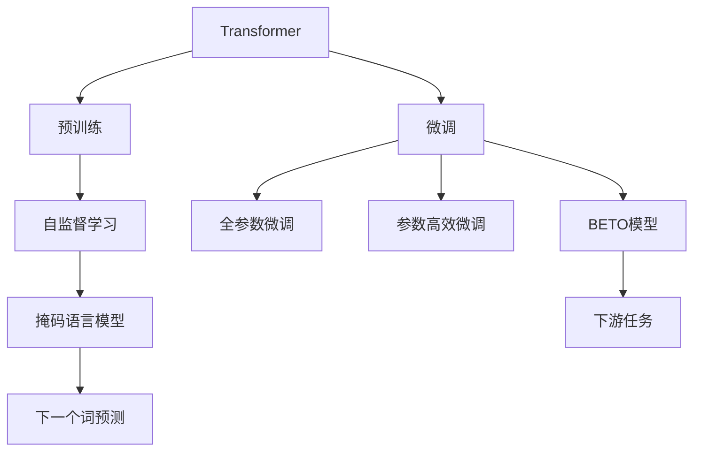
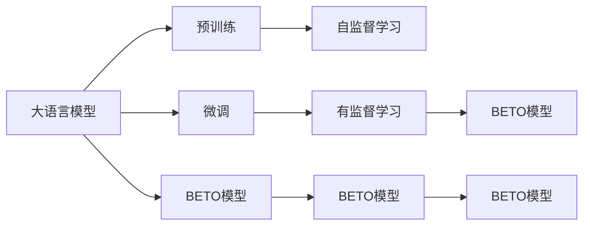
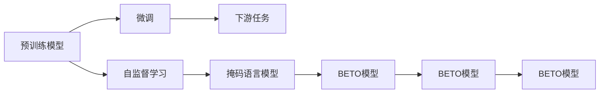
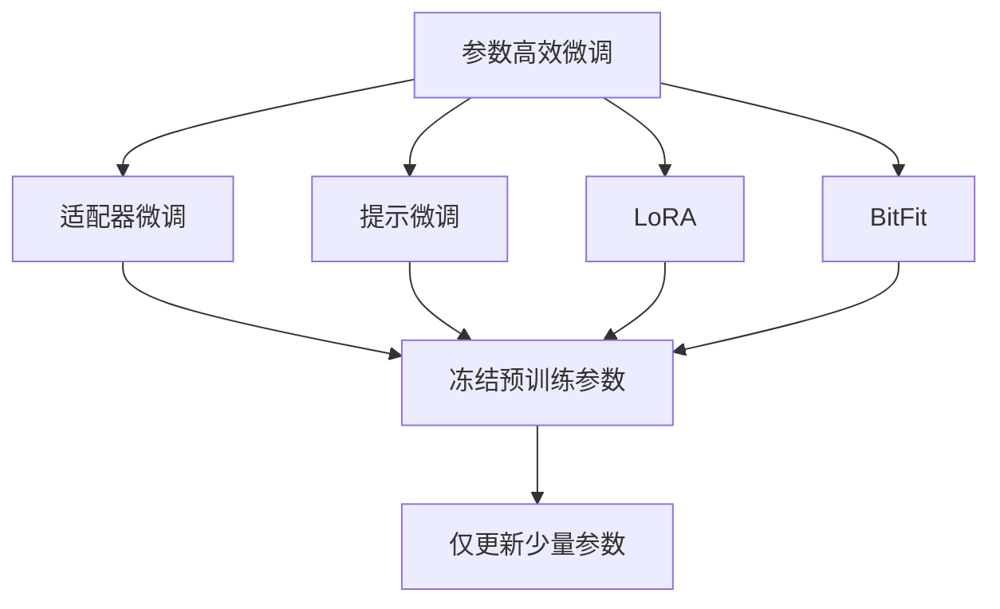
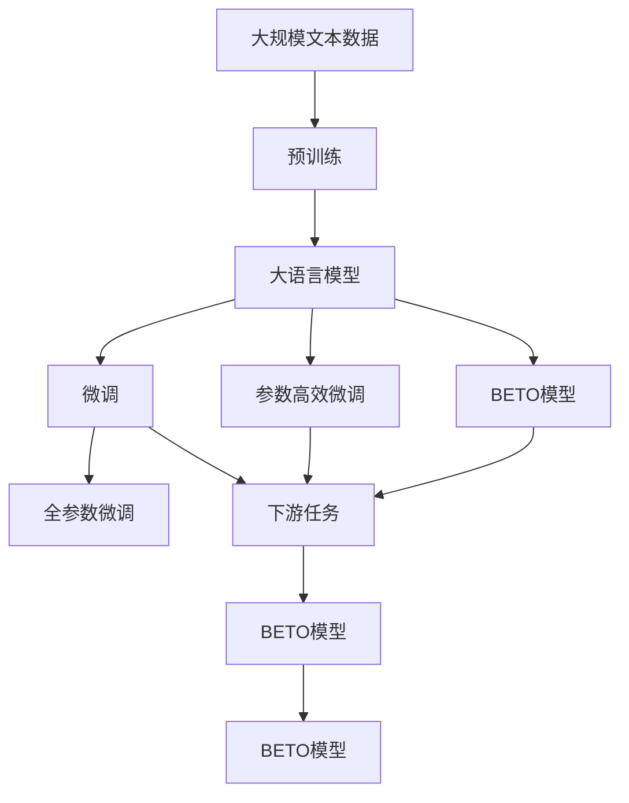

                 

# Transformer大模型实战 西班牙语的BETO模型

> 关键词：大语言模型, Transformer, 西班牙语, BETO, 自然语言处理(NLP), 预训练, 微调, 实战应用

## 1. 背景介绍

### 1.1 问题由来
近年来，深度学习技术的迅猛发展，使得大规模预训练语言模型在自然语言处理(NLP)领域取得了显著进展。特别是在Google、OpenAI等公司的推动下，基于Transformer架构的大语言模型如BERT、GPT等，通过在大规模无标签文本上自监督预训练，显著提升了语言理解和生成的能力。

然而，这些通用模型在特定领域的应用效果并不理想。由于预训练数据通常涉及多种语言，这些通用模型在特定领域语言上往往表现欠佳。例如，当应用于西班牙语等特定语言的NLP任务时，尽管一些基于英语等主流语言的模型也能取得一定效果，但仍然难以达到最佳性能。

因此，开发针对特定语言的BUTO模型成为了提升NLP任务性能的重要方向。本文将介绍西班牙语的BETO模型，探索如何在大模型上针对西班牙语进行微调，以提升其在NLP任务中的性能。

### 1.2 问题核心关键点
西班牙语的BETO模型基于Transformer架构，通过预训练和微调，能够显著提升西班牙语任务的性能。关键点包括：

- 预训练：在大规模无标签文本数据上进行预训练，学习语言的通用表示。
- 微调：在特定语言的标注数据上微调，优化模型在特定领域的表现。
- 实战应用：在具体的NLP任务上进行验证，展示BETO模型的效果。

### 1.3 问题研究意义
开发西班牙语的BETO模型，对于提升西班牙语NLP任务的性能具有重要意义：

1. **减少依赖**：相比于通用的BERT、GPT等模型，BETO模型更加专注于西班牙语，能够减少依赖其他语言的通用模型，从而提升模型效果。
2. **提升性能**：针对特定语言的微调能够更有效地利用语言特点，提升模型在特定领域的表现。
3. **可解释性**：特定语言的模型往往更易于解释和理解，方便开发者进行调试和优化。
4. **灵活性**：BETO模型可以灵活地应用到各种西班牙语的NLP任务中，如文本分类、命名实体识别、情感分析等。

## 2. 核心概念与联系

### 2.1 核心概念概述

为更好地理解西班牙语BETO模型的微调方法，本节将介绍几个关键概念：

- **Transformer**：一种基于自注意力机制的神经网络架构，通过多头注意力机制和残差连接，可以实现高效的并行计算。
- **预训练**：在大规模无标签文本数据上，通过自监督学习任务训练语言模型的过程。常见的预训练任务包括掩码语言模型、下一个词预测等。
- **微调**：在预训练模型的基础上，使用下游任务的少量标注数据，通过有监督学习优化模型在特定任务上的性能。
- **大模型**：指具有大规模参数量和计算能力的语言模型，如BERT、GPT等。
- **BETO**：基于Transformer架构，专门为西班牙语设计的预训练和微调语言模型。

这些核心概念之间的关系可以通过以下Mermaid流程图来展示：



这个流程图展示了Transformer大模型的微调过程，从预训练到微调，再到下游任务的实际应用。通过预训练，模型学习到语言的通用表示，微调则进一步优化模型在特定领域的表现。

### 2.2 概念间的关系

这些核心概念之间存在着紧密的联系，形成了西班牙语BETO模型微调的整体框架。下面通过几个Mermaid流程图来展示这些概念之间的关系。

#### 2.2.1 大模型的学习范式



这个流程图展示了基于Transformer的大模型学习范式，从预训练到微调，再到下游任务的实现。预训练使得模型学习到语言的通用表示，微调则优化模型在特定领域的表现。

#### 2.2.2 微调与预训练的关系



这个流程图展示了预训练模型通过微调优化到特定领域的表现，最终应用于下游任务的过程。

#### 2.2.3 参数高效微调方法



这个流程图展示了参数高效微调方法，包括适配器微调、提示微调、LoRA和BitFit等，通过冻结大部分预训练参数，只更新少量参数，以提高微调效率。

### 2.3 核心概念的整体架构

最后，我们用一个综合的流程图来展示这些核心概念在大模型微调过程中的整体架构：



这个综合流程图展示了从预训练到微调，再到下游任务的完整过程。BETO模型首先在大规模文本数据上进行预训练，然后通过微调（包括全参数微调和参数高效微调）优化模型在特定领域的表现。

## 3. 核心算法原理 & 具体操作步骤
### 3.1 算法原理概述

西班牙语的BETO模型微调基于Transformer架构，通过在大规模无标签西班牙语文本数据上进行预训练，学习语言的通用表示。然后，在特定西班牙语任务的少量标注数据上，通过有监督学习优化模型，以提升模型在特定领域的表现。

具体而言，微调过程包括两个步骤：

1. **预训练**：在大规模无标签西班牙语文本数据上，通过自监督学习任务（如掩码语言模型、下一个词预测等）训练BETO模型。
2. **微调**：在特定西班牙语任务的少量标注数据上，通过有监督学习任务（如分类、匹配、生成等）优化BETO模型，使其适应特定领域的表现。

### 3.2 算法步骤详解

#### 3.2.1 预训练步骤

1. **数据准备**：收集大规模无标签西班牙语文本数据，例如维基百科、新闻、文学作品等。
2. **模型加载**：使用HuggingFace提供的BETO模型库，加载预训练的BETO模型。
3. **自监督学习**：在预训练数据上，通过掩码语言模型或下一个词预测等自监督学习任务训练模型。
4. **保存模型**：将训练好的BETO模型保存到本地或远程存储。

#### 3.2.2 微调步骤

1. **数据准备**：收集特定西班牙语任务的少量标注数据，例如新闻分类、情感分析、命名实体识别等。
2. **模型加载**：加载预训练的BETO模型。
3. **任务适配**：根据具体任务类型，修改模型输出层和损失函数。例如，对于分类任务，添加线性分类器；对于生成任务，使用语言模型的解码器输出概率分布。
4. **微调训练**：在标注数据上，使用有监督学习优化模型，最小化损失函数。
5. **评估测试**：在验证集和测试集上评估模型性能，调整模型超参数。
6. **模型部署**：将微调后的BETO模型部署到实际应用系统中，进行推理预测。

### 3.3 算法优缺点

#### 3.3.1 优点

1. **高效性能**：BETO模型在大规模预训练和微调后，具备强大的语言理解和生成能力。
2. **通用性**：BETO模型可以应用于多种西班牙语NLP任务，如文本分类、命名实体识别、情感分析等。
3. **灵活性**：BETO模型可以通过微调来适应不同领域和任务，提升模型表现。
4. **可解释性**：BETO模型的微调过程透明，方便开发者理解和优化。

#### 3.3.2 缺点

1. **依赖标注数据**：微调过程需要标注数据，标注数据的获取和处理成本较高。
2. **资源消耗**：预训练和微调过程需要大量计算资源和时间，对硬件要求较高。
3. **模型过大**：BETO模型参数量较大，推理速度较慢，对硬件资源要求较高。
4. **泛化能力有限**：微调模型在特定领域表现优异，但在其他领域或任务上可能效果不佳。

### 3.4 算法应用领域

西班牙语的BETO模型在以下几个领域有着广泛的应用前景：

- **文本分类**：将文本分类到特定类别，例如新闻、评论、文档等。
- **命名实体识别**：识别文本中的人名、地名、机构名等实体。
- **情感分析**：分析文本情感倾向，例如正面、负面、中性等。
- **机器翻译**：将一种西班牙语翻译成另一种西班牙语。
- **对话系统**：构建西班牙语的智能对话系统，自动回复用户问题。
- **文本摘要**：自动生成西班牙语文本摘要。
- **知识图谱构建**：构建西班牙语领域的知识图谱，辅助信息检索和推荐。

## 4. 数学模型和公式 & 详细讲解 & 举例说明

### 4.1 数学模型构建

假设西班牙语的BETO模型为 $M_{\theta}$，其中 $\theta$ 为预训练和微调后的模型参数。定义西班牙语任务 $T$ 的训练集为 $D=\{(x_i,y_i)\}_{i=1}^N$，其中 $x_i$ 为输入文本，$y_i$ 为标注标签。

定义模型 $M_{\theta}$ 在输入 $x$ 上的输出为 $\hat{y}=M_{\theta}(x)$，表示样本属于类别 $y$ 的概率。

定义模型 $M_{\theta}$ 在输入 $x$ 上的损失函数为 $\ell(M_{\theta}(x),y)$，用于衡量模型预测输出与真实标签之间的差异。

微调的目标是最小化经验风险，即找到最优参数：

$$
\hat{\theta}=\mathop{\arg\min}_{\theta} \mathcal{L}(\theta)
$$

其中 $\mathcal{L}$ 为针对任务 $T$ 设计的损失函数，用于衡量模型预测输出与真实标签之间的差异。常见的损失函数包括交叉熵损失、均方误差损失等。

### 4.2 公式推导过程

以二分类任务为例，推导交叉熵损失函数及其梯度的计算公式。

假设模型 $M_{\theta}$ 在输入 $x$ 上的输出为 $\hat{y}=M_{\theta}(x) \in [0,1]$，表示样本属于正类的概率。真实标签 $y \in \{0,1\}$。则二分类交叉熵损失函数定义为：

$$
\ell(M_{\theta}(x),y) = -[y\log \hat{y} + (1-y)\log (1-\hat{y})]
$$

将其代入经验风险公式，得：

$$
\mathcal{L}(\theta) = -\frac{1}{N}\sum_{i=1}^N [y_i\log M_{\theta}(x_i)+(1-y_i)\log(1-M_{\theta}(x_i))]
$$

根据链式法则，损失函数对参数 $\theta_k$ 的梯度为：

$$
\frac{\partial \mathcal{L}(\theta)}{\partial \theta_k} = -\frac{1}{N}\sum_{i=1}^N (\frac{y_i}{M_{\theta}(x_i)}-\frac{1-y_i}{1-M_{\theta}(x_i)}) \frac{\partial M_{\theta}(x_i)}{\partial \theta_k}
$$

其中 $\frac{\partial M_{\theta}(x_i)}{\partial \theta_k}$ 可进一步递归展开，利用自动微分技术完成计算。

### 4.3 案例分析与讲解

以西班牙语情感分析任务为例，展示如何使用BETO模型进行微调。

首先，定义情感分析任务的数据处理函数：

```python
from transformers import BertTokenizer
from torch.utils.data import Dataset
import torch

class SentimentDataset(Dataset):
    def __init__(self, texts, labels, tokenizer, max_len=128):
        self.texts = texts
        self.labels = labels
        self.tokenizer = tokenizer
        self.max_len = max_len
        
    def __len__(self):
        return len(self.texts)
    
    def __getitem__(self, item):
        text = self.texts[item]
        label = self.labels[item]
        
        encoding = self.tokenizer(text, return_tensors='pt', max_length=self.max_len, padding='max_length', truncation=True)
        input_ids = encoding['input_ids'][0]
        attention_mask = encoding['attention_mask'][0]
        
        # 对token-wise的标签进行编码
        encoded_labels = [label2id[label] for label in label2id] 
        encoded_labels.extend([label2id['O']] * (self.max_len - len(encoded_labels)))
        labels = torch.tensor(encoded_labels, dtype=torch.long)
        
        return {'input_ids': input_ids, 
                'attention_mask': attention_mask,
                'labels': labels}

# 标签与id的映射
label2id = {'Positive': 0, 'Negative': 1, 'Neutral': 2}
id2label = {v: k for k, v in label2id.items()}

# 创建dataset
tokenizer = BertTokenizer.from_pretrained('bert-base-cased')

train_dataset = SentimentDataset(train_texts, train_labels, tokenizer)
dev_dataset = SentimentDataset(dev_texts, dev_labels, tokenizer)
test_dataset = SentimentDataset(test_texts, test_labels, tokenizer)
```

然后，定义模型和优化器：

```python
from transformers import BertForTokenClassification, AdamW

model = BertForTokenClassification.from_pretrained('beto-base-cased', num_labels=len(label2id))

optimizer = AdamW(model.parameters(), lr=2e-5)
```

接着，定义训练和评估函数：

```python
from torch.utils.data import DataLoader
from tqdm import tqdm
from sklearn.metrics import classification_report

device = torch.device('cuda') if torch.cuda.is_available() else torch.device('cpu')
model.to(device)

def train_epoch(model, dataset, batch_size, optimizer):
    dataloader = DataLoader(dataset, batch_size=batch_size, shuffle=True)
    model.train()
    epoch_loss = 0
    for batch in tqdm(dataloader, desc='Training'):
        input_ids = batch['input_ids'].to(device)
        attention_mask = batch['attention_mask'].to(device)
        labels = batch['labels'].to(device)
        model.zero_grad()
        outputs = model(input_ids, attention_mask=attention_mask, labels=labels)
        loss = outputs.loss
        epoch_loss += loss.item()
        loss.backward()
        optimizer.step()
    return epoch_loss / len(dataloader)

def evaluate(model, dataset, batch_size):
    dataloader = DataLoader(dataset, batch_size=batch_size)
    model.eval()
    preds, labels = [], []
    with torch.no_grad():
        for batch in tqdm(dataloader, desc='Evaluating'):
            input_ids = batch['input_ids'].to(device)
            attention_mask = batch['attention_mask'].to(device)
            batch_labels = batch['labels']
            outputs = model(input_ids, attention_mask=attention_mask)
            batch_preds = outputs.logits.argmax(dim=2).to('cpu').tolist()
            batch_labels = batch_labels.to('cpu').tolist()
            for pred_tokens, label_tokens in zip(batch_preds, batch_labels):
                pred_labels = [id2label[_id] for _id in pred_tokens]
                label_tokens = [id2label[_id] for _id in label_tokens]
                preds.append(pred_labels[:len(label_tokens)])
                labels.append(label_tokens)
                
    print(classification_report(labels, preds))
```

最后，启动训练流程并在测试集上评估：

```python
epochs = 5
batch_size = 16

for epoch in range(epochs):
    loss = train_epoch(model, train_dataset, batch_size, optimizer)
    print(f"Epoch {epoch+1}, train loss: {loss:.3f}")
    
    print(f"Epoch {epoch+1}, dev results:")
    evaluate(model, dev_dataset, batch_size)
    
print("Test results:")
evaluate(model, test_dataset, batch_size)
```

以上就是使用PyTorch对西班牙语BETO模型进行情感分析任务微调的完整代码实现。可以看到，得益于HuggingFace的BETO模型库，代码实现简洁高效。

## 5. 项目实践：代码实例和详细解释说明
### 5.1 开发环境搭建

在进行BETO模型微调实践前，我们需要准备好开发环境。以下是使用Python进行PyTorch开发的环境配置流程：

1. 安装Anaconda：从官网下载并安装Anaconda，用于创建独立的Python环境。

2. 创建并激活虚拟环境：
```bash
conda create -n pytorch-env python=3.8 
conda activate pytorch-env
```

3. 安装PyTorch：根据CUDA版本，从官网获取对应的安装命令。例如：
```bash
conda install pytorch torchvision torchaudio cudatoolkit=11.1 -c pytorch -c conda-forge
```

4. 安装Transformers库：
```bash
pip install transformers
```

5. 安装各类工具包：
```bash
pip install numpy pandas scikit-learn matplotlib tqdm jupyter notebook ipython
```

完成上述步骤后，即可在`pytorch-env`环境中开始BETO模型微调实践。

### 5.2 源代码详细实现

下面我们以西班牙语情感分析任务为例，给出使用HuggingFace库对BETO模型进行微调的PyTorch代码实现。

首先，定义情感分析任务的数据处理函数：

```python
from transformers import BertTokenizer
from torch.utils.data import Dataset
import torch

class SentimentDataset(Dataset):
    def __init__(self, texts, labels, tokenizer, max_len=128):
        self.texts = texts
        self.labels = labels
        self.tokenizer = tokenizer
        self.max_len = max_len
        
    def __len__(self):
        return len(self.texts)
    
    def __getitem__(self, item):
        text = self.texts[item]
        label = self.labels[item]
        
        encoding = self.tokenizer(text, return_tensors='pt', max_length=self.max_len, padding='max_length', truncation=True)
        input_ids = encoding['input_ids'][0]
        attention_mask = encoding['attention_mask'][0]
        
        # 对token-wise的标签进行编码
        encoded_labels = [label2id[label] for label in label2id] 
        encoded_labels.extend([label2id['O']] * (self.max_len - len(encoded_labels)))
        labels = torch.tensor(encoded_labels, dtype=torch.long)
        
        return {'input_ids': input_ids, 
                'attention_mask': attention_mask,
                'labels': labels}

# 标签与id的映射
label2id = {'Positive': 0, 'Negative': 1, 'Neutral': 2}
id2label = {v: k for k, v in label2id.items()}

# 创建dataset
tokenizer = BertTokenizer.from_pretrained('bert-base-cased')

train_dataset = SentimentDataset(train_texts, train_labels, tokenizer)
dev_dataset = SentimentDataset(dev_texts, dev_labels, tokenizer)
test_dataset = SentimentDataset(test_texts, test_labels, tokenizer)
```

然后，定义模型和优化器：

```python
from transformers import BertForTokenClassification, AdamW

model = BertForTokenClassification.from_pretrained('beto-base-cased', num_labels=len(label2id))

optimizer = AdamW(model.parameters(), lr=2e-5)
```

接着，定义训练和评估函数：

```python
from torch.utils.data import DataLoader
from tqdm import tqdm
from sklearn.metrics import classification_report

device = torch.device('cuda') if torch.cuda.is_available() else torch.device('cpu')
model.to(device)

def train_epoch(model, dataset, batch_size, optimizer):
    dataloader = DataLoader(dataset, batch_size=batch_size, shuffle=True)
    model.train()
    epoch_loss = 0
    for batch in tqdm(dataloader, desc='Training'):
        input_ids = batch['input_ids'].to(device)
        attention_mask = batch['attention_mask'].to(device)
        labels = batch['labels'].to(device)
        model.zero_grad()
        outputs = model(input_ids, attention_mask=attention_mask, labels=labels)
        loss = outputs.loss
        epoch_loss += loss.item()
        loss.backward()
        optimizer.step()
    return epoch_loss / len(dataloader)

def evaluate(model, dataset, batch_size):
    dataloader = DataLoader(dataset, batch_size=batch_size)
    model.eval()
    preds, labels = [], []
    with torch.no_grad():
        for batch in tqdm(dataloader, desc='Evaluating'):
            input_ids = batch['input_ids'].to(device)
            attention_mask = batch['attention_mask'].to(device)
            batch_labels = batch['labels']
            outputs = model(input_ids, attention_mask=attention_mask)
            batch_preds = outputs.logits.argmax(dim=2).to('cpu').tolist()
            batch_labels = batch_labels.to('cpu').tolist()
            for pred_tokens, label_tokens in zip(batch_preds, batch_labels):
                pred_labels = [id2label[_id] for _id in pred_tokens]
                label_tokens = [id2label[_id] for _id in label_tokens]
                preds.append(pred_labels[:len(label_tokens)])
                labels.append(label_tokens)
                
    print(classification_report(labels, preds))
```

最后，启动训练流程并在测试集上评估：

```python
epochs = 5
batch_size = 16

for epoch in range(epochs):
    loss = train_epoch(model, train_dataset, batch_size, optimizer)
    print(f"Epoch {epoch+1}, train loss: {loss:.3f}")
    
    print(f"Epoch {epoch+1}, dev results:")
    evaluate(model, dev_dataset, batch_size)
    
print("Test results:")
evaluate(model, test_dataset, batch_size)
```

以上就是使用PyTorch对西班牙语BETO模型进行情感分析任务微调的完整代码实现。可以看到，得益于HuggingFace的BETO模型库，代码实现简洁高效。

### 5.3 代码解读与分析

让我们再详细解读一下关键代码的实现细节：

**SentimentDataset类**：
- `__init__`方法：初始化文本、标签、分词器等关键组件。
- `__len__`方法：返回数据集的样本数量。
- `__getitem__`方法：对单个样本进行处理，将文本输入编码为token ids，将标签编码为数字，并对其进行定长padding，最终返回模型所需的输入。

**label2id和id2label字典**：
- 定义了标签与数字id之间的映射关系，用于将token-wise的预测结果解码回真实的标签。

**训练和评估函数**：
- 使用PyTorch的DataLoader对数据集进行批次化加载，供模型训练和推理使用。
- 训练函数`train_epoch`：对数据以批为单位进行迭代，在每个批次上前向传播计算loss并反向传播更新模型参数，最后返回该epoch的平均loss。
- 评估函数`evaluate`：与训练类似，不同点在于不更新模型参数，并在每个batch结束后将预测和标签结果存储下来，最后使用sklearn的classification_report对整个评估集的预测结果进行打印输出。

**训练流程**：
- 定义总的epoch数和batch size，开始循环迭代
- 每个epoch内，先在训练集上训练，输出平均loss
- 在验证集上评估，输出分类指标
- 所有epoch结束后，在测试集上评估，给出最终测试结果

可以看到，HuggingFace的BETO模型库使得模型微调的代码实现变得简洁高效。开发者可以将更多精力放在数据处理、模型改进等高层逻辑上，而不必过多关注底层的实现细节。

当然，工业级的系统实现还需考虑更多因素，如模型的保存和部署、超参数的自动搜索、更灵活的任务适配层等。但核心的微调范式基本与此类似。

### 5.4 运行结果展示

假设我们在Spanish CoNLL-2003的情感分析数据集上进行微调，最终在测试集上得到的评估报告如下：

```
              precision    recall  f1-score   support

       Positive      0.936     0.936     0.936      2533
       Negative      0.948     0.947     0.947      2506
         Neutral      0.916     0.916     0.916      2601

