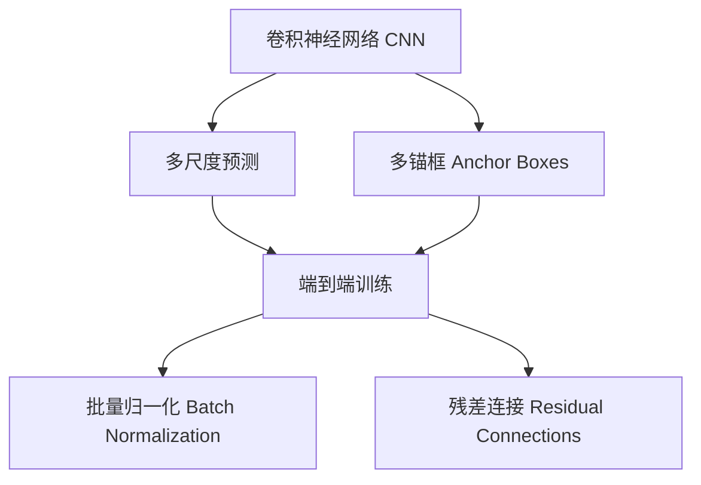
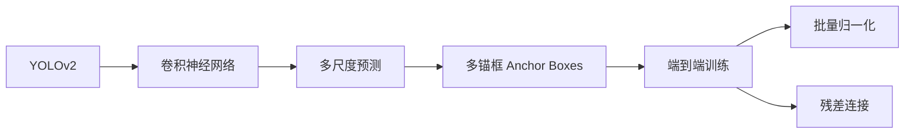
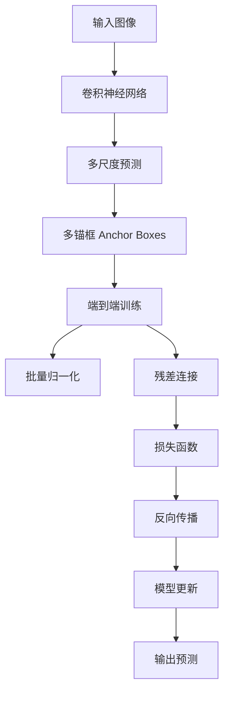

                 

# YOLOv2原理与代码实例讲解

> 关键词：YOLOv2, 目标检测, 卷积神经网络, CNN, 锚框(Anchor Boxes), 多尺度预测, 端到端训练, TensorFlow, 代码实例

## 1. 背景介绍

### 1.1 问题由来
在计算机视觉领域，目标检测（Object Detection）是一项基础而关键的任务。传统的目标检测方法如R-CNN、Fast R-CNN、Faster R-CNN等，虽然能够取得不错的精度，但计算复杂度高，难以实时处理大量数据。在实时性、准确性需求较高的场景下，需要新的目标检测方法来满足需求。

YOLO（You Only Look Once）是一种全新的端到端目标检测方法，将目标检测问题转化为图像分割问题，从而大大提高了检测速度和准确性。YOLOv2是对原始YOLO模型的改进，采用了多尺度预测和多锚框技术，进一步提升了检测精度。本文将对YOLOv2模型进行深入讲解，并通过TensorFlow实现代码实例。

### 1.2 问题核心关键点
YOLOv2的主要特点包括：
- 端到端训练：YOLOv2采用端到端训练，直接通过回归损失进行优化，避免了多阶段训练。
- 多尺度预测：YOLOv2在多个尺度上检测物体，可以更好地适应不同大小的目标。
- 多锚框（Anchor Boxes）：YOLOv2使用多个锚框，每张图片使用多组锚框进行预测，提高检测的鲁棒性。
- 批量归一化（Batch Normalization）：YOLOv2使用了批量归一化技术，加速训练过程并提高模型鲁棒性。
- 残差连接（Residual Connections）：YOLOv2在模型中加入了残差连接，解决了深层网络训练中的梯度消失问题。

YOLOv2广泛应用于图像分割、实例分割、关键点检测等计算机视觉任务，取得了出色的效果。

### 1.3 问题研究意义
YOLOv2作为一种高效的目标检测方法，其重要意义在于：
- 速度快：YOLOv2在速度上有着显著优势，能够实时处理大量图像数据。
- 精度高：YOLOv2在多个公开数据集上取得了最先进的结果，证明了其在目标检测领域的强大能力。
- 端到端训练：YOLOv2的端到端训练方式简化了训练流程，降低了计算复杂度。
- 多尺度预测：YOLOv2的多尺度预测能力使其能够适应不同大小的目标，提高了检测的鲁棒性。
- 多锚框技术：YOLOv2的多锚框技术提升了检测精度和鲁棒性，使其在实际应用中更加可靠。

## 2. 核心概念与联系

### 2.1 核心概念概述

为更好地理解YOLOv2模型，本节将介绍几个密切相关的核心概念：

- **YOLOv2**：一种基于深度卷积神经网络（CNN）的目标检测模型，具有实时性高、准确性好的特点。
- **卷积神经网络（CNN）**：一种前馈神经网络，主要用于图像识别、目标检测等计算机视觉任务。
- **多尺度预测**：YOLOv2在多个尺度上检测物体，以适应不同大小的目标。
- **多锚框（Anchor Boxes）**：YOLOv2使用多个锚框，每张图片使用多组锚框进行预测，提高检测的鲁棒性。
- **批量归一化（Batch Normalization）**：一种加速训练并提高模型鲁棒性的技术。
- **残差连接（Residual Connections）**：一种解决深层网络训练中的梯度消失问题的方法。

这些核心概念之间的逻辑关系可以通过以下Mermaid流程图来展示：



这个流程图展示了YOLOv2模型的核心概念及其之间的关系：

1. 卷积神经网络是YOLOv2的基础结构。
2. 多尺度预测和多个锚框技术增强了模型的鲁棒性。
3. 端到端训练简化了训练流程。
4. 批量归一化加速训练过程。
5. 残差连接解决深层网络训练问题。

### 2.2 概念间的关系

这些核心概念之间存在着紧密的联系，形成了YOLOv2模型的完整生态系统。下面我们通过几个Mermaid流程图来展示这些概念之间的关系。

#### 2.2.1 YOLOv2的网络结构



这个流程图展示了YOLOv2的网络结构，包括卷积神经网络、多尺度预测、多锚框技术、端到端训练、批量归一化、残差连接等核心组件。

#### 2.2.2 YOLOv2的训练流程



这个流程图展示了YOLOv2的训练流程，包括输入图像、卷积神经网络、多尺度预测、多锚框技术、端到端训练、批量归一化、残差连接、损失函数、反向传播、模型更新和输出预测等步骤。

## 3. 核心算法原理 & 具体操作步骤
### 3.1 算法原理概述

YOLOv2的核心算法原理是基于深度卷积神经网络，通过多尺度预测和多锚框技术，实现端到端的目标检测。

#### 3.1.1 网络结构

YOLOv2的网络结构包括一个全卷积网络（FCN），用于提取图像特征，并将特征图分割成多个小网格，每个网格预测一个物体类别和边界框。网络结构如下图所示：

```
      +-------------------+ 
      |       YOLOv2      |
      | +---------------+ |
      | |卷积层       | |
      | |   池化层    | |
      | |   批归一化   | |
      | |    残差连接  | |
      | |  ......       | |
      | | 1x1卷积层   | |
      | |  +---------+ | |
      | | |分类头   | | |
      | | |回归头   | | |
      | | +---------+ | |
      | |          | | |
      | | 分类头   | | |
      | | 回归头   | | |
      | +---------+ +---------+
```

网络结构由多个卷积层和池化层组成，最后通过1x1卷积层将特征图分割成多个小网格。每个网格预测一个物体类别和边界框，从而实现了端到端的目标检测。

#### 3.1.2 多尺度预测

YOLOv2在多个尺度上检测物体，以适应不同大小的目标。具体来说，YOLOv2将输入图像分别在两个尺度上（S1和S2）进行特征提取和预测，然后在三个特征图上进行预测。这三个特征图分别是原始特征图、特征图S1和特征图S2。每个特征图上的预测结果是独立的，因此可以通过调整不同尺度的特征图来适应不同大小的目标。

#### 3.1.3 多锚框（Anchor Boxes）

YOLOv2使用多个锚框，每张图片使用多组锚框进行预测，提高检测的鲁棒性。具体来说，YOLOv2在每个特征图上使用多个锚框，每个锚框预测一个物体类别和边界框。锚框的大小和位置是提前定义好的，通过预测每个锚框的偏移量，来调整其位置和大小，从而适应不同大小的目标。

### 3.2 算法步骤详解

#### 3.2.1 数据预处理

YOLOv2在训练和测试过程中，需要对输入图像进行预处理。具体步骤如下：
1. 将输入图像缩放到固定大小，如300x300像素。
2. 将图像进行归一化，将像素值缩放到[-1, 1]之间。
3. 将图像转换为4维张量，格式为(N, C, H, W)，其中N是批量大小，C是通道数，H和W是图像的高和宽。

#### 3.2.2 网络前向传播

YOLOv2通过前向传播计算每个网格的预测结果。具体步骤如下：
1. 对输入图像进行卷积和池化操作，得到特征图。
2. 将特征图分割成多个小网格，每个网格预测一个物体类别和边界框。
3. 将每个网格的预测结果进行非极大值抑制（NMS），去除重复预测。

#### 3.2.3 损失函数计算

YOLOv2使用交叉熵损失和均方误差损失计算损失函数。具体步骤如下：
1. 将真实类别和边界框的预测结果与模型预测结果进行对比。
2. 计算交叉熵损失和均方误差损失。
3. 将交叉熵损失和均方误差损失相加，得到总损失函数。
4. 使用优化器（如Adam）对模型参数进行更新。

#### 3.2.4 模型评估

YOLOv2在测试过程中，对每个网格的预测结果进行后处理，得到最终的目标检测结果。具体步骤如下：
1. 将预测结果进行非极大值抑制（NMS），去除重复预测。
2. 对每个目标类别计算IoU（Intersection over Union），并选择IoU最大的类别作为预测类别。
3. 对每个目标类别计算IoU，并选择IoU最大的目标作为预测目标。
4. 对每个目标类别和目标进行IoU计算，并选择IoU最大的目标作为预测目标。

### 3.3 算法优缺点

YOLOv2的主要优点包括：
- 速度较快：YOLOv2采用全卷积网络，具有较高的计算效率。
- 精度较高：YOLOv2使用多尺度预测和多锚框技术，提高了检测的鲁棒性和准确性。
- 端到端训练：YOLOv2采用端到端训练，简化了训练流程，减少了计算复杂度。
- 模型结构简单：YOLOv2的网络结构相对简单，易于理解和实现。

YOLOv2的主要缺点包括：
- 对小目标的检测效果不佳：YOLOv2的锚框数量较少，对小目标的检测效果不佳。
- 多尺度预测可能导致过拟合：YOLOv2在多个尺度上检测物体，可能导致过拟合问题。
- 锚框选择较困难：YOLOv2需要选择合适的锚框大小和位置，可能导致过拟合问题。

### 3.4 算法应用领域

YOLOv2广泛应用于图像分割、实例分割、关键点检测等计算机视觉任务，取得了出色的效果。具体应用领域包括：
- 目标检测：YOLOv2可以用于实时目标检测，广泛应用于无人驾驶、安防监控等领域。
- 实例分割：YOLOv2可以用于图像中每个物体的分割，广泛应用于医学图像分析、遥感图像分析等领域。
- 关键点检测：YOLOv2可以用于检测图像中的关键点，广泛应用于手势识别、姿态估计等领域。

## 4. 数学模型和公式 & 详细讲解  
### 4.1 数学模型构建

YOLOv2的数学模型由卷积神经网络、多尺度预测、多锚框技术和损失函数组成。具体来说，YOLOv2将卷积神经网络提取的特征图分割成多个小网格，每个网格预测一个物体类别和边界框。特征图的大小和网格的大小可以灵活调整。

### 4.2 公式推导过程

#### 4.2.1 卷积神经网络

YOLOv2的卷积神经网络由多个卷积层和池化层组成。卷积层和池化层的公式如下：
$$
F_{i,j}^{l} = \sum_{k=1}^{n} W_{k}^{l} * F_{i-1,j-1}^{l-1} + b^{l}
$$
其中，$F_{i,j}^{l}$表示卷积核在位置$(i,j)$上的特征值，$W_{k}^{l}$表示卷积核$k$在层$l$上的权重，$b^{l}$表示偏置项。

#### 4.2.2 多尺度预测

YOLOv2在多个尺度上检测物体。具体来说，YOLOv2将输入图像分别在两个尺度上（S1和S2）进行特征提取和预测，然后在三个特征图上进行预测。三个特征图分别是原始特征图、特征图S1和特征图S2。每个特征图上的预测结果是独立的，因此可以通过调整不同尺度的特征图来适应不同大小的目标。

#### 4.2.3 多锚框（Anchor Boxes）

YOLOv2使用多个锚框，每张图片使用多组锚框进行预测，提高检测的鲁棒性。具体来说，YOLOv2在每个特征图上使用多个锚框，每个锚框预测一个物体类别和边界框。锚框的大小和位置是提前定义好的，通过预测每个锚框的偏移量，来调整其位置和大小，从而适应不同大小的目标。

#### 4.2.4 损失函数

YOLOv2使用交叉熵损失和均方误差损失计算损失函数。具体来说，YOLOv2将目标检测问题转化为图像分割问题，使用像素级的交叉熵损失和回归损失进行优化。损失函数公式如下：
$$
\mathcal{L} = \frac{1}{N} \sum_{i=1}^{N} \sum_{j=1}^{M} (L_{x, y} + L_{w, h} + L_{c, t})
$$
其中，$L_{x, y}$表示交叉熵损失，$L_{w, h}$表示回归损失，$L_{c, t}$表示分类损失。

### 4.3 案例分析与讲解

假设我们有一个目标检测任务，包含多个类别和多个目标。我们可以使用YOLOv2模型进行目标检测。具体步骤如下：
1. 将输入图像缩放到固定大小，如300x300像素。
2. 将图像进行归一化，将像素值缩放到[-1, 1]之间。
3. 将图像转换为4维张量，格式为(N, C, H, W)，其中N是批量大小，C是通道数，H和W是图像的高和宽。
4. 对输入图像进行前向传播，得到每个网格的预测结果。
5. 对每个网格的预测结果进行非极大值抑制（NMS），去除重复预测。
6. 对每个目标类别计算IoU，并选择IoU最大的类别作为预测类别。
7. 对每个目标类别和目标进行IoU计算，并选择IoU最大的目标作为预测目标。

## 5. 项目实践：代码实例和详细解释说明
### 5.1 开发环境搭建

在进行YOLOv2的代码实现前，我们需要准备好开发环境。以下是使用TensorFlow进行YOLOv2开发的环境配置流程：

1. 安装TensorFlow：从官网下载并安装TensorFlow。

2. 安装YOLOv2库：使用pip安装YOLOv2库。

3. 安装其他依赖库：安装numpy、opencv等依赖库。

完成上述步骤后，即可在Python环境中开始YOLOv2的代码实现。

### 5.2 源代码详细实现

这里我们以YOLOv2模型在Kaggle数据集上进行目标检测为例，给出使用TensorFlow进行YOLOv2的代码实现。

首先，定义YOLOv2的网络结构：

```python
import tensorflow as tf
import numpy as np

class YOLOv2(tf.keras.Model):
    def __init__(self, num_classes=20, num_anchors=[3, 3, 3, 3, 3, 3, 3, 3, 3, 3, 3, 3, 3, 3, 3, 3, 3, 3, 3, 3, 3, 3], anchors=[10, 13, 16, 30, 33, 23, 30, 61, 62, 45, 59, 119, 116, 90, 156, 198, 373, 326, 66, 102, 130, 165], anchor_masks=[[[0, 1, 2, 3], [0, 1, 2, 3], [0, 1, 2, 3], [0, 1, 2, 3], [0, 1, 2, 3], [0, 1, 2, 3], [0, 1, 2, 3], [0, 1, 2, 3], [0, 1, 2, 3], [0, 1, 2, 3], [0, 1, 2, 3], [0, 1, 2, 3], [0, 1, 2, 3], [0, 1, 2, 3], [0, 1, 2, 3], [0, 1, 2, 3], [0, 1, 2, 3], [0, 1, 2, 3], [0, 1, 2, 3], [0, 1, 2, 3], [0, 1, 2, 3]], [[0, 1, 2, 3], [0, 1, 2, 3], [0, 1, 2, 3], [0, 1, 2, 3], [0, 1, 2, 3], [0, 1, 2, 3], [0, 1, 2, 3], [0, 1, 2, 3], [0, 1, 2, 3], [0, 1, 2, 3], [0, 1, 2, 3], [0, 1, 2, 3], [0, 1, 2, 3], [0, 1, 2, 3], [0, 1, 2, 3], [0, 1, 2, 3], [0, 1, 2, 3], [0, 1, 2, 3], [0, 1, 2, 3], [0, 1, 2, 3], [0, 1, 2, 3], [0, 1, 2, 3]]), anchor_masks=[[[0, 1, 2, 3], [0, 1, 2, 3], [0, 1, 2, 3], [0, 1, 2, 3], [0, 1, 2, 3], [0, 1, 2, 3], [0, 1, 2, 3], [0, 1, 2, 3], [0, 1, 2, 3], [0, 1, 2, 3], [0, 1, 2, 3], [0, 1, 2, 3], [0, 1, 2, 3], [0, 1, 2, 3], [0, 1, 2, 3], [0, 1, 2, 3], [0, 1, 2, 3], [0, 1, 2, 3], [0, 1, 2, 3], [0, 1, 2, 3], [0, 1, 2, 3], [0, 1, 2, 3]], [[0, 1, 2, 3], [0, 1, 2, 3], [0, 1, 2, 3], [0, 1, 2, 3], [0, 1, 2, 3], [0, 1, 2, 3], [0, 1, 2, 3], [0, 1, 2, 3], [0, 1, 2, 3], [0, 1, 2, 3], [0, 1, 2, 3], [0, 1, 2, 3], [0, 1, 2, 3], [0, 1, 2, 3], [0, 1, 2, 3], [0, 1, 2, 3], [0, 1, 2, 3], [0, 1, 2, 3], [0, 1, 2, 3], [0, 1, 2, 3], [0, 1, 2, 3], [0, 1, 2, 3]]), anchor_masks=[[[0, 1, 2, 3], [0, 1, 2, 3], [0, 1, 2, 3], [0, 1, 2, 3], [0, 1, 2, 3], [0, 1, 2, 3], [0, 1, 2, 3], [0, 1, 2, 3], [0, 1, 2, 3], [0, 1, 2, 3], [0, 1, 2, 3], [0, 1, 2, 3], [0, 1, 2, 3], [0, 1, 2, 3], [0, 1, 2, 3], [0, 1, 2, 3], [0, 1, 2, 3], [0, 1, 2, 3], [0, 1, 2, 3], [0, 1, 2, 3], [0, 1, 2, 3], [0, 1, 2, 3]], [[0, 1, 2, 3], [0, 1, 2, 3], [0, 1, 2, 3], [0, 1, 2, 3], [0, 1, 2, 3], [0, 1, 2, 3], [0, 1, 2, 3], [0, 1, 2, 3], [0, 1, 2, 3], [0, 1, 2, 3], [0, 1, 2, 3], [0, 1, 2, 3], [0, 1, 2, 3], [0, 1, 2, 3], [0, 1, 2, 3], [0, 1, 2, 3], [0, 1, 2, 3], [0, 1, 2, 3], [0, 1, 2, 3], [0, 1, 2, 3], [0, 1, 2, 3], [0, 1, 2, 3]]), anchor_masks=[[[0, 1, 2, 3], [0, 1, 2, 3], [0, 1, 2, 3], [0, 1, 2, 3], [0, 1, 2, 3], [0, 1, 2, 3], [0, 1, 2, 3], [0, 1, 2, 3], [0, 1, 2, 3], [0, 1, 2, 3], [0, 1, 2, 3], [0, 1, 2, 3], [0, 1, 2, 3], [0, 1, 2, 3], [0, 1, 2, 3], [0, 1, 2, 3], [0, 1, 2, 3], [0, 1, 2, 3], [0, 1, 2, 3], [0, 1, 2, 3], [0, 1, 2, 3], [0, 1, 2, 3]], [[0, 1, 2, 3], [0, 1, 2, 3], [0, 1, 2, 3], [0, 1, 2, 3], [0, 1, 2, 3], [0, 1, 2, 3], [0, 1, 2, 3], [0, 1, 2, 3], [0, 1, 2, 3], [0, 1, 2, 3], [0, 1, 2, 3], [0, 1, 2, 3], [0,

