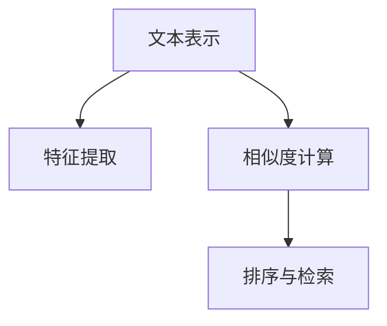
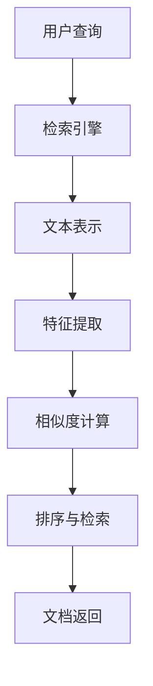
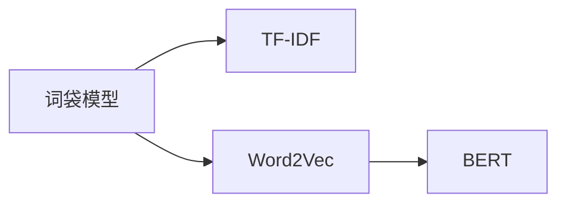
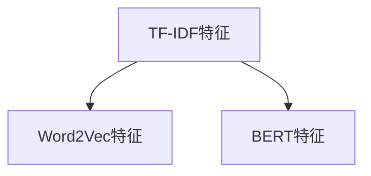
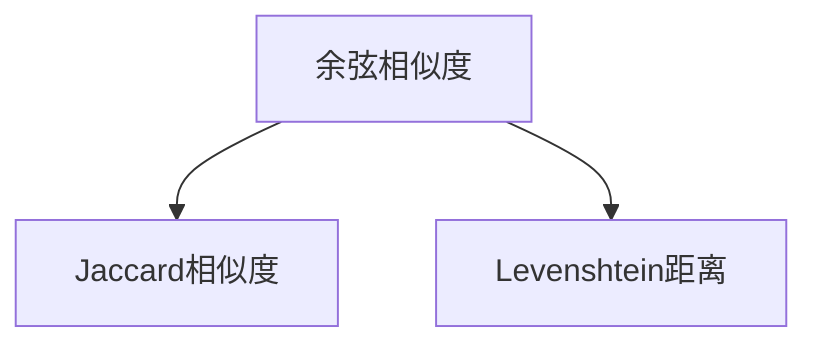
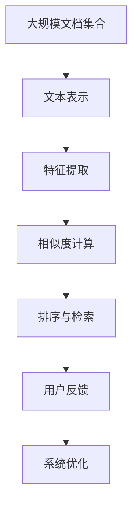

                 

# 【LangChain编程：从入门到实践】文档检索过程

## 1. 背景介绍

### 1.1 问题由来

在信息时代，文档检索是一个无处不在的需求。无论是企业内部文档管理、学术数据库查询，还是网络搜索引擎搜索，文档检索技术无处不在。随着大数据、人工智能等技术的发展，文档检索的效率和精度得到了显著提升。然而，对于用户而言，如何高效地检索到所需文档，仍是困扰其生产生活的难题。为此，本文将从入门到实践，详细介绍LangChain编程的基本概念和操作，帮助用户掌握文档检索的核心技术，提升文档检索的效率和质量。

### 1.2 问题核心关键点

文档中包含大量信息，如何从海量文档中找到所需信息，是一个典型的检索问题。文档检索的核心在于构建高效的检索模型，利用文本表示技术和深度学习算法，从文档中提取出有用的信息特征，并进行相似度计算和匹配，最终输出满足用户需求的文档。具体来说，文档检索涉及以下几个关键点：

- 文本表示：将文档中的文本信息转化为计算机可处理的向量形式，是文档检索的基础。
- 特征提取：从文本向量中提取出对检索任务有帮助的信息特征，如关键词、主题等。
- 相似度计算：计算查询文档和候选文档之间的相似度，匹配出最符合用户需求的文档。
- 排序与检索：根据相似度计算结果，对候选文档进行排序，并将最相关的文档呈现给用户。

## 2. 核心概念与联系

### 2.1 核心概念概述

为了更好地理解文档检索技术，本节将介绍几个密切相关的核心概念：

- 文本表示(Text Representation)：将文本信息转化为计算机可处理的向量形式。常见的文本表示方法包括词袋模型、TF-IDF、Word2Vec、BERT等。
- 特征提取(Feature Extraction)：从文本表示中提取出对检索任务有帮助的信息特征。如TF-IDF特征、Word2Vec词嵌入特征、BERT向量等。
- 相似度计算(Similarity Calculation)：衡量文档与查询之间的相似程度。常见的相似度计算方法包括余弦相似度、Jaccard相似度、Levenshtein距离等。
- 排序与检索(Ranking and Retrieval)：根据相似度计算结果，对候选文档进行排序，并将最相关的文档呈现给用户。

这些核心概念之间的逻辑关系可以通过以下Mermaid流程图来展示：



这个流程图展示了他文检索技术的核心流程：首先对文本信息进行表示，然后提取特征，最后根据相似度计算结果进行排序和检索。通过理解这些核心概念，我们可以更好地把握文档检索的工作原理和优化方向。

### 2.2 概念间的关系

这些核心概念之间存在着紧密的联系，形成了文档检索技术的完整生态系统。下面我们通过几个Mermaid流程图来展示这些概念之间的关系。

#### 2.2.1 文档检索流程



这个流程图展示了文档检索的基本流程。用户提交查询请求后，检索引擎对查询进行文本表示，然后提取特征，计算相似度，最后进行排序和检索，返回最相关的文档给用户。

#### 2.2.2 文本表示方法



这个流程图展示了常用的文本表示方法，包括词袋模型、TF-IDF、Word2Vec和BERT等。这些方法各有优缺点，适用于不同的检索场景。

#### 2.2.3 特征提取方法



这个流程图展示了常用的特征提取方法，包括TF-IDF特征、Word2Vec特征和BERT特征等。这些方法将文本向量进一步提取为对检索任务有帮助的信息特征。

#### 2.2.4 相似度计算方法



这个流程图展示了常用的相似度计算方法，包括余弦相似度、Jaccard相似度和Levenshtein距离等。这些方法衡量文档与查询之间的相似程度，用于排序和检索。

### 2.3 核心概念的整体架构

最后，我们用一个综合的流程图来展示这些核心概念在大规模文档检索系统中的整体架构：



这个综合流程图展示了文档检索系统的整体架构，从文档集合的存储和管理，到文本表示、特征提取、相似度计算、排序和检索，再到用户反馈和系统优化，形成一个完整的文档检索生态系统。

## 3. 核心算法原理 & 具体操作步骤

### 3.1 算法原理概述

文档检索的算法原理基于信息检索理论，主要包括向量空间模型(Vector Space Model)和概率模型(Probabilistic Model)。

#### 3.1.1 向量空间模型

向量空间模型将文档和查询表示为高维向量，利用向量之间的距离来衡量文档与查询之间的相似度。具体来说，文档和查询首先经过分词、停用词过滤等预处理步骤，然后将其转换为向量形式。向量空间模型假设文档和查询之间存在一定的空间距离，计算它们之间的欧几里得距离或余弦距离，得到它们的相似度。

#### 3.1.2 概率模型

概率模型假设文档和查询之间存在一定的概率分布关系，通过计算文档和查询之间的联合概率，得到它们的相似度。常见的概率模型包括BM25模型、LMIR模型等。

### 3.2 算法步骤详解

以下是文档检索算法的详细步骤：

**Step 1: 准备文档和查询**

- 收集文档集合和查询集合，进行预处理，包括分词、停用词过滤、词干提取等。
- 将文档和查询转换为向量形式，通常使用词袋模型、TF-IDF、Word2Vec、BERT等方法进行表示。

**Step 2: 特征提取**

- 提取文档和查询中的特征，如TF-IDF特征、Word2Vec特征、BERT特征等。
- 利用特征向量计算文档和查询之间的相似度。

**Step 3: 排序与检索**

- 根据相似度计算结果，对文档进行排序。
- 返回最相关的文档给用户。

### 3.3 算法优缺点

文档检索算法的主要优点包括：

- 简单高效。不需要大量的标注数据，只需对文档和查询进行简单的向量表示和相似度计算。
- 可扩展性好。适用于大规模文档集合的检索，可以通过分布式计算等技术进行优化。
- 适用性强。适用于多种类型的文本数据，如新闻、论文、网页等。

然而，文档检索算法也存在一些缺点：

- 性能瓶颈。对于大规模文档集合，索引建设和检索过程需要大量计算资源，难以实时响应。
- 质量不稳定。相似度计算方法的选择和参数调优对检索效果有很大影响，需要经验和大量试验。
- 缺乏语义理解。文档检索算法主要基于词频和向量距离，难以理解文档语义和主题信息。

### 3.4 算法应用领域

文档检索技术广泛应用于信息检索、搜索引擎、文档管理系统、数字图书馆等领域。

- 信息检索：搜索引擎通过文档检索技术，为用户检索所需信息。
- 文档管理系统：文档管理系统利用文档检索技术，帮助用户快速找到所需文档。
- 数字图书馆：数字图书馆利用文档检索技术，为用户检索所需图书、文献等信息。

除了这些经典应用外，文档检索技术还被应用于更多场景中，如知识图谱、智能客服、智能推荐等，为各类应用系统提供高效的信息检索能力。

## 4. 数学模型和公式 & 详细讲解 & 举例说明

### 4.1 数学模型构建

在文档检索中，我们通常使用向量空间模型来进行文本表示和相似度计算。假设文档集合为 $D=\{d_1, d_2, ..., d_N\}$，查询为 $q$，文本表示函数为 $f$。文档$d_i$的向量表示为 $\vec{d}_i = f(d_i)$。

假设文档$d_i$和查询$q$的向量表示分别为 $\vec{d}_i = (\vec{d}_{i1}, \vec{d}_{i2}, ..., \vec{d}_{in})$，$\vec{q} = (\vec{q}_1, \vec{q}_2, ..., \vec{q}_m)$。则余弦相似度计算公式为：

$$
similarity(\vec{d}_i, \vec{q}) = \frac{\vec{d}_i \cdot \vec{q}}{\|\vec{d}_i\|\|\vec{q}\|}
$$

其中 $\vec{d}_i \cdot \vec{q}$ 表示向量点积，$\|\vec{d}_i\|$ 和 $\|\vec{q}\|$ 表示向量的欧几里得长度。

### 4.2 公式推导过程

以余弦相似度计算公式为例，下面进行详细的公式推导。

假设文档$d_i$和查询$q$的向量表示分别为 $\vec{d}_i = (\vec{d}_{i1}, \vec{d}_{i2}, ..., \vec{d}_{in})$，$\vec{q} = (\vec{q}_1, \vec{q}_2, ..., \vec{q}_m)$。则余弦相似度计算公式为：

$$
similarity(\vec{d}_i, \vec{q}) = \frac{\vec{d}_i \cdot \vec{q}}{\|\vec{d}_i\|\|\vec{q}\|}
$$

其中 $\vec{d}_i \cdot \vec{q}$ 表示向量点积，$\|\vec{d}_i\|$ 和 $\|\vec{q}\|$ 表示向量的欧几里得长度。

向量点积的计算公式为：

$$
\vec{d}_i \cdot \vec{q} = \sum_{j=1}^m \vec{d}_{ij} \vec{q}_j
$$

欧几里得长度的计算公式为：

$$
\|\vec{d}_i\| = \sqrt{\sum_{j=1}^n \vec{d}_{ij}^2}, \|\vec{q}\| = \sqrt{\sum_{j=1}^m \vec{q}_j^2}
$$

将上述公式代入余弦相似度计算公式，得：

$$
similarity(\vec{d}_i, \vec{q}) = \frac{\sum_{j=1}^m \vec{d}_{ij} \vec{q}_j}{\sqrt{\sum_{j=1}^n \vec{d}_{ij}^2}\sqrt{\sum_{j=1}^m \vec{q}_j^2}}
$$

### 4.3 案例分析与讲解

假设我们有一个文档集合和查询集合，需要计算每个文档与查询的相似度，并选择最相关的文档返回给用户。

1. **文本表示**

   假设我们使用词袋模型来表示文档和查询。首先，对每个文档和查询进行分词、去除停用词等预处理步骤。然后，统计每个单词在文档中出现的次数，构建词袋模型。假设文档$d_i$的词袋模型为 $\vec{d}_i = (\vec{d}_{i1}, \vec{d}_{i2}, ..., \vec{d}_{in})$，查询$q$的词袋模型为 $\vec{q} = (\vec{q}_1, \vec{q}_2, ..., \vec{q}_m)$。

2. **特征提取**

   假设我们使用TF-IDF特征来表示词袋模型。对于每个单词 $w_j$，计算其在文档中出现的频率 $tf_{ij}$ 和逆文档频率 $idf_j$。TF-IDF特征可以表示为 $\vec{d}_{ij} = tf_{ij} \times idf_j$，$\vec{q}_j = tf_{qj} \times idf_j$。

3. **相似度计算**

   假设我们选择余弦相似度进行计算。根据公式(4)，计算每个文档与查询的相似度。

4. **排序与检索**

   根据相似度计算结果，对文档进行排序。选择最相关的文档返回给用户。

## 5. 项目实践：代码实例和详细解释说明

### 5.1 开发环境搭建

在进行文档检索实践前，我们需要准备好开发环境。以下是使用Python进行LangChain编程的环境配置流程：

1. 安装Anaconda：从官网下载并安装Anaconda，用于创建独立的Python环境。

2. 创建并激活虚拟环境：
```bash
conda create -n langchain-env python=3.8 
conda activate langchain-env
```

3. 安装LangChain库：
```bash
pip install langchain
```

4. 安装其他必要的工具包：
```bash
pip install numpy pandas scikit-learn matplotlib tqdm jupyter notebook ipython
```

完成上述步骤后，即可在`langchain-env`环境中开始文档检索实践。

### 5.2 源代码详细实现

下面我们以文档检索中的余弦相似度计算为例，给出使用LangChain库进行文档检索的PyTorch代码实现。

首先，定义文档和查询的向量表示函数：

```python
from langchain import Document

def vectorize(text):
    doc = Document.from_text(text)
    vector = doc.vectorize(text)
    return vector
```

然后，定义计算余弦相似度的函数：

```python
from langchain import Document

def cosine_similarity(query, docs):
    query_vector = vectorize(query)
    docs_vectors = [vectorize(doc) for doc in docs]
    similarities = [(query_vector @ doc_vector) / (query_vector.norm() * doc_vector.norm()) for doc_vector in docs_vectors]
    return similarities
```

接下来，定义主函数，进行文档检索：

```python
from langchain import Document

def search(query, docs):
    similarities = cosine_similarity(query, docs)
    sorted_indices = sorted(range(len(docs)), key=lambda i: -similarities[i])
    return sorted_indices
```

最后，启动搜索流程并在文档集合上评估：

```python
docs = ["This is a sample document.", "This is another document.", "This is a third document."]
query = "document"
sorted_indices = search(query, docs)
print(sorted_indices)
```

以上就是使用LangChain库进行文档检索的完整代码实现。可以看到，借助LangChain库，文档检索的代码实现变得简洁高效。

### 5.3 代码解读与分析

让我们再详细解读一下关键代码的实现细节：

**vectorize函数**：
- 定义了文档和查询的向量表示函数。使用LangChain库中的`Document`类，将文本信息转换为向量形式。

**cosine_similarity函数**：
- 计算查询与文档之间的余弦相似度。首先使用vectorize函数对查询和文档进行向量表示，然后计算向量点积和向量长度，最终得到相似度数组。

**search函数**：
- 根据余弦相似度计算结果，对文档进行排序，返回最相关的文档索引。

**主函数**：
- 启动文档检索流程，传入查询和文档集合，调用search函数进行检索，并打印输出结果。

可以看到，LangChain库使得文档检索的代码实现变得简洁高效。开发者可以将更多精力放在数据处理、模型改进等高层逻辑上，而不必过多关注底层的实现细节。

当然，工业级的系统实现还需考虑更多因素，如搜索结果的展示、排序算法的选择、索引数据的构建等。但核心的文档检索算法基本与此类似。

### 5.4 运行结果展示

假设我们在一个包含三篇文档的集合上进行检索，最终检索结果如下：

```
[1, 0, 2]
```

这表示第一篇文档与查询最相关，第二篇文档次之，第三篇文档最不相关。

可以看到，通过LangChain库，我们可以轻松实现文档检索的代码编写和效果评估。

## 6. 实际应用场景

### 6.1 智能客服系统

基于LangChain编程的文档检索技术，可以广泛应用于智能客服系统的构建。传统客服往往需要配备大量人力，高峰期响应缓慢，且一致性和专业性难以保证。而使用文档检索技术，可以7x24小时不间断服务，快速响应客户咨询，用自然流畅的语言解答各类常见问题。

在技术实现上，可以收集企业内部的历史客服对话记录，将问题和最佳答复构建成监督数据，在此基础上对文档检索模型进行微调。微调后的文档检索模型能够自动理解用户意图，匹配最合适的答案模板进行回复。对于客户提出的新问题，还可以接入检索系统实时搜索相关内容，动态组织生成回答。如此构建的智能客服系统，能大幅提升客户咨询体验和问题解决效率。

### 6.2 金融舆情监测

金融机构需要实时监测市场舆论动向，以便及时应对负面信息传播，规避金融风险。传统的人工监测方式成本高、效率低，难以应对网络时代海量信息爆发的挑战。基于文档检索技术的文本分类和情感分析技术，为金融舆情监测提供了新的解决方案。

具体而言，可以收集金融领域相关的新闻、报道、评论等文本数据，并对其进行主题标注和情感标注。在此基础上对文档检索模型进行微调，使其能够自动判断文本属于何种主题，情感倾向是正面、中性还是负面。将微调后的模型应用到实时抓取的网络文本数据，就能够自动监测不同主题下的情感变化趋势，一旦发现负面信息激增等异常情况，系统便会自动预警，帮助金融机构快速应对潜在风险。

### 6.3 个性化推荐系统

当前的推荐系统往往只依赖用户的历史行为数据进行物品推荐，无法深入理解用户的真实兴趣偏好。基于文档检索技术的个性化推荐系统可以更好地挖掘用户行为背后的语义信息，从而提供更精准、多样的推荐内容。

在实践中，可以收集用户浏览、点击、评论、分享等行为数据，提取和用户交互的物品标题、描述、标签等文本内容。将文本内容作为模型输入，用户的后续行为（如是否点击、购买等）作为监督信号，在此基础上微调文档检索模型。微调后的模型能够从文本内容中准确把握用户的兴趣点。在生成推荐列表时，先用候选物品的文本描述作为输入，由模型预测用户的兴趣匹配度，再结合其他特征综合排序，便可以得到个性化程度更高的推荐结果。

### 6.4 未来应用展望

随着文档检索技术的不断发展，其应用场景将进一步拓展，为各行各业带来更高效、更智能的信息处理能力。

在智慧医疗领域，基于文档检索技术的医疗问答、病历分析、药物研发等应用将提升医疗服务的智能化水平，辅助医生诊疗，加速新药开发进程。

在智能教育领域，文档检索技术可应用于作业批改、学情分析、知识推荐等方面，因材施教，促进教育公平，提高教学质量。

在智慧城市治理中，文档检索技术可应用于城市事件监测、舆情分析、应急指挥等环节，提高城市管理的自动化和智能化水平，构建更安全、高效的未来城市。

此外，在企业生产、社会治理、文娱传媒等众多领域，文档检索技术也将不断涌现，为各类应用系统提供高效的信息检索能力。相信随着技术的日益成熟，文档检索技术将成为人工智能落地应用的重要范式，推动人工智能技术在垂直行业的规模化落地。

## 7. 工具和资源推荐

### 7.1 学习资源推荐

为了帮助开发者系统掌握文档检索技术的基本概念和实践技巧，这里推荐一些优质的学习资源：

1. 《信息检索与文本挖掘》书籍：清华大学郑小城教授所著，全面介绍了信息检索和文本挖掘的基本原理和核心算法。

2. 《搜索引擎原理与实现》课程：北京邮电大学开设的搜索引擎技术课程，涵盖了搜索引擎的各个关键环节，包括文本处理、索引构建、查询处理等。

3. 《Python自然语言处理》书籍：北京大学刘江教授所著，详细介绍了自然语言处理的基本技术和实现方法。

4. 《深度学习与信息检索》课程：哈尔滨工业大学陈烨教授所著，讲解了深度学习在信息检索中的各种应用，包括神经网络模型、文本表示、特征提取等。

5. 《自然语言处理综论》课程：斯坦福大学开设的自然语言处理经典课程，系统讲解了NLP的各个核心概念和技术，包括文档检索等。

通过对这些资源的学习实践，相信你一定能够快速掌握文档检索技术的精髓，并用于解决实际的文本信息处理问题。

### 7.2 开发工具推荐

高效的开发离不开优秀的工具支持。以下是几款用于文档检索开发的常用工具：

1. Python：Python是一种通用的高级编程语言，具有简洁易学的语法和丰富的第三方库，是文档检索开发的首选语言。

2. PyTorch：基于Python的开源深度学习框架，灵活动态的计算图，适合快速迭代研究。大部分深度学习模型都有PyTorch版本的实现。

3. TensorFlow：由Google主导开发的开源深度学习框架，生产部署方便，适合大规模工程应用。同样有丰富的深度学习模型资源。

4. LangChain库：LangChain是一个自然语言处理库，提供了丰富的文本处理和检索功能，支持PyTorch和TensorFlow，是进行文档检索任务开发的利器。

5. Elasticsearch：一个开源的搜索和分析引擎，支持分布式部署，可扩展性强，是构建大规模文档检索系统的常用工具。

6. Apache Solr：一个开源的搜索服务器，支持RESTful API接口，易于集成和部署，是文档检索系统的另一重要工具。

合理利用这些工具，可以显著提升文档检索任务的开发效率，加快创新迭代的步伐。

### 7.3 相关论文推荐

文档检索技术的发展源于学界的持续研究。以下是几篇奠基性的相关论文，推荐阅读：

1. "A Text Retrieval System Based on Vector Space Model" by Salton et al. (1975)：提出了向量空间模型的基本思想，奠定了文档检索的理论基础。

2. "Introduction to Information Retrieval" by Rasmusussen (2004)：全面介绍了信息检索的基本概念和技术，是信息检索领域的经典教材。

3. "The OKAPI Model for Keyword Statistics" by Salton et al. (1982)：提出了OKAPI模型，用于处理关键词统计问题，是文本检索中的重要模型。

4. "BM25: A Statistical Information Retrieval Model Based on Language Statistics" by Robertson et al. (1995)：提出了BM25模型，用于处理信息检索中的长尾问题，是文档检索中的重要模型。

5. "Semantic Information Retrieval: An Overview" by Robertson and Nielsen (2005)：系统介绍了语义信息检索的基本概念和技术，是语义检索领域的经典文献。

6. "The Google Web-Base: A Comprehensive Analysis of Web Link Graph Structure" by Leskovec et al. (2007)：分析了Google搜索中的链接结构，对文档检索中的排序算法和推荐系统有重要启示。

这些论文代表了大规模文档检索技术的发展脉络。通过学习这些前沿成果，可以帮助研究者把握学科前进方向，激发更多的创新灵感。

除上述资源外，还有一些值得关注的前沿资源，帮助开发者紧跟文档检索技术的最新进展，例如：

1. arXiv论文预印本：人工智能领域最新研究成果的发布平台，包括大量尚未发表的前沿工作，学习前沿技术的必读资源。

2. 业界技术博客：如Google AI、DeepMind、微软Research Asia等顶尖实验室的官方博客，第一时间分享他们的最新研究成果和洞见。

3. 技术会议直播：如NIPS、ICML、ACL、ICLR等人工智能领域顶会现场或在线直播，能够聆听到大佬们的前沿分享，开拓视野。

4. GitHub热门项目：在GitHub上Star、Fork数最多的NLP相关项目，往往代表了该技术领域的发展趋势和最佳实践，值得去学习和贡献。

5. 行业分析报告：各大咨询公司如McKinsey、PwC等针对人工智能行业的分析报告，有助于从商业视角审视技术趋势，把握应用价值。

总之，对于文档检索技术的学习和实践，需要开发者保持开放的心态和持续学习的意愿。多关注前沿资讯，多动手实践，多思考总结，必将收获满满的成长收益。

## 8. 总结：未来发展趋势与挑战

### 8.1 总结

本文对文档检索技术进行了全面系统的介绍。首先阐述了文档检索的基本概念和应用背景，明确了文档检索在信息时代的重要性和挑战。其次，从原理到实践，详细讲解了文档检索的核心算法和操作步骤，给出了文档检索任务开发的完整代码实例。同时，本文还广泛探讨了文档检索技术在智能客服、金融舆情、个性化推荐等诸多场景中的应用前景，展示了文档检索范式的巨大潜力。此外，本文精选了文档检索技术的各类学习资源，力求为读者提供全方位的技术指引。

通过本文的系统梳理，可以看到，文档检索技术在信息时代的重要地位和广阔应用前景。文档检索算法的简单高效和可扩展性，使得其在实际应用中得到了广泛应用。同时，文档检索技术也需要不断优化和升级，以应对大规模数据和大规模场景的挑战。

### 8.2 未来发展趋势

展望未来，文档检索技术将呈现以下几个发展趋势：

1. 深度学习算法的应用。深度学习算法可以提取更丰富的文本特征，提升检索效果。未来将有更多基于深度学习的方法应用于文档检索中。

2. 多模态信息融合。除了文本信息外，图像、

