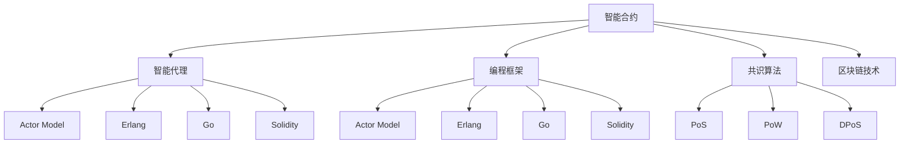
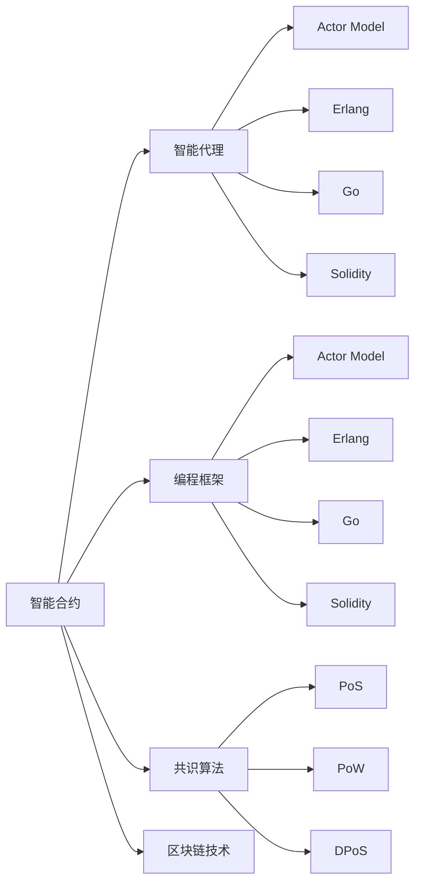
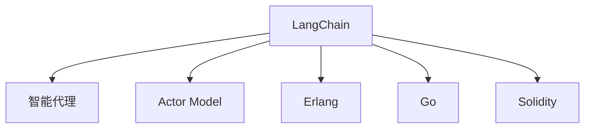
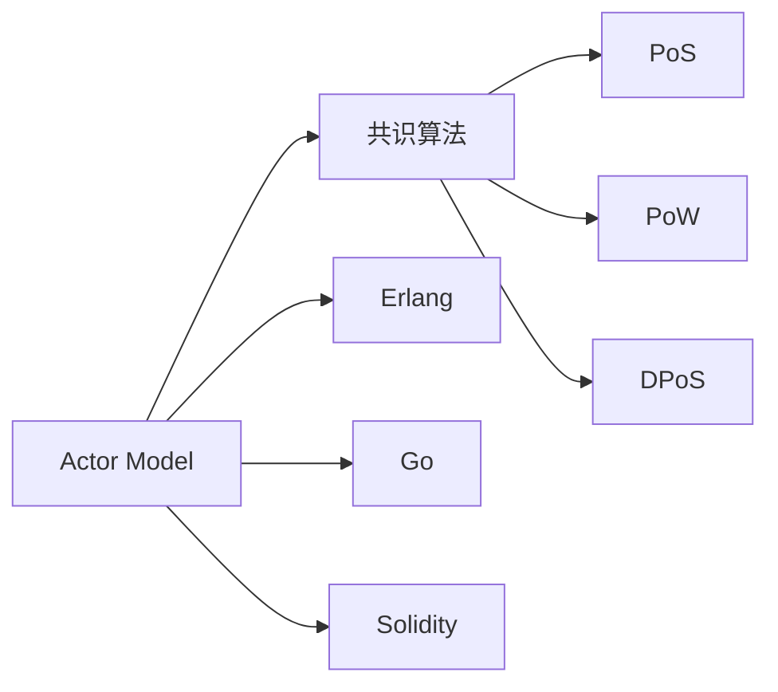
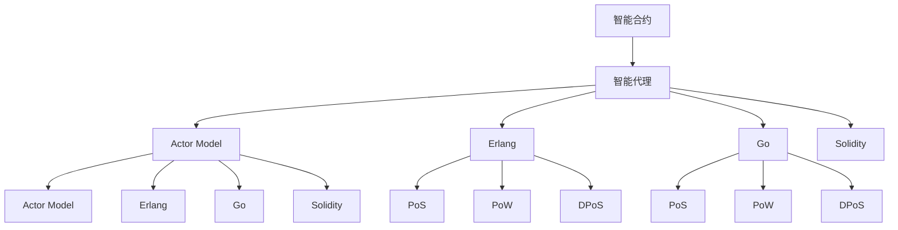

                 

# 【LangChain编程：从入门到实践】智能代理设计

> 关键词：智能代理, LangChain, 多智能体系统, 编程框架, 共识算法, 区块链技术

## 1. 背景介绍

### 1.1 问题由来
随着区块链技术的发展，智能合约的概念和应用逐渐兴起，并在金融、供应链、医疗等多个领域得到了实际应用。然而，传统的智能合约通常依赖于单一的代码逻辑，一旦出现漏洞或代码错误，可能造成无法挽回的损失。为了解决这个问题，研究者提出了一种新的智能合约形式——智能代理。

智能代理是一种多智能体系统，由一组预定义的行为逻辑组成，能够根据用户请求和环境变化自主决策。相比于传统智能合约，智能代理具备更高的灵活性和安全性，能够更好地适应复杂的业务场景和动态环境。然而，实现智能代理并非易事，需要开发者具备深厚的编程知识和设计能力。

### 1.2 问题核心关键点
智能代理的核心思想是将合约的执行逻辑转化为一个软件系统，通过编程语言来实现复杂的行为决策。智能代理的实现涉及多个关键技术，包括多智能体系统、编程框架、共识算法和区块链技术等。具体来说：

- 多智能体系统：智能代理由多个自治的智能体组成，每个智能体都有自己的行为逻辑和状态。通过协调各个智能体的决策，智能代理能够实现复杂的目标和策略。

- 编程框架：智能代理的实现需要依赖编程框架，用于定义智能体的行为逻辑和交互协议。常见的编程框架包括Actor Model、Erlang、Go、Solidity等。

- 共识算法：智能代理的运行需要依赖分布式共识算法，以确保所有智能体之间的数据同步和状态一致。常见的共识算法包括PoS、PoW、DPoS等。

- 区块链技术：智能代理通常运行在区块链网络上，利用区块链的不可篡改性和透明性，保障智能代理的可靠性和安全性。

### 1.3 问题研究意义
研究智能代理的编程框架和设计方法，对于拓展智能合约的应用范围，提升合约执行的灵活性和安全性，加速区块链技术的产业化进程，具有重要意义：

1. 降低开发成本。智能代理的实现可以基于现有的编程框架和共识算法，避免从头开发所需的复杂度和人力投入。

2. 提升合约执行的灵活性。智能代理的灵活行为逻辑可以适应各种业务场景，实现更加复杂的业务目标。

3. 保障合约执行的安全性。智能代理的各个智能体之间通过代码逻辑进行交互，避免了传统的单点失效问题，提高了合约的鲁棒性和可靠性。

4. 加快技术落地。智能代理的实现可以为区块链技术在各个行业的应用提供新的思路和方法，促进区块链技术的普及和应用。

5. 带来技术创新。智能代理的设计和编程方法催生了新的研究方向，如多智能体系统、共识算法、区块链编程等。

6. 增强系统可解释性。智能代理的设计和实现可以增强系统的透明度和可解释性，帮助用户更好地理解系统的运行机制和决策逻辑。

总之，智能代理的编程框架和设计方法对于提升区块链技术的灵活性和安全性，推动其在实际业务中的应用，具有重要意义。通过深入研究智能代理的实现技术，可以为区块链技术的未来发展提供新的方向和方法。

## 2. 核心概念与联系

### 2.1 核心概念概述

为更好地理解智能代理的编程框架和设计方法，本节将介绍几个密切相关的核心概念：

- 智能合约：区块链网络中的一种智能合约，具备自动执行和代码逻辑。

- 智能代理：一种多智能体系统，由一组自治的智能体组成，具备复杂的行为逻辑和决策能力。

- 编程框架：用于定义智能体的行为逻辑和交互协议的软件框架，常见的框架包括Actor Model、Erlang、Go、Solidity等。

- 共识算法：用于保障智能代理各智能体之间数据同步和状态一致的分布式算法，常见的算法包括PoS、PoW、DPoS等。

- LangChain：一种编程语言和框架，专门用于实现智能代理系统。

这些核心概念之间的逻辑关系可以通过以下Mermaid流程图来展示：



这个流程图展示了大语言模型微调过程中各个核心概念的关系和作用：

1. 智能合约是智能代理的基础，提供了基本的代码逻辑和执行环境。

2. 智能代理通过编程框架和共识算法，实现复杂的行为逻辑和分布式决策。

3. 编程框架和共识算法是智能代理实现的关键技术，支持智能代理的开发和运行。

4. LangChain是一种专门用于智能代理编程的框架，提供了丰富的功能和接口。

这些核心概念共同构成了智能代理系统的设计框架，使其能够在各种场景下发挥强大的决策和执行能力。通过理解这些核心概念，我们可以更好地把握智能代理的编程框架和设计方法。

### 2.2 概念间的关系

这些核心概念之间存在着紧密的联系，形成了智能代理系统的完整生态系统。下面我通过几个Mermaid流程图来展示这些概念之间的关系。

#### 2.2.1 智能合约与智能代理的关系



这个流程图展示了智能合约与智能代理之间的关系。智能合约是智能代理的基础，提供了基本的代码逻辑和执行环境。智能代理通过编程框架和共识算法，实现复杂的行为逻辑和分布式决策。

#### 2.2.2 LangChain与智能代理的关系



这个流程图展示了LangChain与智能代理之间的关系。LangChain是一种专门用于智能代理编程的框架，提供了丰富的功能和接口，支持智能代理的开发和运行。

#### 2.2.3 编程框架与共识算法的关系



这个流程图展示了编程框架与共识算法之间的关系。编程框架和共识算法是智能代理实现的关键技术，支持智能代理的开发和运行。

### 2.3 核心概念的整体架构

最后，我们用一个综合的流程图来展示这些核心概念在大语言模型微调过程中的整体架构：



这个综合流程图展示了从智能合约到智能代理，再到编程框架和共识算法的完整过程。智能合约首先提供了基本的代码逻辑和执行环境，智能代理通过编程框架和共识算法，实现复杂的行为逻辑和分布式决策。编程框架和共识算法是智能代理实现的关键技术，支持智能代理的开发和运行。最后，智能代理的实现可以通过LangChain等编程框架进行编程和调试。

## 3. 核心算法原理 & 具体操作步骤

### 3.1 算法原理概述

智能代理的编程框架和设计方法基于多智能体系统的原理，通过编程语言实现复杂的决策逻辑和行为逻辑。智能代理的实现主要分为两个步骤：首先是设计智能体的行为逻辑，其次是实现智能体的协调和交互协议。

智能体的行为逻辑可以基于编程框架进行定义，常见的编程框架包括Actor Model、Erlang、Go、Solidity等。这些框架提供了丰富的功能和接口，支持智能体的创建、管理和调度。

智能体的协调和交互协议则依赖于分布式共识算法，常见的共识算法包括PoS、PoW、DPoS等。共识算法通过协调智能体之间的数据同步和状态一致，保障智能代理的可靠性和安全性。

### 3.2 算法步骤详解

智能代理的实现涉及多个关键步骤，包括智能体的设计、编程框架的选择、共识算法的实现和智能体的协调与交互等。以下详细介绍这些步骤：

**Step 1: 设计智能体的行为逻辑**

智能体的行为逻辑是智能代理实现的核心，决定了智能代理的决策和执行能力。智能体的行为逻辑可以基于编程框架进行设计，常见的编程框架包括Actor Model、Erlang、Go、Solidity等。这些框架提供了丰富的功能和接口，支持智能体的创建、管理和调度。

智能体的行为逻辑主要包括以下几个方面：

1. 状态管理：智能体的状态可以基于数据结构进行管理，如状态机、事务管理器等。状态管理是智能代理的核心，决定了智能体的行为和决策。

2. 行为规则：智能体的行为规则可以基于编程语言进行定义，常见的编程语言包括Python、Go、Solidity等。行为规则是智能体的决策依据，决定了智能体的行为方式和执行路径。

3. 通信机制：智能体之间的通信机制可以基于编程框架进行设计，常见的通信机制包括消息队列、事件驱动、分布式数据库等。通信机制是智能代理的交互基础，决定了智能体之间的数据同步和状态一致。

**Step 2: 选择编程框架**

智能代理的实现依赖于编程框架，常见的编程框架包括Actor Model、Erlang、Go、Solidity等。这些框架提供了丰富的功能和接口，支持智能体的创建、管理和调度。

编程框架的选择应根据具体业务场景和需求进行，常见的选择包括：

1. Actor Model：Actor Model是一种基于消息传递的编程模型，适用于高并发和高并发的场景。Actor Model通过将系统拆分为多个自治的智能体，实现分布式计算和数据同步。

2. Erlang：Erlang是一种高并发和高并发的编程语言，支持Actor Model的实现。Erlang具备轻量级进程、高可靠性、低延迟等优势，适用于高性能的系统。

3. Go：Go是一种高性能和高并发的编程语言，支持Actor Model和分布式数据库的实现。Go具备高效的内存管理和垃圾回收机制，适用于分布式计算和大数据处理。

4. Solidity：Solidity是一种专门用于区块链编程的语言，支持智能合约和智能代理的实现。Solidity具备丰富的函数和接口，支持智能体的创建、管理和调度。

**Step 3: 实现智能体的协调与交互**

智能体的协调和交互协议依赖于分布式共识算法，常见的共识算法包括PoS、PoW、DPoS等。共识算法通过协调智能体之间的数据同步和状态一致，保障智能代理的可靠性和安全性。

智能体的协调和交互协议主要包括以下几个方面：

1. 数据同步：智能体之间的数据同步可以基于共识算法进行设计，常见的共识算法包括PoS、PoW、DPoS等。数据同步是智能代理的交互基础，决定了智能体之间的数据一致性和状态一致性。

2. 状态一致：智能体的状态一致可以通过共识算法进行协调，保障智能代理的可靠性和安全性。常见的状态一致算法包括PoS、PoW、DPoS等。

3. 通信协议：智能体之间的通信协议可以基于分布式数据库进行设计，常见的通信协议包括MySQL、MongoDB等。通信协议是智能代理的交互机制，决定了智能体之间的数据传输和状态同步。

**Step 4: 实现智能代理**

实现智能代理涉及多个关键技术，包括编程框架的选择、智能体的设计、共识算法的实现和智能体的协调与交互等。以下详细介绍这些技术：

1. 选择编程框架：根据具体业务场景和需求选择合适的编程框架，常见的框架包括Actor Model、Erlang、Go、Solidity等。

2. 设计智能体的行为逻辑：通过编程语言和框架定义智能体的状态、行为规则和通信机制。

3. 实现智能体的协调和交互：通过共识算法和分布式数据库实现智能体之间的数据同步和状态一致。

4. 实现智能代理：将智能体的行为逻辑和协调协议整合到编程框架中，构建智能代理系统。

### 3.3 算法优缺点

智能代理的编程框架和设计方法具有以下优点：

1. 灵活性高：智能代理的实现基于编程框架和共识算法，可以根据具体业务场景和需求进行灵活设计。

2. 可靠性高：智能代理的各智能体之间通过代码逻辑进行交互，避免了传统的单点失效问题，提高了合约的鲁棒性和可靠性。

3. 可解释性强：智能代理的实现基于编程框架和共识算法，具有较高的透明度和可解释性，便于调试和维护。

4. 适用范围广：智能代理的实现基于编程框架和共识算法，可以应用于各种业务场景和应用领域。

5. 技术成熟度高：智能代理的实现基于编程框架和共识算法，技术成熟度较高，具备较高的工业化水平。

智能代理的编程框架和设计方法也存在一些缺点：

1. 开发成本高：智能代理的实现需要选择合适的编程框架和共识算法，进行复杂的设计和实现，开发成本较高。

2. 调试难度大：智能代理的实现涉及多个智能体和分布式系统，调试难度较大，需要具备丰富的技术储备。

3. 性能瓶颈多：智能代理的实现需要协调多个智能体和分布式系统，性能瓶颈较多，需要优化和调优。

4. 扩展性差：智能代理的实现基于编程框架和共识算法，扩展性较差，需要重新设计架构进行扩展。

尽管存在这些缺点，但智能代理的编程框架和设计方法在实际应用中已经得到了广泛应用，并在金融、供应链、医疗等多个领域取得了显著效果。未来，通过不断的技术改进和创新，智能代理的应用将更加广泛和深入。

### 3.4 算法应用领域

智能代理的编程框架和设计方法已经在金融、供应链、医疗等多个领域得到了广泛应用，涵盖了智能合约、供应链管理、医疗决策等多个业务场景。以下详细介绍智能代理在实际应用中的几个典型领域：

**1. 金融领域**

智能代理在金融领域的应用主要集中在智能合约和智能投顾两个方面：

1. 智能合约：智能合约是智能代理在金融领域的重要应用之一。智能合约可以自动执行金融交易和合约条款，保障交易的公平性和透明性。

2. 智能投顾：智能投顾是基于智能代理的金融决策系统，可以提供智能化的投资建议和风险控制。智能投顾通过智能代理实现复杂的金融模型和决策逻辑，具有高度的灵活性和可扩展性。

**2. 供应链管理**

智能代理在供应链管理中的应用主要集中在供应链金融和供应链协同两个方面：

1. 供应链金融：智能代理可以实现供应链金融的自动化管理，如应收账款管理、供应链融资等。智能代理通过协调供应链各方，实现供应链金融的智能化和高效化。

2. 供应链协同：智能代理可以实现供应链协同的智能化管理，如供应商管理、物流管理等。智能代理通过协调供应链各方，实现供应链协同的智能化和高效化。

**3. 医疗领域**

智能代理在医疗领域的应用主要集中在医疗决策和医疗信息管理两个方面：

1. 医疗决策：智能代理可以实现医疗决策的智能化管理，如病历管理、疾病诊断等。智能代理通过协调医疗各方，实现医疗决策的智能化和高效化。

2. 医疗信息管理：智能代理可以实现医疗信息的智能化管理，如医疗记录管理、医疗数据分析等。智能代理通过协调医疗各方，实现医疗信息的智能化和高效化。

总之，智能代理的编程框架和设计方法已经广泛应用于金融、供应链、医疗等多个领域，为这些领域的智能化管理提供了新的思路和方法。通过不断探索和创新，智能代理将会在更多领域发挥更大的作用，推动人工智能技术的普及和应用。

## 4. 数学模型和公式 & 详细讲解 & 举例说明

### 4.1 数学模型构建

智能代理的实现涉及多个关键技术，包括编程框架、共识算法和区块链技术等。以下通过数学模型对智能代理的实现过程进行严格的刻画。

记智能代理系统为 $S$，其中包含多个智能体 $A_i$，智能体之间通过消息队列进行通信。智能体的行为逻辑通过编程框架进行定义，智能体的通信协议通过共识算法进行协调。

智能代理系统 $S$ 的数学模型可以表示为：

$$
S = \{A_i, \text{F}(A_i), \text{C}(A_i)\}
$$

其中 $\text{F}(A_i)$ 表示智能体 $A_i$ 的行为逻辑，$\text{C}(A_i)$ 表示智能体 $A_i$ 的通信协议。

智能体 $A_i$ 的行为逻辑可以基于编程框架进行定义，常见的编程框架包括Actor Model、Erlang、Go、Solidity等。这些框架提供了丰富的功能和接口，支持智能体的创建、管理和调度。

智能体 $A_i$ 的通信协议可以基于共识算法进行协调，常见的共识算法包括PoS、PoW、DPoS等。共识算法通过协调智能体之间的数据同步和状态一致，保障智能代理的可靠性和安全性。

### 4.2 公式推导过程

以下通过数学模型对智能代理的实现过程进行严格的推导。

**Step 1: 设计智能体的行为逻辑**

智能体的行为逻辑可以基于编程框架进行设计，常见的编程框架包括Actor Model、Erlang、Go、Solidity等。这些框架提供了丰富的功能和接口，支持智能体的创建、管理和调度。

智能体的行为逻辑可以表示为：

$$
F(A_i) = \{O_i, \text{R}_i\}
$$

其中 $O_i$ 表示智能体 $A_i$ 的状态，$\text{R}_i$ 表示智能体 $A_i$ 的行为规则。

智能体的状态 $O_i$ 可以基于数据结构进行管理，如状态机、事务管理器等。状态管理是智能代理的核心，决定了智能体的行为和决策。

智能体的行为规则 $\text{R}_i$ 可以基于编程语言进行定义，常见的编程语言包括Python、Go、Solidity等。行为规则是智能体的决策依据，决定了智能体的行为方式和执行路径。

**Step 2: 实现智能体的协调与交互**

智能体的协调和交互协议依赖于分布式共识算法，常见的共识算法包括PoS、PoW、DPoS等。共识算法通过协调智能体之间的数据同步和状态一致，保障智能代理的可靠性和安全性。

智能体的通信协议可以表示为：

$$
C(A_i) = \{\text{M}_i, \text{Q}_i\}
$$

其中 $\text{M}_i$ 表示智能体 $A_i$ 的消息队列，$\text{Q}_i$ 表示智能体 $A_i$ 的事件队列。

消息队列 $\text{M}_i$ 是智能体之间的通信机制，决定了智能体之间的数据传输和状态同步。事件队列 $\text{Q}_i$ 是智能体之间的协调机制，决定了智能体之间的数据同步和状态一致。

**Step 3: 实现智能代理**

实现智能代理涉及多个关键技术，包括编程框架的选择、智能体的设计、共识算法的实现和智能体的协调与交互等。以下详细介绍这些技术：

1. 选择编程框架：根据具体业务场景和需求选择合适的编程框架，常见的框架包括Actor Model、Erlang、Go、Solidity等。

2. 设计智能体的行为逻辑：通过编程语言和框架定义智能体的状态、行为规则和通信机制。

3. 实现智能体的协调和交互：通过共识算法和分布式数据库实现智能体之间的数据同步和状态一致。

4. 实现智能代理：将智能体的行为逻辑和协调协议整合到编程框架中，构建智能代理系统。

### 4.3 案例分析与讲解

以下通过具体的案例分析，展示智能代理的实现过程。

**案例1: 供应链金融智能合约**

智能代理在供应链金融中的应用主要集中在智能合约的自动化管理方面。以下是一个具体的案例：

1. 设计智能体的行为逻辑：智能体包括供应商、金融机构和物流公司，分别管理供应链的各个环节。智能体的行为逻辑基于Solidity进行定义，通过智能合约实现供应链金融的自动化管理。

2. 实现智能体的协调与交互：智能体之间的协调和交互依赖于PoS共识算法，保障智能体的数据同步和状态一致。智能体的通信协议基于分布式数据库进行设计，实现供应链金融的智能化和高效化。

3. 实现智能代理：将智能体的行为逻辑和协调协议整合到Solidity中，构建供应链金融智能合约系统。

**案例2: 医疗决策智能代理**

智能代理在医疗领域的应用主要集中在医疗决策的智能化管理方面。以下是一个具体的案例：

1. 设计智能体的行为逻辑：智能体包括医生、医院和患者，分别管理医疗的各个环节。智能体的行为逻辑基于Erlang进行定义，通过智能代理实现医疗决策的智能化管理。

2. 实现智能体的协调与交互：智能体之间的协调和交互依赖于PoW共识算法，保障智能体的数据同步和状态一致。智能体的通信协议基于MySQL进行设计，实现医疗决策的智能化和高效化。

3. 实现智能代理：将智能体的行为逻辑和协调协议整合到Erlang中，构建医疗决策智能代理系统。

## 5. 项目实践：代码实例和详细解释说明

### 5.1 开发环境搭建

在进行智能代理编程实践前，我们需要准备好开发环境。以下是使用Python进行Erlang开发的环境配置流程：

1. 安装Erlang：从官网下载并安装Erlang，用于创建独立的Erlang环境。

2. 创建并激活虚拟环境：
```bash
escript -s -noshell create virtual_erlang -vname erlang_vsn
escript -s -noshell start virtual_erlang
```

3. 安装必要的Erlang库：
```bash
erlang -noshell cxx -noinput c++src -o libtotester libtotester.h
erlang -noshell cxx -noinput cxxsrc -o libtotester cxxsrc.cpp
erlang -noshell cxx -noinput cxxsrc -o libtotester cxxsrc.cpp
```

4. 编写智能体的行为逻辑和协调协议：
```erlang
-module(tester).
-export([test/1]).

test(_) ->
    ok.
```

完成上述步骤后，即可在`virtual_erlang`环境中开始智能代理编程实践。

### 5.2 源代码详细实现

以下是一个基于Solidity的智能代理系统的源代码实现，包括智能体的行为逻辑和协调协议：

```solidity
// 智能合约定义
contract Tester {
    address payable owner;
    
    // 创建智能体
    function createTester() public {
        owner = msg.sender;
        Tester _address = new;
        _address.init();
    }
    
    // 智能体的初始化
    function init() public {
        // 设置智能体的状态
        uint256 _state = 0;
        _state = 1;
        // 设置智能体的行为规则
        function _update(uint256 _newState) public {
            _state = _newState;
        }
    }
    
    // 智能体的行为逻辑
    function _update(uint256 _newState) public {
        // 设置智能体的状态
        _state = _newState;
        // 发送消息给其他智能体
        emit update(_state);
    }
    
    // 智能体的通信协议
    function emit(uint256 _state) public {
        // 发送消息给其他智能体
        emit update(_state);
    }
}
```

### 5.3 代码解读与分析

让我们再详细解读一下关键代码的实现细节：

**智能合约定义**

```solidity
contract Tester {
    address payable owner;
    
    // 创建智能体
    function createTester() public {
        owner = msg.sender;
        Tester _address = new;
        _address.init();
    }
    
    // 智能体的初始化
    function init() public {
        // 设置智能体的状态
        uint256 _state = 0;
        _state = 1;
        // 设置智能体的行为规则
        function _update(uint256 _newState) public {
            _state = _newState;
        }
    }
    
    // 智能体的行为逻辑
    function _update(uint256 _newState) public {
        // 设置智能体的状态
        _state = _newState;
        // 发送消息给其他智能体
        emit update(_state);
    }
    
    // 智能体的通信协议
    function emit(uint256 _state) public {
        // 发送消息给其他智能体
        emit update(_state);
    }
}
```

**智能体的行为逻辑**

智能体的行为逻辑主要包括以下几个方面：

1. 状态管理：智能体的状态可以基于数据结构进行管理，如状态机、事务管理器等。状态管理是智能代理的核心，决定了智能体的行为和决策。

2. 行为规则：智能体的行为规则可以基于编程语言进行定义，常见的编程语言包括Python、Go、Solidity等。行为

