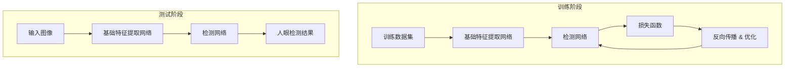

# 基于OpenCV的人眼检测系统详细设计与具体代码实现

## 1. 背景介绍

### 1.1 问题的由来

在当今社会,人眼检测技术在多个领域都有着广泛的应用,如安全监控、人机交互、辅助驾驶等。人眼作为人类面部最显著的特征之一,能够反映人的注意力和情绪状态,因此对人眼的精确检测和跟踪具有重要意义。然而,由于人眼区域较小、形状多变、易受光照和遮挡等因素影响,使得人眼检测成为一项具有挑战性的计算机视觉任务。

### 1.2 研究现状

早期的人眼检测方法主要基于传统的图像处理技术,如边缘检测、模板匹配等。这些方法通常需要手工设计特征,且对光照变化、尺度变化等因素较为敏感。近年来,随着深度学习技术的飞速发展,基于深度学习的人眼检测方法取得了长足进步,能够自动学习更加鲁棒的特征表示,从而提高检测精度和泛化能力。

### 1.3 研究意义

人眼检测技术在多个领域都有着广泛的应用前景:

1. **安全监控**: 通过人眼检测,可以对监控画面中的人员进行识别和跟踪,提高监控系统的智能化水平。
2. **人机交互**: 人眼运动轨迹能够反映用户的注意力,利用人眼检测技术可以实现更加自然的人机交互方式。
3. **驾驶辅助**: 通过检测驾驶员的眼睛状态,可以判断是否存在疲劳驾驶的风险,从而发出警示或采取相应措施,提高驾驶安全性。
4. **医疗辅助**: 人眼状态的变化往往与某些疾病相关,人眼检测技术可以为医疗诊断提供辅助信息。

因此,研究高精度、鲁棒的人眼检测算法对于推动相关领域的技术进步具有重要意义。

### 1.4 本文结构

本文将详细介绍基于OpenCV的人眼检测系统的设计与实现。文章主要分为以下几个部分:

1. 背景介绍
2. 核心概念与联系
3. 核心算法原理与具体操作步骤
4. 数学模型和公式详细讲解与案例分析
5. 项目实践:代码实例和详细解释说明
6. 实际应用场景
7. 工具和资源推荐
8. 总结:未来发展趋势与挑战
9. 附录:常见问题与解答

## 2. 核心概念与联系

在介绍人眼检测的核心算法之前,我们先来了解一些相关的基本概念:

1. **图像处理(Image Processing)**: 指对图像进行加工、处理、分析等操作,以改善图像质量或提取有用信息的过程。
2. **计算机视觉(Computer Vision)**: 是一门研究如何使机器能够获取、处理和分析数字图像或视频数据,从而产生对视觉数据的高层次理解的科学。
3. **特征提取(Feature Extraction)**: 指从原始数据中提取出能够有效描述问题的特征或属性,是机器学习和模式识别中的关键步骤。
4. **目标检测(Object Detection)**: 在给定的图像或视频序列中,自动定位目标物体的位置并给出目标类别的技术。
5. **OpenCV**: 一个跨平台的计算机视觉库,提供了大量用于图像处理和计算机视觉的算法和工具。

人眼检测技术属于目标检测的一个分支,需要结合图像处理、计算机视觉等技术,从图像或视频中自动定位人眼区域。常见的人眼检测算法包括:

- 基于传统图像处理技术(如Haar特征、LBP等)的方法
- 基于深度学习技术(如CNN、RCNN等)的方法
- 基于3D模型匹配的方法
- 基于红外热成像的方法

其中,基于深度学习的方法由于自动学习特征的能力,目前在人眼检测任务上表现最为优异。本文将重点介绍一种基于OpenCV和深度学习的人眼检测算法及其实现。

## 3. 核心算法原理与具体操作步骤

### 3.1 算法原理概述

本文所介绍的人眼检测算法是基于深度卷积神经网络(CNN)的目标检测算法。CNN能够自动从大量训练数据中学习多层次的特征表示,并在此基础上完成目标检测任务。该算法的核心思想是:先使用一个基础网络(如VGGNet、ResNet等)对输入图像进行特征提取,得到特征图;然后在特征图上使用一个专门设计的检测网络(如SSD、YOLO等)进行目标检测,输出目标位置和类别。

对于人眼检测任务,我们需要在大量标注了人眼位置的图像数据上训练该CNN模型。在训练过程中,网络会自动学习提取有利于人眼检测的特征,并优化检测网络的参数,最终得到一个能够高精度检测人眼的模型。

算法的具体流程如下所示:

### 3.2 算法步骤详解

1. **数据预处理**

   - 收集并标注大量包含人眼的图像数据,作为训练集和验证集
   - 对图像进行预处理,如裁剪、缩放、数据增强等,以增加数据的多样性

2. **特征提取网络**

   - 选择一个经典的CNN模型(如VGGNet、ResNet等)作为基础特征提取网络
   - 对输入图像进行前向传播计算,得到多尺度的特征图

3. **检测网络**

   - 在特征图上使用一个专门设计的检测网络,如SSD、YOLO等
   - 检测网络会生成一系列先验边界框(Prior Boxes),并预测每个边界框内是否包含目标,以及目标的类别

4. **模型训练**

   - 定义损失函数,包括分类损失和回归损失
   - 使用反向传播算法,不断优化网络参数,使损失函数的值最小化

5. **模型评估与调优**

   - 在验证集上评估模型的精度和性能指标
   - 根据评估结果,调整网络结构、超参数等,提高模型性能

6. **模型部署与应用**

   - 将训练好的模型导出为可部署的格式
   - 在实际应用场景中,对输入图像进行前向传播计算,得到人眼检测结果

### 3.3 算法优缺点

**优点**:

- 端到端的训练方式,无需手工设计特征
- 利用深度网络自动学习多层次特征表示,具有很强的泛化能力
- 检测精度高,能够有效应对尺度变化、遮挡等困难情况

**缺点**:

- 需要大量标注数据进行训练,数据准备工作量大
- 训练过程计算量大,需要强大的硬件支持
- 对于小目标的检测精度仍有待提高
- 存在过拟合的风险,需要合理的正则化策略

### 3.4 算法应用领域

基于深度学习的人眼检测算法由于其优异的性能,在诸多领域都有广泛的应用前景:

1. **安全监控系统**
2. **人机交互系统**
3. **驾驶员状态监测**
4. **医疗辅助诊断**
5. **虚拟现实/增强现实**
6. **人脸识别与跟踪**
7. **视频会议系统**
8. **广告精准投放**
9. **游戏娱乐系统**
10. **社交媒体滤镜**

## 4. 数学模型和公式详细讲解与举例说明

### 4.1 数学模型构建

在目标检测任务中,我们需要同时预测目标的位置(通过边界框坐标表示)和目标的类别。因此,检测网络的输出通常由两部分组成:

- 边界框回归(Bounding Box Regression),预测目标边界框的坐标
- 目标分类(Object Classification),预测目标所属的类别

我们先来看边界框回归部分。设输入图像为 $I$,待预测目标的实际边界框坐标为 $B=(x, y, w, h)$,其中 $(x, y)$ 表示边界框中心坐标, $w, h$ 表示边界框的宽度和高度。我们的目标是学习一个函数 $f_\text{loc}$,使其能够基于图像特征 $\phi(I)$ 精确预测出目标边界框的坐标:

$$
B = f_\text{loc}(\phi(I))
$$

为了简化优化过程,我们通常不直接预测绝对坐标值,而是预测相对于先验边界框的偏移量。设先验边界框的坐标为 $B_p=(x_p, y_p, w_p, h_p)$,我们定义以下参数化的转换:

$$
\begin{aligned}
t_x &= \frac{x - x_p}{w_p} \
t_y &= \frac{y - y_p}{h_p} \
t_w &= \log\frac{w}{w_p} \
t_h &= \log\frac{h}{h_p}
\end{aligned}
$$

其中 $t_x, t_y$ 表示中心坐标的偏移量, $t_w, t_h$ 表示宽高的缩放量。于是,边界框回归的目标可以转化为学习一个函数 $f_\text{loc}$,使其能够预测上述四个转换参数:

$$
(t_x, t_y, t_w, t_h) = f_\text{loc}(\phi(I))
$$

对于目标分类部分,我们需要学习一个函数 $f_\text{cls}$,使其能够基于图像特征 $\phi(I)$ 预测目标所属的类别 $c$:

$$
c = f_\text{cls}(\phi(I))
$$

在实际应用中,我们通常会为每个先验边界框同时预测其包含目标的概率和目标的类别,从而完成目标检测任务。

### 4.2 公式推导过程

在上一节中,我们定义了边界框回归和目标分类的数学表达式。接下来,我们需要定义损失函数,并通过优化该损失函数来训练检测网络的参数。

对于边界框回归部分,我们使用平滑 $L_1$ 损失函数(Smooth L1 Loss):

$$
\text{Loss}_\text{loc}(t, \hat{t}) = \sum_{i \in \{x, y, w, h\}} \text{SmoothL1}(t_i - \hat{t}_i)
$$

其中 $t$ 表示实际的转换参数, $\hat{t}$ 表示网络预测的转换参数,损失函数对每个参数的差值进行求和。平滑 $L_1$ 损失函数的定义如下:

$$
\text{SmoothL1}(x) = \begin{cases}
0.5x^2 & \text{if } |x| < 1 \
|x| - 0.5 & \text{otherwise}
\end{cases}
$$

平滑 $L_1$ 损失函数在 $|x| < 1$ 时等同于 $L_2$ 损失,在 $|x| \geq 1$ 时则等同于 $L_1$ 损失。相比 $L_2$ 损失,它对于异常值的惩罚较小,从而具有更好的鲁棒性。

对于目标分类部分,我们使用交叉熵损失函数(Cross Entropy Loss):

$$
\text{Loss}_\text{cls}(c, \hat{c}) = -\log(\hat{c}_c)
$$

其中 $c$ 表示实际的目标类别, $\hat{c}_c$ 表示网络预测的该类别的概率。交叉熵损失函数能够直接反映预测概率与实际类别之间的差异。

最终,我们将边界框回归损失和目标分类损失相加,得到整个检测网络的总损失函数:

$$
\text{Loss} = \alpha \text{Loss}_\text{