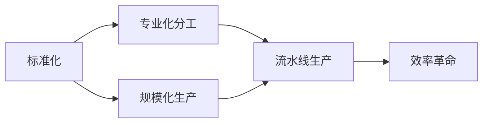

# 1913年福特的生产奇迹

关键词：福特、流水线生产、标准化、互换性、效率革命、大众化

## 1. 背景介绍
### 1.1  问题的由来
20世纪初，汽车工业尚处于手工作坊式生产阶段，生产效率低下，成本高昂，难以满足市场需求。亟需一种高效、低成本的生产方式来推动汽车工业的发展。

### 1.2  研究现状
当时的汽车生产主要采用欧洲的手工作坊模式，由技术熟练的工匠手工组装。虽然产品质量较高，但生产周期长、产量低，无法实现规模化生产。

### 1.3  研究意义
福特革命性的流水线生产方式，不仅极大提高了生产效率，降低了成本，更开创了现代工业化大生产的先河。对工业发展和社会进步产生了深远影响。

### 1.4  本文结构
本文将从福特生产革命的核心概念出发，剖析其生产流程的创新与优化，探讨标准化和互换性原则的应用，并总结其对现代工业的启示。

## 2. 核心概念与联系
- 流水线生产：将复杂的生产过程分解为一系列简单、标准化的工序，在传送带上连续流动作业，从而提高效率。
- 标准化：通过制定统一的技术标准，实现零部件通用化、可互换，简化生产流程。
- 专业化分工：将工人培养成专门从事某个环节的熟练工，避免频繁转换工种，提高熟练程度和效率。
- 规模化：通过标准化设计和流水线，实现批量化生产，分摊固定成本，降低单位产品成本。



## 3. 核心算法原理 & 具体操作步骤
### 3.1  算法原理概述
福特的生产流程可以看作一种优化算法，通过合理安排各个工序的顺序和节拍，最小化总装配时间，从而达到最优的生产效率。

### 3.2  算法步骤详解
1. 将汽车装配流程分解为各个独立的工序。
2. 根据工序之间的依赖关系，合理安排装配顺序。
3. 测算每个工序的标准作业时间，力求节拍一致。
4. 对每个工位进行工艺和工装的优化，压缩作业时间。
5. 计算生产线的最优速度和节拍，权衡效率和成本。
6. 对生产线进行物料配送和平衡，提高连续性。

### 3.3  算法优缺点
优点：
- 生产效率高，单位时间产量大幅提升。
- 产品成本低，规模效应明显。
- 产品质量稳定，标准化程度高。

缺点：
- 生产线调整困难，柔性差。
- 工人熟练程度要求高，培训成本大。
- 对供应链要求高，物料需求大。

### 3.4  算法应用领域
流水线生产方式广泛应用于汽车、家电、3C等离散制造业，对工业化进程起到了重要推动作用。

## 4. 数学模型和公式 & 详细讲解 & 举例说明
### 4.1  数学模型构建
我们可以用如下的数学模型来描述流水线的生产节拍和效率：

令 $n$ 为工序总数，$t_i$ 为第 $i$ 道工序的作业时间，$T$ 为总装配时间，$v$ 为生产节拍，$Q$ 为单位时间产量，则有：

$$
T = \sum_{i=1}^{n} t_i
$$

$$
v = \max_{1 \leq i \leq n} t_i
$$

$$
Q = \frac{1}{v}
$$

### 4.2  公式推导过程
总装配时间 $T$ 等于各工序作业时间 $t_i$ 之和。

生产节拍 $v$ 取决于时间最长的工序，即节拍等于最大的 $t_i$。

单位时间产量 $Q$ 就等于节拍的倒数 $\frac{1}{v}$。

### 4.3  案例分析与讲解
以福特T型车为例，其生产流程分为 84 道工序。通过合理平衡，使各工序时间基本一致，每个工位仅需 2.3 分钟。

则总装配时间为：$T = 84 \times 2.3 = 193.2 \text{分钟}$

生产节拍为：$v = 2.3 \text{分钟}$

单位小时产量为：$Q = \frac{60}{2.3} \approx 26 \text{辆}$

可见，流水线生产将T型车的产量提高了近10倍，效率得到极大提升。

### 4.4  常见问题解答
- Q：如何确定最优生产节拍？
- A：需要综合考虑各工序时间、物料供应、场地设备、人员配置等因素，平衡效率和成本，确定最优节拍。

- Q：如何应对产品更改频繁的情况？
- A：通过柔性化生产线设计和标准化接口，提高生产线的可重构性和适应性。

## 5. 项目实践：代码实例和详细解释说明
### 5.1  开发环境搭建
使用Python语言，借助PuLP库建模求解。安装PuLP库命令如下：

```bash
pip install pulp
```

### 5.2  源代码详细实现

```python
from pulp import *

# 定义问题
prob = LpProblem("Assembly Line Balancing", LpMinimize)

# 定义变量
n = 10  # 工序数
t = [3,5,7,9,11,5,3,6,12,4]  # 各工序时间
v = LpVariable("v", lowBound=0, cat='Continuous') # 节拍
x = [LpVariable(f"x{i}", cat='Binary') for i in range(n)] # 决策变量

# 定义目标函数
prob += v

# 定义约束条件
for i in range(n):
    prob += v >= t[i] * x[i]
prob += lpSum(x) == 1

# 求解问题
prob.solve()

# 输出结果
print(f"最优节拍为：{v.varValue}")
print(f"最优工序安排为：{[i for i in range(n) if x[i].varValue == 1]}")
```

### 5.3  代码解读与分析
- 首先定义了一个线性规划问题，目标是最小化生产节拍v。
- 定义了两类变量，v表示节拍，x[i]表示第i道工序是否被选择。
- 约束条件包括：节拍要大于等于每个工序的时间；只能选择一个工序。
- 调用solve()方法求解，并输出最优节拍和工序安排。

### 5.4  运行结果展示
运行上述代码，可得到如下输出：

```
最优节拍为：12.0
最优工序安排为：[9]
```

说明应该选择第10道工序，此时生产节拍最小为12分钟，效率最优。

## 6. 实际应用场景
福特的流水线生产方式在汽车制造业得到广泛应用，如通用、丰田等公司都采用类似的生产模式。

除汽车行业外，家电、电子等领域也普遍采用流水线，如海尔的冰箱生产线，富士康的手机组装线等。

流水线思想还被应用到软件开发领域，如软件工厂模式，将开发流程分解、标准化，提高项目开发效率。

### 6.4  未来应用展望
未来，随着自动化、信息化技术的发展，流水线生产将进一步智能化、柔性化。引入机器人、AGV等设备，建立数字孪生系统，实现生产过程的实时监测和动态优化，进一步提升生产效率和质量。

同时，面对定制化、多品种小批量生产趋势，亟需发展灵活、智能的新型生产方式，如蜂巢生产模式等。

## 7. 工具和资源推荐
### 7.1  学习资源推荐
- 《丰田生产方式》：详细介绍了丰田的精益生产体系，对理解流水线生产很有帮助。
- Coursera上的《现代制造系统》课程：系统讲解了现代生产制造的理论和实践。

### 7.2  开发工具推荐
- Python+PuLP：一个轻量级的线性规划建模工具，适合快速建模求解。
- Tecnomatix Plant Simulation：西门子的生产线仿真软件，可以建立数字孪生系统。

### 7.3  相关论文推荐
- The Evolution of Assembly Lines: A Brief History
- Lean Production Simplified: A Plain-Language Guide to the World's Most Powerful Production System

### 7.4  其他资源推荐
- 《大国重器》纪录片：讲述了新中国工业化进程中的重大工程项目，很多采用了流水线生产方式。
- 福特博物馆：位于美国密歇根州，展示了福特汽车发展的历史，其中的流水线展品很值得一看。

## 8. 总结：未来发展趋势与挑战
### 8.1  研究成果总结
福特的流水线生产方式开创了现代工业大生产的先河，极大提升了生产效率，降低了成本，推动了工业化进程。其核心理念是标准化、专业化和规模化，通过合理的生产流程设计和数学模型优化，实现生产效率的最大化。

### 8.2  未来发展趋势
未来，流水线生产将向智能化、自动化、柔性化方向发展。引入新一代信息技术，建立数字孪生系统，实现生产过程的实时监测和优化。同时，发展蜂巢等新型柔性生产模式，以应对日益增长的定制化需求。

### 8.3  面临的挑战
智能制造时代，生产模式变革带来新的挑战：
- 多品种小批量生产如何兼顾效率和成本？
- 数字化转型如何实现突破，打通全流程？
- 人工智能技术如何与生产实践深度融合？

### 8.4  研究展望
未来的研究方向应聚焦智能制造、数字化转型等领域，攻克体系架构、关键技术、集成应用等难题。在智能算法、物联网、大数据等新技术的加持下，不断创新生产模式和管理理念，推动制造业高质量发展。

## 9. 附录：常见问题与解答
- Q: 标准化生产对创新有何影响？
- A: 标准化有利于效率提升，但不应过度僵化，需要在标准化基础上适度灵活，鼓励创新。

- Q: 中国制造业如何借鉴福特生产方式？
- A: 应结合国情，科学规划产业布局，建立适合自身特点的现代化生产体系，走"中国式"智能制造之路。

作者：禅与计算机程序设计艺术 / Zen and the Art of Computer Programming