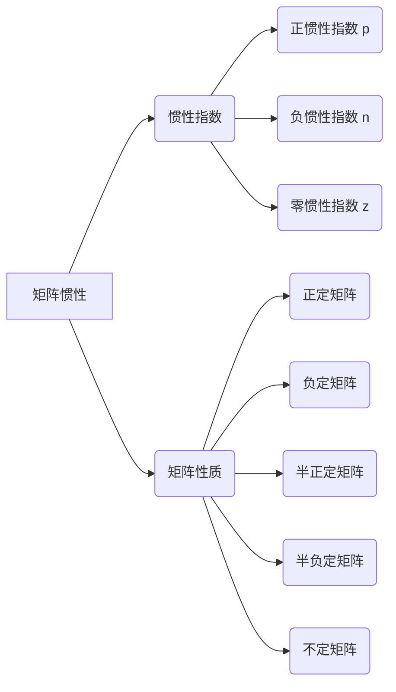

# 矩阵理论与应用：矩阵惯性定理

关键词：矩阵理论、矩阵惯性定理、正惯性指数、负惯性指数、Sylvester定理、Hermite定理

## 1. 背景介绍
### 1.1  问题的由来
矩阵理论是线性代数的重要分支,在科学和工程领域有着广泛的应用。矩阵惯性问题是矩阵理论中的一个基本问题,它研究矩阵的正、负特征值的分布情况。矩阵惯性与许多重要的矩阵性质密切相关,如正定性、半正定性等,在优化理论、控制理论、信号处理等领域有重要应用。

### 1.2  研究现状
矩阵惯性问题的研究可以追溯到19世纪中期。1852年,Sylvester首次提出了实对称矩阵的惯性定理,揭示了矩阵惯性与主子式的关系。此后,Hermite、Frobenius、Schur等数学家对矩阵惯性问题进行了深入研究,得到了一系列重要结果。近年来,随着计算机科学的发展,矩阵惯性理论在机器学习、数据挖掘、图像处理等领域得到了新的应用。

### 1.3  研究意义
矩阵惯性问题的研究对于理解矩阵的性质、揭示不同类型矩阵之间的内在联系具有重要意义。矩阵惯性定理为判断矩阵的正定性、稳定性等提供了有力工具,是优化算法、稳定性分析的理论基础。深入研究矩阵惯性理论,对于拓展其应用范围、促进相关领域的发展具有重要的理论和实践价值。

### 1.4  本文结构
本文将围绕矩阵惯性定理展开讨论。第2部分介绍矩阵惯性的基本概念和主要定理;第3部分讨论矩阵惯性的判定方法和计算步骤;第4部分给出矩阵惯性的数学模型,并通过具体实例加以说明;第5部分通过代码实例演示矩阵惯性的编程实现;第6部分探讨矩阵惯性定理的几个典型应用;第7部分推荐相关的学习资源;第8部分对全文进行总结。

## 2. 核心概念与联系
矩阵惯性的核心概念包括:
- 正惯性指数(positive index)$p$:矩阵正特征值的个数
- 负惯性指数(negative index)$n$:矩阵负特征值的个数
- 零惯性指数(zero index)$z$:矩阵零特征值的个数

对于n阶实对称矩阵$A$,有$p+n+z=n$。矩阵的惯性由正惯性指数和负惯性指数唯一确定,记为$In(A)=\{p,n\}$。

矩阵惯性与其他重要矩阵性质的联系:
- 正定矩阵:$p=n$,即$In(A)=\{n,0\}$
- 负定矩阵:$n=n$,即$In(A)=\{0,n\}$
- 半正定矩阵:$n=0$
- 半负定矩阵:$p=0$
- 不定矩阵:$p>0,n>0$

下图给出了矩阵惯性的概念结构:



## 3. 核心算法原理 & 具体操作步骤
### 3.1  算法原理概述
判定矩阵惯性的主要方法是考察矩阵的特征值分布。对于实对称矩阵,可以通过盖尔圆盘定理、雅可比旋转等方法化为对角矩阵,从而得到全部特征值。

### 3.2  算法步骤详解
以n阶实对称矩阵$A$为例,判定其惯性的步骤如下:
1. 求矩阵$A$的特征值$\lambda_1,\lambda_2,\cdots,\lambda_n$;
2. 统计正特征值个数$p$,负特征值个数$n$,零特征值个数$z$;
3. 矩阵$A$的惯性为$In(A)=\{p,n\}$。

求解特征值可以使用雅可比(Jacobi)方法,其基本步骤为:
1. 选取非对角元素$a_{pq}$,施加正交变换$P$,使$a_{pq}$化为0;
2. 重复步骤1,直到非对角元素足够小;
3. 对角线元素即为矩阵$A$的特征值。

### 3.3  算法优缺点
判定矩阵惯性的特征值法优点是原理简单、易于实现,且能得到精确结果。但是求解特征值的计算量较大,对于高阶矩阵可能效率较低。

### 3.4  算法应用领域
矩阵惯性判定广泛应用于以下领域:
- 优化理论:凸优化、二次优化等
- 控制理论:李雅普诺夫稳定性、鲁棒控制等
- 信号处理:正定矩阵的信号滤波、频谱分析等
- 机器学习:核方法、支持向量机等

## 4. 数学模型和公式 & 详细讲解 & 举例说明
### 4.1  数学模型构建
对于n阶实对称矩阵$A=(a_{ij})_{n\times n}$,其数学模型为:

$$A=\begin{pmatrix}
a_{11} & a_{12} & \cdots & a_{1n}\\
a_{21} & a_{22} & \cdots & a_{2n}\\
\vdots & \vdots & \ddots & \vdots\\
a_{n1} & a_{n2} & \cdots & a_{nn}
\end{pmatrix}$$

其中$a_{ij}=a_{ji}(i,j=1,2,\cdots,n)$。

矩阵$A$的特征值$\lambda$和特征向量$\boldsymbol{x}$满足:

$$A\boldsymbol{x}=\lambda \boldsymbol{x}$$

### 4.2  公式推导过程
由特征值和特征向量的定义,有:

$$(A-\lambda I)\boldsymbol{x}=\boldsymbol{0}$$

要使上式有非零解,须有:

$$\det(A-\lambda I)=0$$

展开上式得到矩阵$A$的特征多项式:

$$\begin{vmatrix}
a_{11}-\lambda & a_{12} & \cdots & a_{1n}\\
a_{21} & a_{22}-\lambda & \cdots & a_{2n}\\
\vdots & \vdots & \ddots & \vdots\\
a_{n1} & a_{n2} & \cdots & a_{nn}-\lambda
\end{vmatrix}=0$$

求解该特征多项式即可得到全部特征值$\lambda_1,\lambda_2,\cdots,\lambda_n$。

### 4.3  案例分析与讲解
考虑实对称矩阵:

$$A=\begin{pmatrix}
1 & 2\\
2 & 3
\end{pmatrix}$$

求矩阵$A$的惯性。

解:矩阵$A$的特征多项式为:

$$\begin{vmatrix}
1-\lambda & 2\\
2 & 3-\lambda
\end{vmatrix}=\lambda^2-4\lambda-1=0$$

解得两个特征值为:

$$\lambda_1=2+\sqrt{5},\lambda_2=2-\sqrt{5}$$

其中$\lambda_1>0,\lambda_2<0$,故矩阵$A$的惯性为$In(A)=\{1,1\}$。

### 4.4  常见问题解答
Q:对于复矩阵,如何判定其惯性?
A:复矩阵不能直接使用特征值法判定惯性。通常需要将其转化为等价的实矩阵,如Hermite矩阵,再讨论其惯性。

Q:矩阵惯性与矩阵的秩有何联系?
A:根据Sylvester惯性定理,实对称矩阵的秩等于其正惯性指数与负惯性指数之和,即$rank(A)=p+n$。

## 5. 项目实践：代码实例和详细解释说明
### 5.1  开发环境搭建
本节代码实例采用Python语言,需要安装以下库:
- NumPy:数值计算库
- SciPy:科学计算库

### 5.2  源代码详细实现
下面给出判定矩阵惯性的Python代码:

```python
import numpy as np
from scipy import linalg

def matrix_inertia(A):
    """
    计算实对称矩阵A的惯性

    参数:
    A:n阶实对称矩阵

    返回:
    p:正惯性指数
    n:负惯性指数
    """
    eigvals = linalg.eigvalsh(A)  # 计算矩阵A的特征值
    p = np.sum(eigvals > 0)  # 正特征值个数
    n = np.sum(eigvals < 0)  # 负特征值个数
    return p, n
```

### 5.3  代码解读与分析
上述代码的关键步骤如下:
1. 使用SciPy的`linalg.eigvalsh()`函数计算实对称矩阵的特征值。该函数采用了效率较高的算法,适合大规模矩阵。
2. 通过NumPy的`np.sum()`函数统计正、负特征值的个数,从而得到矩阵的正惯性指数$p$和负惯性指数$n$。

### 5.4  运行结果展示
对于示例矩阵:

$$A=\begin{pmatrix}
1 & 2\\
2 & 3
\end{pmatrix}$$

运行结果为:

```python
A = np.array([[1, 2], [2, 3]])
p, n = matrix_inertia(A)
print(f"正惯性指数p={p}, 负惯性指数n={n}")
```

输出:
```
正惯性指数p=1, 负惯性指数n=1
```

## 6. 实际应用场景
矩阵惯性定理在许多领域有重要应用,这里举两个典型的例子。

在优化理论中,二次优化问题可以表示为:

$$\begin{aligned}
\min\quad & \frac{1}{2}\boldsymbol{x}^TA\boldsymbol{x}+\boldsymbol{b}^T\boldsymbol{x}\\
\text{s.t.}\quad & \boldsymbol{x}\in \mathbb{R}^n
\end{aligned}$$

其中$A$为实对称矩阵。当$A$正定时,该问题为凸优化问题,具有全局最优解。判断$A$是否正定可以利用矩阵惯性定理:当且仅当$A$的惯性为$\{n,0\}$时,其为正定矩阵。

在控制理论中,判断线性定常系统$\dot{\boldsymbol{x}}=A\boldsymbol{x}$的稳定性需要计算状态矩阵$A$的特征值。根据Lyapunov稳定性理论,当$A$的所有特征值实部均小于0时,系统渐近稳定。此时,矩阵$A$的惯性为$\{0,n\}$。因此,利用矩阵惯性定理可以方便地判断系统的稳定性。

### 6.4  未来应用展望
随着数据科学和人工智能的发展,矩阵惯性定理有望在以下方面得到新的应用:
- 机器学习:核矩阵的正定性判断,SVM的对偶问题求解等
- 图像处理:正定矩阵在图像增强、压缩等方面的应用
- 量子计算:量子态的纠缠判据、量子信道的正定性判断等

## 7. 工具和资源推荐
### 7.1  学习资源推荐
- 《矩阵分析与应用》(Roger A. Horn, Charles R. Johnson):经典的矩阵分析教材,系统介绍了矩阵惯性理论。
- MIT线性代数公开课(Gilbert Strang):深入浅出地讲解了矩阵的特征值、正定性等内容。
- 斯坦福大学凸优化课程(Stephen Boyd):介绍了矩阵惯性在凸优化中的应用。

### 7.2  开发工具推荐
- MATLAB:提供