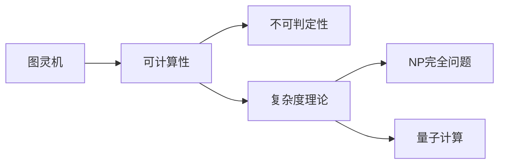

# 计算：第四部分 计算的极限

作者：禅与计算机程序设计艺术 / Zen and the Art of Computer Programming

关键词：计算理论、图灵机、可计算性、不可判定性、复杂度理论、NP完全问题、量子计算

## 1. 背景介绍
### 1.1 问题的由来
自从计算机诞生以来，人们一直在探索计算的本质和极限。什么是可计算的？有哪些问题是计算机无法解决的？计算的效率有什么限制？这些问题引发了计算理论的发展。

### 1.2 研究现状
目前，图灵机作为计算模型奠定了可计算性理论的基础。停机问题等被证明是不可判定的。复杂度理论研究计算问题的内在难度和资源需求。量子计算则为突破经典计算限制带来希望。

### 1.3 研究意义
探索计算的极限有助于我们理解计算的本质，发掘计算机科学的理论基础。这不仅具有重要的理论意义，也能指导我们设计更高效的算法，开发更强大的计算模型。

### 1.4 本文结构
本文将从图灵机和可计算性出发，讨论不可判定性问题，介绍复杂度理论和NP完全问题，展望量子计算的前景，探索计算的极限。

## 2. 核心概念与联系

- 图灵机：一种抽象计算模型，由无限长纸带和读写头组成，可以模拟任何算法。
- 可计算性：问题是否存在算法，能在有限步骤内解决。
- 不可判定性：存在无法用算法判定的问题，如停机问题。
- 复杂度理论：研究问题计算所需的时间和空间资源。
- NP完全问题：一类难以高效求解的问题，许多实际问题可归约为NP完全。
- 量子计算：利用量子力学原理进行计算，有望突破经典计算限制。



## 3. 核心算法原理 & 具体操作步骤
### 3.1 算法原理概述
图灵机是一种简单而强大的计算模型。它由一条无限长的纸带和一个读写头组成。纸带被划分为方格，每个方格可以为空白或印有符号。读写头可以左右移动，读取和改写当前方格中的符号。

### 3.2 算法步骤详解
1. 开始时，纸带上印有输入符号串，其余为空白，读写头位于最左端。
2. 根据当前状态和读入符号，读写头改写当前符号，移动方向，并转移到新状态。
3. 不断重复步骤2，直到到达终止状态。
4. 纸带上非空白符号即为输出。

### 3.3 算法优缺点
图灵机的优点是简洁而强大，可以模拟任何可计算问题的算法。它为可计算性理论奠定了基础。但图灵机只是理论模型，实际计算机的存储和运算能力有限。

### 3.4 算法应用领域
图灵机是理论计算模型，主要用于研究可计算性理论。在现实中，图灵机启发了现代计算机的设计思路。

## 4. 数学模型和公式 & 详细讲解 & 举例说明
### 4.1 数学模型构建
形式化定义：图灵机是一个七元组 $M=(Q,\Gamma,b,\Sigma,\delta,q_0,F)$，其中：
- $Q$ 是有限状态集
- $\Gamma$ 是纸带字母表
- $b \in \Gamma$ 是空白符号
- $\Sigma \subseteq (\Gamma \setminus \{b\})$ 是输入符号集
- $\delta: Q \times \Gamma \rightarrow Q \times \Gamma \times \{L,R\}$ 是转移函数
- $q_0 \in Q$ 是初始状态
- $F \subseteq Q$ 是终止状态集

### 4.2 公式推导过程
设图灵机处于状态 $p$，读写头位于符号 $X$ 上，则下一步：
1. 若 $\delta(p,X)=(q,Y,L)$，则改写为 $Y$，读写头左移，新状态为 $q$
2. 若 $\delta(p,X)=(q,Y,R)$，则改写为 $Y$，读写头右移，新状态为 $q$

### 4.3 案例分析与讲解
考虑一个二进制加法器图灵机，输入两个用 $\#$ 分隔的二进制数，输出它们的和。例如：

输入：$101\#11$

则图灵机经过以下步骤：
1. 扫描第一个数的低位，改写进位，移动到第二个数低位
2. 加上第二个数当前位和进位，改写结果和进位
3. 两数位都处理完之后，改写最终进位（如果有），接受

最终纸带上为 $101\#11\underline{1000}$，即 $5+3=8$，下划线表示读写头位置。

### 4.4 常见问题解答
- Q: 图灵机能计算所有函数吗？
- A: 不能，存在不可计算的函数，如停机函数。图灵机只能计算部分可计算函数。

## 5. 项目实践：代码实例和详细解释说明
### 5.1 开发环境搭建
使用 Python 实现一个简单的图灵机模拟器。首先定义图灵机类：

```python
class TuringMachine:
    def __init__(self, states, symbols, blank, input_symbols,
                 transition, start, accept, reject):
        self.states = states
        self.symbols = symbols
        self.blank = blank
        self.input_symbols = input_symbols
        self.transition = transition
        self.start = start
        self.accept = accept
        self.reject = reject
```

### 5.2 源代码详细实现
实现图灵机的转移函数：

```python
def transition_function(self, state, symbol):
    if (state, symbol) not in self.transition:
        return self.reject, symbol, 'R'
    return self.transition[(state, symbol)]
```

实现图灵机的模拟运行：

```python
def run(self, input):
    tape = list(input)
    state = self.start
    head = 0

    while state not in [self.accept, self.reject]:
        symbol = tape[head]
        state, new_symbol, direction = self.transition_function(state, symbol)
        tape[head] = new_symbol
        head += 1 if direction == 'R' else -1

    return state == self.accept
```

### 5.3 代码解读与分析
- `__init__` 方法初始化图灵机的各个组件，包括状态集、符号集、转移函数等。
- `transition_function` 根据当前状态和符号，返回下一步的状态、改写符号和读写头移动方向。如果转移不存在，则拒绝。
- `run` 方法模拟图灵机的运行过程。从初始状态和纸带起始位置开始，不断根据当前符号进行转移，直到到达接受或拒绝状态。

### 5.4 运行结果展示
以二进制加法器为例，构造图灵机，并测试：

```python
transition = {
    ('start', '0'): ('start', '0', 'R'),
    ('start', '1'): ('start', '1', 'R'),
    ('start', '#'): ('check', '#', 'R'),
    ('check', '0'): ('write0', '#', 'R'),
    ('check', '1'): ('write1', '#', 'R'),
    ('write0', '0'): ('write0', '0', 'R'),
    ('write0', '1'): ('write1', '0', 'R'),
    ('write0', '#'): ('accept', '#', 'N'),
    ('write1', '0'): ('write1', '1', 'R'),
    ('write1', '1'): ('write0', '1', 'L'),
    ('write1', '#'): ('carry', '1', 'L'),
    ('carry', '0'): ('write1', '1', 'R'),
    ('carry', '1'): ('write0', '1', 'L'),
    ('carry', '#'): ('accept', '1', 'N'),
}

adder = TuringMachine(
    states={'start', 'check', 'write0', 'write1', 'carry', 'accept'},
    symbols={'0', '1', '#'},
    blank='#',
    input_symbols={'0', '1', '#'},
    transition=transition,
    start='start',
    accept='accept',
    reject='check'
)

print(adder.run('101#11'))  # True
```

结果正确，图灵机正常工作，模拟了二进制加法。

## 6. 实际应用场景
图灵机主要用于理论研究，检验问题的可计算性。在现实中，图灵机启发了现代计算机体系结构的设计，如程序存储、顺序执行等思想。

### 6.4 未来应用展望
图灵机虽然是简单的理论模型，但为复杂计算模型的设计提供了基础。未来，图灵机有望在可计算性研究、复杂度分析、量子计算等领域发挥重要作用。

## 7. 工具和资源推荐
### 7.1 学习资源推荐
- 《计算理论导引》 (Introduction to the Theory of Computation) by Michael Sipser
- Coursera 公开课程《自动机理论》(Automata Theory)
- 《计算的本质：深入剖析程序和计算机》 (The Annotated Turing) by Charles Petzold

### 7.2 开发工具推荐
- Python：简单直观，适合编写图灵机模拟器
- C++：执行效率高，适合开发复杂的图灵机模型
- Jflap：图灵机可视化工具，便于理解和演示

### 7.3 相关论文推荐
- Turing, A. M. (1937). On computable numbers, with an application to the Entscheidungsproblem. Proceedings of the London mathematical society.
- Cook, S. A. (1971). The complexity of theorem-proving procedures. Proceedings of the third annual ACM symposium on Theory of computing.
- Shor, P. W. (1999). Polynomial-time algorithms for prime factorization and discrete logarithms on a quantum computer. SIAM review.

### 7.4 其他资源推荐
- 图灵机在线模拟器：http://morphett.info/turing/turing.html
- 图灵机编程挑战：http://boundvariable.org/task.shtml
- 图灵机可视化演示：http://turingmachinesimulator.com/

## 8. 总结：未来发展趋势与挑战
### 8.1 研究成果总结
图灵机作为一种简单而强大的计算模型，为可计算性理论奠定了基础。它证明了存在不可判定的问题，如停机问题。图灵机也启发了现代计算机的设计思路。

### 8.2 未来发展趋势
未来，图灵机将在以下方面得到进一步发展：
- 更多不可判定问题的研究，深化对可计算性的理解
- 与复杂度理论结合，分析问题的内在计算难度
- 启发新型计算模型，如量子图灵机、生物图灵机等

### 8.3 面临的挑战
图灵机也面临一些挑战：
- 如何突破可计算性的限制，解决更广泛的问题
- 如何在有限资源下高效模拟图灵机
- 如何将图灵机与其他计算理论融合，发展新的计算模型

### 8.4 研究展望
尽管图灵机面临挑战，但它仍是计算理论的基石。未来，图灵机有望在可计算性、复杂度、量子计算等领域取得更多突破，为计算机科学的发展做出贡献。

## 9. 附录：常见问题与解答
- Q: 图灵机与现代计算机有何区别？
- A: 图灵机是抽象的数学模型，有无限存储空间；而现代计算机是物理实现，存储和计算资源有限。但它们在计算能力上是等价的。

- Q: 图灵机能模拟任何算法吗？
- A: 图灵机能模拟任何可计算的算法。但对于不可计算的问题，如停机问题，图灵机也无能为力。

- Q: 图灵机与lambda演算、Post机等计算模型的关系？
- A: 它们都是等价的计算模型，可以相互模拟。图灵机更侧重状态转移和存储操作，lambda演算侧重函数计算，Post机侧重字符串处理。