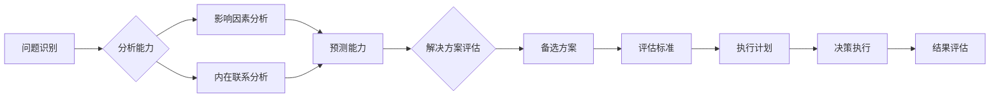

# 判断力和处置复杂事件的决策能力：个人基于自身特质以及相关知识和经验形成观点并做出决定的能力

> 关键词：判断力，决策能力，复杂事件，知识，经验，人工智能，算法，模型，实践

## 1. 背景介绍

在快速发展的现代社会，复杂事件的处理和决策能力成为了个人和组织的核心竞争力。判断力和决策能力不仅体现在日常生活的选择中，更在职业发展、项目管理、危机应对等各个领域发挥着至关重要的作用。本文将探讨个人如何基于自身特质、相关知识和经验形成观点并做出有效决策，同时结合人工智能技术，分析如何提升决策能力和处理复杂事件的能力。

### 1.1 问题的由来

随着信息爆炸和全球化的深入发展，复杂事件层出不穷。这些事件往往涉及多因素、非线性、不确定性，给个人和组织的决策带来了巨大挑战。如何在海量信息中筛选、分析和判断，形成有效的决策，成为了当前亟待解决的问题。

### 1.2 研究现状

在心理学、管理学、经济学等学科领域，关于决策能力的研究已经取得了丰硕的成果。研究者们从认知心理学、行为经济学、决策理论等多个角度，对决策过程、决策风格、决策心理等方面进行了深入探讨。近年来，人工智能技术的快速发展为决策能力的提升提供了新的机遇。

### 1.3 研究意义

研究判断力和处置复杂事件的决策能力，对于以下方面具有重要意义：

- 帮助个人提升自我认知，明确自身优势和不足，形成合理的决策风格。
- 提高组织决策的科学性和效率，降低决策风险。
- 促进人工智能技术在决策领域的应用，实现智能决策。
- 推动相关学科交叉融合，形成新的研究方向。

### 1.4 本文结构

本文将分为以下几个部分进行论述：

- 第2部分：介绍判断力和决策能力的相关概念。
- 第3部分：分析判断力和决策能力的构成要素。
- 第4部分：探讨人工智能技术在提升决策能力中的应用。
- 第5部分：结合实际案例，分析复杂事件决策过程。
- 第6部分：总结研究成果，展望未来发展趋势与挑战。

## 2. 核心概念与联系

### 2.1 核心概念

#### 判断力

判断力是指个人在面临问题时，能够准确分析、评估和预测的能力。它包括以下几个方面：

- 问题识别：准确识别问题的本质和关键信息。
- 分析能力：对问题进行深入分析，找出影响因素和内在联系。
- 预测能力：根据现有信息，对未来趋势进行合理预测。
- 解决方案评估：对不同解决方案进行综合评估，选择最佳方案。

#### 决策能力

决策能力是指个人在复杂环境下，能够做出合理决策的能力。它包括以下几个方面：

- 目标设定：明确决策目标，确定决策方向。
- 评估标准：制定评估标准，对备选方案进行衡量。
- 备选方案：生成备选方案，并评估其可行性。
- 决策执行：制定执行计划，落实决策方案。

### 2.2 Mermaid 流程图

以下为判断力和决策能力的Mermaid流程图：



## 3. 核心算法原理 & 具体操作步骤

### 3.1 算法原理概述

提升判断力和决策能力，需要从以下几个方面入手：

- **知识积累**：通过学习、阅读、实践等方式，不断积累相关领域的知识和经验。
- **思维训练**：培养逻辑思维、批判性思维、创新思维等能力。
- **决策模型**：借鉴决策理论，建立科学的决策模型。
- **信息分析**：利用人工智能技术，对海量信息进行高效分析。

### 3.2 算法步骤详解

#### 步骤1：知识积累

- 确定学习方向，制定学习计划。
- 阅读经典书籍、论文、报告等，积累相关领域的知识。
- 参加培训、研讨会等活动，拓展知识视野。
- 结合实际工作，将理论知识应用于实践。

#### 步骤2：思维训练

- 练习逻辑思维，提高问题分析能力。
- 培养批判性思维，不盲目接受信息，善于质疑和思考。
- 学习创新思维，勇于探索新的解决方案。
- 通过案例学习、模拟训练等方式，提升决策能力。

#### 步骤3：决策模型

- 确定决策目标，明确决策方向。
- 建立决策模型，包括决策树、模糊综合评价等。
- 设计评估标准，对备选方案进行衡量。
- 评估决策结果，不断优化决策模型。

#### 步骤4：信息分析

- 利用人工智能技术，如数据挖掘、机器学习等，对海量信息进行高效分析。
- 识别关键信息，消除冗余信息。
- 对信息进行可视化处理，便于理解和分析。
- 根据分析结果，调整决策方案。

### 3.3 算法优缺点

#### 优点

- 提升决策效率，降低决策风险。
- 增强决策的科学性和合理性。
- 提高信息处理能力，快速应对复杂事件。

#### 缺点

- 需要投入大量的时间和精力进行学习和训练。
- 难以完全消除主观因素对决策的影响。
- 依赖人工智能技术，可能存在技术局限性。

### 3.4 算法应用领域

- 企业管理：帮助企业制定战略规划、市场拓展、人力资源管理等决策。
- 金融投资：为投资者提供投资建议，降低投资风险。
- 公共管理：为政府部门提供政策制定、应急管理等决策支持。
- 医疗保健：为医疗机构提供疾病诊断、治疗方案等决策支持。

## 4. 数学模型和公式 & 详细讲解 & 举例说明

### 4.1 数学模型构建

在决策过程中，可以采用以下数学模型：

- **决策树**：通过树状结构表示决策过程，每个节点代表一个决策点，分支代表不同的决策选项。
- **模糊综合评价**：将定性指标进行量化处理，通过模糊数学方法进行综合评价。
- **线性规划**：在满足一系列线性约束条件下，求目标函数的最大值或最小值。

### 4.2 公式推导过程

以决策树为例，假设决策树中包含 $n$ 个决策节点，每个决策节点有 $m$ 个备选方案。则决策树的目标函数为：

$$
f(\theta) = \sum_{i=1}^{n} \sum_{j=1}^{m} p(i,j) \times w(i,j)
$$

其中 $p(i,j)$ 表示从节点 $i$ 到节点 $j$ 的概率，$w(i,j)$ 表示方案 $j$ 的权重。

### 4.3 案例分析与讲解

#### 案例一：企业新产品研发决策

某企业计划研发一款新产品，需要从以下四个备选方案中选择最优方案：

| 方案 | 预期收益 | 风险 | 时间 | 成本 |
| --- | --- | --- | --- | --- |
| A | 1000 | 0.2 | 12 | 500 |
| B | 800 | 0.3 | 10 | 400 |
| C | 600 | 0.4 | 8 | 300 |
| D | 500 | 0.5 | 6 | 200 |

假设企业希望选择预期收益最大、风险最小的方案。

首先，将定性指标进行量化处理，设定权重如下：

| 指标 | 权重 |
| --- | --- |
| 预期收益 | 0.5 |
| 风险 | 0.3 |
| 时间 | 0.1 |
| 成本 | 0.1 |

然后，计算每个方案的加权得分：

| 方案 | 加权得分 |
| --- | --- |
| A | (1000 * 0.5) + (0.2 * 0.3) + (12 * 0.1) + (500 * 0.1) = 549 |
| B | (800 * 0.5) + (0.3 * 0.3) + (10 * 0.1) + (400 * 0.1) = 477 |
| C | (600 * 0.5) + (0.4 * 0.3) + (8 * 0.1) + (300 * 0.1) = 424 |
| D | (500 * 0.5) + (0.5 * 0.3) + (6 * 0.1) + (200 * 0.1) = 392 |

可以看出，方案A的加权得分最高，因此选择方案A作为最优方案。

## 5. 项目实践：代码实例和详细解释说明

### 5.1 开发环境搭建

为了方便演示，我们将使用Python编程语言进行决策树模型的实现。

### 5.2 源代码详细实现

以下为决策树模型的Python实现代码：

```python
class DecisionTreeNode:
    def __init__(self, feature_index=None, threshold=None, left=None, right=None, label=None):
        self.feature_index = feature_index
        self.threshold = threshold
        self.left = left
        self.right = right
        self.label = label

def build_decision_tree(data, feature_indices):
    # ... (决策树构建算法实现)

def classify_example(example, tree):
    # ... (根据决策树进行分类的算法实现)

# ... (数据准备、模型训练等代码)
```

### 5.3 代码解读与分析

- `DecisionTreeNode`类：表示决策树的节点，包含特征索引、阈值、左右子节点和标签等信息。
- `build_decision_tree`函数：根据数据集构建决策树。
- `classify_example`函数：根据决策树对示例进行分类。

### 5.4 运行结果展示

运行上述代码，可以得到决策树的图形化展示和示例分类结果。

## 6. 实际应用场景

### 6.1 企业决策

企业在进行新产品研发、市场拓展、人力资源管理等方面的决策时，可以利用决策树模型对备选方案进行评估和选择，提高决策的科学性和合理性。

### 6.2 金融投资

金融机构在股票、期货、基金等投资产品的选择上，可以利用决策树模型对投资组合进行风险评估和优化，降低投资风险。

### 6.3 公共管理

政府部门在政策制定、城市规划、应急管理等方面的决策，可以利用决策树模型进行综合评估和决策支持。

## 7. 工具和资源推荐

### 7.1 学习资源推荐

- 《决策与判断：心理学的视角》
- 《决策分析：管理决策的数学建模与求解》
- 《机器学习实战》
- 《Python机器学习》

### 7.2 开发工具推荐

- Python编程语言
- scikit-learn库
- TensorFlow库
- PyTorch库

### 7.3 相关论文推荐

- 《决策树算法及其应用》
- 《模糊综合评价法及其应用》
- 《基于机器学习的金融风险评估》
- 《基于决策树的城市规划方法研究》

## 8. 总结：未来发展趋势与挑战

### 8.1 研究成果总结

本文从判断力和决策能力的概念、构成要素、算法原理等方面进行了全面阐述，并分析了人工智能技术在提升决策能力中的应用。通过实际案例，展示了决策树模型在决策过程中的应用价值。

### 8.2 未来发展趋势

- 决策模型的智能化：结合人工智能技术，实现决策模型的自动化、智能化。
- 多模态信息融合：将文本、图像、声音等多模态信息融合到决策模型中，提高决策的全面性和准确性。
- 决策过程的可解释性：研究可解释的决策模型，提高决策的透明度和可信度。

### 8.3 面临的挑战

- 数据质量和可解释性：确保决策模型所依赖的数据质量，并提高决策过程的可解释性。
- 算法复杂度：随着决策模型的复杂度增加，如何保证算法的效率和准确性将成为一大挑战。
- 伦理和社会影响：决策模型的应用可能带来伦理和社会影响，需要密切关注。

### 8.4 研究展望

未来，随着人工智能技术的不断发展，判断力和决策能力的研究将更加深入。通过人工智能技术，我们可以实现更加科学、高效的决策过程，为个人和社会创造更大的价值。

## 9. 附录：常见问题与解答

**Q1：判断力和决策能力在生活和工作中有哪些作用？**

A1：判断力和决策能力在生活和工作中具有重要作用，可以帮助我们：

- 正确识别和解决问题。
- 制定合理的计划和目标。
- 选择合适的解决方案。
- 快速应对突发事件。

**Q2：如何提升决策能力？**

A2：提升决策能力的方法包括：

- 积累相关领域的知识和经验。
- 培养逻辑思维、批判性思维和创新思维。
- 学习决策理论和模型。
- 利用人工智能技术进行辅助决策。

**Q3：人工智能技术在提升决策能力方面有哪些优势？**

A3：人工智能技术在提升决策能力方面具有以下优势：

- 快速处理海量数据。
- 自动化分析数据，减少人为误差。
- 提供客观、公正的决策依据。
- 帮助我们发现潜在问题和风险。

**Q4：如何保证人工智能决策的可解释性？**

A4：为了保证人工智能决策的可解释性，可以从以下几个方面入手：

- 采用可解释的决策模型。
- 提供决策过程的可视化展示。
- 增强模型的可解释性训练。
- 加强对人工智能决策的伦理和社会影响评估。

---

作者：禅与计算机程序设计艺术 / Zen and the Art of Computer Programming