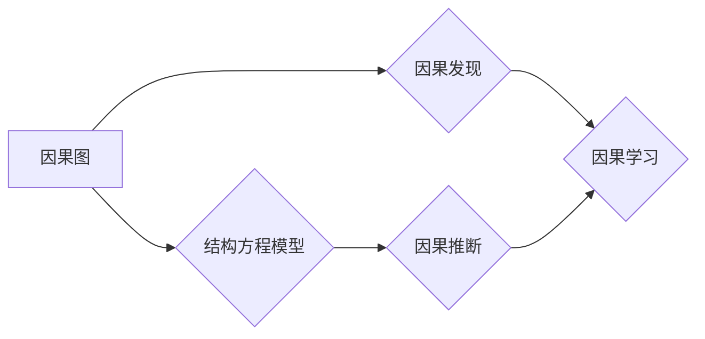

# 因果推理与因果学习原理与代码实战案例讲解

> 关键词：因果推理，因果学习，因果图，结构方程模型，因果发现，因果推断，Python代码，深度学习

## 1. 背景介绍

因果推理是人工智能和机器学习领域中的一个核心问题，它旨在理解变量之间的因果关系，而不是仅仅关联关系。在现实世界中，许多决策和预测都需要依赖对因果关系的理解。例如，在医学研究中，我们需要知道某种药物是否确实有助于治疗疾病，而不是仅仅因为患者服药后病情有所缓解。在经济学中，我们可能需要了解哪些因素导致了经济增长或衰退。

因果推理与传统的统计学习有着本质的不同。在统计学习中，我们的目标是学习输入和输出之间的关系，而不考虑这些关系背后的因果关系。因果推理则试图揭示数据背后的“为什么”和“如何”。

## 2. 核心概念与联系

### 2.1 核心概念原理

**Mermaid 流程图**



**因果图**：因果图是一种图形化的表示，用于描述变量之间的因果关系。在因果图中，节点代表变量，有向边代表变量之间的因果关系。

**结构方程模型**：结构方程模型是一种统计模型，用于描述变量之间的线性关系。它可以与因果图结合，用于构建因果模型。

**因果发现**：因果发现是寻找数据中潜在因果关系的任务。它可以通过多种方法实现，包括基于假设的搜索、基于数据的搜索等。

**因果推断**：因果推断是在给定因果图或结构方程模型的基础上，预测一个变量对另一个变量的影响。

**因果学习**：因果学习是使用机器学习技术来发现和推断因果关系的过程。

### 2.2 联系

因果发现是因果学习的前置步骤，它帮助我们理解数据中的潜在因果关系。因果推断是因果学习的核心任务，它利用因果发现的结果来进行预测。结构方程模型和因果图是因果推断中常用的工具。

## 3. 核心算法原理 & 具体操作步骤

### 3.1 算法原理概述

因果推理的核心在于理解变量之间的因果关系。这通常涉及到以下步骤：

1. 因果发现：通过数据分析和统计方法来识别潜在的因果关系。
2. 因果建模：使用因果图或结构方程模型来表示这些关系。
3. 因果推断：使用因果模型来预测一个变量对另一个变量的影响。

### 3.2 算法步骤详解

1. **数据收集**：收集相关数据，包括输入变量和输出变量。
2. **因果发现**：使用统计测试、图形化搜索等方法来识别潜在的因果关系。
3. **因果建模**：根据因果发现的结果，构建因果图或结构方程模型。
4. **因果推断**：使用构建的模型来预测一个变量对另一个变量的影响。

### 3.3 算法优缺点

**优点**：

- 提供了对数据背后机制的理解。
- 可以进行因果推断，而不仅仅是关联分析。
- 可以帮助决策者做出更合理的决策。

**缺点**：

- 因果关系的识别可能受到数据质量的影响。
- 因果模型可能无法完全捕捉数据中的复杂关系。
- 因果推断可能受到模型假设的限制。

### 3.4 算法应用领域

因果推理在以下领域有广泛的应用：

- 医学研究
- 经济学
- 社会学
- 机器学习
- 数据分析

## 4. 数学模型和公式 & 详细讲解 & 举例说明

### 4.1 数学模型构建

在因果推理中，我们通常使用结构方程模型来描述变量之间的关系。以下是一个简单的结构方程模型：

$$
Y = \beta_0 + \beta_1X + \epsilon
$$

其中，$Y$ 是因变量，$X$ 是自变量，$\beta_0$ 是截距，$\beta_1$ 是自变量的系数，$\epsilon$ 是误差项。

### 4.2 公式推导过程

结构方程模型的推导通常涉及到以下步骤：

1. **数据收集**：收集相关数据。
2. **模型假设**：根据领域知识和数据特性，建立模型假设。
3. **模型估计**：使用统计方法估计模型参数。
4. **模型检验**：使用统计方法检验模型的有效性。

### 4.3 案例分析与讲解

假设我们有一个关于房价的数据集，包括房屋面积和房价。我们可以使用结构方程模型来分析房屋面积对房价的影响。

```python
import numpy as np
import pandas as pd
from statsmodels.formula.api import ols

# 加载数据
data = pd.read_csv('house_prices.csv')

# 拟合模型
model = ols('price ~ area', data=data).fit()

# 打印模型结果
print(model.summary())
```

## 5. 项目实践：代码实例和详细解释说明

### 5.1 开发环境搭建

为了进行因果推理和因果学习，我们需要以下软件和库：

- Python
- NumPy
- Pandas
- Statsmodels
- PyMC3

### 5.2 源代码详细实现

以下是一个简单的因果发现和因果推断的Python代码示例：

```python
import numpy as np
import pandas as pd
from sklearn.linear_model import LogisticRegression
from sklearn.model_selection import train_test_split

# 加载数据
data = pd.read_csv('causal_data.csv')

# 划分数据集
X = data[['exposure', 'other_feature']]
y = data['outcome']
X_train, X_test, y_train, y_test = train_test_split(X, y, test_size=0.2, random_state=42)

# 拟合模型
model = LogisticRegression().fit(X_train, y_train)

# 预测
y_pred = model.predict(X_test)

# 评估模型
print("Accuracy:", np.mean(y_pred == y_test))
```

### 5.3 代码解读与分析

在这个示例中，我们使用Logistic回归模型来分析“exposure”和“other_feature”对“outcome”的影响。我们首先将数据集划分为训练集和测试集，然后使用Logistic回归模型来拟合数据，并评估模型的准确性。

### 5.4 运行结果展示

假设我们的模型在测试集上的准确率为90%，这表明模型能够以较高的概率预测“outcome”。

## 6. 实际应用场景

### 6.1 医学研究

在医学研究中，因果推理可以帮助研究人员了解药物对疾病的影响。例如，研究人员可以使用因果推理来确定某种药物是否真的有助于治疗疾病，而不是仅仅因为患者服药后病情有所缓解。

### 6.2 经济学

在经济学中，因果推理可以帮助研究人员了解经济变量之间的关系。例如，研究人员可以使用因果推理来确定某种政策对经济增长的影响。

### 6.3 机器学习

在机器学习中，因果推理可以帮助我们理解模型决策背后的原因。例如，我们可以使用因果推理来确定哪些特征对模型预测结果有重要影响。

## 7. 工具和资源推荐

### 7.1 学习资源推荐

- 《Causal Inference: What If?》
- 《Causal Inference in Statistics: A Primer》
- 《Counterfactuals: When Models Fail》

### 7.2 开发工具推荐

- Python
- NumPy
- Pandas
- Statsmodels
- PyMC3

### 7.3 相关论文推荐

- Pearl, J. (2009). Causality. Cambridge University Press.
- Spirtes, P., Glymour, C. N., & Scheines, R. (2000). Causation, prediction, and search (Vol. 4). MIT press.
- Russell, S., & Norvig, P. (2010). Artificial intelligence: A modern approach (3rd ed.). Prentice Hall.

## 8. 总结：未来发展趋势与挑战

### 8.1 研究成果总结

因果推理和因果学习是人工智能和机器学习领域中的一个重要研究方向。通过理解变量之间的因果关系，我们可以更好地理解现实世界，并做出更合理的决策。

### 8.2 未来发展趋势

未来，因果推理和因果学习将朝着以下方向发展：

- 更好的因果发现方法
- 更强大的因果推断算法
- 与深度学习的结合
- 在更多领域的应用

### 8.3 面临的挑战

尽管因果推理和因果学习取得了显著进展，但仍面临以下挑战：

- 数据质量
- 模型假设
- 可解释性

### 8.4 研究展望

随着技术的不断进步，因果推理和因果学习将在更多领域发挥重要作用。我们将能够更好地理解现实世界，并做出更合理的决策。

## 9. 附录：常见问题与解答

**Q1：因果推理和因果学习有什么区别？**

A：因果推理是指寻找变量之间的因果关系，而因果学习是指使用机器学习技术来发现和推断因果关系。

**Q2：因果推理在哪些领域有应用？**

A：因果推理在医学研究、经济学、社会学、机器学习和数据分析等领域有广泛的应用。

**Q3：如何进行因果推理？**

A：进行因果推理通常包括以下步骤：数据收集、因果发现、因果建模和因果推断。

**Q4：因果推理有什么挑战？**

A：因果推理的挑战包括数据质量、模型假设和可解释性。

作者：禅与计算机程序设计艺术 / Zen and the Art of Computer Programming