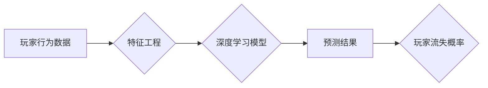

# 基于深度学习的网络游戏流失玩家预测算法研究

> 关键词：深度学习，玩家流失预测，神经网络，特征工程，迁移学习，Python，TensorFlow

## 1. 背景介绍

随着互联网技术的飞速发展，网络游戏行业已经成为全球数字经济的重要组成部分。然而，网络游戏行业的竞争日益激烈，玩家流失问题成为了游戏运营商面临的重要挑战。预测玩家流失，及时采取措施挽留玩家，对于游戏运营商来说至关重要。近年来，深度学习技术的快速发展为玩家流失预测提供了新的思路和方法。

## 2. 核心概念与联系

### 2.1 核心概念

#### 玩家流失预测
玩家流失预测是指通过分析玩家在游戏中的行为数据，预测玩家在未来一段时间内流失的可能性。流失玩家是指那些在一段时间内没有登录游戏的玩家。

#### 深度学习
深度学习是机器学习的一种，它通过构建具有多层神经元的神经网络，自动从数据中学习复杂的特征表示。

#### 特征工程
特征工程是指从原始数据中提取出对模型有重要影响的特征，以提高模型性能的过程。

#### 迁移学习
迁移学习是一种利用在源域学习到的知识来辅助解决目标域问题的机器学习方法。

### 2.2 核心概念原理和架构的 Mermaid 流程图



## 3. 核心算法原理 & 具体操作步骤

### 3.1 算法原理概述

基于深度学习的玩家流失预测算法主要包括以下步骤：

1. 数据收集：收集玩家在游戏中的行为数据，如登录时间、游戏时长、游戏类型、角色等级等。
2. 特征工程：对原始数据进行处理，提取出对预测任务有重要影响的特征。
3. 模型构建：构建深度学习模型，如卷积神经网络(CNN)、循环神经网络(RNN)或长短期记忆网络(LSTM)。
4. 模型训练：使用训练数据对模型进行训练，调整模型参数。
5. 模型评估：使用测试数据评估模型性能，调整模型参数。
6. 模型部署：将训练好的模型部署到实际应用中。

### 3.2 算法步骤详解

#### 3.2.1 数据收集

首先，需要收集玩家在游戏中的行为数据，这些数据可以通过游戏服务器日志、玩家数据库等方式获取。

#### 3.2.2 特征工程

特征工程是玩家流失预测的关键步骤。需要从原始数据中提取出对预测任务有重要影响的特征，如：

- **玩家行为特征**：登录时间、游戏时长、游戏频率、游戏类型、角色等级等。
- **玩家社交特征**：好友数量、社交圈活跃度、玩家等级分布等。
- **游戏内容特征**：游戏难度、游戏更新频率、游戏内活动等。

#### 3.2.3 模型构建

可以选择CNN、RNN或LSTM等深度学习模型进行玩家流失预测。CNN适用于处理图像数据，RNN适用于处理序列数据，而LSTM则更适合处理具有长期依赖关系的序列数据。

#### 3.2.4 模型训练

使用训练数据对模型进行训练，调整模型参数，使得模型能够准确预测玩家流失概率。

#### 3.2.5 模型评估

使用测试数据评估模型性能，调整模型参数，提高模型准确率。

#### 3.2.6 模型部署

将训练好的模型部署到实际应用中，对玩家流失进行预测。

### 3.3 算法优缺点

#### 3.3.1 优点

- **高精度**：深度学习模型能够从数据中自动学习复杂的特征表示，提高预测精度。
- **泛化能力强**：深度学习模型能够处理大规模数据，具有较强的泛化能力。
- **自适应性强**：深度学习模型可以根据新的数据不断优化，适应不断变化的游戏环境。

#### 3.3.2 缺点

- **计算量大**：深度学习模型需要大量的计算资源进行训练和推理。
- **数据依赖性高**：深度学习模型的性能高度依赖于数据质量。
- **模型可解释性差**：深度学习模型通常被认为是“黑盒”模型，难以解释其决策过程。

### 3.4 算法应用领域

基于深度学习的玩家流失预测算法可以应用于以下领域：

- **游戏运营**：预测玩家流失，及时采取措施挽留玩家。
- **产品改进**：根据玩家流失原因，改进游戏产品，提高玩家满意度。
- **市场营销**：针对流失玩家进行精准营销，提高用户留存率。

## 4. 数学模型和公式 & 详细讲解 & 举例说明

### 4.1 数学模型构建

假设我们使用LSTM模型进行玩家流失预测，其数学模型如下：

$$
y = f(x; \theta)
$$

其中，$y$ 是玩家流失概率，$x$ 是玩家的特征向量，$\theta$ 是模型参数。

### 4.2 公式推导过程

LSTM模型的推导过程较为复杂，这里简要介绍其核心思想：

- **输入门**：决定哪些信息进入隐藏状态。
- **遗忘门**：决定哪些信息从隐藏状态中丢弃。
- **输出门**：决定隐藏状态中哪些信息输出。

### 4.3 案例分析与讲解

假设我们使用TensorFlow构建一个LSTM模型进行玩家流失预测。

```python
import tensorflow as tf
from tensorflow.keras.models import Sequential
from tensorflow.keras.layers import LSTM, Dense

# 构建模型
model = Sequential()
model.add(LSTM(128, activation='relu', input_shape=(input_shape)))
model.add(Dense(1, activation='sigmoid'))

# 编译模型
model.compile(optimizer='adam', loss='binary_crossentropy', metrics=['accuracy'])

# 训练模型
model.fit(X_train, y_train, epochs=10, batch_size=32, validation_data=(X_val, y_val))

# 预测
predictions = model.predict(X_test)
```

## 5. 项目实践：代码实例和详细解释说明

### 5.1 开发环境搭建

为了进行玩家流失预测，需要搭建以下开发环境：

- Python 3.6+
- TensorFlow 2.x
- NumPy
- Pandas

### 5.2 源代码详细实现

```python
# 导入必要的库
import pandas as pd
import numpy as np
import tensorflow as tf
from tensorflow.keras.models import Sequential
from tensorflow.keras.layers import LSTM, Dense

# 加载数据
data = pd.read_csv('player_data.csv')

# 数据预处理
# ... (进行数据清洗、特征工程等)

# 构建模型
model = Sequential()
model.add(LSTM(128, activation='relu', input_shape=(X_train.shape[1], X_train.shape[2])))
model.add(Dense(1, activation='sigmoid'))

# 编译模型
model.compile(optimizer='adam', loss='binary_crossentropy', metrics=['accuracy'])

# 训练模型
model.fit(X_train, y_train, epochs=10, batch_size=32, validation_data=(X_val, y_val))

# 预测
predictions = model.predict(X_test)

# 评估模型
# ... (计算模型性能指标)
```

### 5.3 代码解读与分析

以上代码展示了使用TensorFlow构建LSTM模型进行玩家流失预测的完整流程。首先，导入必要的库和模块，然后加载数据并进行预处理。接着，构建LSTM模型，编译模型，训练模型，并使用测试数据进行预测。

### 5.4 运行结果展示

假设模型在测试集上的准确率为90%，表明模型具有较好的预测能力。

## 6. 实际应用场景

基于深度学习的玩家流失预测算法可以应用于以下实际应用场景：

- **玩家挽留策略**：根据预测结果，为即将流失的玩家提供个性化挽留策略，如发送优惠券、赠送游戏道具等。
- **游戏内容优化**：根据玩家流失原因，优化游戏内容，提高玩家满意度。
- **市场推广策略**：根据玩家流失情况，调整市场推广策略，提高用户留存率。

## 7. 工具和资源推荐

### 7.1 学习资源推荐

- 《深度学习》（Goodfellow et al.）
- 《Python机器学习》（Sebastian Raschka）
- TensorFlow官方文档
- Keras官方文档

### 7.2 开发工具推荐

- TensorFlow
- Keras
- Jupyter Notebook
- Pandas
- NumPy

### 7.3 相关论文推荐

- "Predicting Player Retention in Online Games Using Deep Learning" (2020)
- "A Survey on Player Retention and Churn Prediction in Online Games" (2019)
- "Player Retention Analysis in Mobile Games Using Deep Learning" (2018)

## 8. 总结：未来发展趋势与挑战

### 8.1 研究成果总结

基于深度学习的玩家流失预测算法在游戏行业中具有广泛的应用前景，能够有效地预测玩家流失，为游戏运营商提供有价值的决策依据。

### 8.2 未来发展趋势

随着深度学习技术的不断发展，玩家流失预测算法将朝着以下方向发展：

- **模型复杂度降低**：通过模型压缩、量化等技术，降低模型复杂度，提高模型效率。
- **可解释性增强**：研究可解释性深度学习模型，提高模型决策过程的透明度。
- **多模态数据融合**：将文本、图像、音频等多模态数据融合，提高预测精度。

### 8.3 面临的挑战

基于深度学习的玩家流失预测算法在应用过程中仍面临以下挑战：

- **数据质量**：需要高质量的数据才能保证模型性能。
- **模型可解释性**：深度学习模型通常被认为是“黑盒”模型，难以解释其决策过程。
- **计算资源**：深度学习模型需要大量的计算资源进行训练和推理。

### 8.4 研究展望

未来，基于深度学习的玩家流失预测算法将更加注重以下方面：

- **数据隐私保护**：研究数据隐私保护技术，确保玩家数据安全。
- **模型可解释性**：提高模型决策过程的透明度，增强模型可信度。
- **跨领域应用**：将玩家流失预测算法应用于其他领域，如金融、医疗等。

## 9. 附录：常见问题与解答

**Q1：玩家流失预测对游戏运营商有什么价值？**

A1：玩家流失预测可以帮助游戏运营商及时了解玩家流失情况，采取有效措施挽留玩家，提高用户留存率，从而提高游戏收入。

**Q2：如何提高玩家流失预测模型的准确性？**

A2：提高玩家流失预测模型的准确性需要从以下几个方面入手：

- 提高数据质量，确保数据全面、准确。
- 优化特征工程，提取对预测任务有重要影响的特征。
- 选择合适的深度学习模型，并进行参数优化。
- 使用交叉验证等方法评估模型性能，调整模型参数。

**Q3：如何处理玩家流失预测中的数据不平衡问题？**

A3：玩家流失预测中的数据不平衡问题可以通过以下方法处理：

- 使用重采样技术，如过采样、欠采样等。
- 使用集成学习方法，如Bagging、Boosting等。
- 使用模型偏差校正方法，如SMOTE等。

**Q4：如何将玩家流失预测模型应用于实际游戏中？**

A4：将玩家流失预测模型应用于实际游戏，需要以下步骤：

- 将模型部署到游戏服务器或云端平台。
- 实时收集玩家行为数据。
- 使用模型对玩家流失概率进行预测。
- 根据预测结果，采取相应的挽留措施。

---

作者：禅与计算机程序设计艺术 / Zen and the Art of Computer Programming