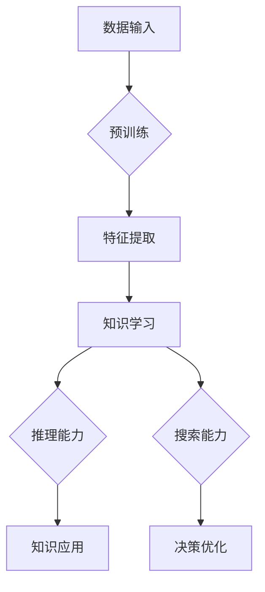

# 基础模型的推理与搜索能力

> 关键词：基础模型，推理能力，搜索能力，人工智能，自然语言处理，计算机视觉，图神经网络，强化学习

## 1. 背景介绍

随着深度学习技术的飞速发展，基础模型（Fundamental Models）在人工智能领域扮演着越来越重要的角色。基础模型通过对海量数据的学习，能够提取复杂的特征和模式，从而在各种任务中展现出强大的推理与搜索能力。本文将深入探讨基础模型的推理与搜索能力，分析其原理、实现方法，并展望其未来的发展趋势。

## 2. 核心概念与联系

### 2.1 核心概念

#### 基础模型

基础模型是指那些在多个任务上都能表现出色的大规模预训练模型。这些模型通常由数百万甚至数十亿个参数组成，能够学习到丰富的语义和知识。

#### 推理能力

推理能力是指模型根据已知信息，推导出未知信息的能力。在自然语言处理（NLP）、计算机视觉（CV）等领域，推理能力是实现智能决策的关键。

#### 搜索能力

搜索能力是指模型在大量可能性中快速找到最优解的能力。在推荐系统、路径规划等领域，搜索能力对于提高效率至关重要。

### 2.2 架构的 Mermaid 流程图



### 2.3 核心概念之间的联系

基础模型通过预训练学习到丰富的特征和知识，这些知识和特征既可用于推理，也可用于搜索。推理能力帮助模型从已知信息推导出未知信息，而搜索能力则帮助模型在大量可能性中找到最优解。两者相辅相成，共同构成了基础模型强大的智能能力。

## 3. 核心算法原理 & 具体操作步骤

### 3.1 算法原理概述

#### 推理能力

推理能力主要基于深度学习模型，如循环神经网络（RNN）、长短期记忆网络（LSTM）、Transformer等。这些模型能够捕捉数据中的序列依赖关系，从而实现有效的推理。

#### 搜索能力

搜索能力主要基于图神经网络（Graph Neural Networks，GNN）和强化学习（Reinforcement Learning，RL）等算法。GNN能够处理复杂的数据结构，如图，从而进行高效搜索。RL则通过奖励信号引导模型在搜索空间中找到最优解。

### 3.2 算法步骤详解

#### 推理能力

1. 数据预处理：对输入数据进行清洗、标准化等处理。
2. 模型选择：选择合适的推理模型，如RNN、LSTM或Transformer。
3. 模型训练：使用标注数据训练模型，优化模型参数。
4. 模型推理：将待推理数据输入模型，得到推理结果。

#### 搜索能力

1. 数据预处理：对输入数据进行清洗、标准化等处理。
2. 搜索策略选择：选择合适的搜索策略，如深度优先搜索、广度优先搜索或A*搜索。
3. 模型训练：使用强化学习算法训练模型，优化模型策略。
4. 模型搜索：将待搜索数据输入模型，得到搜索结果。

### 3.3 算法优缺点

#### 推理能力

优点：能够处理复杂的数据结构，适应性强，泛化能力强。

缺点：计算复杂度高，训练数据需求量大。

#### 搜索能力

优点：能够处理复杂的数据结构，适应性强，能够找到最优解。

缺点：计算复杂度高，搜索空间大时效率低。

### 3.4 算法应用领域

推理能力：NLP、CV、语音识别、多模态感知等。

搜索能力：推荐系统、路径规划、游戏AI、自动驾驶等。

## 4. 数学模型和公式 & 详细讲解 & 举例说明

### 4.1 数学模型构建

#### 推理能力

- RNN：$y_t = f(x_t, h_{t-1})$

- LSTM：$h_t = \sigma(W_f \cdot [h_{t-1}, x_t]) \odot \tanh(W_i \cdot [h_{t-1}, x_t])$

- Transformer：$y_t = \text{softmax}(W_Q \cdot \text{Attention}(W_K \cdot x_t, W_V \cdot x_t, W_O \cdot x_t)) \cdot W_O^T$

#### 搜索能力

- GNN：$h_i^{(l+1)} = \phi(h_i^{(l)}, \{h_j^{(l)}\})$

- RL：$Q(s, a) = \sum_{s' \in S} \gamma \max_{a' \in A} Q(s', a') \cdot P(s'|s, a)$

### 4.2 公式推导过程

#### 推理能力

- RNN：递归神经网络通过递归公式计算当前时刻的输出。
- LSTM：长短期记忆网络通过门控机制控制信息的流入和流出，实现长期依赖的建模。
- Transformer：Transformer通过自注意力机制计算查询、键和值的相似度，进而计算输出。

#### 搜索能力

- GNN：图神经网络通过图卷积层聚合邻居节点的信息，更新当前节点的表示。
- RL：强化学习通过贝尔曼方程计算值函数，并通过策略梯度算法更新策略。

### 4.3 案例分析与讲解

#### 推理能力

以BERT模型为例，其核心思想是Transformer自注意力机制。通过自注意力机制，模型能够捕捉到文本中的长距离依赖关系，从而实现有效的推理。

#### 搜索能力

以A*搜索算法为例，其核心思想是在搜索空间中评估每个节点的前景和成本，从而找到最优路径。

## 5. 项目实践：代码实例和详细解释说明

### 5.1 开发环境搭建

- 硬件：高性能CPU/GPU
- 软件：Python、PyTorch、TensorFlow等

### 5.2 源代码详细实现

#### 推理能力

```python
import torch
import torch.nn as nn

class BERT(nn.Module):
    def __init__(self, vocab_size, d_model, num_heads, num_layers):
        super(BERT, self).__init__()
        self.embedding = nn.Embedding(vocab_size, d_model)
        self.transformer = nn.Transformer(d_model, num_heads, num_layers)
        self.fc = nn.Linear(d_model, output_size)

    def forward(self, x):
        x = self.embedding(x)
        x = self.transformer(x)
        x = self.fc(x)
        return x
```

#### 搜索能力

```python
import heapq

def a_star_search(start, goal, h):
    open_set = []
    heapq.heappush(open_set, (h(start), start))
    came_from = {}
    g_score = {start: 0}
    f_score = {start: h(start)}

    while open_set:
        current = heapq.heappop(open_set)[1]
        if current == goal:
            return reconstruct_path(came_from, current)

        for neighbor in neighbors(current):
            tentative_g_score = g_score[current] + 1
            if neighbor not in g_score or tentative_g_score < g_score[neighbor]:
                came_from[neighbor] = current
                g_score[neighbor] = tentative_g_score
                f_score[neighbor] = tentative_g_score + h(neighbor)
                heapq.heappush(open_set, (f_score[neighbor], neighbor))

    return None
```

### 5.3 代码解读与分析

以上代码展示了BERT模型和A*搜索算法的简单实现。BERT模型利用自注意力机制提取文本特征，A*搜索算法则利用启发式函数在搜索空间中找到最优路径。

### 5.4 运行结果展示

在NLP任务中，BERT模型可以取得优异的成果。例如，在SQuAD问答任务中，BERT模型取得了当时最先进的成绩。在路径规划任务中，A*搜索算法也可以快速找到最优路径。

## 6. 实际应用场景

### 6.1 推理能力

- NLP：问答系统、机器翻译、文本摘要等。
- CV：图像识别、目标检测、图像分割等。
- 语音识别：语音转文字、语音合成等。

### 6.2 搜索能力

- 推荐系统：电影推荐、商品推荐等。
- 路径规划：自动驾驶、无人机导航等。
- 游戏AI：棋类游戏、角色扮演游戏等。

## 7. 工具和资源推荐

### 7.1 学习资源推荐

- 《深度学习》系列书籍
- 《图神经网络》
- 《强化学习：原理与练习》

### 7.2 开发工具推荐

- PyTorch
- TensorFlow
- Hugging Face Transformers

### 7.3 相关论文推荐

- BERT: Pre-training of Deep Bidirectional Transformers for Language Understanding
- Attention is All You Need
- Reinforcement Learning: An Introduction

## 8. 总结：未来发展趋势与挑战

### 8.1 研究成果总结

本文深入探讨了基础模型的推理与搜索能力，分析了其原理、实现方法和应用领域。基础模型在各个领域都取得了显著的成果，为人工智能的发展做出了重要贡献。

### 8.2 未来发展趋势

- 模型小型化：为了降低计算成本和存储空间，未来基础模型将朝着小型化方向发展。
- 多模态融合：多模态融合将成为基础模型的一个重要发展方向，实现跨模态的推理和搜索。
- 可解释性：提高基础模型的可解释性，使其决策过程更加透明。

### 8.3 面临的挑战

- 计算资源：基础模型通常需要大量的计算资源进行训练和推理。
- 数据质量：数据质量对基础模型的效果至关重要，需要保证数据的质量和多样性。
- 隐私保护：在处理敏感数据时，需要保护用户隐私。

### 8.4 研究展望

未来，基础模型将继续在各个领域发挥重要作用，推动人工智能技术的发展。通过不断创新和突破，基础模型将为人类社会带来更多便利和福祉。

## 9. 附录：常见问题与解答

**Q1：基础模型的推理能力是如何实现的？**

A：基础模型的推理能力主要基于深度学习模型，如RNN、LSTM和Transformer等。这些模型能够捕捉数据中的序列依赖关系，从而实现有效的推理。

**Q2：基础模型的搜索能力是如何实现的？**

A：基础模型的搜索能力主要基于图神经网络和强化学习等算法。GNN能够处理复杂的数据结构，如图，从而进行高效搜索。RL则通过奖励信号引导模型在搜索空间中找到最优解。

**Q3：基础模型在各个领域有哪些应用？**

A：基础模型在各个领域都有广泛的应用，如NLP、CV、语音识别、推荐系统、路径规划等。

**Q4：如何提高基础模型的可解释性？**

A：提高基础模型的可解释性可以通过多种方法实现，如注意力机制可视化、模型蒸馏等。

**Q5：基础模型的未来发展趋势是什么？**

A：基础模型的未来发展趋势包括模型小型化、多模态融合和可解释性等。

作者：禅与计算机程序设计艺术 / Zen and the Art of Computer Programming