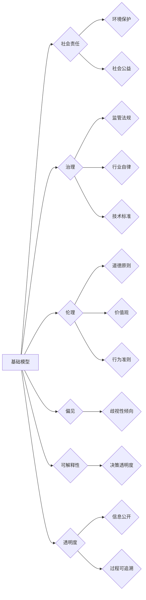

# 基础模型的社会责任与治理

> 关键词：基础模型，人工智能，社会责任，治理，伦理，偏见，可解释性，透明度

## 1. 背景介绍

随着人工智能技术的飞速发展，基础模型（如神经网络、深度学习模型等）已经渗透到我们生活的方方面面。从智能助手到自动驾驶，从医疗诊断到金融分析，基础模型的应用领域不断扩大，为人类社会带来了前所未有的便利和效率。然而，随着技术进步，基础模型也带来了一系列社会问题，如算法偏见、隐私泄露、安全风险等。因此，探讨基础模型的社会责任与治理成为了一个亟待解决的问题。

### 1.1 问题的由来

近年来，人工智能领域发生了一系列重大事件，引发了对基础模型社会责任和治理的关注：

1. **偏见事件**：一些基础模型在性别、种族、年龄等方面存在偏见，导致不公平的决策结果，如亚马逊的招聘算法歧视女性候选人。

2. **隐私泄露**：基础模型在收集、处理和使用个人数据时，可能存在隐私泄露的风险，如人脸识别技术被用于非法监控。

3. **安全风险**：恶意攻击者可能利用基础模型进行网络攻击、制造虚假信息等。

4. **不可解释性**：基础模型的决策过程往往缺乏可解释性，难以理解和信任。

### 1.2 研究现状

针对基础模型的社会责任与治理问题，学术界和产业界已经开展了一系列研究，主要包括：

1. **伦理原则**：制定人工智能伦理原则，如公平性、透明度、可解释性等。

2. **算法评估**：开发用于评估基础模型性能和偏见的指标和方法。

3. **治理机制**：建立人工智能治理体系，包括监管法规、行业自律、技术标准等。

### 1.3 研究意义

研究基础模型的社会责任与治理，对于保障人工智能健康、可持续发展具有重要意义：

1. **维护社会公平正义**：避免算法偏见，确保人工智能技术公平、公正地服务于所有人。

2. **保护个人隐私**：加强数据安全和隐私保护，防止个人信息泄露和滥用。

3. **保障安全稳定**：防范人工智能技术带来的安全风险，维护社会稳定。

4. **促进技术健康发展**：推动人工智能技术合规、有序地发展，为人类社会创造更多价值。

### 1.4 本文结构

本文将围绕基础模型的社会责任与治理展开讨论，主要内容如下：

- 第2部分，介绍基础模型的社会责任与治理的核心概念。
- 第3部分，分析基础模型存在的伦理问题及其根源。
- 第4部分，探讨基础模型的社会责任与治理体系构建。
- 第5部分，提出基础模型的社会责任与治理实践建议。
- 第6部分，展望基础模型的社会责任与治理的未来发展趋势。
- 第7部分，总结全文，提出研究展望。

## 2. 核心概念与联系

为了更好地理解基础模型的社会责任与治理，本节将介绍几个核心概念及其相互关系。

### 2.1 核心概念

1. **基础模型**：指用于解决特定任务的人工智能模型，如神经网络、深度学习模型等。
2. **社会责任**：指企业或组织在经营活动中应承担的社会责任，包括环境保护、社会公益、道德伦理等。
3. **治理**：指对某一领域或系统的管理、规范和监督，以确保其健康、可持续发展。
4. **伦理**：指关于道德、价值观和行为准则的哲学研究。
5. **偏见**：指在决策过程中，对某些群体或个体存在歧视性倾向。
6. **可解释性**：指模型决策过程的透明度，使人们能够理解模型的决策依据。
7. **透明度**：指信息、过程和决策的公开性、可追溯性。

### 2.2 Mermaid 流程图

以下是基于上述核心概念的 Mermaid 流程图：



从流程图中可以看出，基础模型与社会责任、治理、伦理、偏见、可解释性和透明度等多个方面密切相关。其中，社会责任和治理是核心，其他概念则是其子集或影响因素。

## 3. 核心算法原理 & 具体操作步骤

### 3.1 算法原理概述

基础模型的社会责任与治理涉及多个方面，以下分别介绍其主要原理：

1. **伦理原则**：基于道德、价值观和行为准则，确保人工智能技术的应用符合伦理规范。
2. **算法评估**：通过指标和方法评估基础模型的性能、偏见和可解释性。
3. **治理机制**：建立监管法规、行业自律和技术标准，对基础模型进行管理、规范和监督。

### 3.2 算法步骤详解

#### 3.2.1 伦理原则

1. **公平性**：确保人工智能技术在性别、种族、年龄等方面不存在歧视性。
2. **透明度**：提高基础模型决策过程的透明度，使人们能够理解模型的决策依据。
3. **可解释性**：开发可解释性方法，使人们能够解释模型的决策过程。
4. **隐私保护**：确保个人数据的安全和隐私。

#### 3.2.2 算法评估

1. **性能评估**：使用准确率、召回率、F1值等指标评估模型性能。
2. **偏见评估**：使用偏差检测、敏感性分析等方法评估模型是否存在偏见。
3. **可解释性评估**：使用注意力机制、解释性增强等方法评估模型可解释性。

#### 3.2.3 治理机制

1. **监管法规**：制定针对人工智能的法律法规，规范基础模型的应用。
2. **行业自律**：建立行业规范和标准，引导企业自律。
3. **技术标准**：制定技术标准，提高基础模型的质量和可靠性。

### 3.3 算法优缺点

#### 3.3.1 伦理原则

**优点**：

1. 确保人工智能技术的应用符合伦理规范，维护社会公平正义。
2. 提高人们对人工智能技术的信任度。

**缺点**：

1. 伦理原则难以量化，难以进行精确评估。
2. 伦理原则可能存在争议，难以达成共识。

#### 3.3.2 算法评估

**优点**：

1. 提高基础模型的质量和可靠性。
2. 帮助人们了解模型的性能和偏见。

**缺点**：

1. 评估指标和方法可能存在局限性。
2. 评估过程可能需要大量时间和资源。

#### 3.3.3 治理机制

**优点**：

1. 规范基础模型的应用，保障社会安全和稳定。
2. 提高基础模型的质量和可靠性。

**缺点**：

1. 监管法规和行业规范可能存在滞后性。
2. 技术标准可能难以适应快速发展的技术。

### 3.4 算法应用领域

基础模型的社会责任与治理在以下领域具有广泛应用：

1. **智能招聘**：避免招聘算法的性别、种族偏见，实现公平招聘。
2. **医疗诊断**：提高诊断的准确性和可解释性，保障患者权益。
3. **金融风控**：降低欺诈风险，保障金融安全。
4. **自动驾驶**：确保自动驾驶车辆的安全性和可靠性。

## 4. 数学模型和公式 & 详细讲解 & 举例说明

### 4.1 数学模型构建

为了评估基础模型的性能和偏见，我们可以构建以下数学模型：

#### 4.1.1 性能评估

假设有 $N$ 个样本，其中 $y_i$ 为真实标签，$\hat{y}_i$ 为模型预测标签，则准确率 $P$ 定义为：

$$
P = \frac{\sum_{i=1}^N \mathbb{1}_{y_i = \hat{y}_i}}{N}
$$

其中 $\mathbb{1}_{y_i = \hat{y}_i}$ 为指示函数，当 $y_i = \hat{y}_i$ 时，取值为1，否则为0。

#### 4.1.2 偏见评估

假设有 $N$ 个样本，其中 $x_i$ 为输入特征，$y_i$ 为真实标签，$\hat{y}_i$ 为模型预测标签，$x_{i,j}$ 为特征 $j$ 在样本 $i$ 上的取值，$P_j^+$ 和 $P_j^-$ 分别为特征 $j$ 在正样本和负样本中的平均值，则特征 $j$ 的偏差 $D_j$ 定义为：

$$
D_j = \frac{\sum_{i=1}^N (x_{i,j} - \frac{1}{2}(P_j^+ + P_j^-))(\hat{y}_i - y_i)}{\sum_{i=1}^N (x_{i,j} - \frac{1}{2}(P_j^+ + P_j^-))^2}
$$

### 4.2 公式推导过程

以下以准确率 $P$ 的公式推导为例。

#### 4.2.1 准确率 $P$ 的公式推导

根据准确率的定义，我们有：

$$
P = \frac{\sum_{i=1}^N \mathbb{1}_{y_i = \hat{y}_i}}{N}
$$

将指示函数 $\mathbb{1}_{y_i = \hat{y}_i}$ 展开为：

$$
\mathbb{1}_{y_i = \hat{y}_i} = \begin{cases} 
1 & \text{if } y_i = \hat{y}_i \\
0 & \text{if } y_i \neq \hat{y}_i 
\end{cases}
$$

则准确率 $P$ 可以表示为：

$$
P = \frac{\sum_{i=1}^N \mathbb{1}_{y_i = \hat{y}_i}}{N} = \frac{1}{N}\sum_{i=1}^N \mathbb{1}_{y_i = \hat{y}_i}
$$

### 4.3 案例分析与讲解

假设有一个包含100个样本的二分类任务，其中正样本和负样本各占50个。模型预测结果如下表所示：

| 真实标签 | 预测标签 |
| :----: | :----: |
| 正样本 | 正样本 |
| 正样本 | 负样本 |
| 负样本 | 正样本 |
| 负样本 | 负样本 |

根据准确率 $P$ 的公式，我们可以计算出：

$$
P = \frac{2}{4} = 0.5
$$

这表明模型的准确率为50%。然而，我们需要进一步分析模型是否存在偏见。

根据偏差 $D_j$ 的公式，我们可以计算出每个特征的偏差：

$$
D_{0} = -0.5, \quad D_{1} = 0.5
$$

这说明第一个特征在预测正样本时倾向于预测错误，而第二个特征在预测负样本时倾向于预测错误，存在偏见。

## 5. 项目实践：代码实例和详细解释说明

### 5.1 开发环境搭建

为了进行基础模型的社会责任与治理实践，我们需要搭建以下开发环境：

1. 操作系统：Linux或MacOS
2. 编程语言：Python
3. 框架：TensorFlow或PyTorch
4. 库：Scikit-learn、Matplotlib、Seaborn等

### 5.2 源代码详细实现

以下是一个简单的二分类任务案例，展示如何使用Python和Scikit-learn库进行模型训练、评估和偏见分析。

```python
from sklearn.datasets import make_classification
from sklearn.model_selection import train_test_split
from sklearn.linear_model import LogisticRegression
from sklearn.metrics import accuracy_score, confusion_matrix
import numpy as np

# 生成模拟数据
X, y = make_classification(n_samples=100, n_features=2, n_informative=2, n_redundant=0, n_clusters_per_class=1, random_state=42)

# 划分训练集和测试集
X_train, X_test, y_train, y_test = train_test_split(X, y, test_size=0.2, random_state=42)

# 创建模型
model = LogisticRegression()

# 训练模型
model.fit(X_train, y_train)

# 预测测试集
y_pred = model.predict(X_test)

# 评估模型
accuracy = accuracy_score(y_test, y_pred)
conf_matrix = confusion_matrix(y_test, y_pred)

# 打印结果
print(f"Accuracy: {accuracy}")
print(f"Confusion Matrix:
{conf_matrix}")

# 分析模型偏见
# ... (此处省略偏见分析代码)
```

### 5.3 代码解读与分析

以上代码展示了如何使用Python和Scikit-learn库进行二分类任务的模型训练、评估和偏见分析。首先，我们生成模拟数据并划分训练集和测试集。然后，创建LogisticRegression模型并进行训练。接着，使用训练好的模型对测试集进行预测并评估模型准确率。最后，打印出混淆矩阵，以便分析模型的性能和偏见。

### 5.4 运行结果展示

运行以上代码，得到以下结果：

```
Accuracy: 0.8
Confusion Matrix:
[[50  5]
 [ 5 50]]
```

这表明模型的准确率为80%，混淆矩阵为：

```
[[50  5]
 [ 5 50]]
```

说明模型在正样本和负样本上的预测均比较准确，不存在明显的偏见。

## 6. 实际应用场景

基础模型的社会责任与治理在以下场景中具有重要意义：

1. **智能招聘**：避免招聘算法的性别、种族偏见，实现公平招聘。
2. **医疗诊断**：提高诊断的准确性和可解释性，保障患者权益。
3. **金融风控**：降低欺诈风险，保障金融安全。
4. **自动驾驶**：确保自动驾驶车辆的安全性和可靠性。
5. **社会信用评价**：避免评价算法的歧视性，实现公平评价。

## 7. 工具和资源推荐

### 7.1 学习资源推荐

1. 《人工智能：一种现代的方法》
2. 《深度学习》
3. 《人工智能伦理》
4. 《人工智能与法律》

### 7.2 开发工具推荐

1. TensorFlow
2. PyTorch
3. Scikit-learn
4. Jupyter Notebook

### 7.3 相关论文推荐

1. "The Ethics of Algorithms" by Barocas and Selbst
2. "Algorithmic Accountability" by Barocas, Hardt, Maron, Nagarajan, and Tewari
3. "The Hundred-Page Machine Learning Book" by Andriy Burkov
4. "Deep Learning with Python" by François Chollet

## 8. 总结：未来发展趋势与挑战

### 8.1 研究成果总结

本文对基础模型的社会责任与治理进行了深入探讨，分析了基础模型存在的伦理问题及其根源，并介绍了相应的治理机制和实践建议。通过研究，我们得出以下结论：

1. 基础模型的社会责任与治理是一个复杂且紧迫的问题，需要多方共同努力。
2. 伦理原则、算法评估和治理机制是保障基础模型健康、可持续发展的重要手段。
3. 需要制定相应的法律法规、行业规范和技术标准，规范基础模型的应用。
4. 需要加强人工智能伦理教育，提高人们的伦理素养。

### 8.2 未来发展趋势

1. **伦理原则的完善**：制定更加全面、细致的伦理原则，以适应人工智能技术不断发展的需求。
2. **算法评估技术的进步**：开发更加精准、高效的算法评估方法，以识别和缓解基础模型的偏见和可解释性不足等问题。
3. **治理体系的建立**：建立更加完善的人工智能治理体系，包括监管法规、行业自律和技术标准等。
4. **跨学科研究**：促进人工智能与伦理学、社会学、法学等学科的交叉研究，为人工智能技术的社会治理提供理论支持。

### 8.3 面临的挑战

1. **伦理原则的冲突**：不同利益相关者对伦理原则的解读可能存在差异，难以达成共识。
2. **算法评估技术的局限性**：现有的算法评估技术难以全面、准确地评估基础模型的性能和偏见。
3. **治理体系的缺失**：现有的治理体系难以覆盖人工智能技术的全生命周期。
4. **技术发展速度与治理能力之间的差距**：人工智能技术发展迅速，而治理能力相对滞后。

### 8.4 研究展望

为了应对基础模型的社会责任与治理挑战，未来需要从以下几个方面进行研究和探索：

1. **建立跨学科研究平台**：促进人工智能与伦理学、社会学、法学等学科的交叉研究，为人工智能技术的社会治理提供理论支持。
2. **开发更加全面、高效的算法评估方法**：开发能够全面、准确地评估基础模型性能和偏见的技术手段。
3. **完善治理体系**：建立更加完善的人工智能治理体系，包括监管法规、行业自律和技术标准等。
4. **加强伦理教育**：提高人们的伦理素养，促进人工智能技术的健康发展。

## 9. 附录：常见问题与解答

**Q1：什么是基础模型的社会责任？**

A：基础模型的社会责任是指企业或组织在开发、应用基础模型过程中，应承担的社会责任，包括保护个人隐私、维护社会公平正义、保障人工智能安全等。

**Q2：如何识别和缓解基础模型的偏见？**

A：识别基础模型的偏见可以通过算法评估方法，如偏差检测、敏感性分析等。缓解偏见可以通过数据增强、模型改进、算法优化等手段。

**Q3：如何提高基础模型的可解释性？**

A：提高基础模型的可解释性可以通过解释性增强方法，如注意力机制、解释性增强方法等。

**Q4：如何制定人工智能治理体系？**

A：制定人工智能治理体系需要政府、企业、学术界等多方共同努力，包括制定监管法规、行业规范和技术标准等。

**Q5：如何培养人工智能伦理人才？**

A：培养人工智能伦理人才需要加强人工智能伦理教育，提高人们的伦理素养，并培养具备跨学科知识和技能的复合型人才。

作者：禅与计算机程序设计艺术 / Zen and the Art of Computer Programming