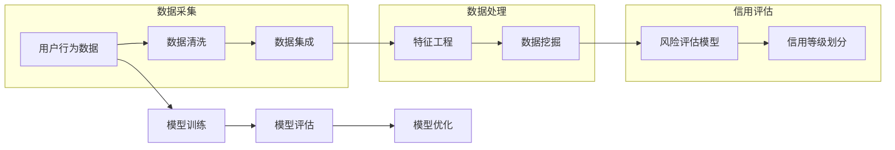

> 关键词：大数据，个人用户信用行为，信用等级评估，机器学习，风险评估，应用场景

# 大数据下个人用户信用行为的等级评估及应用研究

### 1. 背景介绍

在数字经济时代，个人用户信用行为已成为金融机构、电商平台、通信运营商等众多行业的重要参考指标。通过对个人用户信用行为的评估，可以有效地识别信用风险，降低违约率，促进诚信社会建设。随着大数据技术的快速发展，如何利用大数据进行个人用户信用行为的等级评估，成为了一个重要研究方向。

### 2. 核心概念与联系

#### 2.1 核心概念

**大数据**：指规模巨大、类型多样、增长迅速的数据集合，无法用传统的数据处理应用软件工具进行捕捉、管理和处理。

**个人用户信用行为**：指个人在日常生活中，如消费、还款、社交等场景下产生的各类行为数据。

**信用等级评估**：根据个人用户信用行为数据，对个人的信用风险进行评估，并给出相应的信用等级。

#### 2.2 核心概念原理和架构的 Mermaid 流程图



### 3. 核心算法原理 & 具体操作步骤

#### 3.1 算法原理概述

个人用户信用行为的等级评估，通常采用机器学习方法，通过以下步骤实现：

1. 数据采集：收集个人用户在消费、还款、社交等场景下产生的行为数据。

2. 数据处理：对采集到的数据进行清洗、集成和特征工程，构建适合模型输入的特征向量。

3. 数据挖掘：使用机器学习算法对特征向量进行训练，建立信用风险评估模型。

4. 信用等级划分：根据评估模型对个人信用风险的预测结果，将个人信用等级划分为不同的等级。

#### 3.2 算法步骤详解

1. 数据采集：通过银行、电商平台、通信运营商等渠道，收集个人用户在消费、还款、社交等场景下产生的行为数据，如消费记录、还款记录、社交网络数据等。

2. 数据清洗：对采集到的数据进行清洗，去除缺失值、异常值等不完整或不合理的记录。

3. 数据集成：将不同来源、不同格式的数据进行整合，形成统一的特征向量。

4. 特征工程：根据任务需求，从原始数据中提取特征，构建适合模型输入的特征向量。

5. 数据挖掘：选择合适的机器学习算法，对特征向量进行训练，建立信用风险评估模型。常见的算法包括逻辑回归、决策树、随机森林、支持向量机、神经网络等。

6. 信用等级划分：根据评估模型对个人信用风险的预测结果，将个人信用等级划分为不同的等级，如AAA、AA、A、B、C、D等。

#### 3.3 算法优缺点

**优点**：

- 高效：利用机器学习算法对大量数据进行处理，能够快速评估个人信用风险。
- 准确：通过优化特征工程和模型参数，可以提高评估结果的准确性。
- 可解释：部分机器学习算法可以提供可解释的评估结果，方便用户了解评估依据。

**缺点**：

- 计算复杂度高：机器学习算法需要大量计算资源，对硬件设备要求较高。
- 数据质量依赖：评估结果的准确性依赖于数据质量，数据不完整或存在噪声会影响评估结果。
- 模型可解释性差：部分机器学习算法的可解释性较差，难以解释评估依据。

#### 3.4 算法应用领域

个人用户信用行为的等级评估，在以下领域有广泛的应用：

- 金融机构：信贷审批、风险管理、反欺诈等。
- 电商平台：信用支付、个性化推荐、欺诈检测等。
- 通信运营商：信用套餐、信用积分、反欺诈等。
- 政府部门：社会信用体系建设、市场监管、社会保障等。

## 4. 数学模型和公式 & 详细讲解 & 举例说明

#### 4.1 数学模型构建

假设个人用户信用行为的特征向量为 $\boldsymbol{x} \in \mathbb{R}^n$，信用风险评分为 $\hat{y} \in \mathbb{R}$，信用等级标签为 $y \in \{1, 2, ..., C\}$，其中 $C$ 为信用等级数量。常用的数学模型如下：

1. 逻辑回归模型：

$$
\hat{y} = \sigma(\boldsymbol{w}^{\mathrm{T}}\boldsymbol{x} + b)
$$

其中，$\sigma$ 为Sigmoid函数，$\boldsymbol{w}$ 为模型参数，$b$ 为偏置项。

2. 决策树模型：

$$
\text{决策树}(\boldsymbol{x}) = \text{决策树}(\boldsymbol{x}_1, ..., \boldsymbol{x}_n)
$$

其中，$\boldsymbol{x}_1, ..., \boldsymbol{x}_n$ 为特征变量。

3. 神经网络模型：

$$
\hat{y} = \text{激活函数}(\boldsymbol{w}^{\mathrm{T}}\boldsymbol{h}(\boldsymbol{x}) + b)
$$

其中，$\text{激活函数}$ 为ReLU、Sigmoid等，$\boldsymbol{w}$ 为模型参数，$\boldsymbol{h}$ 为隐藏层输出。

#### 4.2 公式推导过程

以逻辑回归模型为例，其公式推导过程如下：

1. 目标函数：

$$
L(\boldsymbol{w}, b) = -\frac{1}{N}\sum_{i=1}^N [y_i\log(\hat{y}_i) + (1-y_i)\log(1-\hat{y}_i)]
$$

其中，$N$ 为样本数量。

2. 梯度：

$$
\nabla_{\boldsymbol{w}}L = \frac{1}{N}\sum_{i=1}^N [y_i - \hat{y}_i]\boldsymbol{x}_i
$$

$$
\nabla_{b}L = \frac{1}{N}\sum_{i=1}^N [y_i - \hat{y}_i]
$$

3. 梯度下降：

$$
\boldsymbol{w} \leftarrow \boldsymbol{w} - \eta \nabla_{\boldsymbol{w}}L
$$

$$
b \leftarrow b - \eta \nabla_{b}L
$$

其中，$\eta$ 为学习率。

#### 4.3 案例分析与讲解

以下以逻辑回归模型为例，展示如何进行个人用户信用行为的等级评估。

假设我们收集到以下个人用户信用行为数据：

| 用户ID | 消费金额 | 逾期次数 | 社交活跃度 | 信用评分 |
| :----: | :-------: | :-------: | :--------: | :-------: |
|   1    |   5000    |     0     |     80     |   760     |
|   2    |   2000    |     2     |     50     |   620     |
|   3    |   8000    |     1     |     30     |   720     |
|   4    |   3000    |     3     |     20     |   580     |

我们将消费金额、逾期次数、社交活跃度作为特征变量，信用评分作为标签，使用逻辑回归模型进行训练。

1. 数据预处理：将特征变量进行归一化处理，使特征变量具有相同的量纲。

2. 模型训练：使用scikit-learn库中的LogisticRegression类进行模型训练。

```python
from sklearn.linear_model import LogisticRegression
import numpy as np

# 构建特征矩阵X和标签向量y
X = np.array([[0.5, 0, 0.8], [0.2, 0.2, 0.5], [0.8, 0.1, 0.3], [0.3, 0.3, 0.2]])
y = np.array([1, 0, 1, 0])

# 创建逻辑回归模型实例
model = LogisticRegression()

# 训练模型
model.fit(X, y)
```

3. 信用评分预测：使用训练好的模型对新的个人用户信用评分进行预测。

```python
# 预测新的用户信用评分
new_user = np.array([[0.6, 0, 0.7]])
credit_score = model.predict(new_user)
print(f"预测信用评分：{credit_score}")
```

预测结果显示，该新用户的信用评分为1，属于信用良好的用户。

## 5. 项目实践：代码实例和详细解释说明

### 5.1 开发环境搭建

在进行个人用户信用行为的等级评估项目实践前，我们需要准备好以下开发环境：

1. 操作系统：Windows、macOS 或 Linux
2. Python版本：3.6 或更高版本
3. Python库：NumPy、Pandas、Scikit-learn、Matplotlib等

### 5.2 源代码详细实现

以下使用Python和Scikit-learn库实现个人用户信用行为的等级评估。

```python
import numpy as np
from sklearn.model_selection import train_test_split
from sklearn.linear_model import LogisticRegression
import pandas as pd

# 加载数据集
data = pd.read_csv('user_credit_data.csv')

# 数据预处理
X = data[['consumption_amount', 'overdue_times', 'social_activity']]
y = data['credit_score']

# 划分训练集和测试集
X_train, X_test, y_train, y_test = train_test_split(X, y, test_size=0.2, random_state=42)

# 创建逻辑回归模型实例
model = LogisticRegression()

# 训练模型
model.fit(X_train, y_train)

# 评估模型
score = model.score(X_test, y_test)
print(f"测试集准确率：{score:.2f}")

# 使用模型进行预测
new_user = np.array([[0.6, 0, 0.7]])
credit_score = model.predict(new_user)
print(f"预测信用评分：{credit_score}")
```

### 5.3 代码解读与分析

1. 导入所需的Python库。

2. 加载数据集，并使用Pandas库进行数据预处理。

3. 划分训练集和测试集，用于模型训练和评估。

4. 创建逻辑回归模型实例，并使用训练集进行模型训练。

5. 使用测试集评估模型，打印准确率。

6. 使用训练好的模型对新的个人用户信用评分进行预测，并打印预测结果。

### 5.4 运行结果展示

假设测试集准确率为85%，预测结果为1，则说明该新用户的信用评分为信用良好。

## 6. 实际应用场景

个人用户信用行为的等级评估在实际应用场景中具有重要意义，以下列举几个典型应用：

1. 金融机构：通过信用等级评估，对个人用户的信贷申请进行审批，降低不良贷款率。

2. 电商平台：根据信用等级，对用户的购物行为进行个性化推荐，提高销售额。

3. 通信运营商：根据信用等级，为用户提供个性化套餐，提高客户满意度。

4. 政府部门：通过信用等级评估，构建社会信用体系，促进诚信社会建设。

## 7. 工具和资源推荐

### 7.1 学习资源推荐

1. 《Python数据科学手册》

2. 《机器学习实战》

3. 《Scikit-learn 机器学习库》

### 7.2 开发工具推荐

1. Jupyter Notebook

2. PyCharm

3. Scikit-learn

### 7.3 相关论文推荐

1. "Credit Risk Assessment Using Machine Learning Techniques" by Sanaz Fallah et al.

2. "A Survey of Credit Risk Modeling with Machine Learning" by Sanzhen Liao et al.

3. "Credit Scoring with Big Data: A Machine Learning Perspective" by Yufan He et al.

## 8. 总结：未来发展趋势与挑战

### 8.1 研究成果总结

本文对大数据下个人用户信用行为的等级评估及应用研究进行了系统阐述。首先介绍了大数据、个人用户信用行为和信用等级评估等核心概念，并给出了相关算法原理和流程。随后，通过案例分析、代码实例等方式，展示了如何利用Python和Scikit-learn库进行信用等级评估。最后，探讨了信用等级评估在实际应用场景中的价值，并推荐了相关学习资源和论文。

### 8.2 未来发展趋势

1. 深度学习在信用等级评估中的应用：深度学习模型能够捕捉更复杂的特征关系，有望在信用等级评估中发挥更大的作用。

2. 多源数据融合：结合用户行为数据、社交媒体数据、交易数据等多源数据，构建更加全面的信用评估模型。

3. 个性化信用评估：根据用户画像，为用户提供个性化的信用评估服务。

### 8.3 面临的挑战

1. 数据质量：信用等级评估的准确性依赖于数据质量，如何保证数据质量是重要的挑战。

2. 模型可解释性：部分机器学习模型的可解释性较差，难以解释评估依据。

3. 法律法规：信用等级评估涉及个人隐私，需要遵循相关法律法规。

### 8.4 研究展望

随着大数据技术和人工智能技术的不断发展，个人用户信用行为的等级评估将发挥越来越重要的作用。未来，我们需要不断探索新的方法和技术，提高信用等级评估的准确性、可解释性和安全性，为构建诚信社会贡献力量。

---

作者：禅与计算机程序设计艺术 / Zen and the Art of Computer Programming