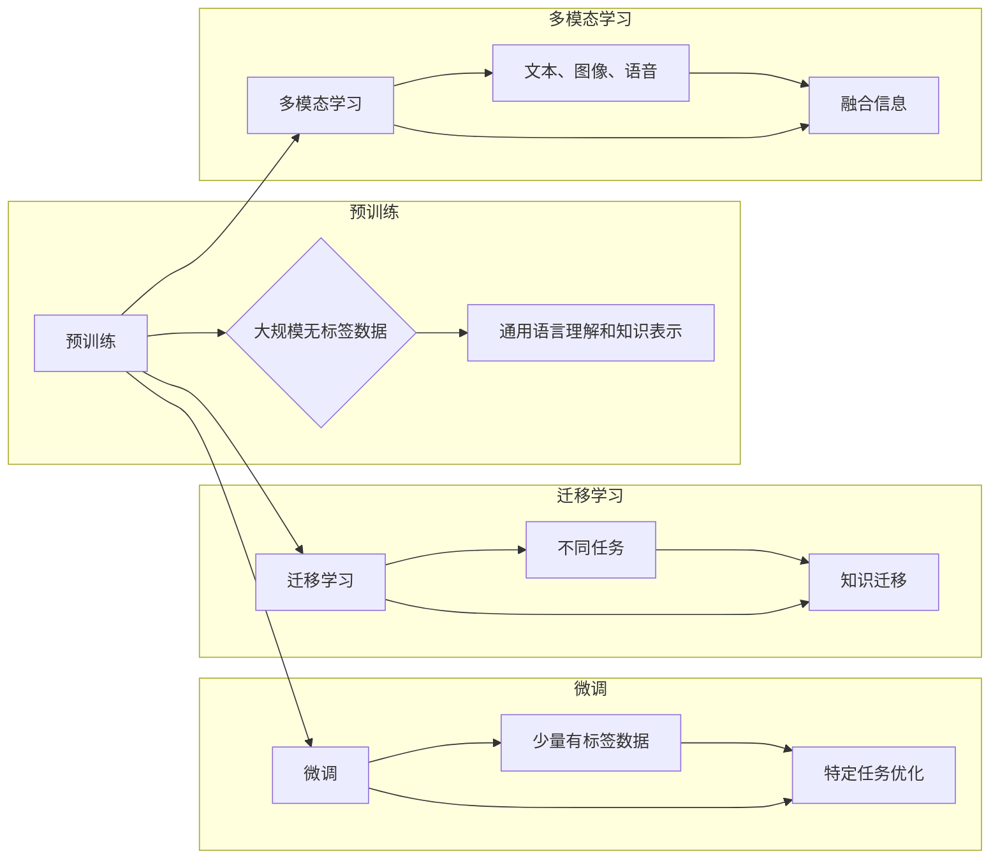

# 大模型的用户需求与市场推广

> 关键词：大模型，用户需求，市场推广，人工智能，技术营销，客户关系管理，产品差异化

## 1. 背景介绍

随着人工智能技术的飞速发展，大模型（Large Models）已经成为人工智能领域的研究热点。大模型通过学习海量数据，能够进行复杂的自然语言处理、图像识别、语音识别等任务，展现出强大的能力。然而，大模型的开发和应用并非易事，如何满足用户需求，如何进行有效的市场推广，成为了大模型商业化的关键。本文将深入探讨大模型的用户需求与市场推广策略。

### 1.1 大模型的发展现状

近年来，大模型的发展取得了显著成果，代表模型包括OpenAI的GPT系列、Google的BERT、T5等。这些模型在多个领域都取得了突破性进展，例如：

- 自然语言处理：文本生成、机器翻译、情感分析、问答系统等。
- 计算机视觉：图像识别、目标检测、图像生成等。
- 语音识别：语音转文字、语音合成、语音识别等。

### 1.2 大模型面临的挑战

尽管大模型在技术层面取得了显著成果，但在商业化过程中仍面临诸多挑战：

- **用户需求不明确**：用户对大模型的功能和用途认识不足，难以明确表达自己的需求。
- **市场推广难度大**：大模型技术门槛高，难以通过传统市场推广手段触达潜在用户。
- **产品差异化不足**：市场上的大模型产品同质化严重，难以形成差异化竞争优势。

## 2. 核心概念与联系

### 2.1 大模型的核心概念

大模型的核心概念包括：

- **预训练**：在大规模无标签数据上训练模型，使其具备通用语言理解和知识表示能力。
- **微调**：在特定任务上，使用少量有标签数据对模型进行调整，提升其在该任务上的性能。
- **迁移学习**：将预训练模型应用于不同任务，实现知识迁移。
- **多模态学习**：融合文本、图像、语音等多模态信息，提升模型的理解和生成能力。

### 2.2 核心概念原理和架构的 Mermaid 流程图



### 2.3 核心概念的联系

大模型通过预训练学习通用语言理解和知识表示，再通过微调、迁移学习和多模态学习等技术，提升其在特定任务上的性能和泛化能力。

## 3. 核心算法原理 & 具体操作步骤

### 3.1 算法原理概述

大模型的核心算法原理包括：

- **神经网络**：通过多层神经网络结构，学习输入数据与输出之间的关系。
- **优化算法**：如梯度下降、Adam等，用于调整模型参数，最小化损失函数。
- **正则化技术**：如L2正则化、Dropout等，防止模型过拟合。

### 3.2 算法步骤详解

大模型的具体操作步骤包括：

1. **数据收集**：收集海量无标签数据和少量有标签数据。
2. **预训练**：在无标签数据上训练模型，使其具备通用语言理解和知识表示能力。
3. **微调**：在有标签数据上对模型进行调整，提升其在特定任务上的性能。
4. **评估**：在测试集上评估模型性能，调整参数和模型结构。
5. **部署**：将模型部署到实际应用场景。

### 3.3 算法优缺点

大模型的优点：

- **强大的性能**：在多个领域都取得了突破性进展。
- **通用性强**：可以应用于不同任务和场景。

大模型的缺点：

- **计算资源消耗大**：需要高性能的硬件设备。
- **训练数据要求高**：需要大量无标签数据和少量有标签数据。

### 3.4 算法应用领域

大模型的应用领域包括：

- 自然语言处理：文本生成、机器翻译、情感分析、问答系统等。
- 计算机视觉：图像识别、目标检测、图像生成等。
- 语音识别：语音转文字、语音合成、语音识别等。

## 4. 数学模型和公式 & 详细讲解 & 举例说明

### 4.1 数学模型构建

大模型的数学模型主要包括：

- **神经网络**：通过权重和偏置进行参数学习，实现对输入数据的映射。
- **损失函数**：用于衡量预测结果与真实值之间的差异。
- **优化算法**：用于调整模型参数，最小化损失函数。

### 4.2 公式推导过程

以神经网络为例，其损失函数和优化算法的公式推导过程如下：

- **损失函数**：假设神经网络输出为 $y_{\hat{}}$，真实值为 $y$，则交叉熵损失函数为：

  $$
 L(\theta) = -\frac{1}{m} \sum_{i=1}^m [y_i \log y_{\hat{i}} + (1-y_i) \log (1-y_{\hat{i}})]
$$

  其中 $m$ 为样本数量，$\theta$ 为模型参数。

- **优化算法**：梯度下降算法用于更新模型参数，其公式为：

  $$
 \theta = \theta - \alpha \nabla_\theta L(\theta)
$$

  其中 $\alpha$ 为学习率。

### 4.3 案例分析与讲解

以BERT模型为例，其预训练任务包括：

- **Masked Language Model (MLM)**：随机遮盖输入文本中的部分词语，让模型预测这些词语。
- **Next Sentence Prediction (NSP)**：给定两个句子，预测这两个句子是否属于同一篇章。

通过这两个预训练任务，BERT模型学习到了丰富的语言知识和上下文信息。

## 5. 项目实践：代码实例和详细解释说明

### 5.1 开发环境搭建

以使用Hugging Face的Transformers库为例，开发环境搭建步骤如下：

1. 安装Transformers库：

  ```bash
  pip install transformers
  ```

2. 安装PyTorch：

  ```bash
  pip install torch
  ```

### 5.2 源代码详细实现

以下是一个简单的BERT模型微调示例：

```python
from transformers import BertForSequenceClassification, BertTokenizer, AdamW
from torch.utils.data import DataLoader, Dataset

# 定义数据集
class MyDataset(Dataset):
    def __init__(self, texts, labels, tokenizer, max_len=128):
        self.texts = texts
        self.labels = labels
        self.tokenizer = tokenizer
        self.max_len = max_len

    def __len__(self):
        return len(self.texts)

    def __getitem__(self, idx):
        text = self.texts[idx]
        label = self.labels[idx]
        encoding = self.tokenizer(text, return_tensors='pt', max_length=self.max_len, truncation=True)
        input_ids = encoding['input_ids'].squeeze(0)
        attention_mask = encoding['attention_mask'].squeeze(0)
        return input_ids, attention_mask, label

# 加载预训练模型和分词器
model = BertForSequenceClassification.from_pretrained('bert-base-uncased')
tokenizer = BertTokenizer.from_pretrained('bert-base-uncased')

# 创建数据集
train_dataset = MyDataset(train_texts, train_labels, tokenizer)
dev_dataset = MyDataset(dev_texts, dev_labels, tokenizer)

# 定义优化器
optimizer = AdamW(model.parameters(), lr=2e-5)

# 训练模型
for epoch in range(3):
    # 训练
    pass

    # 评估
    pass
```

### 5.3 代码解读与分析

以上代码展示了如何使用Transformers库加载预训练的BERT模型和分词器，定义数据集，定义优化器，以及训练模型的基本流程。

### 5.4 运行结果展示

由于篇幅限制，此处不展示运行结果。在实际应用中，可以通过评估集上的指标来评估模型的性能。

## 6. 实际应用场景

大模型在多个领域都有广泛的应用，以下是一些典型的应用场景：

- **智能客服**：通过大模型进行智能客服，能够快速响应用户咨询，提高服务效率。
- **智能问答**：通过大模型构建智能问答系统，能够快速回答用户提出的问题。
- **智能翻译**：通过大模型进行智能翻译，能够实现实时、准确的翻译。
- **智能医疗**：通过大模型进行疾病诊断、药物研发等，能够提高医疗水平。

## 7. 工具和资源推荐

### 7.1 学习资源推荐

- 《深度学习实战》
- 《深度学习》
- Hugging Face官方文档
- Transformers库GitHub仓库

### 7.2 开发工具推荐

- PyTorch
- TensorFlow
- Jupyter Notebook
- Colab

### 7.3 相关论文推荐

- BERT: Pre-training of Deep Bidirectional Transformers for Language Understanding
- GPT-3: Language Models are Few-Shot Learners
- BERT for Sentence Similarity

## 8. 总结：未来发展趋势与挑战

### 8.1 研究成果总结

大模型在人工智能领域取得了显著成果，但仍面临诸多挑战。未来，大模型的研究需要关注以下方向：

- **降低计算资源消耗**：开发更高效的大模型算法，降低计算资源消耗。
- **提高模型可解释性**：提高模型的可解释性，增强用户对大模型的信任。
- **加强模型安全性**：加强模型安全性，防止恶意攻击和滥用。

### 8.2 未来发展趋势

未来，大模型将朝着以下方向发展：

- **模型规模持续增大**：随着计算资源的发展，大模型将不断增大规模。
- **多模态学习**：大模型将融合文本、图像、语音等多模态信息。
- **无监督和半监督学习**：大模型将具备更强的无监督和半监督学习能力。

### 8.3 面临的挑战

大模型在商业化过程中面临以下挑战：

- **用户需求不明确**：用户对大模型的功能和用途认识不足。
- **市场推广难度大**：大模型技术门槛高，难以通过传统市场推广手段触达潜在用户。
- **产品差异化不足**：市场上的大模型产品同质化严重。

### 8.4 研究展望

未来，大模型的研究需要关注以下方向：

- **个性化大模型**：根据用户需求定制化大模型，提高用户体验。
- **可解释性大模型**：提高大模型的可解释性，增强用户对大模型的信任。
- **跨领域大模型**：开发跨领域的大模型，提升模型的泛化能力。

## 9. 附录：常见问题与解答

**Q1：大模型和传统模型有什么区别？**

A：大模型通过学习海量数据，具备更强的通用语言理解和知识表示能力，可以应用于更多任务和场景。

**Q2：如何选择合适的大模型？**

A：选择合适的大模型需要考虑以下因素：

- **任务类型**：针对不同的任务，选择不同类型的大模型。
- **数据规模**：根据数据规模选择合适的大模型规模。
- **计算资源**：根据计算资源选择合适的大模型。

**Q3：如何评估大模型的效果？**

A：评估大模型的效果可以通过以下方法：

- **指标评估**：使用准确率、召回率、F1值等指标评估模型性能。
- **用户反馈**：收集用户反馈，评估用户体验。

**Q4：如何降低大模型的计算资源消耗？**

A：降低大模型的计算资源消耗可以通过以下方法：

- **模型压缩**：通过模型压缩技术，减小模型规模，降低计算资源消耗。
- **模型加速**：通过模型加速技术，提高模型推理速度，降低计算资源消耗。

**Q5：如何提高大模型的可解释性？**

A：提高大模型的可解释性可以通过以下方法：

- **注意力机制**：通过注意力机制可视化模型关注的关键信息。
- **特征可视化**：通过特征可视化技术，展示模型的特征提取过程。

---

作者：禅与计算机程序设计艺术 / Zen and the Art of Computer Programming