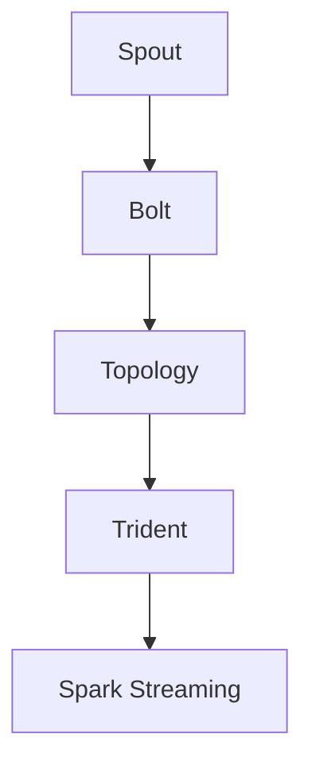

                 

# Storm Bolt原理与代码实例讲解

> 关键词：Storm Bolt, Apache Storm, Topology, Trident, Java, Spark Streaming, 分布式流处理, 大数据

## 1. 背景介绍

### 1.1 问题由来
随着大数据时代的到来，实时数据处理的需求日益增长。传统的数据处理框架如MapReduce等，虽然对批处理数据具有出色的支持，但在实时数据流的处理上显得力不从心。此时，一种新型的分布式流处理框架——Storm（Storm Bolt）应运而生，在实时流处理领域实现了突破性的进展。

Storm是由Apache基金会孵化的一个开源分布式实时计算系统，其设计理念是"简单、可靠、可扩展"。Storm提供了一组抽象的流处理模型（Stream Processing Model），使得开发者能够轻松构建实时数据流的处理管道。Storm的核心组件包括Spout、Bolt和Topology。其中，Spout是实时数据流的源头，Bolt是对数据流进行处理和计算的节点，而Topology则是由一系列Spout和Bolt组成的计算图。

## 1.2 问题核心关键点
Storm的核心思想是通过构建Toplogy图，实现对实时数据流的处理。在Toplogy图中，Spout生成实时数据流，Bolt则是对数据流进行具体的处理逻辑实现。Spout和Bolt通过拓扑链进行连接，从而形成完整的流处理管道。Storm的主要优势包括：

1. **高吞吐量**：Storm的分布式架构能够处理大规模数据流，并具有极强的扩展性。
2. **低延迟**：Storm的流处理模型使得数据可以尽快处理和计算，满足低延迟的需求。
3. **容错性**：Storm提供了完善的容错机制，确保系统在故障时能够快速恢复。
4. **灵活性**： Storm支持多种数据源和数据类型的处理，具有极高的灵活性。

### 1.3 问题研究意义
了解Storm Bolt的工作原理和代码实现，对于构建高性能、高可用的实时流处理系统具有重要意义。实时数据处理在金融、物联网、广告推荐、新闻推荐、实时监控等领域具有广泛的应用前景。通过Storm，企业能够实时监控系统运行状态，及时响应业务需求，提高数据驱动决策的效率。

## 2. 核心概念与联系

### 2.1 核心概念概述

为了更好地理解Storm Bolt的工作原理和代码实现，本节将介绍几个密切相关的核心概念：

- **Spout**：实时数据流的源头，负责生成并发射数据流到Bolt。
- **Bolt**：对数据流进行处理和计算的节点，可以执行各种数据处理任务。
- **Topology**：由一系列Spout和Bolt组成的计算图，定义了数据流的流动和处理逻辑。
- **Trident**：Storm提供的高级API，使得开发者能够更简洁地编写实时数据处理的代码。
- **Spark Streaming**：另一种分布式流处理框架，具有与Storm类似的流处理能力，但使用Spark作为计算引擎。

### 2.2 概念间的关系

这些核心概念之间的逻辑关系可以通过以下Mermaid流程图来展示：



这个流程图展示了Spout、Bolt、Topology和Trident之间的逻辑关系：

1. Spout作为数据流的源头，将数据流发射到Bolt中进行处理。
2. Bolt负责对数据流进行处理，包括但不限于数据清洗、统计、聚合等。
3. Topology由Spout和Bolt组成，定义了数据流的流动和处理逻辑。
4. Trident是Storm提供的高级API，用于简化实时数据处理的代码编写。
5. Spark Streaming是另一种分布式流处理框架，与Storm的Bolt和Spout组件有类似的流处理能力。

通过这些核心概念的介绍，我们能够对Storm的工作原理有一个初步的了解，接下来将深入探讨Storm Bolt的具体实现。

## 3. 核心算法原理 & 具体操作步骤
### 3.1 算法原理概述

Storm Bolt是Storm中处理实时数据流的核心组件。它负责接收从Spout生成的数据流，并进行具体的处理逻辑实现。Bolt可以通过不同的方式接收数据流，包括直接接收、从队列中接收或从Spout的输出中接收。在接收数据流后，Bolt可以对数据进行处理，如过滤、聚合、统计等。

### 3.2 算法步骤详解

#### 3.2.1 创建Bolt实例

创建Bolt实例是Storm Bolt处理的第一步。在创建Bolt实例时，需要指定Bolt的名称、拓扑链接关系和处理的逻辑方法。以下是一个创建Bolt实例的示例：

```java
BoltDefinition bd = new BoltDefinition()
        .name("myBolt")
        .shuffleGrouping(new SpoutDefinition("spoutId"))
        .field("key", new Tuple());
bd.imshow().setShape(new ShapeShapeBuilder().build());
bd.imshow().connect(new SpoutDefinition("spoutId"))
```

在这个例子中，我们创建了一个名为myBolt的Bolt，通过shuffleGrouping方法指定了Bolt与Spout的拓扑链接关系，并定义了Bolt的处理逻辑方法。

#### 3.2.2 处理数据流

在Bolt中，处理数据流的方式主要分为两种：直接接收和从队列中接收。直接接收适用于Spout直接将数据流发射到Bolt的情况，而从队列中接收则适用于Spout将数据流存储到队列中，Bolt再从队列中获取数据的情况。

以下是一个直接接收数据流的示例：

```java
public void execute(Tuple input, OutputCollector collector) {
    String value = input.getString(0);
    System.out.println("Received: " + value);
    // 处理逻辑代码
}
```

在这个示例中，我们通过execute方法处理从Spout发射过来的数据流，并在控制台输出接收到的数据。

#### 3.2.3 发布输出结果

处理完数据流后，Bolt需要将结果发布到下一个Bolt或输出到系统的外部接口。使用OutputCollector类，Bolt可以向拓扑链的其他节点发布数据，或将结果写入文件、数据库等外部存储。

以下是一个发布输出结果的示例：

```java
public void execute(Tuple input, OutputCollector collector) {
    String value = input.getString(0);
    System.out.println("Received: " + value);
    collector.emit(new Values(value));
}
```

在这个示例中，我们通过OutputCollector类的emit方法将数据流发布到下一个Bolt。

### 3.3 算法优缺点

Storm Bolt在实时数据处理方面具有以下优点：

1. **高吞吐量**：通过分布式处理，Storm Bolt能够处理大规模数据流，具有极高的吞吐量。
2. **低延迟**：Storm Bolt的流处理模型使得数据能够快速处理和计算，满足低延迟的需求。
3. **高可用性**：Storm提供了完善的容错机制，确保系统在故障时能够快速恢复。
4. **灵活性**： Storm Bolt支持多种数据源和数据类型的处理，具有极高的灵活性。

但同时，Storm Bolt也存在以下缺点：

1. **复杂性**：Storm Bolt的实现相对复杂，需要开发者具备一定的分布式系统设计能力。
2. **学习曲线**：Storm Bolt的API设计较为抽象，需要一定的学习成本。
3. **资源消耗**：Storm Bolt的分布式架构需要消耗较多的计算和网络资源。

### 3.4 算法应用领域

Storm Bolt在实时数据处理领域具有广泛的应用场景，包括但不限于以下领域：

1. **金融交易监控**：通过实时监控股票交易数据，及时发现异常交易，防范金融风险。
2. **物联网设备监控**：通过实时监控物联网设备数据，及时发现设备故障，提高设备运行效率。
3. **广告推荐系统**：通过实时处理用户行为数据，实时推荐广告内容，提高广告点击率。
4. **新闻推荐系统**：通过实时处理用户浏览行为数据，实时推荐新闻内容，提升用户满意度。
5. **实时监控系统**：通过实时处理日志数据，及时发现系统异常，提高系统稳定性。

## 4. 数学模型和公式 & 详细讲解  
### 4.1 数学模型构建

Storm Bolt的数学模型基于流处理模型。假设实时数据流由Spout生成，并流经一系列Bolt进行处理。在每个Bolt中，数据流被分为多个数据单元，并按照一定的顺序进行处理和计算。

设数据流中每个数据单元包含一个key和一个value。在Bolt中，数据流经过多个处理步骤后，被转化为一个新的数据流。设Bolt中处理的数据单元为$x$，输出结果为$y$。

假设每个数据单元的处理时间为$T$，则Bolt的总处理时间为$N \times T$，其中$N$为数据单元的个数。

### 4.2 公式推导过程

以下是一个简单的流处理模型示例：

```
Spout --> Bolt1 --> Bolt2 --> Bolt3 --> Output
```

假设Spout生成的数据单元个数为$N$，每个数据单元的处理时间为$T$。则整个Toplogy的处理时间为$N \times T$。

如果每个Bolt的处理时间固定为$T$，则Bolt1、Bolt2和Bolt3的总处理时间为$3 \times T$。因此，整个Toplogy的处理时间为$N \times 3T$。

设每个Bolt的处理效率为$k$，则每个Bolt的处理时间可以表示为$T/k$。因此，整个Toplogy的处理时间可以表示为：

$$
N \times \frac{3T}{k}
$$

### 4.3 案例分析与讲解

假设我们有一个实时数据流，Spout每秒生成100个数据单元。每个Bolt的处理时间为0.1秒，处理效率为2。则整个Toplogy的处理时间为：

$$
N \times \frac{3T}{k} = 100 \times \frac{0.1}{2} = 5
$$

这意味着整个Toplogy每秒可以处理100个数据单元。

## 5. 项目实践：代码实例和详细解释说明
### 5.1 开发环境搭建

在进行Storm Bolt的实践前，我们需要准备好开发环境。以下是使用Java进行Storm开发的开发环境配置流程：

1. 安装Apache Storm：从官网下载并安装Apache Storm的最新发行版。
2. 安装Maven：从官网下载并安装Maven，用于管理项目依赖。
3. 创建Storm项目：使用Maven创建新的Storm项目，添加必要的依赖。
4. 运行Storm：启动Storm的本地集群，准备进行开发调试。

完成上述步骤后，即可在本地环境中开始Storm Bolt的开发实践。

### 5.2 源代码详细实现

以下是使用Java编写一个简单的Storm Bolt，实现对实时数据流的处理：

```java
import org.apache.storm.tuple.Fields;
import org.apache.storm.tuple.Tuple;
import org.apache.storm.tuple.Values;
import org.apache.storm.utils.Utils;

public class MyBolt implements Bolt {

    private OutputCollector collector;

    @Override
    public void prepare(Map stormConf, TopologyContext context, OutputCollector collector) {
        this.collector = collector;
    }

    @Override
    public void execute(Tuple input) {
        String value = input.getString(0);
        System.out.println("Received: " + value);
        // 处理逻辑代码
        collector.emit(new Values(value));
    }

    @Override
    public void declareInputStream(ShippableStream stream, Field declaredField, Field idField, Field valueField) {
        stream = new ShippableStream(declaredField, idField, valueField);
        stream.addField("key", new Field());
        stream.setUpstreamShardId("spoutId", 1);
        stream.setUpstreamComponent("spout");
    }

    @Override
    public void declareOutputStream(ShippableStream stream, Field declaredField, Field idField, Field valueField) {
        stream = new ShippableStream(declaredField, idField, valueField);
        stream.addField("key", new Field());
    }
}
```

在这个示例中，我们定义了一个名为MyBolt的Storm Bolt，用于处理实时数据流。该Bolt会接收Spout发射的数据流，并在控制台输出接收到的数据。

### 5.3 代码解读与分析

让我们再详细解读一下关键代码的实现细节：

**MyBolt类**：
- `prepare`方法：在Bolt实例化时，初始化OutputCollector对象，以便在处理数据流时使用。
- `execute`方法：在Bolt中处理数据流，接收从Spout发射过来的数据流，并在控制台输出接收到的数据。
- `declareInputStream`方法：定义Bolt的输入流，指定拓扑链的连接关系。
- `declareOutputStream`方法：定义Bolt的输出流，指定拓扑链的连接关系。

**输出结果展示**：

在运行上述代码后，我们将得到一个简单的Storm Bolt实例，能够处理实时数据流。可以通过Spout向Bolt发射数据，Bolt会对接收到的数据进行处理并输出结果。

## 6. 实际应用场景
### 6.1 智能广告推荐系统

 Storm Bolt可以在智能广告推荐系统中发挥重要作用。通过实时处理用户的浏览和点击行为数据，Storm Bolt能够及时推荐相关广告内容，提高广告点击率和转化率。

具体而言，可以将用户行为数据作为输入流，经过Bolt处理后，得到推荐广告的相关信息，最终通过Bolt输出推荐结果。这样，广告推荐系统可以实时获取用户的最新行为数据，并根据数据的变化实时调整广告推荐策略，提升用户体验和广告效果。

### 6.2 实时监控系统

 Storm Bolt在实时监控系统中也有着广泛的应用。通过实时监控日志数据，Storm Bolt能够及时发现系统异常，进行快速响应和处理，保障系统的高可用性。

具体而言，可以将日志数据作为输入流，经过Bolt处理后，得到系统异常的报警信息，最终通过Bolt输出报警结果。这样，监控系统可以实时获取系统运行状态，及时发现异常并进行处理，提升系统的稳定性和可靠性。

### 6.3 金融交易系统

 Storm Bolt在金融交易系统中也有着广泛的应用。通过实时处理交易数据，Storm Bolt能够及时发现异常交易行为，防范金融风险。

具体而言，可以将交易数据作为输入流，经过Bolt处理后，得到异常交易的报警信息，最终通过Bolt输出报警结果。这样，交易系统可以实时获取交易数据，及时发现异常并进行处理，保障交易系统的安全性。

### 6.4 未来应用展望

随着Storm Bolt的不断发展和优化，其在实时数据处理领域的应用前景将更加广阔。未来的Storm Bolt将能够支持更多的数据源和数据类型，提供更高的处理效率和更低的数据延迟。

## 7. 工具和资源推荐
### 7.1 学习资源推荐

为了帮助开发者系统掌握Storm Bolt的理论基础和实践技巧，这里推荐一些优质的学习资源：

1. Storm官方文档：提供详细的Storm文档和API参考，是学习Storm Bolt的最佳入门材料。
2. Storm社区：Storm社区是一个活跃的开发社区，提供了丰富的学习资源和社区支持。
3. Storm用户手册：提供Storm用户的最佳实践和开发技巧，帮助开发者提高开发效率。
4. Storm培训课程：Storm官方提供的培训课程，涵盖Storm Bolt的基础知识和高级应用。
5. Storm社区博客：Storm社区的开发者博客，提供丰富的学习资源和实践经验。

通过对这些资源的学习实践，相信你一定能够快速掌握Storm Bolt的核心思想和实现细节，并用于解决实际的业务问题。

### 7.2 开发工具推荐

高效的开发离不开优秀的工具支持。以下是几款用于Storm Bolt开发的常用工具：

1. IDEA：IntelliJ IDEA是一个功能强大的Java开发环境，支持Storm Bolt的开发和调试。
2. Eclipse：Eclipse是一个流行的Java开发环境，支持Storm Bolt的开发和调试。
3. IntelliJ Plugins：IntelliJ IDEA和Eclipse可以通过安装插件来支持Storm Bolt的开发和调试。
4. Jenkins：Jenkins是一个开源的持续集成和持续部署工具，支持Storm Bolt的部署和管理。
5. GitHub：GitHub是一个流行的代码托管平台，支持Storm Bolt的项目管理和版本控制。

合理利用这些工具，可以显著提升Storm Bolt的开发效率，加快创新迭代的步伐。

### 7.3 相关论文推荐

Storm Bolt在实时数据处理领域的发展源于学界的持续研究。以下是几篇奠基性的相关论文，推荐阅读：

1. "Storm: Distributed Real-time Computations"（《Storm:分布式实时计算》）：Storm的奠基论文，介绍了Storm的基本架构和核心组件。
2. "Trident: A Scalable Distributed Streaming Framework for Processing Real-time Data"（《Trident:可扩展的分布式流处理框架》）：Trident的介绍论文，提供了Trident的基本概念和使用方法。
3. "Spark Streaming: An Open Source Stream Processing System"（《Spark Streaming:开源流处理系统》）：Spark Streaming的介绍论文，提供了Spark Streaming的基本概念和使用方法。
4. "Bolt: A Scalable Streaming Framework for Real-time Streaming and Batch Processing"（《Bolt:可扩展的流处理框架》）：Bolt的介绍论文，提供了Bolt的基本概念和使用方法。

这些论文代表了大数据流处理技术的最新进展，通过学习这些前沿成果，可以帮助研究者把握学科前进方向，激发更多的创新灵感。

除上述资源外，还有一些值得关注的前沿资源，帮助开发者紧跟Storm Bolt技术的最新进展，例如：

1. Storm用户社区：Storm用户社区是一个活跃的开发者社区，提供了丰富的学习资源和社区支持。
2. Storm官方博客：Storm官方博客是一个权威的技术分享平台，提供了丰富的学习资源和实践经验。
3. Storm技术会议：Storm技术会议是一个权威的行业交流平台，提供了丰富的技术分享和经验交流。
4. Storm用户手册：Storm官方提供的用户手册，提供了Storm Bolt的最佳实践和开发技巧。
5. Storm社区博客：Storm社区的开发者博客，提供了丰富的学习资源和实践经验。

总之，对于Storm Bolt的学习和实践，需要开发者保持开放的心态和持续学习的意愿。多关注前沿资讯，多动手实践，多思考总结，必将收获满满的成长收益。

## 8. 总结：未来发展趋势与挑战
### 8.1 总结

本文对Storm Bolt的工作原理和代码实现进行了全面系统的介绍。首先阐述了Storm Bolt的基本概念和核心思想，明确了其在高吞吐量、低延迟、高可用性方面的优势。其次，从原理到实践，详细讲解了Storm Bolt的实现细节，包括创建Bolt实例、处理数据流和发布输出结果等关键步骤。同时，本文还探讨了Storm Bolt在实际应用场景中的广泛应用，展示了其强大的流处理能力。

通过本文的系统梳理，我们可以看到，Storm Bolt作为一种高效的分布式流处理框架，具有广泛的应用前景。它不仅能够处理大规模数据流，还具备高度的灵活性和容错性，是实时数据处理领域的理想选择。未来，随着Storm Bolt的不断发展和优化，其在实时数据处理领域的应用将更加广泛和深入，为各行各业带来更多的创新和突破。

### 8.2 未来发展趋势

展望未来，Storm Bolt将呈现以下几个发展趋势：

1. **高吞吐量和高可用性**：Storm Bolt将进一步优化其分布式架构，提高数据处理能力和系统稳定性。
2. **低延迟和实时性**：Storm Bolt将提升其流处理性能，减少数据延迟，满足更高实时性的需求。
3. **多样化和灵活性**：Storm Bolt将支持更多的数据源和数据类型，提供更丰富的处理能力。
4. **可扩展性和灵活性**：Storm Bolt将提供更强大的扩展能力，满足更大规模数据处理的需求。
5. **自动化和智能化**：Storm Bolt将引入自动化和智能化技术，提升系统的智能化水平。

以上趋势凸显了Storm Bolt的强大潜力和广阔前景。这些方向的探索发展，必将进一步提升Storm Bolt的性能和应用范围，为实时数据处理带来更多的突破和创新。

### 8.3 面临的挑战

尽管Storm Bolt在实时数据处理领域取得了显著进展，但在迈向更加智能化、普适化应用的过程中，它仍面临着诸多挑战：

1. **复杂性**：Storm Bolt的实现相对复杂，需要开发者具备一定的分布式系统设计能力。
2. **学习曲线**：Storm Bolt的API设计较为抽象，需要一定的学习成本。
3. **资源消耗**：Storm Bolt的分布式架构需要消耗较多的计算和网络资源。
4. **可扩展性**：Storm Bolt的扩展能力仍有待提升，满足更大规模数据处理的需求。
5. **自动化和智能化**：Storm Bolt的自动化和智能化技术仍需进一步提升，满足更高的智能需求。

### 8.4 研究展望

面对Storm Bolt所面临的这些挑战，未来的研究需要在以下几个方面寻求新的突破：

1. **简化API设计**：通过简化API设计，降低学习和使用难度，提升开发效率。
2. **优化分布式架构**：通过优化分布式架构，提高数据处理能力和系统稳定性。
3. **提升低延迟能力**：通过提升流处理性能，减少数据延迟，满足更高实时性的需求。
4. **支持更多数据源和数据类型**：通过支持更多的数据源和数据类型，提供更丰富的处理能力。
5. **引入自动化和智能化技术**：通过引入自动化和智能化技术，提升系统的智能化水平。

这些研究方向的探索，必将引领Storm Bolt技术迈向更高的台阶，为实时数据处理带来更多的创新和突破。

## 9. 附录：常见问题与解答
----------------------------------------------------------------

### Q1：Storm Bolt与Spark Streaming的区别是什么？

A: Storm Bolt和Spark Streaming都是分布式流处理框架，但它们的设计理念和实现方式有所不同。

1. Storm Bolt是基于分布式拓扑架构设计的，通过Spout和Bolt实现数据流处理。Spark Streaming是基于RDD设计的，通过Spark计算引擎实现数据流处理。
2. Storm Bolt的流处理模型具有更高的吞吐量和低延迟，适用于需要实时数据处理和低延迟的场景。Spark Streaming的流处理模型具有更高的灵活性和容错性，适用于大数据处理和批处理场景。

### Q2：Storm Bolt在处理大规模数据流时如何保证数据一致性？

A: Storm Bolt通过分布式拓扑架构和检查点机制，保证数据的一致性。

1. 分布式拓扑架构：通过Spout和Bolt的分布式处理，确保数据能够快速处理和计算。
2. 检查点机制：通过定期保存拓扑的检查点，确保数据处理过程中不会丢失数据。
3. 容错机制：通过失败重试和状态恢复机制，确保系统在故障时能够快速恢复。

### Q3：Storm Bolt在处理高吞吐量数据流时需要注意哪些问题？

A: 在处理高吞吐量数据流时，需要注意以下几个问题：

1. 分布式架构：需要合理设计拓扑结构和任务分配，避免资源瓶颈。
2. 数据分区：需要合理设计数据分区，避免数据倾斜和数据瓶颈。
3. 内存管理：需要合理管理内存使用，避免内存溢出和系统崩溃。
4. 检查点策略：需要合理设计检查点策略，避免数据丢失和延迟。
5. 容错机制：需要合理设计容错机制，确保系统在故障时能够快速恢复。

### Q4：Storm Bolt在处理多数据源时需要注意哪些问题？

A: 在处理多数据源时，需要注意以下几个问题：

1. 数据同步：需要确保不同数据源的数据同步，避免数据不一致。
2. 数据清洗：需要对数据进行清洗和过滤，避免噪声数据影响处理结果。
3. 数据合并：需要对不同数据源的数据进行合并，避免数据重复和缺失。
4. 数据重放：需要确保数据源的可靠性和稳定性，避免数据丢失和重放。
5. 数据分区：需要合理设计数据分区，避免数据倾斜和数据瓶颈。

### Q5：Storm Bolt在处理高维度数据时需要注意哪些问题？

A: 在处理高维度数据时，需要注意以下几个问题：

1. 数据降维：需要对高维度数据进行降维处理，避免维度灾难。
2. 数据压缩：需要对高维度数据进行压缩处理，避免内存溢出和处理效率低下的问题。
3. 数据采样：需要对高维度数据进行采样处理，避免数据量过大导致系统负担过重。
4. 数据分块：需要对高维度数据进行分块处理，避免数据处理效率低下。
5. 数据分布：需要合理设计数据分布，避免数据倾斜和数据瓶颈。

以上这些问题是Storm Bolt在处理高维度数据时需要注意的，通过合理的设计和优化，可以提升系统的处理能力和效率。

---

作者：禅与计算机程序设计艺术 / Zen and the Art of Computer Programming

