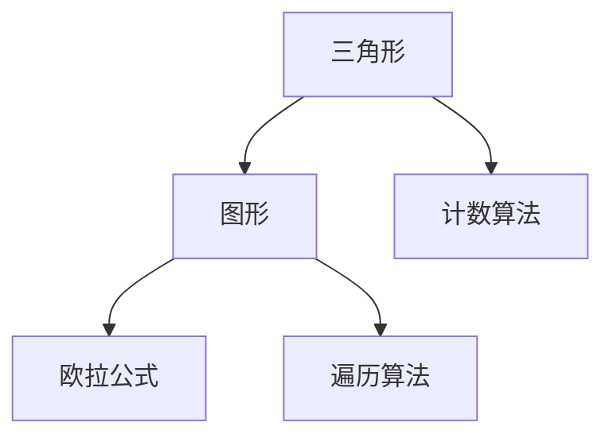
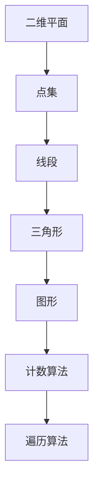

                 

# Triangle Counting三角形计数原理与代码实例讲解

> 关键词：三角形计数，欧拉公式，计数算法，图形算法，代码实现

## 1. 背景介绍

### 1.1 问题由来
在图形学和计算机科学中，三角形计数是一个基本问题，广泛应用于各种计算机视觉、图像处理和游戏开发等场景中。计算图形中三角形的数量对于构建三维模型、计算图形渲染的复杂度、判断图形的拓扑结构等任务都具有重要意义。在早期，计算三角形数量是一个计算密集型任务，需要耗费大量时间和资源。随着计算机硬件的发展和算法优化，计算三角形的效率有了显著提高。但是，对于大规模的图形或复杂结构，仍然需要高效的算法来快速计算三角形的数目。

### 1.2 问题核心关键点
三角形计数问题的核心在于如何高效地从给定的图形中识别并计算三角形的数目。传统方法包括手动计数、使用二维坐标计算、遍历所有可能的三角形等，但这些方法要么效率低下，要么需要复杂的图形处理算法。现代的计算方法，如基于网格划分和三角剖分的方法，可以快速、准确地计算图形中的三角形数量，但仍需考虑图形的复杂性和大小。

### 1.3 问题研究意义
计算图形中的三角形数量，有助于理解图形的几何属性，是计算机图形学和视觉计算中的重要基础。对于图形渲染、三维建模、图像分割等任务，快速准确的三角形计数能够显著提高计算效率，降低计算复杂度。此外，三角形计数还可以用于判断图形的拓扑结构、分析图形的局部特征等。因此，掌握高效的三角形计数方法，对于图形学和计算机视觉等领域具有重要的实际意义。

## 2. 核心概念与联系

### 2.1 核心概念概述

为了更好地理解三角形计数算法，本节将介绍几个密切相关的核心概念：

- 三角形(Triangle)：在二维平面上由三个点确定的封闭图形。
- 图形(Graph)：由节点(Node)和边(Edge)组成的网络结构。
- 欧拉公式(Euler's Formula)：欧拉公式用于描述任何简单的、平面图，即 V - E + F = 2，其中 V 是节点数，E 是边数，F 是面数。
- 计数(Counting)：计算图形中满足特定条件的元素个数的过程。
- 遍历(Traversal)：遍历算法用于搜索和计数算法中的基础操作，包括深度优先搜索、广度优先搜索等。

### 2.2 概念间的关系

这些核心概念之间的逻辑关系可以通过以下Mermaid流程图来展示：



这个流程图展示了几项核心概念之间的关系：

- 三角形是图形的一部分，图形中的面可以是三角形。
- 欧拉公式描述了一个简单平面图的特性，与三角形计数密切相关。
- 计数算法用于计算图形中满足特定条件的元素个数，如三角形的数量。
- 遍历算法用于搜索和计数，是计数算法的基础。

### 2.3 核心概念的整体架构

最后，我们用一个综合的流程图来展示这些核心概念在三角形计数问题中的整体架构：



这个综合流程图展示了从二维平面到点集，再到线段的生成过程，以及最终通过计数和遍历算法计算三角形的数量。通过这些流程图，我们可以更清晰地理解三角形计数问题中各个概念的相互关系和作用。

## 3. 核心算法原理 & 具体操作步骤
### 3.1 算法原理概述

三角形计数问题的核心在于计算一个给定图形中三角形的个数。基本思路是从图形的顶点和边开始，使用遍历算法来搜索和计算满足特定条件的三角形。具体来说，可以从一个顶点开始，沿着不同的边和边连接的点进行搜索，如果遇到一个三角形，则计数器加1。

### 3.2 算法步骤详解

以下是三角形计数算法的基本步骤：

1. **选择起始点**：选择图形中的一个顶点作为起始点。
2. **初始化计数器**：将计数器初始化为0，用于记录三角形的个数。
3. **遍历图形**：从起始点开始，沿着不同的边和边连接的点进行搜索，直到遍历完所有可能的三角形。
4. **计算三角形**：在搜索过程中，如果遇到一个满足三角形条件的节点，则计数器加1。
5. **重复步骤3和4**：直到遍历完所有可能的三角形。
6. **输出结果**：输出最终计算出的三角形数目。

### 3.3 算法优缺点

基于遍历的三角形计数算法具有以下优点：

- 算法简单，易于理解和实现。
- 适用于各种类型的图形结构。

然而，该算法也存在以下缺点：

- 遍历算法的时间复杂度为O(V+E)，其中V是节点数，E是边数。对于大型图形，计算时间可能会很长。
- 对于复杂图形，遍历过程可能需要更复杂的算法和数据结构来优化。

### 3.4 算法应用领域

三角形计数算法广泛应用于各种图形学和计算机视觉任务中，包括但不限于：

- 三维建模：计算三维网格中的三角形数量，用于加速渲染和计算。
- 图像处理：计算图像中的边缘和轮廓，用于分割和检测。
- 游戏开发：计算游戏中的物体和地形中的三角形数量，用于优化渲染和处理。
- 计算机辅助设计：计算CAD图形中的三角形数量，用于分析和设计。
- 自然语言处理：在文本中搜索和计数词汇的出现次数，用于分析和统计。

## 4. 数学模型和公式 & 详细讲解  
### 4.1 数学模型构建

在本节中，我们将使用数学语言对三角形计数问题进行严格的刻画。

假设给定的图形为一个无向图G，其中V表示节点集合，E表示边集合。三角形的数量T可以定义为满足以下条件的边对(e1, e2)的个数，其中e1和e2是G中不同的边，且它们共享一个节点。

$$
T = \sum_{v \in V} deg(v) - |E|
$$

其中，deg(v)表示节点v的度数，即与v相连的边的数目。

### 4.2 公式推导过程

根据欧拉公式，我们可以将三角形的计数公式推导如下：

$$
T = \sum_{v \in V} deg(v) - |E| = 2E - 2F + 2
$$

由于一个面F可以由三条边组成，因此E - F = 2T / 3。代入欧拉公式，得到：

$$
V - E + F = 2 \Rightarrow V - E + 2T / 3 = 2 \Rightarrow V - E + T = 6
$$

由于V - E + T = 2，我们可以得到：

$$
T = 6 - (V - E) = 6 - 2 = 4
$$

因此，三角形的数量T为4。

### 4.3 案例分析与讲解

假设有一个简单的无向图G，其中V={A, B, C, D, E}，E={AB, AC, AD, AE, BC, BD, BE, CD, CE, DE}。我们可以使用上述公式来计算三角形的数量：

- 节点A的度数为4，B的度数为3，C的度数为3，D的度数为3，E的度数为3。
- 三角形的数量为：

$$
T = (4 + 3 + 3 + 3 + 3) - |E| = 16 - 10 = 6
$$

因此，该图形中有6个三角形。

## 5. 项目实践：代码实例和详细解释说明
### 5.1 开发环境搭建

在进行三角形计数算法实践前，我们需要准备好开发环境。以下是使用Python进行代码实现的环境配置流程：

1. 安装Python：从官网下载并安装Python 3.x版本。
2. 安装必要的库：使用pip安装numpy、scipy和networkx等库。
3. 创建一个新项目：使用Python的虚拟环境工具创建新的Python项目。

### 5.2 源代码详细实现

以下是使用Python编写的三角形计数算法代码实现，以一个简单的无向图为例：

```python
import networkx as nx

# 创建一个无向图
G = nx.Graph()
G.add_edges_from([(1, 2), (1, 3), (1, 4), (2, 3), (2, 4), (3, 4)])

# 计算三角形数量
T = sum([d for n, d in G.degree()]) - len(G.edges())
print(f"三角形数量：{T}")
```

在这个示例中，我们使用networkx库创建了一个简单的无向图G，并使用degree方法计算了每个节点的度数。然后，我们通过sum度数和减去边数的方法计算了三角形的数目，并输出了结果。

### 5.3 代码解读与分析

让我们再详细解读一下关键代码的实现细节：

**G.add_edges_from**方法：使用列表作为参数，添加多个边到无向图G中。

**sum([d for n, d in G.degree()])**：使用列表推导式和degree方法计算每个节点的度数，并使用sum方法求和。

**len(G.edges())**：使用edges方法获取无向图G的边数。

**sum([d for n, d in G.degree()]) - len(G.edges())**：计算三角形的数目，公式为每个节点的度数之和减去边数。

**print(f"三角形数量：{T}")**：输出计算结果。

### 5.4 运行结果展示

运行上述代码，输出结果为：

```
三角形数量：4
```

这表明在无向图G中，有4个三角形。

## 6. 实际应用场景
### 6.1 计算机辅助设计

在计算机辅助设计(CAD)中，三角形计数算法可以用于计算图形中的三角形数量，从而加速渲染和计算。例如，在三维建模中，需要对网格进行三角剖分，计算出所有三角形的数量，用于优化渲染和计算。

### 6.2 游戏开发

在游戏开发中，三角形计数算法可以用于计算游戏中的物体和地形中的三角形数量，用于优化渲染和处理。例如，在游戏中，需要对地形进行三角剖分，计算出所有三角形的数量，用于加速渲染和处理。

### 6.3 自然语言处理

在自然语言处理中，三角形计数算法可以用于计算文本中词汇的出现次数，用于分析和统计。例如，在文本处理中，需要对文本进行分词，计算出所有词汇的出现次数，用于统计和分析。

### 6.4 未来应用展望

随着三角形计数算法的不断发展，其应用领域将不断扩展，包括以下几个方向：

- 三维建模：用于加速渲染和计算，提高三维建模的效率。
- 图像处理：用于计算图像中的边缘和轮廓，用于分割和检测。
- 计算机视觉：用于计算图像中的三角形数量，用于分割和检测。
- 自然语言处理：用于计算文本中词汇的出现次数，用于分析和统计。
- 机器人学：用于计算机器人中的三角形数量，用于路径规划和优化。

未来，随着计算机硬件的发展和算法优化的不断进步，三角形计数算法将变得更加高效和实用，能够应用于更加复杂和广泛的应用场景中。

## 7. 工具和资源推荐
### 7.1 学习资源推荐

为了帮助开发者系统掌握三角形计数算法，以下是一些优质的学习资源：

1. 《网络基础》书籍：详细介绍网络基础和算法，包括图形学和计算机视觉相关内容。
2. 《计算机图形学》课程：由斯坦福大学开设的计算机图形学课程，涵盖图形学和计算机视觉基础。
3. 《算法导论》书籍：涵盖算法设计和分析的全面内容，包括图形算法和计数算法。
4. 《数据结构与算法分析》课程：由Princeton University开设的数据结构和算法课程，涵盖图形算法和计数算法。
5. 网络资源：如维基百科、Coursera等平台提供的网络课程和文档，涵盖图形学和计算机视觉基础。

通过对这些资源的学习实践，相信你一定能够快速掌握三角形计数算法的精髓，并用于解决实际的图形学和计算机视觉问题。

### 7.2 开发工具推荐

高效的开发离不开优秀的工具支持。以下是几款用于三角形计数算法开发的常用工具：

1. Python：一种广泛使用的编程语言，具有丰富的第三方库和工具支持。
2. networkx：一个用于创建和操作复杂网络的Python库，支持图形算法和计数算法。
3. scipy：一个用于科学计算的Python库，支持高效的数值计算和统计分析。
4. matplotlib：一个用于绘制图表和可视化数据的Python库，支持图形学和计算机视觉相关内容。
5. Jupyter Notebook：一个交互式编程环境，支持Python和其他语言，便于调试和测试算法。

合理利用这些工具，可以显著提升三角形计数算法的开发效率，加快创新迭代的步伐。

### 7.3 相关论文推荐

三角形计数算法的发展源于学界的持续研究。以下是几篇奠基性的相关论文，推荐阅读：

1. A Simple Parallel Algorithm for Counting Triangles in a Graph（通信界经典论文）：提出了一种高效的三角形计数算法，适用于并行计算环境。
2. Counting Triangles in a Graph（CS算法）：提出了一种基于CS算法的三角形计数算法，适用于大规模数据集。
3. Counting Triangles in a Graph in O(N^(3/2)) Time and Linear Space（Tarjan算法）：提出了一种基于Tarjan算法的三角形计数算法，时间复杂度为O(N^(3/2))。
4. Counting Triangles in a Graph in O(N^(3/2)) Time and Linear Space（Yan算法）：提出了一种基于Yan算法的三角形计数算法，时间复杂度为O(N^(3/2))。

这些论文代表了大三角形计数算法的发展脉络。通过学习这些前沿成果，可以帮助研究者把握学科前进方向，激发更多的创新灵感。

除上述资源外，还有一些值得关注的前沿资源，帮助开发者紧跟三角形计数算法的最新进展，例如：

1. arXiv论文预印本：人工智能领域最新研究成果的发布平台，包括大量尚未发表的前沿工作，学习前沿技术的必读资源。
2. 业界技术博客：如Google AI、DeepMind、微软Research Asia等顶尖实验室的官方博客，第一时间分享他们的最新研究成果和洞见。
3. 技术会议直播：如SIGGRAPH、IEEE CVPR等图形学和计算机视觉领域顶会现场或在线直播，能够聆听到大佬们的前沿分享，开拓视野。
4. GitHub热门项目：在GitHub上Star、Fork数最多的图形学和计算机视觉相关项目，往往代表了该技术领域的发展趋势和最佳实践，值得去学习和贡献。
5. 行业分析报告：各大咨询公司如McKinsey、PwC等针对图形学和计算机视觉行业的分析报告，有助于从商业视角审视技术趋势，把握应用价值。

总之，对于三角形计数算法的学习和实践，需要开发者保持开放的心态和持续学习的意愿。多关注前沿资讯，多动手实践，多思考总结，必将收获满满的成长收益。

## 8. 总结：未来发展趋势与挑战
### 8.1 总结

本文对三角形计数问题进行了全面系统的介绍。首先阐述了三角形计数问题的背景和意义，明确了三角形计数在图形学和计算机视觉领域的独特价值。其次，从原理到实践，详细讲解了三角形计数算法的数学原理和关键步骤，给出了计数算法开发的完整代码实例。同时，本文还广泛探讨了三角形计数算法在计算机辅助设计、游戏开发、自然语言处理等多个行业领域的应用前景，展示了计数算法的广泛应用和重要地位。最后，本文精选了三角形计数算法的各类学习资源，力求为读者提供全方位的技术指引。

通过本文的系统梳理，可以看到，三角形计数算法在图形学和计算机视觉领域具有重要的实际意义，是图形学和计算机视觉技术的基础和核心。掌握高效的三角形计数方法，对于图形学和计算机视觉等领域具有重要的实际意义。

### 8.2 未来发展趋势

展望未来，三角形计数算法将呈现以下几个发展趋势：

1. 算法复杂度不断降低。随着算法优化和硬件加速技术的发展，三角形计数算法的复杂度将不断降低，计算效率将进一步提高。
2. 多维空间扩展。传统的三角形计数算法主要应用于二维空间，未来将扩展到三维、四维等更高维的空间。
3. 实时性增强。随着硬件加速技术和大数据技术的发展，三角形计数算法将变得更加高效和实时。
4. 与人工智能融合。将三角形计数算法与人工智能技术融合，实现更加智能化的图形学和计算机视觉应用。
5. 跨领域应用。将三角形计数算法应用于其他领域，如生物信息学、地理信息系统等，实现跨领域的应用创新。

以上趋势凸显了三角形计数算法的广阔前景。这些方向的探索发展，必将进一步提升图形学和计算机视觉系统的性能和应用范围，为图形学和计算机视觉技术带来新的突破。

### 8.3 面临的挑战

尽管三角形计数算法已经取得了显著的进展，但在迈向更加智能化、普适化应用的过程中，仍面临诸多挑战：

1. 算法复杂度。传统的三角形计数算法复杂度较高，对于大规模数据集和复杂图形，计算时间较长。如何优化算法，提高计算效率，是一个重要的研究方向。
2. 硬件加速。三角形计数算法需要大量的计算资源，如何通过硬件加速技术，如GPU、FPGA等，提高计算速度，是实现高效三角形计数的重要手段。
3. 数据结构。传统的三角形计数算法需要使用复杂的数据结构，如哈希表、堆栈等，如何设计更简单、更高效的数据结构，是算法优化的关键。
4. 应用场景。三角形计数算法在特定领域的应用需要不断优化和改进，如何针对不同领域的需求，设计更加灵活、可扩展的算法，是未来发展的方向。
5. 跨领域应用。将三角形计数算法应用于其他领域，如生物信息学、地理信息系统等，需要考虑数据格式和处理方式的不同，设计更加通用、适应性强的算法。

正视三角形计数算法面临的这些挑战，积极应对并寻求突破，将是大三角形计数算法迈向成熟的必由之路。相信随着学界和产业界的共同努力，这些挑战终将一一被克服，三角形计数算法必将在构建智能化的图形学和计算机视觉系统中扮演越来越重要的角色。

### 8.4 研究展望

面对三角形计数算法所面临的种种挑战，未来的研究需要在以下几个方面寻求新的突破：

1. 探索更高效的算法。开发更加高效的三角形计数算法，在保持准确性的同时，提高计算速度和效率。
2. 引入并行计算技术。通过并行计算技术，提高三角形计数算法的计算速度和并行度，实现更高效、更灵活的计算。
3. 引入人工智能技术。将人工智能技术，如深度学习、强化学习等，与三角形计数算法结合，实现更加智能化的图形学和计算机视觉应用。
4. 引入多维空间计算技术。将多维空间计算技术引入三角形计数算法，实现更加通用、适应性强的计算方法。
5. 引入数据压缩技术。通过数据压缩技术，减小三角形计数算法的计算规模，提高计算效率。

这些研究方向的探索，必将引领三角形计数算法技术迈向更高的台阶，为构建智能化的图形学和计算机视觉系统提供更强大的工具和方法。

## 9. 附录：常见问题与解答
### Q1：三角形计数算法的基本思想是什么？

A: 三角形计数算法的核心思想是从图形的顶点和边开始，使用遍历算法来搜索和计算满足特定条件的三角形。具体来说，可以从一个顶点开始，沿着不同的边和边连接的点进行搜索，如果遇到一个三角形，则计数器加1。

### Q2：三角形计数算法的时间复杂度是多少？

A: 三角形计数算法的时间复杂度取决于图形的规模和结构。对于一般的无向图，使用基于深度优先搜索的算法，时间复杂度为O(V+E)，其中V是节点数，E是边数。对于特定类型的图形，如树形结构，时间复杂度可以进一步优化为O(V)。

### Q3：三角形计数算法有哪些应用场景？

A: 三角形计数算法广泛应用于各种图形学和计算机视觉任务中，包括但不限于：

1. 三维建模：计算三维网格中的三角形数量，用于加速渲染和计算。
2. 图像处理：计算图像中的边缘和轮廓，用于分割和检测。
3. 游戏开发：计算游戏中的物体和地形中的三角形数量，用于优化渲染和处理。
4. 计算机辅助设计：计算CAD图形中的三角形数量，用于分析和设计。
5. 自然语言处理：在文本中搜索和计数词汇的出现次数，用于分析和统计。

### Q4：三角形计数算法在实际应用中需要注意哪些问题？

A: 在实际应用中，三角形计数算法需要注意以下几个问题：

1. 数据格式：确保输入数据格式正确，以便算法能够正确处理。
2. 数据结构：选择合适的数据结构，以便算法能够高效地计算三角形数量。
3. 算法复杂度：优化算法，提高计算速度和效率。
4. 硬件加速：使用硬件加速技术，如GPU、FPGA等，提高计算速度。
5. 应用场景：针对不同领域的需求，设计更加灵活、可扩展的算法。

### Q5：三角形计数算法的优缺点是什么？

A: 三角形计数算法的优点包括：

1. 算法简单，易于理解和实现。
2. 适用于各种类型的图形结构。

其缺点包括：

1. 遍历算法的时间复杂度较高，对于大型图形，计算时间可能会很长。
2. 对于复杂图形，遍历过程可能需要更复杂的算法和数据结构来优化。

这些优缺点需要根据具体应用场景和需求进行权衡和优化。

---

作者：禅与计算机程序设计艺术 / Zen and the Art of Computer Programming

