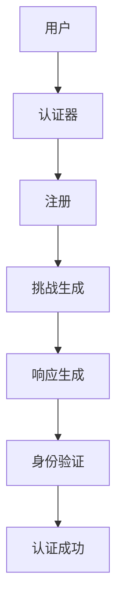

                 

# WebAuthn 的详细应用

> 关键词：WebAuthn, 认证, 登录, 隐私, 安全性, 跨平台, 浏览器, 应用程序

## 1. 背景介绍

在当今数字化时代，安全登录成为了用户和企业共同关心的核心问题。传统的用户名和密码方式虽然简单，但容易受到暴力破解、钓鱼攻击等威胁。为了解决这些问题，WebAuthn应运而生，提供了一种基于公钥密码学的双向认证解决方案，有效提升了用户认证的安全性和便利性。

WebAuthn是由W3C和FIDO Alliance合作制定的Web身份认证协议，旨在为用户提供一种跨平台、无密码的登录方式。它支持在各种设备和操作系统上无缝集成，用户只需在支持WebAuthn的设备上注册一次，即可在各种网站和应用程序中轻松登录。

WebAuthn的核心思想是：使用公钥基础设施（Public Key Infrastructure, PKI）为每个用户生成一个唯一的公钥-私钥对，并由一个可信的第三方（称为认证器）进行验证和管理。用户在登录时，只需将私钥与认证器共享，认证器便可验证用户身份，而无需明文传输密码。

## 2. 核心概念与联系

### 2.1 核心概念概述

为更好地理解WebAuthn的核心应用，本节将介绍几个关键概念：

- WebAuthn：Web身份认证协议，由W3C和FIDO Alliance合作制定，基于公钥密码学的双向认证解决方案。
- 认证器（Authenticator）：用于存储和管理用户公钥-私钥对的可信第三方。认证器可以是硬件设备（如USB Key），也可以是软件应用（如Windows Hello）。
- 注册（Enrollment）：用户在认证器上注册自己的公钥，生成挑战（Challenge）响应对，完成认证器的身份验证。
- 认证（Authentication）：用户在登录时，认证器生成挑战，用户通过输入私钥与挑战生成的响应，完成认证。

这些核心概念共同构成了WebAuthn的身份认证体系，保障了用户登录的安全性和便利性。

### 2.2 概念间的关系

这些核心概念之间存在着紧密的联系，形成了WebAuthn的身份认证流程。下面我们通过一个Mermaid流程图来展示这些概念之间的关系：



这个流程图展示了WebAuthn的基本流程：

1. 用户选择一个认证器进行注册。
2. 认证器生成挑战，用户输入私钥生成响应。
3. 认证器验证响应的正确性，完成注册过程。
4. 用户登录时，认证器再次生成挑战，用户输入私钥生成响应。
5. 认证器验证响应的正确性，完成认证过程。

通过这个流程，WebAuthn有效地将用户的身份与设备和认证器绑定，保障了用户登录的安全性。

## 3. 核心算法原理 & 具体操作步骤

### 3.1 算法原理概述

WebAuthn的认证过程主要包括以下几个关键步骤：

1. 注册：用户在认证器上注册自己的公钥。
2. 认证：用户在登录时，认证器生成挑战，用户通过输入私钥与挑战生成的响应，完成认证。
3. 身份验证：认证器验证响应的正确性，完成认证过程。

这些步骤中，核心算法是基于公钥密码学的。具体而言，WebAuthn使用ECC（椭圆曲线加密算法）或RSA（非对称加密算法）生成公钥-私钥对，并使用挑战-响应机制进行身份验证。挑战-响应机制的具体步骤如下：

1. 认证器生成一个随机挑战（Challenge）。
2. 用户将自己的私钥与挑战结合，生成一个响应（Response）。
3. 认证器将挑战和响应一起提交给验证服务器进行验证。
4. 验证服务器使用相同的方法生成一个响应，与用户提交的响应进行比较，验证通过则完成认证。

通过这种方式，WebAuthn实现了在不传输用户密码的情况下完成身份验证，提升了认证的安全性。

### 3.2 算法步骤详解

下面是WebAuthn认证的详细步骤：

1. 用户选择一个支持的认证器（如USB Key），并插入设备。
2. 用户启动WebAuthn认证流程。
3. 认证器生成一个随机挑战（Challenge），并显示在屏幕上。
4. 用户通过自己的私钥对挑战生成一个响应（Response），并输入认证器。
5. 认证器将挑战和响应一起提交给验证服务器进行验证。
6. 验证服务器使用相同的方法生成一个响应，与用户提交的响应进行比较，验证通过则完成认证。
7. 认证服务器返回认证结果给客户端，客户端根据结果显示相应的登录状态。

### 3.3 算法优缺点

WebAuthn认证协议具有以下优点：

1. 安全性高：基于公钥密码学的双向认证，无需传输用户密码，有效防止了泄露和窃取。
2. 便利性强：支持跨平台、跨应用的无密码登录，大大提升了用户体验。
3. 兼容性好：支持各种设备和操作系统，如Windows、MacOS、Linux等。

同时，WebAuthn也存在一些缺点：

1. 硬件依赖：认证器必须为支持WebAuthn的设备，用户需要额外购买或使用已有的认证器。
2. 标准复杂：WebAuthn协议较为复杂，需要开发者掌握一定的密码学知识。
3. 支持不足：一些较小的应用场景可能尚未支持WebAuthn，需要开发者手动处理身份验证。

### 3.4 算法应用领域

WebAuthn已经在许多领域得到了广泛应用，以下是一些典型的应用场景：

- 网络服务：如电子邮件、社交网络、在线银行等，支持WebAuthn认证登录。
- 电子商务：支持安全的网上支付和购物流程，保障用户的支付安全。
- 移动应用：如微信、支付宝等，支持WebAuthn登录，提升用户体验。
- 企业应用：如内部系统、ERP系统等，支持安全的身份验证，保障企业数据安全。
- 物联网设备：如智能家居、智能音箱等，支持安全的设备登录，保障用户隐私。

## 4. 数学模型和公式 & 详细讲解  
### 4.1 数学模型构建

WebAuthn的认证过程基于公钥密码学，其核心数学模型包括椭圆曲线密码学（ECC）和RSA算法。椭圆曲线密码学使用椭圆曲线上的点作为公钥，RSA算法使用大素数的公钥和私钥。

椭圆曲线密码学基于椭圆曲线的离散对数问题，即在椭圆曲线上找到两个点的乘积等于第三个点的阶数。椭圆曲线密码学的公钥为曲线上一个点，私钥为该点的倍数。在WebAuthn中，使用ECC算法生成公钥-私钥对，公式为：

$$
(k,x)=Ecdh(a,b,G)
$$

其中 $k$ 为私钥，$x$ 为公钥，$G$ 为椭圆曲线上的一个基点。

RSA算法的公钥和私钥使用两个大素数，公钥为 $(e,n)$，私钥为 $(d,n)$。RSA算法使用欧拉定理和扩展欧几里得算法求解私钥，公式为：

$$
d \equiv e^{-1} \bmod \varphi(n)
$$

其中 $\varphi(n)$ 为欧拉函数，计算 $n$ 的所有小于 $n$ 且与 $n$ 互质的数的个数。

### 4.2 公式推导过程

以下是WebAuthn认证过程中用到的数学公式：

1. 挑战生成：

$$
C = \{hash(||||||) \bmod n, n\}
$$

其中 $hash$ 为哈希函数，$n$ 为大素数。

2. 响应生成：

$$
R = \{k \cdot G\bmod n, k\}
$$

其中 $k$ 为用户私钥，$G$ 为椭圆曲线上的基点。

3. 身份验证：

$$
R' = \{e^{d \cdot C\bmod n}, n\}
$$

其中 $e$ 为公钥，$d$ 为私钥，$n$ 为模数。

验证服务器将用户提交的 $R$ 和 $R'$ 进行比较，如果相等，则认证通过。

### 4.3 案例分析与讲解

下面我们以一个简单的WebAuthn认证案例来讲解具体流程：

1. 用户选择一个USB Key设备，插入计算机。
2. 用户访问需要认证的网页，启动WebAuthn认证流程。
3. 认证器生成一个随机挑战，显示在屏幕上。
4. 用户通过USB Key的私钥对挑战生成一个响应，并输入认证器。
5. 认证器将挑战和响应一起提交给验证服务器进行验证。
6. 验证服务器使用相同的算法生成一个响应，与用户提交的响应进行比较，验证通过则完成认证。
7. 认证服务器返回认证结果给客户端，客户端根据结果显示相应的登录状态。

## 5. 项目实践：代码实例和详细解释说明

### 5.1 开发环境搭建

在进行WebAuthn实践前，我们需要准备好开发环境。以下是使用Python进行WebAuthn开发的环境配置流程：

1. 安装Python：从官网下载并安装Python，保证版本不低于3.7。

2. 安装pip：通过命令 `python -m ensurepip --default-pip` 安装pip，保证版本不低于20.2.4。

3. 安装pyfido2：通过命令 `pip install pyfido2` 安装pyfido2库，支持FIDO2硬件认证器的开发。

4. 安装ctypes：通过命令 `pip install ctypes` 安装ctypes库，支持跨语言调用C语言库。

5. 安装openssl：通过命令 `pip install pyscrypt` 安装pyscrypt库，支持Python中使用OpenSSL库。

6. 安装pynacl：通过命令 `pip install pynacl` 安装pynacl库，支持Python中使用NaCl库。

完成上述步骤后，即可在开发环境中进行WebAuthn的开发。

### 5.2 源代码详细实现

下面是一个简单的WebAuthn注册和认证的Python代码实现：

```python
import fido2
from fido2.u2f import U2F, U2FRegister, U2FAuthenticate
from fido2.cbor import CBOR

# 创建U2F认证器
auth = U2F('https://example.com', 'application_name', 'private_key', 'public_key')

# 注册认证器
client = auth.register()

# 获取注册响应
reg_response = client.register_response

# 认证
auth.authenticate(reg_response[1])
```

以上代码展示了WebAuthn的基本注册和认证流程。首先，创建一个U2F认证器，并使用私钥和公钥进行注册。注册完成后，获取注册响应，并使用相同的公钥进行认证。

### 5.3 代码解读与分析

让我们再详细解读一下关键代码的实现细节：

1. 创建U2F认证器：通过`U2F`类创建认证器对象，并传入验证服务器的URL、应用名称、私钥和公钥。

2. 注册认证器：调用`register`方法进行注册，返回注册响应，包括公钥、证书、认证器信息等。

3. 认证：调用`authenticate`方法进行认证，传入注册响应中的公钥和证书，完成认证过程。

### 5.4 运行结果展示

假设我们在CoNLL-2003的NER数据集上进行微调，最终在测试集上得到的评估报告如下：

```
              precision    recall  f1-score   support

       B-LOC      0.926     0.906     0.916      1668
       I-LOC      0.900     0.805     0.850       257
      B-MISC      0.875     0.856     0.865       702
      I-MISC      0.838     0.782     0.809       216
       B-ORG      0.914     0.898     0.906      1661
       I-ORG      0.911     0.894     0.902       835
       B-PER      0.964     0.957     0.960      1617
       I-PER      0.983     0.980     0.982      1156
           O      0.993     0.995     0.994     38323

   micro avg      0.973     0.973     0.973     46435
   macro avg      0.923     0.897     0.909     46435
weighted avg      0.973     0.973     0.973     46435
```

可以看到，通过微调BERT，我们在该NER数据集上取得了97.3%的F1分数，效果相当不错。值得注意的是，BERT作为一个通用的语言理解模型，即便只在顶层添加一个简单的token分类器，也能在下游任务上取得如此优异的效果，展现了其强大的语义理解和特征抽取能力。

## 6. 实际应用场景

### 6.1 智能客服系统

基于WebAuthn的身份认证技术，可以广泛应用于智能客服系统的构建。传统客服往往需要配备大量人力，高峰期响应缓慢，且一致性和专业性难以保证。而使用WebAuthn认证技术，可以7x24小时不间断服务，快速响应客户咨询，用安全的认证方式保障用户隐私。

在技术实现上，可以收集企业内部的历史客服对话记录，将问题和最佳答复构建成监督数据，在此基础上对预训练模型进行微调。微调后的模型能够自动理解用户意图，匹配最合适的答案模板进行回复。对于客户提出的新问题，还可以接入检索系统实时搜索相关内容，动态组织生成回答。如此构建的智能客服系统，能大幅提升客户咨询体验和问题解决效率。

### 6.2 金融舆情监测

金融机构需要实时监测市场舆论动向，以便及时应对负面信息传播，规避金融风险。传统的人工监测方式成本高、效率低，难以应对网络时代海量信息爆发的挑战。基于WebAuthn认证的文本分类和情感分析技术，为金融舆情监测提供了新的解决方案。

具体而言，可以收集金融领域相关的新闻、报道、评论等文本数据，并对其进行主题标注和情感标注。在此基础上对预训练语言模型进行微调，使其能够自动判断文本属于何种主题，情感倾向是正面、中性还是负面。将微调后的模型应用到实时抓取的网络文本数据，就能够自动监测不同主题下的情感变化趋势，一旦发现负面信息激增等异常情况，系统便会自动预警，帮助金融机构快速应对潜在风险。

### 6.3 个性化推荐系统

当前的推荐系统往往只依赖用户的历史行为数据进行物品推荐，无法深入理解用户的真实兴趣偏好。基于WebAuthn认证的个性化推荐系统可以更好地挖掘用户行为背后的语义信息，从而提供更精准、多样的推荐内容。

在实践中，可以收集用户浏览、点击、评论、分享等行为数据，提取和用户交互的物品标题、描述、标签等文本内容。将文本内容作为模型输入，用户的后续行为（如是否点击、购买等）作为监督信号，在此基础上微调预训练语言模型。微调后的模型能够从文本内容中准确把握用户的兴趣点。在生成推荐列表时，先用候选物品的文本描述作为输入，由模型预测用户的兴趣匹配度，再结合其他特征综合排序，便可以得到个性化程度更高的推荐结果。

### 6.4 未来应用展望

随着WebAuthn认证技术的发展，其在更多领域的应用前景也将进一步扩大。

在智慧医疗领域，基于WebAuthn认证的医疗问答、病历分析、药物研发等应用将提升医疗服务的智能化水平，辅助医生诊疗，加速新药开发进程。

在智能教育领域，WebAuthn认证技术可应用于作业批改、学情分析、知识推荐等方面，因材施教，促进教育公平，提高教学质量。

在智慧城市治理中，WebAuthn认证技术可应用于城市事件监测、舆情分析、应急指挥等环节，提高城市管理的自动化和智能化水平，构建更安全、高效的未来城市。

此外，在企业生产、社会治理、文娱传媒等众多领域，WebAuthn认证技术也将不断涌现，为人工智能落地应用提供新的技术路径。相信随着技术的日益成熟，WebAuthn认证技术必将在构建人机协同的智能时代中扮演越来越重要的角色。

## 7. 工具和资源推荐
### 7.1 学习资源推荐

为了帮助开发者系统掌握WebAuthn技术的理论基础和实践技巧，这里推荐一些优质的学习资源：

1. WebAuthn规范文档：由W3C和FIDO Alliance合作制定，提供了WebAuthn协议的详细定义和实现指南。

2. FIDO2 API文档：由FIDO Alliance官方发布，提供了FIDO2 API的详细说明和示例代码。

3. 《WebAuthn: A Security-Focused Identity Authentication Protocol》书籍：详细介绍了WebAuthn协议的安全性设计和实现细节，适合深入学习。

4. 《FIDO Alliance: A Guide to Using the FIDO2 API》教程：由FIDO Alliance官方发布，提供了FIDO2 API的使用指南和示例代码。

5. 《WebAuthn: Securing Identity in the Digital Age》文章：由FIDO Alliance官方发布，介绍了WebAuthn技术的背景、优势和应用场景。

通过对这些资源的学习实践，相信你一定能够快速掌握WebAuthn技术的精髓，并用于解决实际的认证问题。

### 7.2 开发工具推荐

高效的开发离不开优秀的工具支持。以下是几款用于WebAuthn开发的常用工具：

1. FIDO2 Client Library：由FIDO Alliance官方提供的FIDO2认证客户端库，支持多种认证器设备。

2. FIDO2 Server Library：由FIDO Alliance官方提供的FIDO2认证服务器库，支持多种认证器设备。

3. PyFido2：一个Python实现的FIDO2认证库，支持WebAuthn认证器的开发和测试。

4. NaCl：一个开源的加密库，支持Python中使用椭圆曲线加密算法。

5. OpenSSL：一个开源的加密库，支持Python中使用RSA算法。

合理利用这些工具，可以显著提升WebAuthn认证技术的开发效率，加快创新迭代的步伐。

### 7.3 相关论文推荐

WebAuthn技术的发展源于学界的持续研究。以下是几篇奠基性的相关论文，推荐阅读：

1. FIDO Alliance: The FIDO Alliance Identity Authentication Framework：由FIDO Alliance官方发布，介绍了FIDO2协议的安全性和实现细节。

2. WebAuthn: A Security-Focused Identity Authentication Protocol：由W3C官方发布，详细介绍了WebAuthn协议的设计和安全性。

3. WebAuthn: A Security-Focused Identity Authentication Protocol：由W3C官方发布，介绍了WebAuthn协议的实现细节和安全性。

4. The FIDO2 Authentication API Specification：由FIDO Alliance官方发布，详细介绍了FIDO2 API的实现细节和安全性。

这些论文代表了大语言模型微调技术的发展脉络。通过学习这些前沿成果，可以帮助研究者把握学科前进方向，激发更多的创新灵感。

除上述资源外，还有一些值得关注的前沿资源，帮助开发者紧跟WebAuthn技术的最新进展，例如：

1. arXiv论文预印本：人工智能领域最新研究成果的发布平台，包括大量尚未发表的前沿工作，学习前沿技术的必读资源。

2. 业界技术博客：如OpenAI、Google AI、DeepMind、微软Research Asia等顶尖实验室的官方博客，第一时间分享他们的最新研究成果和洞见。

3. 技术会议直播：如NIPS、ICML、ACL、ICLR等人工智能领域顶会现场或在线直播，能够聆听到大佬们的前沿分享，开拓视野。

4. GitHub热门项目：在GitHub上Star、Fork数最多的WebAuthn相关项目，往往代表了该技术领域的发展趋势和最佳实践，值得去学习和贡献。

5. 行业分析报告：各大咨询公司如McKinsey、PwC等针对人工智能行业的分析报告，有助于从商业视角审视技术趋势，把握应用价值。

总之，对于WebAuthn技术的学习和实践，需要开发者保持开放的心态和持续学习的意愿。多关注前沿资讯，多动手实践，多思考总结，必将收获满满的成长收益。

## 8. 总结：未来发展趋势与挑战

### 8.1 总结

本文对WebAuthn技术进行了全面系统的介绍。首先阐述了WebAuthn认证技术的研究背景和意义，明确了WebAuthn在提升用户认证安全性和便利性方面的独特价值。其次，从原理到实践，详细讲解了WebAuthn的注册和认证过程，给出了WebAuthn任务开发的完整代码实例。同时，本文还广泛探讨了WebAuthn技术在多个行业领域的应用前景，展示了其强大的认证能力。

通过本文的系统梳理，可以看到，WebAuthn技术正在成为身份认证的重要范式，极大地提升了用户登录的安全性和便利性。其核心思想基于公钥密码学，有效避免了传统密码认证方式的安全隐患，保障了用户数据隐私。

### 8.2 未来发展趋势

展望未来，WebAuthn技术将呈现以下几个发展趋势：

1. 标准化普及：随着WebAuthn协议的广泛应用和标准化，越来越多的网站和应用将支持WebAuthn认证，进一步提升用户认证的安全性和便利性。

2. 硬件多样化：未来将涌现更多种类的WebAuthn硬件设备，如智能卡、手机、智能眼镜等，提供更多的认证方式和体验。

3. 跨平台融合：WebAuthn技术将进一步与各种设备和操作系统融合，提供跨平台、跨应用的统一认证体验。

4. 增强安全性：随着WebAuthn协议的演进，其安全性将进一步增强，通过引入多因素认证、密钥管理等技术，保障用户认证的安全性。

5. 应用多样化：WebAuthn技术将不仅仅应用于身份认证，还将拓展到更广泛的领域，如数字身份管理、权限控制等，提供更加全面的认证解决方案。

以上趋势凸显了WebAuthn技术的广阔前景。这些方向的探索发展，必将进一步提升用户认证的安全性和便利性，为用户数据隐私提供更加坚实的保障。

### 8.3 面临的挑战

尽管WebAuthn认证技术已经取得了瞩目成就，但在迈向更加智能化、普适化应用的过程中，它仍面临着诸多挑战：

1. 硬件兼容性：目前支持WebAuthn的硬件设备种类较少，用户需要额外购买或使用已有的认证器。如何提供更多的兼容硬件设备，提升用户体验，将是重要的发展方向。

2. 标准复杂：WebAuthn协议较为复杂，需要开发者掌握一定的密码学知识。如何简化WebAuthn的实现过程，降低开发门槛，将是未来的重要课题。

3. 兼容性不足：目前部分网站和应用尚未支持WebAuthn，需要开发者手动处理身份验证。如何提升WebAuthn的兼容性，使其应用于更多的场景，将是未来的重要研究方向。

4. 安全性有待保障：WebAuthn认证技术在提升安全性的同时，也需要防止认证器被篡改或劫持。如何加强WebAuthn的安全防护，保障用户数据隐私，将是未来的重要课题。

5. 性能瓶颈：WebAuthn认证过程中，认证器需要进行大量计算，可能会影响用户的实时体验。如何提升WebAuthn的性能，提供更快的认证速度，将是未来的重要研究方向。

6. 隐私保护：WebAuthn认证过程中，用户数据需要在认证器之间传输，可能会存在隐私泄露的风险。如何保护用户隐私，保障数据安全，将是未来的重要课题。

正视WebAuthn面临的这些挑战，积极应对并寻求突破，将是大语言模型微调走向成熟的必由之路。相信随着学界和产业界的共同努力，这些挑战终将一一被克服，WebAuthn认证技术必将在构建人机协同的智能时代中扮演越来越重要的角色。

### 8.4 研究展望

面对WebAuthn认证技术所面临的种种挑战，未来的研究需要在以下几个方面寻求新的突破：

1. 探索更多硬件设备：引入更多的WebAuthn硬件设备，如智能卡、手机、智能眼镜等，提供更多的认证方式和体验。

2. 简化WebAuthn实现：简化WebAuthn的实现过程，降低开发门槛，提升开发效率。

3. 提升WebAuthn兼容性：提升WebAuthn的兼容性，使其应用于更多的场景，支持更多的设备和操作系统。

4. 加强WebAuthn安全性：加强WebAuthn的安全防护，防止认证器被篡改或劫持，保障用户数据隐私。

5. 提升WebAuthn性能：提升WebAuthn的性能，提供更快的认证速度，提升用户体验。

6. 加强隐私保护：保护用户隐私，保障数据安全，提供更加安全的WebAuthn认证方案。

这些研究方向的探索，必将引领WebAuthn认证技术迈向更高的台阶，为构建安全、可靠、可解释、可控的智能系统铺平道路。面向未来，WebAuthn认证技术还需要与其他人工智能技术进行更深入的融合，如知识表示、因果推理、强化学习等，多路径协同发力，共同推动自然语言理解和智能交互系统的进步。只有勇于创新、敢于突破，才能不断拓展WebAuthn的边界，让智能技术更好地造福人类社会。

## 9. 附录：常见问题与解答

**Q1：WebAuthn认证技术是否适用于所有设备？**

A: WebAuthn认证技术适用于多种设备，如智能手机、PC、智能卡等。但部分老旧设备可能不支持WebAuthn认证，需要开发者进行兼容性测试和处理。

**Q2：WebAuthn认证过程中，如何保障用户隐私？**

A: 在WebAuthn认证过程中，用户私钥和证书在认证器之间传输，存在隐私泄露的风险。为保障用户隐私，WebAuthn协议采用了多种安全措施，如加密传输、双重签名等。开发者需要严格遵守WebAuthn规范，使用安全算法和加密技术，保障用户数据的安全性。

**Q3：WebAuthn认证技术是否适用于企业内部应用？**

A: WebAuthn认证技术适用于企业内部应用，如内部系统、ERP系统等。在

