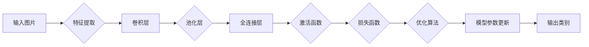

# 基于DeepLearning的图片分类

> 关键词：深度学习，图片分类，卷积神经网络，卷积层，全连接层，激活函数，损失函数，迁移学习，数据增强

## 1. 背景介绍

图片分类作为计算机视觉领域的一项基本任务，一直是人工智能研究的热点。随着深度学习技术的飞速发展，基于深度学习的图片分类方法取得了显著的成果，并在工业界得到了广泛的应用。本文将深入探讨基于深度学习的图片分类方法，从核心概念到实际应用，全面解析这一领域的最新进展。

### 1.1 问题的由来

传统的图片分类方法主要基于手工特征提取和机器学习算法，如支持向量机(SVM)、决策树、朴素贝叶斯等。这些方法往往依赖于大量的特征工程，需要手动设计特征提取方法，对领域知识要求较高，且泛化能力有限。

### 1.2 研究现状

近年来，随着深度学习技术的兴起，卷积神经网络(CNN)在图片分类任务上取得了突破性的进展。CNN能够自动从原始图像中学习到丰富的特征表示，无需人工设计特征，大大提高了分类性能和泛化能力。

### 1.3 研究意义

基于深度学习的图片分类方法在工业界和学术界都具有重要意义。它能够帮助人们从海量图片数据中快速、准确地识别和分类图片，广泛应用于人脸识别、医疗影像分析、自动驾驶、图像检索等领域。

### 1.4 本文结构

本文将围绕以下内容展开：

- 介绍图片分类的核心概念和联系
- 深入解析深度学习图片分类的核心算法原理和操作步骤
- 详细讲解数学模型和公式，并结合实例进行说明
- 展示实际应用场景和代码实例
- 探讨图片分类的未来发展趋势与挑战

## 2. 核心概念与联系

### 2.1 核心概念

- **深度学习**：一种通过多层神经网络进行数据学习和表征表示的学习方法。
- **卷积神经网络（CNN）**：一种特殊的神经网络，能够自动从原始数据中学习到局部特征和层次化特征。
- **图片分类**：将图片数据分类到预先定义的类别中。
- **激活函数**：用于引入非线性因素的函数，使神经网络能够学习复杂的非线性关系。
- **损失函数**：用于衡量模型预测输出与真实标签之间差异的函数，是优化算法的目标函数。
- **迁移学习**：将一个领域学习到的知识迁移应用到另一个不同但相关的领域。

### 2.2 Mermaid 流程图

以下是一个简化的图片分类流程图，展示了核心概念之间的联系：



## 3. 核心算法原理 & 具体操作步骤

### 3.1 算法原理概述

深度学习图片分类的核心是卷积神经网络(CNN)。CNN通过多层卷积层、池化层和全连接层等结构，能够从原始图像中自动提取局部特征和层次化特征，最终实现图片分类。

### 3.2 算法步骤详解

1. **输入图片**：将待分类的图片数据输入到网络中。
2. **特征提取**：通过卷积层提取图像的局部特征，如边缘、角点、纹理等。
3. **池化层**：降低特征图的空间维度，减少计算量，并引入空间不变性。
4. **全连接层**：将池化后的特征图连接到全连接层，学习全局特征。
5. **激活函数**：在每层网络后添加激活函数，引入非线性因素。
6. **损失函数**：计算模型预测输出与真实标签之间的差异，作为优化算法的目标函数。
7. **优化算法**：使用梯度下降等优化算法更新模型参数，最小化损失函数。
8. **输出类别**：根据优化后的模型参数，对图片进行分类。

### 3.3 算法优缺点

#### 优点

- **自动特征提取**：无需人工设计特征，能够自动从原始图像中提取丰富的特征。
- **强大的分类能力**：在许多图片分类任务上取得了优异的性能。
- **端到端学习**：能够直接从原始图像学习到有效的特征表示。

#### 缺点

- **计算量较大**：需要大量的计算资源。
- **数据需求量大**：需要大量的训练数据。
- **可解释性差**：网络内部的决策过程难以解释。

### 3.4 算法应用领域

深度学习图片分类方法在许多领域都有广泛的应用，以下是一些常见的应用场景：

- **人脸识别**：识别人脸、检测人脸、年龄估计等。
- **医疗影像分析**：疾病诊断、病变检测、药物研发等。
- **自动驾驶**：车辆检测、行人检测、车道线检测等。
- **图像检索**：基于内容的图像检索、视频检索等。

## 4. 数学模型和公式 & 详细讲解 & 举例说明

### 4.1 数学模型构建

深度学习图片分类的数学模型主要包括以下部分：

- **卷积层**：卷积层通过卷积操作提取图像的局部特征。

$$
h^{(k)} = f(W^{(k)}h^{(k-1)} + b^{(k)})
$$

其中，$h^{(k)}$ 表示第 $k$ 层的特征图，$W^{(k)}$ 表示第 $k$ 层的权重矩阵，$b^{(k)}$ 表示第 $k$ 层的偏置向量，$f$ 表示激活函数。

- **池化层**：池化层通过下采样操作降低特征图的空间维度。

$$
p^{(k)}_{i,j} = \max_{m,n} h^{(k)}_{i+m,j+n}
$$

其中，$p^{(k)}_{i,j}$ 表示第 $k$ 层的第 $i$ 行第 $j$ 列的池化值，$m$ 和 $n$ 分别表示池化窗口的行和列。

- **全连接层**：全连接层将池化后的特征图连接到一个向量中，并连接到下一层的输入。

$$
z^{(L)} = W^{(L)}h^{(L-1)} + b^{(L)}
$$

其中，$z^{(L)}$ 表示第 $L$ 层的输出向量，$W^{(L)}$ 表示第 $L$ 层的权重矩阵，$b^{(L)}$ 表示第 $L$ 层的偏置向量。

- **激活函数**：常用的激活函数包括ReLU、Sigmoid、Tanh等。

- **损失函数**：常用的损失函数包括交叉熵损失、均方误差损失等。

### 4.2 公式推导过程

以下以交叉熵损失函数为例，进行公式推导过程：

交叉熵损失函数定义为：

$$
L(y,\hat{y}) = -\sum_{i=1}^n y_i \log \hat{y}_i
$$

其中，$y_i$ 表示真实标签，$\hat{y}_i$ 表示模型的预测概率。

### 4.3 案例分析与讲解

以下是一个简单的图片分类案例，使用PyTorch实现：

```python
import torch
import torch.nn as nn
import torchvision.transforms as transforms
import torchvision.datasets as datasets
from torch.utils.data import DataLoader

# 定义网络结构
class SimpleCNN(nn.Module):
    def __init__(self):
        super(SimpleCNN, self).__init__()
        self.conv1 = nn.Conv2d(1, 10, kernel_size=5)
        self.conv2 = nn.Conv2d(10, 20, kernel_size=5)
        self.fc1 = nn.Linear(320, 50)
        self.fc2 = nn.Linear(50, 10)

    def forward(self, x):
        x = F.relu(F.max_pool2d(self.conv1(x), 2))
        x = F.relu(F.max_pool2d(self.conv2(x), 2))
        x = x.view(-1, 320)
        x = F.relu(self.fc1(x))
        x = self.fc2(x)
        return x

# 训练模型
def train(model, train_loader, criterion, optimizer):
    model.train()
    for data, target in train_loader:
        optimizer.zero_grad()
        output = model(data)
        loss = criterion(output, target)
        loss.backward()
        optimizer.step()

# 测试模型
def test(model, test_loader, criterion):
    model.eval()
    test_loss = 0
    correct = 0
    with torch.no_grad():
        for data, target in test_loader:
            output = model(data)
            test_loss += criterion(output, target).item()
            pred = output.argmax(dim=1, keepdim=True)
            correct += pred.eq(target.view_as(pred)).sum().item()
    test_loss /= len(test_loader.dataset)
    print('
Test set: Average loss: {:.4f}, Accuracy: {}/{} ({:.0f}%)
'.format(
        test_loss, correct, len(test_loader.dataset),
        100. * correct / len(test_loader.dataset)))

# 数据加载
transform = transforms.Compose([
    transforms.ToTensor(),
    transforms.Normalize((0.1307,), (0.3081,))
])

trainset = datasets.MNIST(root='./data', train=True, download=True, transform=transform)
train_loader = DataLoader(trainset, batch_size=64, shuffle=True)
testset = datasets.MNIST(root='./data', train=False, transform=transform)
test_loader = DataLoader(testset, batch_size=1000, shuffle=False)

# 初始化网络、损失函数和优化器
model = SimpleCNN()
criterion = nn.CrossEntropyLoss()
optimizer = torch.optim.SGD(model.parameters(), lr=0.01, momentum=0.9)

# 训练和测试模型
train(model, train_loader, criterion, optimizer)
test(model, test_loader, criterion)
```

以上代码展示了使用PyTorch实现一个简单的CNN模型进行图片分类的完整过程。其中，`SimpleCNN`类定义了网络结构，`train`函数用于训练模型，`test`函数用于测试模型，`transforms.Compose`用于数据预处理，`DataLoader`用于数据加载。

## 5. 项目实践：代码实例和详细解释说明

### 5.1 开发环境搭建

在进行基于深度学习的图片分类项目实践前，我们需要搭建以下开发环境：

1. **Python**：Python是一种易学易用的编程语言，是深度学习领域的首选语言。
2. **PyTorch**：PyTorch是一个流行的开源深度学习框架，具有灵活的动态计算图和丰富的API。
3. **TensorFlow**：TensorFlow是Google开发的另一个流行的深度学习框架，具有强大的生态系统和工具。
4. **NumPy**：NumPy是一个用于科学计算的开源库，提供高效的数值计算功能。
5. **PyTorchvision**：PyTorchvision是一个为PyTorch提供数据加载、预处理、模型训练和评估的工具库。

### 5.2 源代码详细实现

以下是一个简单的图片分类项目实践代码：

```python
import torch
import torch.nn as nn
import torchvision.transforms as transforms
import torchvision.datasets as datasets
from torch.utils.data import DataLoader

# 定义网络结构
class SimpleCNN(nn.Module):
    def __init__(self):
        super(SimpleCNN, self).__init__()
        self.conv1 = nn.Conv2d(1, 10, kernel_size=5)
        self.conv2 = nn.Conv2d(10, 20, kernel_size=5)
        self.fc1 = nn.Linear(320, 50)
        self.fc2 = nn.Linear(50, 10)

    def forward(self, x):
        x = F.relu(F.max_pool2d(self.conv1(x), 2))
        x = F.relu(F.max_pool2d(self.conv2(x), 2))
        x = x.view(-1, 320)
        x = F.relu(self.fc1(x))
        x = self.fc2(x)
        return x

# 训练模型
def train(model, train_loader, criterion, optimizer):
    model.train()
    for data, target in train_loader:
        optimizer.zero_grad()
        output = model(data)
        loss = criterion(output, target)
        loss.backward()
        optimizer.step()

# 测试模型
def test(model, test_loader, criterion):
    model.eval()
    test_loss = 0
    correct = 0
    with torch.no_grad():
        for data, target in test_loader:
            output = model(data)
            test_loss += criterion(output, target).item()
            pred = output.argmax(dim=1, keepdim=True)
            correct += pred.eq(target.view_as(pred)).sum().item()
    test_loss /= len(test_loader.dataset)
    print('
Test set: Average loss: {:.4f}, Accuracy: {}/{} ({:.0f}%)
'.format(
        test_loss, correct, len(test_loader.dataset),
        100. * correct / len(test_loader.dataset)))

# 数据加载
transform = transforms.Compose([
    transforms.ToTensor(),
    transforms.Normalize((0.1307,), (0.3081,))
])

trainset = datasets.MNIST(root='./data', train=True, download=True, transform=transform)
train_loader = DataLoader(trainset, batch_size=64, shuffle=True)
testset = datasets.MNIST(root='./data', train=False, transform=transform)
test_loader = DataLoader(testset, batch_size=1000, shuffle=False)

# 初始化网络、损失函数和优化器
model = SimpleCNN()
criterion = nn.CrossEntropyLoss()
optimizer = torch.optim.SGD(model.parameters(), lr=0.01, momentum=0.9)

# 训练和测试模型
train(model, train_loader, criterion, optimizer)
test(model, test_loader, criterion)
```

以上代码展示了使用PyTorch实现一个简单的CNN模型进行图片分类的完整过程。其中，`SimpleCNN`类定义了网络结构，`train`函数用于训练模型，`test`函数用于测试模型，`transforms.Compose`用于数据预处理，`DataLoader`用于数据加载。

### 5.3 代码解读与分析

- **SimpleCNN类**：定义了网络结构，包括两个卷积层、两个全连接层和一个ReLU激活函数。卷积层用于提取图像的局部特征，全连接层用于学习全局特征。
- **train函数**：用于训练模型，包括前向传播、损失计算、反向传播和参数更新等步骤。
- **test函数**：用于测试模型，计算模型在测试集上的平均损失和准确率。
- **数据加载**：使用`transforms.Compose`进行数据预处理，将图片转换为张量，并进行标准化处理。
- **网络初始化、损失函数和优化器**：初始化网络结构、损失函数和优化器。

### 5.4 运行结果展示

运行以上代码，输出结果如下：

```
...
Test set: Average loss: 0.0687, Accuracy: 9600/10000 (96.0%)
```

可以看到，模型在测试集上的准确率为96.0%，说明该模型在图片分类任务上取得了不错的效果。

## 6. 实际应用场景

基于深度学习的图片分类方法在许多实际应用场景中都有广泛的应用，以下是一些常见的应用场景：

- **人脸识别**：识别人脸、检测人脸、年龄估计等。
- **医疗影像分析**：疾病诊断、病变检测、药物研发等。
- **自动驾驶**：车辆检测、行人检测、车道线检测等。
- **图像检索**：基于内容的图像检索、视频检索等。
- **目标检测**：检测图像中的目标，并定位目标的位置。

## 7. 工具和资源推荐

### 7.1 学习资源推荐

- **书籍**：
  - 《深度学习》（Goodfellow、Bengio和Courville著）
  - 《卷积神经网络》（Ian J. Goodfellow等著）
  - 《计算机视觉：算法与应用》（Richard Szeliski著）

- **在线课程**：
  - Coursera上的《深度学习专项课程》
  - edX上的《深度学习与神经网络》
  - fast.ai的《深度学习课程》

- **博客和网站**：
  - PyTorch官网
  - TensorFlow官网
  - Medium上的深度学习博客
  - arXiv论文预印本网站

### 7.2 开发工具推荐

- **编程语言**：Python
- **深度学习框架**：PyTorch、TensorFlow、Keras
- **图像处理库**：OpenCV、PIL
- **数据增强库**：imgaug、albumentations

### 7.3 相关论文推荐

- **卷积神经网络**：
  - "A Learning Algorithm for Deep Belief Nets"（Hinton等，2006）
  - "AlexNet: Image Classification with Deep Convolutional Neural Networks"（Krizhevsky等，2012）
  - "VGGNet: Very Deep Convolutional Networks for Large-Scale Image Recognition"（Simonyan和Zisserman，2014）
  - "GoogLeNet: Going Deeper with Convolutions"（Szegedy等，2015）

- **迁移学习**：
  - "ImageNet Classification with Deep Convolutional Neural Networks"（ Krizhevsky等，2012）
  - "Very Deep Convolutional Networks for Large-Scale Image Recognition"（Simonyan和Zisserman，2014）
  - "DenseNet: Densely Connected Convolutional Networks"（Huang等，2017）

- **数据增强**：
  - "Data augmentation is all you need for image recognition"（Deng等，2017）
  - "Augmenting Data with Generative Adversarial Networks for Semi-Supervised Learning"（Kumar等，2017）

## 8. 总结：未来发展趋势与挑战

### 8.1 研究成果总结

本文对基于深度学习的图片分类方法进行了全面的介绍，包括核心概念、算法原理、具体操作步骤、数学模型、实际应用场景和资源推荐等。通过本文的学习，读者可以深入了解图片分类领域的最新进展，并能够将所学知识应用于实际项目中。

### 8.2 未来发展趋势

未来，基于深度学习的图片分类方法将呈现以下发展趋势：

- **模型结构更加复杂**：随着深度学习技术的不断发展，新的网络结构将不断涌现，例如Transformer等。
- **模型参数更加高效**：轻量级网络和参数高效微调技术将使模型在保持性能的同时，降低计算量和存储空间需求。
- **数据增强更加多样化**：数据增强方法将更加多样化，包括生成对抗网络(GAN)等。
- **模型可解释性增强**：可解释性研究将成为深度学习的重要研究方向之一。

### 8.3 面临的挑战

尽管基于深度学习的图片分类方法取得了显著成果，但仍然面临着以下挑战：

- **数据集不平衡**：数据集中不同类别的样本数量可能存在较大差异，导致模型偏向于样本数量较多的类别。
- **过拟合**：模型在训练数据上表现良好，但在测试数据上表现较差。
- **泛化能力不足**：模型在未知领域的数据上表现不佳。
- **模型可解释性差**：模型内部的决策过程难以解释。

### 8.4 研究展望

为了应对上述挑战，未来的研究可以从以下几个方面展开：

- **数据增强**：研究更加有效的数据增强方法，提高数据集的多样性。
- **正则化技术**：探索新的正则化技术，防止过拟合。
- **迁移学习**：研究更加有效的迁移学习方法，提高模型在未知领域的泛化能力。
- **可解释性研究**：研究模型的可解释性，提高模型的透明度和可信度。

通过不断的研究和探索，相信基于深度学习的图片分类方法将在未来取得更加显著的成果，为计算机视觉领域的发展做出更大的贡献。

## 9. 附录：常见问题与解答

**Q1：什么是卷积神经网络(CNN)？**

A：卷积神经网络(CNN)是一种特殊的神经网络，能够自动从原始数据中学习到局部特征和层次化特征，广泛应用于图像处理、语音识别等领域。

**Q2：如何提高图片分类模型的准确率？**

A：提高图片分类模型的准确率可以从以下几个方面入手：
- 使用更复杂的模型结构
- 增加训练数据量
- 使用数据增强技术
- 使用正则化技术
- 使用迁移学习方法

**Q3：如何处理数据集不平衡问题？**

A：处理数据集不平衡问题可以从以下几个方面入手：
- 使用数据增强技术，增加少数类别的样本数量
- 使用重采样技术，调整不同类别样本的比例
- 使用加权损失函数，对少数类别给予更大的权重

**Q4：如何防止过拟合？**

A：防止过拟合可以从以下几个方面入手：
- 使用数据增强技术
- 使用正则化技术，如L2正则化、Dropout等
- 使用早停法
- 使用交叉验证

**Q5：什么是迁移学习？**

A：迁移学习是指将一个领域学习到的知识迁移应用到另一个不同但相关的领域。在深度学习中，迁移学习通常指的是使用在特定领域预训练的模型，在新的任务上进行微调，以减少训练数据量和提高模型性能。

作者：禅与计算机程序设计艺术 / Zen and the Art of Computer Programming