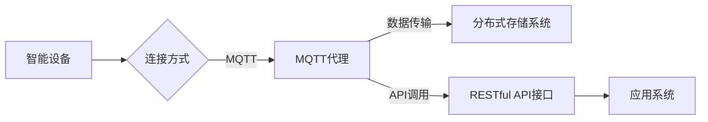

# 基于MQTT协议和RESTful API的智能家居分布式存储解决方案

> 关键词：MQTT协议, RESTful API, 智能家居, 分布式存储, 物联网, 云计算, 数据同步, 实时性, 安全性

## 1. 背景介绍

随着物联网(IoT)技术的快速发展，智能家居已成为人们日常生活的重要组成部分。智能家居系统通常由多个设备和平台组成，它们通过互联网相互连接，实现家庭设备的自动化控制。然而，随着设备数量的增加和数据的爆炸式增长，如何有效地管理和存储这些数据成为一个关键问题。

本文将探讨基于MQTT协议和RESTful API的智能家居分布式存储解决方案。该方案旨在提供一个高效、可靠、安全的数据存储和访问机制，以满足智能家居系统对实时性、扩展性和安全性等方面的需求。

### 1.1 问题的由来

智能家居系统面临以下挑战：

- **数据量庞大**：智能家居设备产生的数据量庞大，需要高效的存储和检索机制。
- **实时性要求**：智能家居应用场景对数据的实时性要求高，需要快速响应设备状态变化。
- **安全性问题**：智能家居设备涉及用户隐私和安全，需要确保数据传输和存储的安全性。
- **分布式架构**：智能家居系统通常采用分布式架构，需要支持跨设备、跨平台的数据访问。

### 1.2 研究现状

目前，智能家居分布式存储解决方案主要分为以下几类：

- **中心化存储**：所有数据都存储在中心服务器上，易于管理和维护，但容易成为单点故障，且扩展性差。
- **边缘计算**：在设备或边缘节点上进行数据处理和存储，提高实时性，但可能面临数据安全和隐私问题。
- **分布式存储**：将数据分散存储在多个节点上，提高数据可靠性和扩展性，但需要解决数据一致性和访问效率问题。

### 1.3 研究意义

本文提出的基于MQTT协议和RESTful API的智能家居分布式存储解决方案，旨在解决智能家居系统中数据存储和访问的挑战，具有以下意义：

- 提高数据存储和访问效率。
- 增强数据安全性和可靠性。
- 支持跨设备和跨平台的数据访问。
- 促进智能家居系统的快速发展。

## 2. 核心概念与联系

### 2.1 核心概念原理

#### MQTT协议

MQTT（Message Queuing Telemetry Transport）是一种轻量级的消息传输协议，适用于低带宽、高延迟和不稳定网络环境。它具有以下特点：

- 发布/订阅模式：发布者可以向订阅者发布消息，订阅者可以订阅感兴趣的主题。
- 质量服务等级（QoS）：支持不同级别的服务质量，包括至多一次、至少一次和恰好一次。
- 简洁性：协议设计简单，数据传输开销小。

#### RESTful API

RESTful API是基于REST架构风格的一套接口规范，用于构建Web服务。它具有以下特点：

- 状态lessness：客户端不保存服务器状态，每次请求都是独立的。
- 无状态：服务器不存储客户端请求的历史信息。
- 可缓存：响应可以被缓存，提高访问效率。
- 跨语言：可以使用任何编程语言实现。

### 2.2 架构流程图

智能家居分布式存储解决方案的架构流程图如下：



## 3. 核心算法原理 & 具体操作步骤

### 3.1 算法原理概述

智能家居分布式存储解决方案的核心算法主要包括以下步骤：

1. 智能设备通过MQTT协议连接到MQTT代理。
2. 智能设备将传感器数据发送到MQTT代理，并指定主题。
3. MQTT代理将数据存储到分布式存储系统，并记录数据元数据。
4. 应用系统通过RESTful API接口查询和访问数据。
5. 分布式存储系统根据请求返回数据给应用系统。

### 3.2 算法步骤详解

1. **设备连接**：智能设备通过MQTT客户端连接到MQTT代理，配置MQTT代理地址、端口、用户名和密码等信息。

2. **数据发布**：智能设备将传感器数据打包成MQTT消息，指定主题，并通过MQTT协议发送到MQTT代理。

3. **数据存储**：MQTT代理接收到消息后，将数据存储到分布式存储系统。存储系统可以使用关系型数据库、NoSQL数据库或分布式文件系统等。

4. **数据查询**：应用系统通过RESTful API接口向分布式存储系统发送查询请求，请求格式可以是JSON、XML等。

5. **数据返回**：分布式存储系统根据查询请求返回数据给应用系统。

### 3.3 算法优缺点

#### 优点

- **实时性**：MQTT协议支持QoS等级，可以满足实时性要求。
- **可扩展性**：分布式存储系统可以水平扩展，提高存储容量和访问效率。
- **安全性**：可以使用TLS/SSL加密MQTT协议和数据传输，保证数据安全。
- **易用性**：RESTful API接口简单易用，方便开发和管理。

#### 缺点

- **复杂性**：系统架构较为复杂，需要协调MQTT代理、分布式存储系统和RESTful API接口。
- **性能损耗**：MQTT协议和数据传输可能会引入一定的性能损耗。

### 3.4 算法应用领域

智能家居分布式存储解决方案适用于以下领域：

- **智能家庭**：将家居设备连接到网络，实现远程控制、自动调节等功能。
- **智能城市**：将城市基础设施连接到网络，实现智能交通、智能安防等功能。
- **工业物联网**：将工业设备连接到网络，实现远程监控、故障预测等功能。

## 4. 数学模型和公式 & 详细讲解 & 举例说明

### 4.1 数学模型构建

智能家居分布式存储解决方案的数学模型可以表示为：

$$
\text{模型} = \text{MQTT协议} + \text{分布式存储系统} + \text{RESTful API接口}
$$

其中：

- MQTT协议负责数据的实时传输。
- 分布式存储系统负责数据的存储和检索。
- RESTful API接口负责数据的访问和控制。

### 4.2 公式推导过程

由于智能家居分布式存储解决方案涉及多个组件，其数学模型的推导过程较为复杂，需要根据具体的应用场景和需求进行设计。

### 4.3 案例分析与讲解

以下以智能家庭场景为例，分析智能家居分布式存储解决方案的应用：

1. **设备连接**：智能灯具通过MQTT客户端连接到MQTT代理。

2. **数据发布**：当用户通过手机APP关闭智能灯具时，智能灯具将关闭信号通过MQTT协议发送到MQTT代理。

3. **数据存储**：MQTT代理将关闭信号存储到分布式存储系统，并记录时间戳、设备ID等信息。

4. **数据查询**：手机APP通过RESTful API接口查询智能灯具的状态。

5. **数据返回**：分布式存储系统返回智能灯具的关闭状态给手机APP，手机APP显示灯具关闭。

## 5. 项目实践：代码实例和详细解释说明

### 5.1 开发环境搭建

以下是使用Python进行智能家居分布式存储解决方案开发的开发环境搭建步骤：

1. 安装Python 3.8及以上版本。
2. 安装MQTT库：`pip install paho-mqtt`
3. 安装分布式存储系统：如Redis、MongoDB等。
4. 安装RESTful API框架：如Flask、Django等。

### 5.2 源代码详细实现

以下是使用Python实现智能家居分布式存储解决方案的示例代码：

```python
import paho.mqtt.client as mqtt
import json
from flask import Flask, request, jsonify

app = Flask(__name__)

# MQTT代理配置
mqtt_client = mqtt.Client()
mqtt_client.connect("mqtt_broker_address", 1883, 60)

# 数据存储系统初始化
# ...

# RESTful API接口
@app.route('/device/status', methods=['GET'])
def get_device_status():
    device_id = request.args.get('device_id')
    status = get_device_status_from_storage(device_id)
    return jsonify({'device_id': device_id, 'status': status})

# MQTT消息处理回调函数
def on_message(client, userdata, message):
    topic = message.topic
    payload = json.loads(message.payload.decode())
    store_data_to_storage(topic, payload)

# 启动Flask应用
if __name__ == '__main__':
    app.run(port=5000)

# MQTT消息订阅
mqtt_client.subscribe("home/smart_lights")
mqtt_client.on_message = on_message
mqtt_client.loop_forever()
```

### 5.3 代码解读与分析

以上代码展示了智能家居分布式存储解决方案的核心功能实现：

- 使用Paho-MQTT库实现MQTT客户端。
- 使用Flask框架实现RESTful API接口。
- 使用自定义函数`get_device_status_from_storage`和`store_data_to_storage`实现数据存储和检索。

### 5.4 运行结果展示

运行以上代码后，智能灯具关闭信号将通过MQTT协议发送到MQTT代理，并存储到分布式存储系统。同时，通过RESTful API接口可以查询到智能灯具的关闭状态。

## 6. 实际应用场景

智能家居分布式存储解决方案在实际应用中具有广泛的应用场景，以下列举几个例子：

- **智能家庭**：通过收集智能家居设备的数据，实现家庭设备的远程控制、自动调节等功能。
- **智能社区**：通过收集社区内各个设备的数据，实现社区安防、环境监测等功能。
- **智慧城市**：通过收集城市基础设施的数据，实现交通管理、环境监测等功能。

## 7. 工具和资源推荐

### 7.1 学习资源推荐

- MQTT协议官方文档：[MQTT协议官方文档](https://mosquitto.org/protocol/)
- RESTful API设计指南：[RESTful API设计指南](https://restfulapi.net/)

### 7.2 开发工具推荐

- MQTT客户端：Paho-MQTT
- 分布式存储系统：Redis、MongoDB
- RESTful API框架：Flask、Django

### 7.3 相关论文推荐

- [MQTT协议规范](https://www.mqtt.org/specifications/mqtt-5.0/)
- [RESTful API设计最佳实践](https://restfulapi.net/http-methods.html)

## 8. 总结：未来发展趋势与挑战

### 8.1 研究成果总结

本文提出了基于MQTT协议和RESTful API的智能家居分布式存储解决方案，并对其原理、步骤、优缺点和应用领域进行了详细阐述。该方案为智能家居系统中数据存储和访问提供了一种高效、可靠、安全的解决方案。

### 8.2 未来发展趋势

智能家居分布式存储解决方案未来发展趋势如下：

- **边缘计算**：将数据处理和存储功能下沉到边缘节点，提高实时性和安全性。
- **区块链技术**：利用区块链技术保证数据的安全性和不可篡改性。
- **人工智能**：将人工智能技术应用于数据分析和预测，实现更智能化的智能家居系统。

### 8.3 面临的挑战

智能家居分布式存储解决方案面临以下挑战：

- **数据安全**：如何保证数据传输和存储的安全性，防止数据泄露和篡改。
- **数据隐私**：如何保护用户隐私，避免敏感信息泄露。
- **数据一致性**：如何保证分布式存储系统中的数据一致性。

### 8.4 研究展望

智能家居分布式存储解决方案的研究展望如下：

- **标准化**：制定智能家居分布式存储的行业标准，促进技术发展。
- **技术创新**：开发更高效、更安全的数据存储和访问技术。
- **生态建设**：构建智能家居分布式存储生态系统，推动产业进步。

## 9. 附录：常见问题与解答

**Q1：为什么选择MQTT协议？**

A：MQTT协议适用于低带宽、高延迟和不稳定网络环境，适合智能家居等物联网应用。

**Q2：如何保证数据安全性？**

A：可以使用TLS/SSL加密MQTT协议和数据传输，使用访问控制列表限制访问权限，使用区块链技术保证数据不可篡改。

**Q3：如何保证数据一致性？**

A：可以使用分布式数据库的一致性保证机制，如一致性哈希、分布式锁等。

**Q4：如何扩展分布式存储系统？**

A：可以使用分布式文件系统或分布式数据库，通过水平扩展提高存储容量和访问效率。

**Q5：如何实现跨平台的数据访问？**

A：可以使用RESTful API接口，支持多种编程语言和平台的数据访问。

---

作者：禅与计算机程序设计艺术 / Zen and the Art of Computer Programming