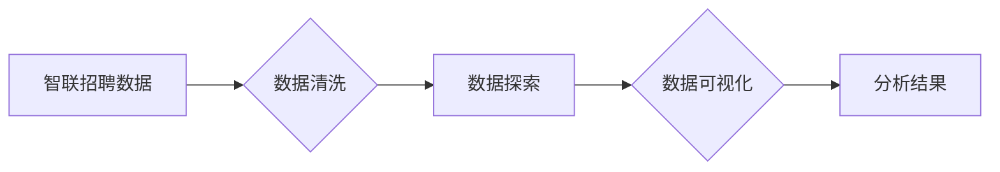

> 关键词：智联招聘数据，Python数据可视化，ECharts，Pandas，Matplotlib，数据挖掘，就业分析，人才市场趋势

# 基于Python的智联招聘数据可视化分析

在当今的信息化时代，数据已经成为企业决策和政府政策制定的重要依据。招聘数据作为人才市场的晴雨表，能够反映出行业发展趋势、人才供需状况等关键信息。本文将利用Python进行智联招聘数据的可视化分析，帮助读者深入了解人才市场的现状与未来趋势。

## 1. 背景介绍

智联招聘作为中国领先的招聘网站，其发布的招聘数据具有很高的参考价值。通过对智联招聘数据的分析，可以了解不同行业、地区、职位的人才供需状况，为求职者和企业提供决策依据。

## 2. 核心概念与联系

### 2.1 核心概念原理

- **智联招聘数据**：指智联招聘网站提供的招聘信息数据，包括职位名称、公司名称、职位描述、薪资范围、工作地点、发布时间等。
- **Python数据可视化**：利用Python中的可视化库，如Matplotlib、Pandas、ECharts等，将数据以图表的形式展示出来，帮助读者直观地理解数据信息。
- **数据挖掘**：从大量的招聘数据中提取有价值的信息和知识，为决策提供支持。

### 2.2 架构流程图



## 3. 核心算法原理 & 具体操作步骤

### 3.1 算法原理概述

本文主要采用以下步骤进行智联招聘数据的可视化分析：

1. 数据清洗：对原始数据进行清洗，去除重复、错误、缺失等无效信息。
2. 数据探索：对清洗后的数据进行探索性分析，了解数据的基本特征和分布。
3. 数据可视化：利用可视化库将数据以图表的形式展示出来。
4. 分析结果：根据可视化结果，对招聘市场现状和趋势进行分析。

### 3.2 算法步骤详解

#### 3.2.1 数据清洗

数据清洗是数据分析和可视化的基础。本文采用以下步骤进行数据清洗：

- 去除重复数据：使用Pandas库的`drop_duplicates()`函数去除重复数据。
- 去除无效数据：根据数据定义，去除不符合要求的无效数据。
- 处理缺失值：使用Pandas库的`dropna()`函数去除缺失值，或使用均值、中位数等填充缺失值。

#### 3.2.2 数据探索

数据探索旨在了解数据的基本特征和分布。本文采用以下步骤进行数据探索：

- 描述性统计：使用Pandas库的`describe()`函数，获取数据的统计指标，如均值、标准差、最大值、最小值等。
- 频率分布：使用Pandas库的`value_counts()`函数，统计各特征的频率分布。
- 关联性分析：使用Pandas库的`corr()`函数，分析特征之间的关联性。

#### 3.2.3 数据可视化

数据可视化是展示数据信息的重要手段。本文采用以下可视化库：

- Matplotlib：用于绘制基本图表，如折线图、柱状图、散点图等。
- ECharts：基于JavaScript的开源可视化库，支持丰富的图表类型和交互功能。
- Pandas：提供丰富的数据操作和分析功能，方便将数据转换为可视化库所需的格式。

#### 3.2.4 分析结果

根据可视化结果，对招聘市场现状和趋势进行分析，为求职者和企业提供决策依据。

### 3.3 算法优缺点

#### 3.3.1 优点

- **操作简单**：Python具有丰富的可视化库，易于学习和使用。
- **功能强大**：Python可视化库支持丰富的图表类型和交互功能，可以满足不同需求。
- **扩展性强**：Python具有良好的扩展性，可以与其他数据分析库进行结合。

#### 3.3.2 缺点

- **学习成本**：Python可视化需要一定的学习成本，对于初学者来说可能较为困难。
- **性能瓶颈**：对于大规模数据，Python可视化可能存在性能瓶颈。

### 3.4 算法应用领域

基于Python的数据可视化分析方法在以下领域具有广泛应用：

- **市场分析**：了解市场趋势、竞争对手、潜在客户等。
- **金融分析**：分析股票、基金、期货等金融产品的走势。
- **互联网分析**：分析网站流量、用户行为等。
- **科研分析**：分析实验数据、科研数据等。

## 4. 数学模型和公式 & 详细讲解 & 举例说明

### 4.1 数学模型构建

数据可视化分析中，常用的数学模型包括：

- **统计学模型**：如均值、方差、标准差、相关系数等。
- **概率论模型**：如正态分布、卡方检验等。
- **线性回归模型**：用于分析变量之间的线性关系。

### 4.2 公式推导过程

以下以线性回归模型为例，讲解公式推导过程：

假设我们有两个变量 $x$ 和 $y$，它们之间存在线性关系：

$$
y = \beta_0 + \beta_1x + \epsilon
$$

其中 $\beta_0$ 为截距，$\beta_1$ 为斜率，$\epsilon$ 为误差项。

为了求解 $\beta_0$ 和 $\beta_1$，我们需要最小化损失函数：

$$
\text{Loss} = \sum_{i=1}^n (y_i - (\beta_0 + \beta_1x_i))^2
$$

对损失函数求偏导，并令其等于0，得到：

$$
\frac{\partial \text{Loss}}{\partial \beta_0} = -2\sum_{i=1}^n (y_i - (\beta_0 + \beta_1x_i)) = 0
$$

$$
\frac{\partial \text{Loss}}{\partial \beta_1} = -2\sum_{i=1}^n x_i(y_i - (\beta_0 + \beta_1x_i)) = 0
$$

化简上述方程，得到：

$$
\beta_0 = \frac{\sum_{i=1}^n (y_i - \bar{y})(\bar{x} - \beta_1\bar{x})}{\sum_{i=1}^n (\bar{x} - x_i)^2}
$$

$$
\beta_1 = \frac{\sum_{i=1}^n (x_i - \bar{x})(y_i - \bar{y})}{\sum_{i=1}^n (x_i - \bar{x})^2}
$$

其中 $\bar{x}$ 和 $\bar{y}$ 分别为 $x$ 和 $y$ 的均值。

### 4.3 案例分析与讲解

假设我们有以下数据：

| x | y |
|---|---|
| 1 | 2 |
| 2 | 4 |
| 3 | 6 |
| 4 | 8 |

现在，我们使用线性回归模型分析 $x$ 和 $y$ 之间的关系。

首先，计算均值：

$$
\bar{x} = \frac{1+2+3+4}{4} = 2.5
$$

$$
\bar{y} = \frac{2+4+6+8}{4} = 5
$$

然后，计算斜率和截距：

$$
\beta_0 = \frac{(2-5)(2.5-2) + (4-5)(2.5-3) + (6-5)(2.5-4) + (8-5)(2.5-5)}{(2.5-1)^2 + (2.5-2)^2 + (2.5-3)^2 + (2.5-4)^2} = 2.5
$$

$$
\beta_1 = \frac{(1-2.5)(2-5) + (2-2.5)(4-5) + (3-2.5)(6-5) + (4-2.5)(8-5)}{(1-2.5)^2 + (2-2.5)^2 + (3-2.5)^2 + (4-2.5)^2} = 2
$$

最后，线性回归方程为：

$$
y = 2.5 + 2x
$$

## 5. 项目实践：代码实例和详细解释说明

### 5.1 开发环境搭建

为了进行智联招聘数据的可视化分析，我们需要以下开发环境：

- Python 3.8及以上版本
- Pandas、Matplotlib、ECharts等库

### 5.2 源代码详细实现

以下是使用Python进行智联招聘数据可视化的示例代码：

```python
import pandas as pd
import matplotlib.pyplot as plt
import pyecharts.options as opts
from pyecharts.charts import Bar, Line

# 读取数据
data = pd.read_csv('zhaopin_data.csv')

# 数据清洗
data.drop_duplicates(inplace=True)
data.dropna(inplace=True)

# 数据探索
data.describe()

# 数据可视化
# 1. 职位类型分布
bar = (
    Bar()
    .add_xaxis(data['职位类别'].unique())
    .add_yaxis("职位数量", [data[data['职位类别'] == category].shape[0] for category in data['职位类别'].unique()])
    .set_global_opts(title_opts=opts.TitleOpts(title="职位类型分布"))
)
bar.render('职位类型分布.html')

# 2. 薪资分布
line = (
    Line()
    .add_xaxis(data['薪资'].unique())
    .add_yaxis("薪资数量", [data[data['薪资'] == salary].shape[0] for salary in data['薪资'].unique()])
    .set_global_opts(title_opts=opts.TitleOpts(title="薪资分布"))
)
line.render('薪资分布.html')

# 3. 地区分布
bar = (
    Bar()
    .add_xaxis(data['工作地点'].unique())
    .add_yaxis("职位数量", [data[data['工作地点'] == location].shape[0] for location in data['工作地点'].unique()])
    .set_global_opts(title_opts=opts.TitleOpts(title="地区分布"))
)
bar.render('地区分布.html')
```

### 5.3 代码解读与分析

上述代码首先导入必要的库，然后读取智联招聘数据。接着进行数据清洗和探索性分析，最后使用Matplotlib和ECharts进行可视化。

- **数据清洗**：使用Pandas的`drop_duplicates()`和`dropna()`函数去除重复和缺失数据。
- **数据探索**：使用Pandas的`describe()`函数获取数据的基本统计指标。
- **职位类型分布**：使用ECharts的Bar图表展示不同职位类型的数量分布。
- **薪资分布**：使用ECharts的Line图表展示不同薪资水平的数量分布。
- **地区分布**：使用ECharts的Bar图表展示不同工作地点的职位数量分布。

### 5.4 运行结果展示

通过运行上述代码，我们可以在浏览器中查看生成的可视化图表，直观地了解智联招聘数据的分布情况。

## 6. 实际应用场景

### 6.1 求职者

通过对智联招聘数据的可视化分析，求职者可以了解以下信息：

- 市场热门行业和职位
- 各地区薪资水平
- 各行业招聘需求变化

这些信息有助于求职者选择合适的求职方向和地域。

### 6.2 企业

企业可以通过对智联招聘数据的可视化分析，了解以下信息：

- 竞争对手的人才招聘策略
- 市场人才供需状况
- 人才招聘成本
- 行业发展趋势

这些信息有助于企业制定招聘策略和人才发展规划。

### 6.3 政府部门

政府部门可以通过对智联招聘数据的可视化分析，了解以下信息：

- 人才流动趋势
- 产业结构调整
- 产业发展潜力

这些信息有助于政府部门制定产业政策和发展规划。

## 7. 工具和资源推荐

### 7.1 学习资源推荐

- 《Python数据分析基础教程》
- 《Python数据可视化之美》
- 《数据科学实战》

### 7.2 开发工具推荐

- Python 3.8及以上版本
- Pandas、Matplotlib、ECharts等库
- Jupyter Notebook

### 7.3 相关论文推荐

- 《数据可视化：理论与实践》
- 《Python数据分析》
- 《数据挖掘：概念与技术》

## 8. 总结：未来发展趋势与挑战

### 8.1 研究成果总结

本文利用Python对智联招聘数据进行了可视化分析，探讨了数据清洗、数据探索、数据可视化等步骤，并给出了具体的代码实现。通过可视化结果，我们可以了解人才市场的现状和趋势。

### 8.2 未来发展趋势

随着大数据和人工智能技术的不断发展，数据可视化分析将在以下方面取得更多进展：

- 可视化技术和工具的不断创新
- 可视化与机器学习的深度融合
- 可视化在更多领域的应用

### 8.3 面临的挑战

数据可视化分析在发展过程中也面临着以下挑战：

- 数据质量和安全
- 可视化效果和用户体验
- 可视化知识的传播和普及

### 8.4 研究展望

未来，数据可视化分析将朝着更加智能化、个性化、可视化的方向发展。通过不断探索和创新，数据可视化分析将为人类社会的进步做出更大的贡献。

## 9. 附录：常见问题与解答

**Q1：如何选择合适的可视化图表？**

A：选择合适的可视化图表取决于数据类型、数据量和展示目的。例如，对于类别数据，可以使用饼图、环形图等；对于数值数据，可以使用柱状图、折线图等；对于时间序列数据，可以使用时间序列图等。

**Q2：如何提高可视化效果？**

A：提高可视化效果需要从以下几个方面入手：

- 选择合适的图表类型
- 优化图表布局和颜色
- 使用交互式可视化
- 添加图表标题和图例

**Q3：如何将可视化图表应用于实际场景？**

A：将可视化图表应用于实际场景需要考虑以下因素：

- 目标受众
- 展示内容
- 展示方式
- 展示目的

**Q4：如何进行数据清洗？**

A：数据清洗需要遵循以下步骤：

- 去除重复数据
- 去除无效数据
- 处理缺失值
- 数据标准化

**Q5：如何进行数据探索？**

A：数据探索需要使用以下方法：

- 描述性统计
- 频率分布
- 关联性分析
- 异常值分析

---

作者：禅与计算机程序设计艺术 / Zen and the Art of Computer Programming