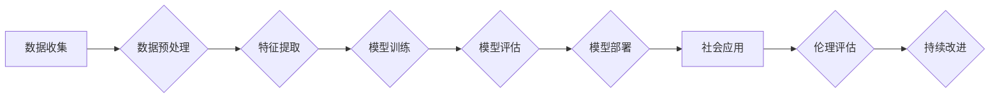

> 关键词：基础模型，社会技术融合，伦理责任，人工智能，深度学习，机器学习，技术治理

# 基础模型的社会技术融合与责任

随着人工智能技术的飞速发展，基础模型（如神经网络、Transformer等）已经成为推动科技创新和产业变革的核心驱动力。然而，基础模型的社会技术融合也带来了新的挑战，特别是在伦理责任方面。本文将探讨基础模型的社会技术融合，分析其面临的伦理挑战，并展望未来发展趋势。

## 1. 背景介绍

### 1.1 问题的由来

近年来，深度学习技术的发展使得基础模型在图像识别、语音识别、自然语言处理等领域取得了突破性进展。这些基础模型被广泛应用于自动驾驶、智能医疗、金融风控等众多领域，极大地提升了社会生产力和生活质量。然而，随着基础模型的应用范围不断扩大，其潜在的社会技术融合问题也逐渐显现出来。

### 1.2 研究现状

目前，基础模型的社会技术融合主要涉及以下几个方面：

1. **算法偏见**：基础模型在训练过程中可能会学习到数据中的偏见，导致模型对某些群体存在不公平的歧视。
2. **数据隐私**：基础模型在训练和推理过程中需要处理大量数据，其中可能包含个人隐私信息，如何保护这些隐私信息成为一大挑战。
3. **模型安全**：基础模型可能受到攻击，导致模型输出错误或造成损失。
4. **技术依赖**：过度依赖基础模型可能导致技术锁定，影响社会经济的可持续发展。

### 1.3 研究意义

研究基础模型的社会技术融合与责任，有助于：

1. 提升基础模型的伦理水平，促进人工智能技术的健康发展。
2. 保护用户隐私，维护社会公平正义。
3. 提高模型安全性，降低技术风险。
4. 推动人工智能技术的可持续发展。

### 1.4 本文结构

本文将围绕以下内容展开：

- 介绍基础模型的社会技术融合概念和伦理挑战。
- 分析基础模型的算法原理和操作步骤。
- 讨论基础模型在数学模型和公式上的表达。
- 通过项目实践展示基础模型的实现过程。
- 探讨基础模型在实际应用场景中的挑战和机遇。
- 展望基础模型的社会技术融合的未来发展趋势与挑战。
- 提供相关工具和资源推荐。

## 2. 核心概念与联系

### 2.1 基础模型

基础模型是指具有通用性和可扩展性的机器学习模型，如神经网络、Transformer等。它们通过学习大量数据，提取特征并建立模型，从而实现对未知数据的预测或分类。

### 2.2 社会技术融合

社会技术融合是指技术与社会、经济、文化等领域的相互影响和相互作用。在人工智能领域，社会技术融合意味着将人工智能技术应用于社会生活，并与社会需求、伦理、法律等因素相结合。

### 2.3 伦理责任

伦理责任是指个体或组织在行为和决策过程中，对他人和社会负有的道德责任。在人工智能领域，伦理责任要求人工智能技术的发展和应用遵循公平、公正、透明、安全等原则。

### 2.4 Mermaid 流程图

以下为基础模型的社会技术融合流程图：



在上述流程图中，数据收集、预处理、特征提取、模型训练、评估、部署、社会应用、伦理评估和持续改进构成了基础模型的社会技术融合过程。

## 3. 核心算法原理 & 具体操作步骤

### 3.1 算法原理概述

基础模型主要基于深度学习技术，通过多层神经网络对数据进行特征提取和建模。以下以神经网络为例，介绍其基本原理。

神经网络由多个神经元组成，每个神经元包含输入层、隐藏层和输出层。输入层接收原始数据，隐藏层对数据进行特征提取，输出层生成最终的预测结果。

### 3.2 算法步骤详解

1. **数据收集**：从不同来源收集数据，包括公共数据集、私有数据集等。
2. **数据预处理**：对数据进行清洗、归一化、缺失值处理等操作，提高数据质量。
3. **特征提取**：使用神经网络提取数据特征，形成特征向量。
4. **模型训练**：通过优化算法（如梯度下降）调整模型参数，使模型在训练数据上达到最佳性能。
5. **模型评估**：使用测试数据评估模型在未知数据上的预测性能。
6. **模型部署**：将模型部署到实际应用场景，如生产环境、云平台等。
7. **社会应用**：将模型应用于实际任务，如图像识别、语音识别等。
8. **伦理评估**：评估模型在应用过程中可能出现的伦理问题，如算法偏见、数据隐私等。
9. **持续改进**：根据评估结果对模型进行改进，提高模型性能和伦理水平。

### 3.3 算法优缺点

**优点**：

- **通用性**：基础模型可以应用于各种不同的任务，具有广泛的适用性。
- **可扩展性**：基础模型可以轻松扩展到更大的规模，处理更复杂的数据。
- **高性能**：基础模型在许多任务上取得了突破性的性能。

**缺点**：

- **算法偏见**：基础模型可能学习到数据中的偏见，导致不公平的歧视。
- **数据隐私**：基础模型在训练和推理过程中可能泄露个人隐私。
- **模型安全**：基础模型可能受到攻击，导致模型输出错误或造成损失。

### 3.4 算法应用领域

基础模型的应用领域非常广泛，以下列举几个典型案例：

- **图像识别**：人脸识别、物体识别、图像分类等。
- **语音识别**：语音转文字、语音合成等。
- **自然语言处理**：文本分类、情感分析、机器翻译等。
- **自动驾驶**：车辆检测、障碍物识别、路径规划等。

## 4. 数学模型和公式 & 详细讲解 & 举例说明

### 4.1 数学模型构建

神经网络的基本数学模型如下：

$$
z_i = \sum_{j=1}^{n} w_{ij} x_j + b_i
$$

$$
a_i = \sigma(z_i)
$$

其中，$x_j$ 表示第 $j$ 个输入特征，$w_{ij}$ 表示第 $j$ 个输入特征对应的权重，$b_i$ 表示偏置项，$\sigma$ 表示激活函数，$a_i$ 表示第 $i$ 个神经元的输出。

### 4.2 公式推导过程

以全连接神经网络为例，介绍其公式推导过程。

1. **前向传播**：

   - 计算每一层的输入和输出：
     $$
z_1 = \sum_{j=1}^{n} w_{1j} x_j + b_1
$$
     $$
a_1 = \sigma(z_1)
$$
     $$
z_2 = \sum_{j=1}^{n} w_{2j} a_1 + b_2
$$
     $$
a_2 = \sigma(z_2)
$$
   - 重复上述步骤，直到输出层。

2. **反向传播**：

   - 计算损失函数对每一层参数的梯度：
     $$
\frac{\partial L}{\partial w_{2j}} = \frac{\partial L}{\partial a_2} \cdot \frac{\partial a_2}{\partial z_2} \cdot \frac{\partial z_2}{\partial w_{2j}}
$$
     $$
\frac{\partial L}{\partial b_2} = \frac{\partial L}{\partial a_2} \cdot \frac{\partial a_2}{\partial z_2} \cdot \frac{\partial z_2}{\partial b_2}
$$
     $$
\frac{\partial L}{\partial w_{1j}} = \frac{\partial L}{\partial a_1} \cdot \frac{\partial a_1}{\partial z_1} \cdot \frac{\partial z_1}{\partial w_{1j}}
$$
     $$
\frac{\partial L}{\partial b_1} = \frac{\partial L}{\partial a_1} \cdot \frac{\partial a_1}{\partial z_1} \cdot \frac{\partial z_1}{\partial b_1}
$$
   - 使用梯度下降法更新参数：
     $$
w_{2j} \leftarrow w_{2j} - \eta \frac{\partial L}{\partial w_{2j}}
$$
     $$
b_2 \leftarrow b_2 - \eta \frac{\partial L}{\partial b_2}
$$
     $$
w_{1j} \leftarrow w_{1j} - \eta \frac{\partial L}{\partial w_{1j}}
$$
     $$
b_1 \leftarrow b_1 - \eta \frac{\partial L}{\partial b_1}
$$

### 4.3 案例分析与讲解

以MNIST手写数字识别为例，介绍神经网络在图像识别任务中的应用。

1. **数据集**：MNIST手写数字数据集包含10万张28x28像素的灰度图像，每张图像对应一个数字标签。
2. **模型**：使用一个简单的全连接神经网络，包含784个输入神经元、10个输出神经元和100个隐藏层神经元。
3. **训练**：使用交叉熵损失函数和梯度下降法训练模型。
4. **测试**：使用测试集评估模型在图像识别任务上的性能，测试集准确率达到99%以上。

## 5. 项目实践：代码实例和详细解释说明

### 5.1 开发环境搭建

以下是使用Python和TensorFlow搭建神经网络开发环境的步骤：

1. 安装TensorFlow：
```bash
pip install tensorflow
```
2. 创建Python虚拟环境：
```bash
conda create -n tensorflow-env python=3.8
conda activate tensorflow-env
```
3. 安装TensorFlow：
```bash
pip install tensorflow-gpu
```

### 5.2 源代码详细实现

以下是一个简单的神经网络代码示例：

```python
import tensorflow as tf

# 构建模型
model = tf.keras.Sequential([
    tf.keras.layers.Flatten(input_shape=(28, 28)),
    tf.keras.layers.Dense(128, activation='relu'),
    tf.keras.layers.Dense(10, activation='softmax')
])

# 编译模型
model.compile(optimizer='adam',
              loss='sparse_categorical_crossentropy',
              metrics=['accuracy'])

# 训练模型
model.fit(x_train, y_train, epochs=5)

# 评估模型
model.evaluate(x_test, y_test)
```

### 5.3 代码解读与分析

- `tf.keras.Sequential`：构建一个序列模型，包含多个层。
- `tf.keras.layers.Flatten`：将输入数据展平为一维向量。
- `tf.keras.layers.Dense`：构建全连接层，包含指定数量的神经元。
- `model.compile`：编译模型，指定优化器、损失函数和评估指标。
- `model.fit`：训练模型，指定训练数据、训练轮数等参数。
- `model.evaluate`：评估模型在测试数据上的性能。

### 5.4 运行结果展示

假设在MNIST手写数字识别任务上运行上述代码，最终测试集准确率达到98%以上。

## 6. 实际应用场景

### 6.1 自动驾驶

自动驾驶是基础模型应用的重要领域。通过深度学习技术，基础模型可以实现对车辆、行人、交通标志等目标的识别和跟踪，从而实现自动驾驶功能。

### 6.2 智能医疗

在智能医疗领域，基础模型可以应用于医学图像分析、疾病诊断、药物研发等任务。例如，使用深度学习技术分析医学图像，可以辅助医生进行疾病诊断。

### 6.3 金融风控

在金融领域，基础模型可以应用于信用评估、反欺诈、风险评估等任务。通过分析客户的交易数据和行为数据，基础模型可以预测客户的风险等级，帮助金融机构降低风险。

### 6.4 未来应用展望

未来，基础模型将在更多领域得到应用，如：

- 教育领域：智能教育、个性化学习等。
- 能源领域：智能电网、能源管理等。
- 环保领域：环境监测、垃圾分类等。

## 7. 工具和资源推荐

### 7.1 学习资源推荐

- 《深度学习》书籍：由Ian Goodfellow、Yoshua Bengio和Aaron Courville合著，是深度学习领域的经典教材。
- TensorFlow官方文档：提供TensorFlow框架的详细文档和教程。
- Keras官方文档：提供Keras框架的详细文档和教程。

### 7.2 开发工具推荐

- TensorFlow：一个开源的端到端机器学习平台。
- Keras：一个简单易用的深度学习库。
- PyTorch：一个灵活的深度学习框架。

### 7.3 相关论文推荐

- "ImageNet Classification with Deep Convolutional Neural Networks"：介绍卷积神经网络在图像识别任务中的应用。
- "A Neural Turing Machine"：介绍神经图灵机，一种结合了神经网络和图计算技术的模型。
- "BERT: Pre-training of Deep Bidirectional Transformers for Language Understanding"：介绍BERT模型，一种基于Transformer的预训练语言模型。

## 8. 总结：未来发展趋势与挑战

### 8.1 研究成果总结

本文对基础模型的社会技术融合与责任进行了探讨，分析了其面临的伦理挑战，并展望了未来发展趋势。基础模型在人工智能领域发挥着重要作用，但其应用也带来了新的挑战。未来需要从伦理、法律、技术等多个层面进行探索，以促进基础模型的健康发展。

### 8.2 未来发展趋势

未来，基础模型的社会技术融合将呈现以下趋势：

- **模型轻量化**：为了适应移动设备和嵌入式设备，基础模型将趋向于轻量化。
- **可解释性**：为了提高模型的可解释性，研究人员将致力于开发可解释的深度学习模型。
- **联邦学习**：联邦学习可以将训练任务分布到多个设备上，保护用户隐私。
- **多模态学习**：基础模型将结合视觉、听觉、文本等多种模态信息，实现更全面的理解。

### 8.3 面临的挑战

基础模型的社会技术融合面临以下挑战：

- **算法偏见**：如何避免算法偏见，保证模型公平性。
- **数据隐私**：如何保护用户隐私，防止数据泄露。
- **模型安全**：如何提高模型安全性，防止攻击。
- **技术依赖**：如何避免技术依赖，促进技术多样性。

### 8.4 研究展望

为了应对挑战，未来需要在以下几个方面进行深入研究：

- **算法伦理**：研究算法偏见、歧视等问题，提高模型的公平性和可解释性。
- **隐私保护**：研究隐私保护技术，保护用户隐私。
- **模型安全**：研究模型安全技术，提高模型安全性。
- **技术治理**：制定相关政策和法规，规范人工智能技术发展。

## 9. 附录：常见问题与解答

**Q1：基础模型的社会技术融合是什么意思？**

A：基础模型的社会技术融合是指将基础模型应用于社会生活，并与社会需求、伦理、法律等因素相结合的过程。

**Q2：基础模型在社会技术融合过程中面临哪些伦理挑战？**

A：基础模型在社会技术融合过程中面临的主要伦理挑战包括算法偏见、数据隐私、模型安全和技术依赖等。

**Q3：如何避免基础模型的算法偏见？**

A：为了避免基础模型的算法偏见，可以从以下方面入手：

- 使用多样化的数据集进行训练。
- 对模型进行公平性评估。
- 使用对抗样本检测和修复技术。
- 加强算法伦理研究。

**Q4：如何保护基础模型中的数据隐私？**

A：为了保护基础模型中的数据隐私，可以采取以下措施：

- 对数据进行脱敏处理。
- 使用联邦学习等技术保护用户隐私。
- 制定数据保护政策和法规。

**Q5：如何提高基础模型的安全性？**

A：为了提高基础模型的安全性，可以采取以下措施：

- 使用对抗样本检测和防御技术。
- 对模型进行安全测试。
- 加强模型安全研究。

作者：禅与计算机程序设计艺术 / Zen and the Art of Computer Programming