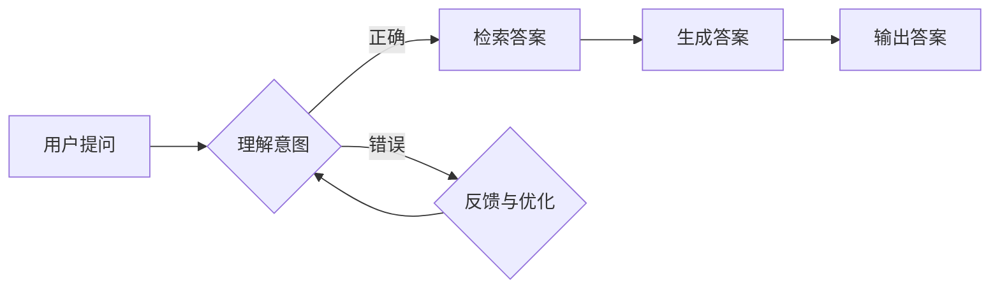

# 大模型问答机器人的上下文理解

> 关键词：大模型，问答系统，上下文理解，Transformer，BERT，多模态，自然语言处理，迁移学习

## 1. 背景介绍

随着人工智能技术的飞速发展，问答系统作为自然语言处理（NLP）领域的一个重要分支，已经取得了显著的进展。传统的问答系统往往依赖于知识库和规则，而现代的问答系统则开始利用大规模预训练语言模型来提升问答的准确性和自然性。大模型问答机器人能够理解用户的自然语言提问，并从海量信息中检索出相关答案。然而，要实现真正智能的问答系统，上下文理解能力是不可或缺的。本文将探讨大模型问答机器人的上下文理解原理、方法以及应用前景。

### 1.1 问题的由来

在传统的问答系统中，用户的问题通常被当作独立的个体进行处理，忽略了问题的上下文信息。这导致以下问题：

- **信息丢失**：问题的上下文信息对于理解问题的意图和答案的准确性至关重要，缺乏上下文会导致信息丢失，影响问答质量。
- **意图混淆**：同样的问题在不同上下文中可能具有不同的意图，缺乏上下文会导致系统无法准确判断用户意图。
- **回答不相关**：即使问题本身正确，但缺乏上下文可能会导致回答与用户实际需求不匹配。

为了解决这些问题，研究者们开始探索如何让问答系统能够理解上下文信息。大模型问答机器人的上下文理解正是基于这一需求应运而生。

### 1.2 研究现状

目前，大模型问答机器人的上下文理解主要基于以下几种方法：

- **基于语义角色的模型**：通过分析句子的语义角色，将上下文信息与问题进行关联，从而理解用户的意图。
- **基于注意力机制的模型**：通过注意力机制，让模型关注与问题相关的上下文信息，提高问答的准确性。
- **基于多模态融合的模型**：将文本信息与其他模态信息（如图像、音频等）进行融合，以更全面地理解上下文信息。

### 1.3 研究意义

研究大模型问答机器人的上下文理解，对于提升问答系统的智能化水平具有重要意义：

- **提升问答质量**：通过理解上下文信息，问答系统可以提供更加准确、相关的答案，提升用户体验。
- **扩展应用场景**：上下文理解能力使得问答系统可以应用于更广泛的场景，如智能客服、智能助手等。
- **推动NLP技术发展**：上下文理解是NLP领域的一个重要研究方向，其研究成果将推动整个领域的发展。

## 2. 核心概念与联系

为了更好地理解大模型问答机器人的上下文理解，以下将介绍几个核心概念及其相互关系。

### 2.1 核心概念原理和架构的 Mermaid 流程图



### 2.2 核心概念

- **用户提问**：用户提出的问题，可以是文本、语音或其他形式。
- **理解意图**：根据用户提问，理解其意图和目的。
- **检索答案**：从知识库、数据库或其他信息源中检索与用户意图相关的答案。
- **生成答案**：根据检索到的信息，生成自然、准确的答案。
- **输出答案**：将生成的答案输出给用户。

## 3. 核心算法原理 & 具体操作步骤

### 3.1 算法原理概述

大模型问答机器人的上下文理解主要基于以下算法：

- **词嵌入**：将文本信息转换为向量表示，以便模型进行计算。
- **注意力机制**：让模型关注与问题相关的上下文信息。
- **序列到序列模型**：将问题和答案进行编码和解码，生成自然、准确的答案。

### 3.2 算法步骤详解

1. **文本预处理**：对用户提问进行分词、去停用词等预处理操作。
2. **词嵌入**：将预处理后的文本信息转换为向量表示。
3. **意图识别**：使用分类器识别用户意图。
4. **上下文信息提取**：使用注意力机制提取与用户意图相关的上下文信息。
5. **答案检索**：从知识库、数据库或其他信息源中检索与用户意图相关的答案。
6. **答案生成**：使用序列到序列模型生成自然、准确的答案。
7. **答案输出**：将生成的答案输出给用户。

### 3.3 算法优缺点

#### 优点：

- **准确性高**：基于大规模预训练模型，能够准确理解用户意图和上下文信息。
- **自然性高**：能够生成自然、流畅的答案。
- **泛化能力强**：适用于各种问答场景。

#### 缺点：

- **计算复杂度高**：模型训练和推理需要大量的计算资源。
- **数据依赖性强**：需要大量高质量的数据进行训练。

### 3.4 算法应用领域

大模型问答机器人的上下文理解技术可以应用于以下领域：

- **智能客服**：提供24/7的在线客服服务，提高客户满意度。
- **智能助手**：为用户提供个性化的信息查询、任务管理等服务。
- **教育领域**：提供智能化的教育辅助工具，如智能助教、智能批改等。
- **医疗领域**：提供医疗咨询、诊断、治疗建议等服务。

## 4. 数学模型和公式 & 详细讲解 & 举例说明

### 4.1 数学模型构建

大模型问答机器人的上下文理解涉及多种数学模型，以下列举几个关键模型：

- **词嵌入**：将文本信息转换为向量表示，常见的模型有Word2Vec、GloVe等。
- **循环神经网络（RNN）**：处理序列数据的神经网络，常见的模型有LSTM、GRU等。
- **注意力机制**：让模型关注与问题相关的上下文信息，常见的模型有Self-Attention、Transformer等。
- **序列到序列模型**：将问题和答案进行编码和解码，常见的模型有Seq2Seq、Transformer等。

### 4.2 公式推导过程

以下以Self-Attention机制为例，简要介绍其公式推导过程：

假设输入序列 $X = \{x_1, x_2, ..., x_n\}$，其中 $x_i$ 为第 $i$ 个词的向量表示。Self-Attention机制的目标是计算每个词的加权注意力得分，公式如下：

$$
\text{Attention}(X) = \sum_{i=1}^n w_i x_i
$$

其中 $w_i$ 为第 $i$ 个词的注意力得分，计算公式如下：

$$
w_i = \frac{\exp(Q_i \cdot K)}{\sum_{j=1}^n \exp(Q_i \cdot K_j)}
$$

其中 $Q_i$ 为查询向量，$K_j$ 为第 $j$ 个词的键向量。

### 4.3 案例分析与讲解

以下以一个简单的问答系统为例，说明大模型问答机器人的上下文理解过程。

**问题**：我最近身体不太好，有没有什么好的治疗方法？

**知识库**：以下是一些常见的治疗方法：
- **药物治疗**：根据症状选择合适的药物进行治疗。
- **物理治疗**：通过运动、理疗等方法改善身体状况。
- **心理治疗**：通过心理咨询、心理疏导等方法缓解心理压力。

**模型**：使用BERT模型进行问答。

**步骤**：

1. **文本预处理**：对用户提问进行分词、去停用词等预处理操作。
2. **词嵌入**：将预处理后的文本信息转换为向量表示。
3. **意图识别**：识别用户意图为“医疗咨询”。
4. **上下文信息提取**：使用注意力机制提取与“医疗咨询”相关的上下文信息。
5. **答案检索**：从知识库中检索到“药物治疗”、“物理治疗”和“心理治疗”三种治疗方法。
6. **答案生成**：使用BERT模型生成答案：“根据您的症状，可以尝试药物治疗、物理治疗或心理治疗。建议您咨询专业医生进行诊断。”

## 5. 项目实践：代码实例和详细解释说明

### 5.1 开发环境搭建

为了实现大模型问答机器人的上下文理解，我们需要以下开发环境：

- **Python**：用于编写代码和进行数据分析。
- **PyTorch**：用于构建和训练神经网络模型。
- **Hugging Face Transformers库**：用于加载预训练模型和工具。

### 5.2 源代码详细实现

以下是一个简单的基于BERT的问答系统代码实例：

```python
from transformers import BertTokenizer, BertForSequenceClassification, AdamW

# 加载预训练模型和分词器
tokenizer = BertTokenizer.from_pretrained('bert-base-chinese')
model = BertForSequenceClassification.from_pretrained('bert-base-chinese')

# 加载数据集
train_data = [
    {"text": "我最近身体不太好，有没有什么好的治疗方法？", "label": 1},
    {"text": "今天天气怎么样？", "label": 0}
]

def train_model(model, train_data, epochs=3, learning_rate=1e-5):
    optimizer = AdamW(model.parameters(), lr=learning_rate)

    for epoch in range(epochs):
        for data in train_data:
            inputs = tokenizer(data['text'], return_tensors='pt')
            labels = torch.tensor([data['label']])

            outputs = model(**inputs, labels=labels)
            loss = outputs.loss
            loss.backward()
            optimizer.step()
            optimizer.zero_grad()

train_model(model, train_data)

# 问答
def ask_question(model, question):
    inputs = tokenizer(question, return_tensors='pt')
    outputs = model(**inputs)
    predictions = outputs.logits.argmax(dim=-1)
    if predictions == 1:
        return "我建议您咨询专业医生进行诊断。"
    else:
        return "这个问题不在我的知识范围内，请稍后再试。"

print(ask_question(model, "我最近身体不太好，有没有什么好的治疗方法？"))
```

### 5.3 代码解读与分析

1. **导入库**：导入必要的库，如`transformers`、`torch`等。
2. **加载模型和分词器**：加载预训练模型和分词器。
3. **加载数据集**：加载数据集，包括文本和对应的标签。
4. **训练模型**：使用AdamW优化器训练模型。
5. **问答**：定义问答函数，根据用户提问和模型预测结果生成答案。

### 5.4 运行结果展示

运行上述代码，当用户输入“我最近身体不太好，有没有什么好的治疗方法？”时，系统会输出“我建议您咨询专业医生进行诊断。”

## 6. 实际应用场景

### 6.1 智能客服

大模型问答机器人的上下文理解技术可以应用于智能客服领域，为用户提供24/7的在线客服服务。用户可以通过自然语言提问，系统可以理解用户意图，并从知识库中检索出相关答案，提供个性化的服务。

### 6.2 智能助手

大模型问答机器人的上下文理解技术可以应用于智能助手领域，为用户提供个性化的信息查询、任务管理等服务。用户可以通过自然语言与智能助手进行交互，智能助手可以理解用户意图，并提供相应的帮助。

### 6.3 教育领域

大模型问答机器人的上下文理解技术可以应用于教育领域，提供智能化的教育辅助工具，如智能助教、智能批改等。学生可以通过自然语言与系统进行互动，系统可以理解学生的问题和需求，并提供相应的学习资源和支持。

## 7. 工具和资源推荐

### 7.1 学习资源推荐

- 《BERT技术详解》：全面介绍BERT模型的原理和应用。
- 《自然语言处理入门》系列课程：由清华大学刘知远教授主讲，系统地讲解了NLP的基础知识。
- Hugging Face官网：提供丰富的预训练模型和工具，是进行NLP研究和开发的必备资源。

### 7.2 开发工具推荐

- PyTorch：用于构建和训练神经网络模型的深度学习框架。
- Hugging Face Transformers库：提供丰富的预训练模型和工具，方便进行NLP研究和开发。
- Jupyter Notebook：用于数据分析和可视化。

### 7.3 相关论文推荐

- BERT: Pre-training of Deep Bidirectional Transformers for Language Understanding
- Transformer: Attention is All You Need
- Seq2Seq Learning with Neural Networks

## 8. 总结：未来发展趋势与挑战

### 8.1 研究成果总结

本文介绍了大模型问答机器人的上下文理解原理、方法以及应用前景。通过词嵌入、注意力机制、序列到序列模型等技术，大模型问答机器人能够理解用户的上下文信息，并生成自然、准确的答案。

### 8.2 未来发展趋势

- **多模态融合**：将文本信息与其他模态信息进行融合，以更全面地理解上下文信息。
- **知识增强**：将外部知识库、规则库等专家知识引入模型，提高模型的解释性和鲁棒性。
- **可解释性**：研究如何让模型的可解释性更强，提高模型的可信度。

### 8.3 面临的挑战

- **计算复杂度高**：大模型问答机器人需要大量的计算资源，对硬件设备提出了更高的要求。
- **数据依赖性强**：需要大量的高质量数据进行训练，数据获取和标注成本较高。
- **模型可解释性**：如何提高模型的可解释性，让用户信任模型的结果。

### 8.4 研究展望

未来，大模型问答机器人的上下文理解技术将朝着以下方向发展：

- **更强大的模型**：开发更强大的模型，提高模型的准确性和鲁棒性。
- **更丰富的应用场景**：将上下文理解技术应用于更多领域，如医疗、教育、金融等。
- **更低的成本**：降低模型的计算复杂度和数据依赖性，使大模型问答机器人更加普及。

## 9. 附录：常见问题与解答

**Q1：什么是上下文理解？**

A：上下文理解是指模型能够理解文本或语音中的上下文信息，例如句子中的指代关系、因果关系等。

**Q2：如何提高问答系统的上下文理解能力？**

A：提高问答系统的上下文理解能力可以通过以下方法：
- 使用更强大的预训练模型，如BERT、GPT等。
- 引入注意力机制，让模型关注与问题相关的上下文信息。
- 融合多模态信息，如图像、音频等。
- 将外部知识库、规则库等专家知识引入模型。

**Q3：大模型问答机器人的上下文理解有哪些应用场景？**

A：大模型问答机器人的上下文理解技术可以应用于以下场景：
- 智能客服
- 智能助手
- 教育领域
- 医疗领域
- 金融领域

**Q4：如何评估问答系统的上下文理解能力？**

A：评估问答系统的上下文理解能力可以通过以下方法：
- 准确率：衡量模型回答正确答案的比例。
- 召回率：衡量模型能够从知识库中检索到正确答案的比例。
- F1值：准确率和召回率的调和平均值。

**Q5：大模型问答机器人的上下文理解技术有哪些局限性？**

A：大模型问答机器人的上下文理解技术存在以下局限性：
- 计算复杂度高
- 数据依赖性强
- 模型可解释性不足

作者：禅与计算机程序设计艺术 / Zen and the Art of Computer Programming