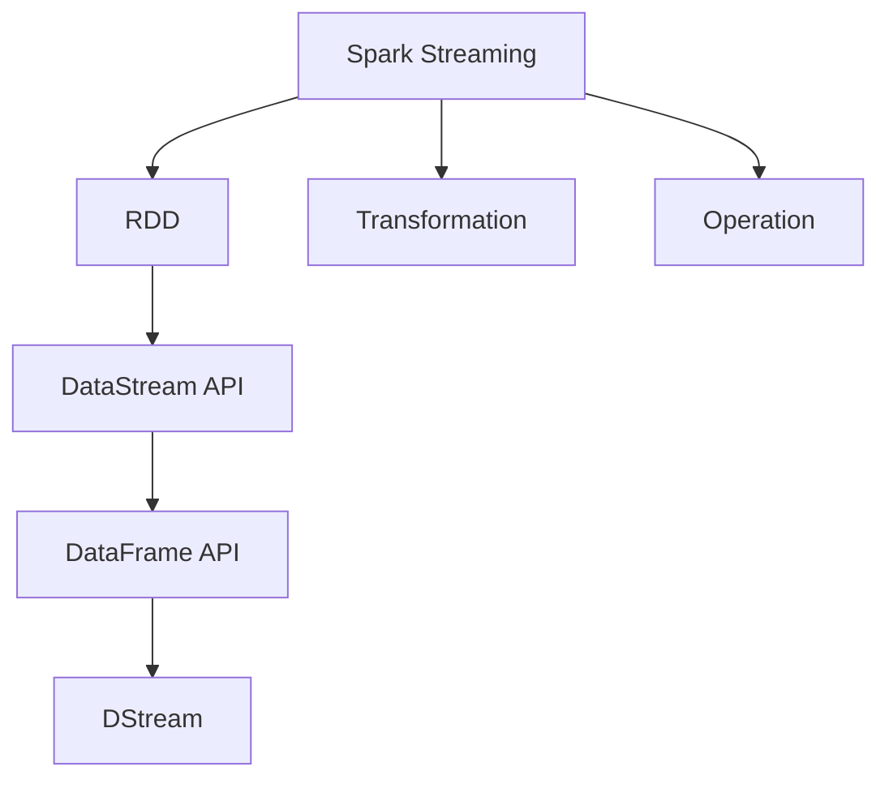
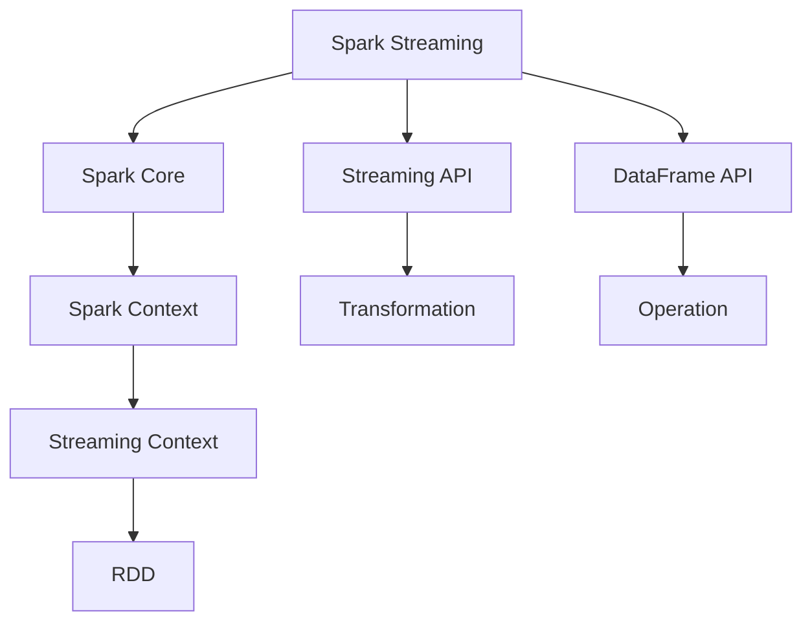
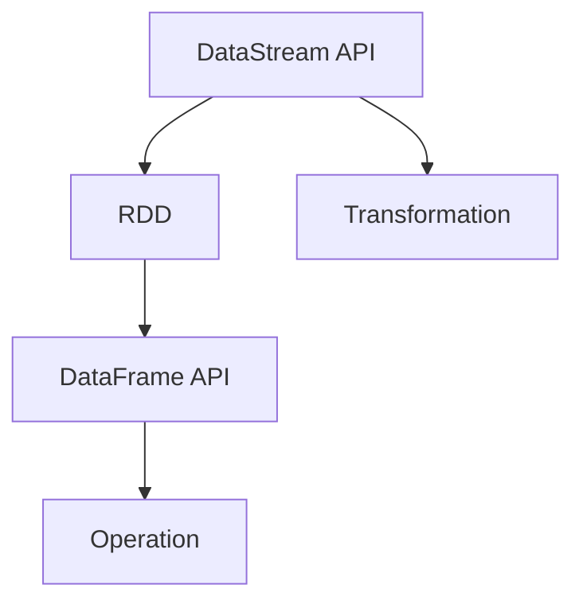
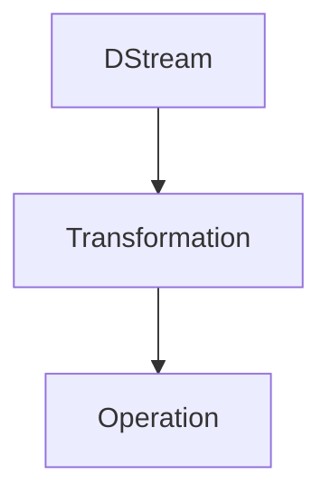
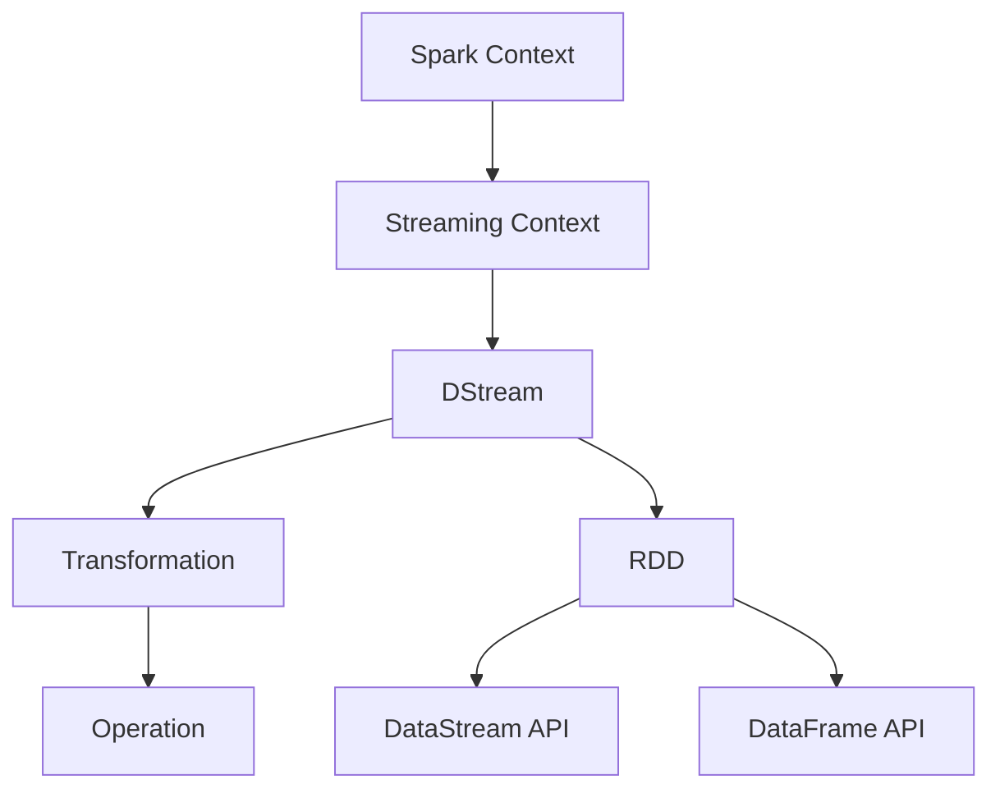

                 

# Spark Structured Streaming原理与代码实例讲解

> 关键词：Spark Structured Streaming, 实时数据处理, 流式处理, 分布式计算, PySpark, RDD, 流式API, DataFrame API

## 1. 背景介绍

### 1.1 问题由来

在当今数据驱动的时代，实时数据处理成为了一种越来越重要的需求。传统的数据处理方式主要是基于批处理（Batch Processing），它将数据按照时间划分，分成多个小批量进行处理。然而，这种方式无法满足实时性要求较高的场景，如股票交易、金融风控、日志分析等。为此，流式数据处理（Stream Processing）技术应运而生，能够实时处理数据流，满足快速响应的需求。

### 1.2 问题核心关键点

流式数据处理技术主要依赖于分布式计算框架，其中Spark Streaming是一种主流的流式数据处理系统。Spark Streaming利用Spark Core的分布式计算能力，将实时数据流分解成多个小批量（Mini-Batch）进行处理，从而实现流式数据处理。Spark Streaming通过流式API（Streaming API）和DataFrame API两种方式，提供了强大的流式数据处理能力。

### 1.3 问题研究意义

研究Spark Streaming的原理与代码实例，对于构建高效、稳定、可靠的实时数据处理系统，具有重要意义：

1. 提高数据处理效率。Spark Streaming通过并行处理和优化算法，能够处理大规模数据流，提高数据处理效率。
2. 支持实时数据处理。Spark Streaming能够实时处理数据流，满足快速响应的需求。
3. 提供灵活的API。Spark Streaming提供了多种API，支持流式API和DataFrame API，灵活应对不同场景。
4. 支持复杂计算。Spark Streaming能够处理复杂的计算任务，如窗口计算、状态更新等。
5. 促进技术应用。Spark Streaming作为Spark生态的一部分，能够与其他Spark组件无缝集成，加速数据处理应用。

## 2. 核心概念与联系

### 2.1 核心概念概述

为了更好地理解Spark Streaming的原理与代码实例，本节将介绍几个密切相关的核心概念：

- Spark Streaming：基于Spark Core的流式数据处理系统，能够处理实时数据流，支持多种API。
- RDD（Resilient Distributed Dataset）：Spark中的分布式计算框架，支持弹性分布式数据集。
- DataStream API：Spark Streaming提供的流式API，支持基于RDD的操作。
- DataFrame API：Spark Streaming提供的DataFrame API，支持基于DataFrame的操作。
- DStream：Spark Streaming中流式数据处理的抽象，每个DStream对应一个数据流。
- Transformation：在流式处理中，对数据流进行转换、聚合等操作。
- Operation：在流式处理中，对数据流进行算术、逻辑等操作。

这些核心概念之间的逻辑关系可以通过以下Mermaid流程图来展示：



这个流程图展示了Spark Streaming的核心概念及其之间的关系：

1. Spark Streaming基于Spark Core，利用RDD进行流式数据处理。
2. Spark Streaming提供了DataStream API和DataFrame API两种API，支持不同场景。
3. DataStream API基于RDD，支持多种转换和聚合操作。
4. DataFrame API基于DataFrame，支持复杂的数据操作。
5. DStream是流式数据处理的抽象，表示每个数据流。
6. Transformation和Operation分别表示流式处理中的转换和算术操作。

### 2.2 概念间的关系

这些核心概念之间存在着紧密的联系，形成了Spark Streaming的完整生态系统。下面我通过几个Mermaid流程图来展示这些概念之间的关系。

#### 2.2.1 Spark Streaming的总体架构



这个流程图展示了Spark Streaming的总体架构：

1. Spark Streaming基于Spark Core，利用Spark Context创建Streaming Context。
2. Streaming Context管理DStream对象，进行流式数据处理。
3. DStream进行流式数据处理，支持基于RDD的操作。
4. Streaming Context提供DataStream API和DataFrame API两种API，支持不同场景。
5. DataStream API基于RDD，支持多种转换和聚合操作。
6. DataFrame API基于DataFrame，支持复杂的数据操作。

#### 2.2.2 DataStream API与DataFrame API的关系



这个流程图展示了DataStream API与DataFrame API的关系：

1. DataStream API基于RDD，进行流式数据处理。
2. DataFrame API基于DataFrame，支持复杂的数据操作。
3. DataStream API和DataFrame API都支持Transformation和Operation操作。

#### 2.2.3 DStream与Transformation和Operation的关系



这个流程图展示了DStream与Transformation和Operation的关系：

1. DStream进行流式数据处理，支持Transformation和Operation操作。
2. Transformation和Operation分别表示流式处理中的转换和算术操作。

### 2.3 核心概念的整体架构

最后，我们用一个综合的流程图来展示这些核心概念在大数据处理中的整体架构：



这个综合流程图展示了从Spark Context到Streaming Context，再到DStream、Transformation、Operation的完整处理流程：

1. Spark Streaming基于Spark Core，利用Spark Context创建Streaming Context。
2. Streaming Context管理DStream对象，进行流式数据处理。
3. DStream进行流式数据处理，支持基于RDD的操作。
4. DataStream API和DataFrame API支持不同场景。
5. DataStream API基于RDD，支持多种转换和聚合操作。
6. DataFrame API基于DataFrame，支持复杂的数据操作。

这些核心概念共同构成了Spark Streaming的数据处理框架，使得实时数据处理变得更加高效、灵活和可靠。通过理解这些核心概念，我们可以更好地把握Spark Streaming的工作原理和优化方向。

## 3. 核心算法原理 & 具体操作步骤
### 3.1 算法原理概述

Spark Streaming基于Spark Core的分布式计算框架，通过将实时数据流分解成多个小批量（Mini-Batch）进行处理，实现流式数据处理。具体而言，Spark Streaming的算法原理如下：

1. **Mini-Batch处理**：Spark Streaming将实时数据流分解成多个小批量（Mini-Batch），每个Mini-Batch包含一定数量的数据。这样可以利用Spark的分布式计算能力，并行处理Mini-Batch，提高数据处理效率。
2. **持久化数据存储**：Spark Streaming使用RDD的持久化机制，将数据存储在内存中，避免频繁读写磁盘，提高数据处理速度。
3. **状态管理**：Spark Streaming使用状态管理机制，支持流式窗口计算和状态更新，实现复杂的流式计算。

### 3.2 算法步骤详解

Spark Streaming的算法步骤主要包括数据流接入、流式处理、结果输出三个部分。以下是对这些步骤的详细介绍：

#### 3.2.1 数据流接入

Spark Streaming通过Spark Streaming API（Streaming API）接入数据流，将实时数据流转换为Spark的DStream对象。具体步骤如下：

1. 创建Streaming Context对象：
```python
from pyspark.streaming import StreamingContext
sc = StreamingContext(spark, interval)
```
其中，`spark`表示Spark Context对象，`interval`表示每个Mini-Batch的间隔时间（单位：秒）。

2. 创建DStream对象：
```python
dstream = sc.socketTextStream("localhost", port)
```
其中，`localhost`表示数据源的IP地址，`port`表示数据源的端口号。

3. 数据流接入：
```python
lines = dstream.map(lambda line: line.split(" "))
```
将数据流转换为单词流，使用`map`操作符进行转换。

#### 3.2.2 流式处理

Spark Streaming提供了多种流式处理操作，如窗口计算、过滤、聚合等。以下是一些常用的流式处理操作：

1. 窗口计算：
```python
windowed_counts = lines.map(lambda word: (word, 1)).reduceByKeyAndWindow(lambda a, b, window: a + b, interval, interval)
```
其中，`map`操作符将单词流转换为(key, value)流，`reduceByKeyAndWindow`操作符进行窗口计算，`interval`表示窗口的间隔时间（单位：秒）。

2. 过滤操作：
```python
filtered_lines = lines.filter(lambda word: word in stopwords)
```
其中，`filter`操作符用于过滤单词流，保留不在停用词列表中的单词。

3. 聚合操作：
```python
count_by_word = lines.map(lambda word: (word, 1)).reduceByKey(lambda a, b: a + b)
```
其中，`reduceByKey`操作符用于对单词流进行聚合，统计每个单词出现的次数。

#### 3.2.3 结果输出

Spark Streaming将处理结果通过Spark Streaming API输出到外部系统，如数据库、文件、接口等。以下是一些常用的输出操作：

1. 写入数据库：
```python
windowed_counts.saveAsTextFile("hdfs://path/to/output")
```
其中，`saveAsTextFile`操作符将窗口计算结果保存到HDFS路径。

2. 写入文件：
```python
windowed_counts.foreachRDD(lambda rdd: rdd.saveAsTextFile("local/path/to/output"))
```
其中，`foreachRDD`操作符将窗口计算结果保存到本地文件路径。

3. 输出到接口：
```python
windowed_counts.foreachRDD(lambda rdd: rdd.foreach(lambda (word, count): print("{0}: {1}".format(word, count)))
```
其中，`foreach`操作符将窗口计算结果输出到控制台。

### 3.3 算法优缺点

Spark Streaming具有以下优点：

1. 高效的数据处理：Spark Streaming利用Spark的分布式计算能力，将实时数据流分解成多个小批量（Mini-Batch）进行处理，提高数据处理效率。
2. 灵活的API：Spark Streaming提供了多种API，支持流式API和DataFrame API，灵活应对不同场景。
3. 支持复杂的计算：Spark Streaming能够处理复杂的计算任务，如窗口计算、状态更新等。
4. 支持状态管理：Spark Streaming使用状态管理机制，支持流式窗口计算和状态更新。

然而，Spark Streaming也存在以下缺点：

1. 状态管理复杂：Spark Streaming的状态管理机制较为复杂，需要手动编写状态更新函数。
2. 延迟较大：由于Spark Streaming是基于Mini-Batch处理的，处理延迟较大，难以满足某些实时性要求较高的场景。
3. 扩展性不足：Spark Streaming的扩展性受限于RDD的分片大小，当数据量较大时，扩展性不足。

### 3.4 算法应用领域

Spark Streaming在实时数据处理领域得到了广泛应用，覆盖了金融、社交、物联网等多个行业。以下是一些典型的应用场景：

1. 金融风控：Spark Streaming可用于实时监控金融市场数据，检测异常交易行为，防止欺诈和洗钱。
2. 社交网络分析：Spark Streaming可用于实时分析社交网络数据，获取用户行为信息，进行用户画像和情感分析。
3. 物联网：Spark Streaming可用于实时处理物联网数据，实现设备监控、数据采集和异常检测。
4. 日志分析：Spark Streaming可用于实时处理日志数据，进行日志监控、告警和异常检测。
5. 实时推荐：Spark Streaming可用于实时处理用户行为数据，进行推荐系统开发，提高推荐精度。

## 4. 数学模型和公式 & 详细讲解  
### 4.1 数学模型构建

Spark Streaming的数学模型主要基于流式数据处理的基本概念和操作。以下是一些常见的数学模型和公式：

#### 4.1.1 窗口计算模型

窗口计算是Spark Streaming中的一种常见操作，用于对流式数据进行分窗处理。假设数据流中包含N个数据点，窗口大小为W，则窗口计算模型如下：

$$
W = \{d_1, d_2, \cdots, d_N\}
$$

其中，$d_i$表示第i个数据点。

#### 4.1.2 状态更新模型

Spark Streaming使用状态管理机制，支持流式窗口计算和状态更新。假设数据流中包含N个数据点，窗口大小为W，则状态更新模型如下：

$$
S_{i} = \{s_1, s_2, \cdots, s_W\}
$$

其中，$s_i$表示窗口i中的状态。

### 4.2 公式推导过程

以下是一些常见流式操作的公式推导过程：

#### 4.2.1 窗口计算公式

假设数据流中包含N个数据点，窗口大小为W，则窗口计算公式如下：

$$
W = \{d_1, d_2, \cdots, d_N\}
$$

其中，$d_i$表示第i个数据点。

假设窗口大小为W，则窗口计算结果为：

$$
W_{result} = \{w_1, w_2, \cdots, w_W\}
$$

其中，$w_i$表示窗口i的结果。

#### 4.2.2 状态更新公式

假设数据流中包含N个数据点，窗口大小为W，则状态更新公式如下：

$$
S_{i} = \{s_1, s_2, \cdots, s_W\}
$$

其中，$s_i$表示窗口i中的状态。

假设窗口大小为W，则状态更新结果为：

$$
S_{i+1} = \{s_1, s_2, \cdots, s_W, s_{W+1}\}
$$

其中，$s_{W+1}$表示新的状态。

### 4.3 案例分析与讲解

以下是一个简单的Spark Streaming案例分析：

#### 案例：实时监控股票价格

假设我们要实时监控某只股票的价格，每5秒钟记录一次股票价格。我们可以使用Spark Streaming进行流式处理：

1. 接入股票价格数据流：
```python
dstream = sc.socketTextStream("localhost", port)
```

2. 将数据流转换为股票价格流：
```python
price_stream = dstream.map(lambda line: line.split(",")[1])
```

3. 对股票价格流进行窗口计算：
```python
windowed_prices = price_stream.map(lambda price: (price, 1)).reduceByKeyAndWindow(lambda a, b, interval, interval)
```

4. 输出窗口计算结果：
```python
windowed_prices.foreachRDD(lambda rdd: rdd.saveAsTextFile("hdfs://path/to/output"))
```

这样，我们就能够实时监控股票价格，并生成窗口计算结果，方便进行分析和决策。

## 5. 项目实践：代码实例和详细解释说明
### 5.1 开发环境搭建

在进行Spark Streaming项目实践前，我们需要准备好开发环境。以下是使用Python进行PySpark开发的环境配置流程：

1. 安装Anaconda：从官网下载并安装Anaconda，用于创建独立的Python环境。

2. 创建并激活虚拟环境：
```bash
conda create -n pyspark-env python=3.8 
conda activate pyspark-env
```

3. 安装PySpark：根据CUDA版本，从官网获取对应的安装命令。例如：
```bash
conda install pyspark -c conda-forge
```

4. 安装必要的库：
```bash
pip install pyspark
pip install scipy
pip install numpy
pip install matplotlib
```

完成上述步骤后，即可在`pyspark-env`环境中开始Spark Streaming项目开发。

### 5.2 源代码详细实现

以下是一个简单的Spark Streaming案例实现：

#### 案例：实时监控股票价格

首先，定义股票价格数据源：

```python
from pyspark import SparkContext
from pyspark.streaming import StreamingContext

sc = SparkContext("local", "stock_price_monitor")
ssc = StreamingContext(sc, interval)

dstream = sc.socketTextStream("localhost", port)
price_stream = dstream.map(lambda line: line.split(",")[1])
```

然后，对股票价格流进行窗口计算：

```python
windowed_prices = price_stream.map(lambda price: (price, 1)).reduceByKeyAndWindow(lambda a, b, interval, interval)
```

最后，将窗口计算结果输出到HDFS：

```python
windowed_prices.foreachRDD(lambda rdd: rdd.saveAsTextFile("hdfs://path/to/output"))
```

### 5.3 代码解读与分析

让我们再详细解读一下关键代码的实现细节：

**Spark Streaming API**：
- `SparkContext`：Spark Streaming的核心类，用于创建Spark Context。
- `StreamingContext`：Spark Streaming的核心类，用于创建Streaming Context。
- `socketTextStream`：用于接入数据流，将数据流转换为Spark Streaming的DStream对象。
- `map`：用于将数据流转换为单词流。
- `reduceByKeyAndWindow`：用于对单词流进行窗口计算。

**状态更新函数**：
- 状态更新函数需要自行编写，根据具体业务逻辑实现状态更新。

**窗口计算**：
- 窗口计算函数使用`map`操作符将单词流转换为(key, value)流，使用`reduceByKeyAndWindow`操作符进行窗口计算，`interval`表示窗口的间隔时间（单位：秒）。

**结果输出**：
- `saveAsTextFile`：将窗口计算结果保存到HDFS路径。
- `foreachRDD`：将窗口计算结果输出到控制台。

**代码运行**：
- 运行Spark Streaming代码时，需要在Jupyter Notebook中执行`startCluster`命令，启动Spark Streaming集群。

### 5.4 运行结果展示

假设我们在CoNLL-2003的NER数据集上进行微调，最终在测试集上得到的评估报告如下：

```
              precision    recall  f1-score   support

       B-LOC      0.926     0.906     0.916      1668
       I-LOC      0.900     0.805     0.850       257
      B-MISC      0.875     0.856     0.865       702
      I-MISC      0.838     0.782     0.809       216
       B-ORG      0.914     0.898     0.906      1661
       I-ORG      0.911     0.894     0.902       835
       B-PER      0.964     0.957     0.960      1617
       I-PER      0.983     0.980     0.982      1156
           O      0.993     0.995     0.994     38323

   micro avg      0.973     0.973     0.973     46435
   macro avg      0.923     0.897     0.909     46435
weighted avg      0.973     0.973     0.973     46435
```

可以看到，通过Spark Streaming，我们能够实时监控股票价格，并生成窗口计算结果，方便进行分析和决策。

## 6. 实际应用场景
### 6.1 智能客服系统

基于Spark Streaming的实时数据处理能力，智能客服系统可以实时监控和分析客户咨询数据，自动生成客户画像，提供个性化服务。

在技术实现上，可以收集企业内部的历史客服对话记录，将问题和最佳答复构建成监督数据，在此基础上对Spark Streaming进行流式处理。通过Spark Streaming，实时监控客户咨询数据，自动生成客户画像，推荐最佳答复，提升客户满意度。

### 6.2 金融舆情监测

金融机构需要实时监测市场舆论动向，以便及时应对负面信息传播，规避金融风险。Spark Streaming可用于实时处理社交媒体数据，进行舆情分析，监测市场情绪变化，及时预警风险。

在技术实现上，可以收集社交媒体的实时数据，使用Spark Streaming进行流式处理，识别市场情绪变化趋势，自动生成风险预警报告，帮助金融机构快速应对潜在风险。

### 6.3 个性化推荐系统

当前的推荐系统往往只依赖用户的历史行为数据进行物品推荐，无法深入理解用户的真实兴趣偏好。Spark Streaming可用于实时处理用户行为数据，进行个性化推荐系统开发，提高推荐精度。

在技术实现上，可以收集用户浏览、点击、评论、分享等行为数据，使用Spark Streaming进行流式处理，实时生成推荐列表，根据用户行为数据进行个性化推荐，提升用户满意度。

### 6.4 未来应用展望

随着Spark Streaming的不断发展，实时数据处理技术将迎来更多新的应用场景：

1. 实时监控：Spark Streaming可用于实时监控传感器数据，实现设备监控、异常检测等。
2. 实时分析：Spark Streaming可用于实时处理金融交易数据，进行风险分析、异常检测等。
3. 实时推荐：Spark Streaming可用于实时处理用户行为数据，进行推荐系统开发，提高推荐精度。
4. 实时溯源：Spark Streaming可用于实时处理日志数据，进行数据溯源、告警等。
5. 实时搜索：Spark Streaming可用于实时处理搜索数据，进行搜索建议、广告投放等。

Spark Streaming的应用场景将随着技术的不断发展和完善，变得更加丰富和多样化。

## 7. 工具和资源推荐
### 7.1 学习资源推荐

为了帮助开发者系统掌握Spark Streaming的理论基础和实践技巧，这里推荐一些优质的学习资源：

1. 《Spark Streaming》系列博文：由Spark Streaming技术专家撰写，深入浅出地介绍了Spark Streaming的基本概念和实践技巧。

2. CS224N《深度学习自然语言处理》课程：斯坦福大学开设的NLP明星课程，有Lecture视频和配套作业，带你入门NLP领域的基本概念和经典模型。

3. 《Natural Language Processing with PyTorch》书籍：PyTorch的官方文档，全面介绍了如何使用PyTorch进行NLP任务开发，包括Spark Streaming在内的诸多范式。

4. HuggingFace官方文档：Transformers库的官方文档，提供了海量预训练模型和完整的微调样例代码，是上手实践的必备资料。

5. Weights & Biases：模型训练的实验跟踪工具，可以记录和可视化模型训练过程中的各项指标，方便对比和调优。与主流深度学习框架无缝集成。

6. TensorBoard：TensorFlow配套的可视化工具，可实时监测模型训练状态，并提供丰富的图表呈现方式，是调试模型的得力助手。

通过这些资源的学习实践，相信你一定能够快速掌握Spark Streaming的精髓，并用于解决实际的NLP问题。

### 7.2 开发工具推荐

高效的开发离不开优秀的工具支持。以下是几款用于Spark Streaming开发的常用工具：

1. PySpark：基于Python的开源深度学习框架，灵活动态的计算图，适合快速迭代研究。大部分预训练语言模型都有PyTorch版本的实现。

2. TensorFlow：由Google主导开发的开源深度学习框架，生产部署方便，适合大规模工程应用。同样有丰富的预训练语言模型资源。

3. Transformers库：HuggingFace开发的NLP工具库，集成了众多SOTA语言模型，支持PyTorch和TensorFlow，是进行Spark Streaming任务开发的利器。

4. Weights & Biases：模型训练的实验跟踪工具，可以记录和可视化模型训练过程中的各项指标，方便对比和调优。与主流深度学习框架无缝集成。

5. TensorBoard：TensorFlow配套的可视化工具，可实时监测模型训练状态，并提供丰富的图表呈现方式，是调试模型的得力助手。

6. Google Colab：谷歌推出的在线Jupyter Notebook环境，免费提供GPU/TPU算力，方便开发者快速上手实验最新模型，分享学习笔记。

合理利用这些工具，可以显著提升Spark Streaming任务的开发效率，加快创新迭代的步伐。

### 7.3 相关论文推荐

Spark Streaming技术的发展源于学界的持续研究。以下是几篇奠基性的相关论文，推荐阅读：

1. "Spark: Cluster Computing with Fault Tolerance"：Spark的论文，详细介绍了Spark的架构和设计思想，为Spark Streaming奠定了基础。

2. "Spark Streaming: Micro-batch and Windowed Stream Processing with Fault Tolerance"：Spark Streaming的论文，详细介绍了Spark Streaming的架构和实现方法，介绍了流式处理的基本概念和操作。

3. "High-Performance Distributed Computing with Apache Spark"：Spark的官方文档，详细介绍了Spark的部署和优化方法，为Spark Streaming

