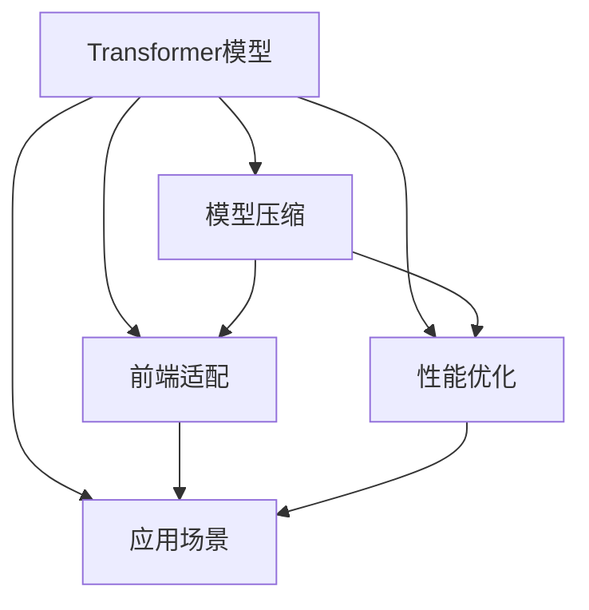
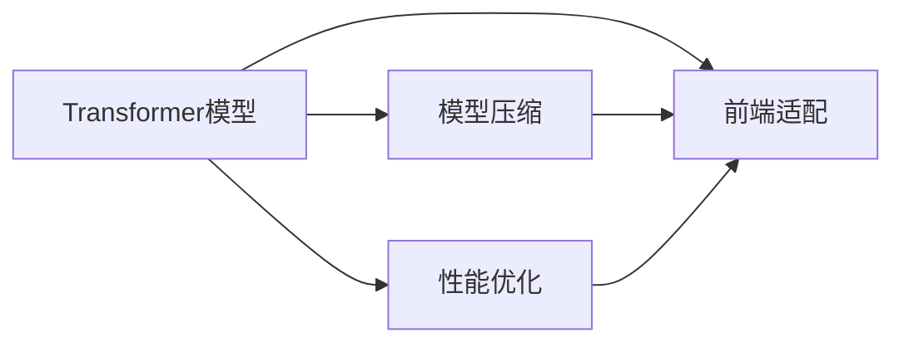
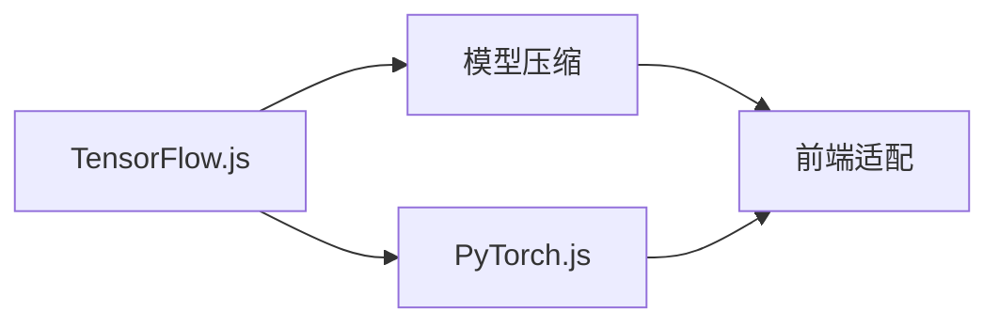
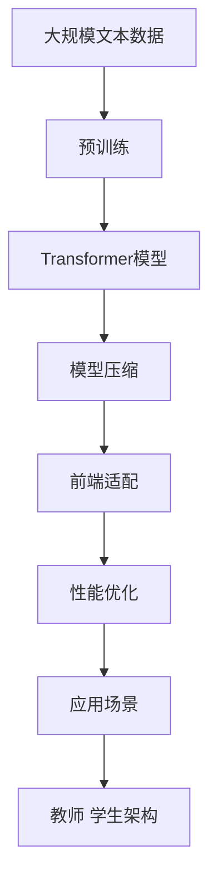

                 

# Transformer大模型实战 教师 学生架构

> 关键词：Transformer, 自然语言处理(NLP), 教师 学生 架构, 模型部署, 应用场景, 教学效果

## 1. 背景介绍

### 1.1 问题由来

随着人工智能(AI)技术的飞速发展，Transformer模型逐渐成为自然语言处理(NLP)领域的核心工具。Transformer在深度学习、计算机视觉、语音识别等多个领域都有广泛应用。它通过自注意力机制对序列数据进行编码和解码，取得了诸多SOTA的表现。

Transformer的核心贡献在于它的自注意力机制，使得模型可以同时关注序列中的所有位置，提升了模型的表示能力。这一机制赋予了Transformer强大的特征抽取和建模能力，可以处理各种序列数据，包括文本、音频、视频等。

然而，Transformer模型往往拥有数亿级别的参数，大规模训练和部署都存在诸多挑战。如何在教师端和学生端实现高效、易用的Transformer模型部署，是当前研究的热点之一。

### 1.2 问题核心关键点

Transformer大模型实战的核心在于：

- **模型压缩**：在教师端，需要压缩模型大小，减少计算资源消耗，提升运行效率。
- **前端适配**：在学生端，需要适配不同的前端框架，方便快速集成和使用。
- **性能优化**：在教师端和学生端，都需要针对具体应用场景进行模型性能优化，提升用户体验。

通过上述三点，可以构建一个高效、易用的Transformer模型教师 学生架构，最大化Transformer模型在教育领域的价值。

### 1.3 问题研究意义

Transformer大模型实战研究的意义在于：

- **教育公平**：通过高效部署Transformer模型，可以降低教育资源的成本，提升教育公平性。
- **教学质量**：Transformer模型强大的语言处理能力，可以辅助教师提高教学质量。
- **学习体验**：通过适配不同前端框架，学生可以方便地使用Transformer模型进行学习和研究。
- **未来发展**：研究如何更高效地部署和优化Transformer模型，有助于推动人工智能技术的普及和应用。

## 2. 核心概念与联系

### 2.1 核心概念概述

为了更好地理解Transformer大模型实战的方法，本节将介绍几个密切相关的核心概念：

- **Transformer模型**：基于自注意力机制的深度学习模型，能够处理序列数据，具备强大的语言处理能力。

- **模型压缩**：通过剪枝、量化、蒸馏等技术，减少模型参数和计算量，降低部署成本。

- **前端适配**：将Transformer模型适配不同的前端框架（如TensorFlow.js、PyTorch.js等），方便学生端集成使用。

- **性能优化**：针对特定应用场景，对模型进行针对性的优化，提升运行效率和精度。

- **应用场景**：Transformer模型在教育领域的应用，包括语音识别、自动评分、知识图谱等。

这些核心概念之间的逻辑关系可以通过以下Mermaid流程图来展示：



这个流程图展示了Transformer模型的核心概念及其之间的关系：

1. 在教师端，通过模型压缩、前端适配和性能优化，可以构建一个高效易用的Transformer部署架构。
2. 在学生端，通过适配不同的前端框架，方便学生集成和使用。
3. 针对具体应用场景，进一步优化模型，提升用户体验。

### 2.2 概念间的关系

这些核心概念之间存在着紧密的联系，形成了Transformer模型部署架构的完整生态系统。下面我们通过几个Mermaid流程图来展示这些概念之间的关系。

#### 2.2.1 Transformer模型的部署架构



这个流程图展示了Transformer模型在教师端和学生端的部署架构。

#### 2.2.2 前端适配的流程



这个流程图展示了将Transformer模型适配到不同前端框架的流程。

#### 2.2.3 性能优化的关键点


这个流程图展示了性能优化在特定应用场景下的关键点。

### 2.3 核心概念的整体架构

最后，我们用一个综合的流程图来展示这些核心概念在大模型实战中的整体架构：



这个综合流程图展示了从预训练到模型部署，再到特定应用场景的完整过程。Transformer模型通过预训练获得基础能力，经过模型压缩、前端适配和性能优化，适配到教师端和学生端，最终在特定应用场景中发挥作用。通过这些流程图，我们可以更清晰地理解Transformer模型在大模型实战中的关键环节和逻辑关系。

## 3. 核心算法原理 & 具体操作步骤
### 3.1 算法原理概述

Transformer大模型实战，本质上是一个模型压缩、前端适配和性能优化的过程。其核心思想是：将复杂的Transformer模型转化为轻量级、易用的模型，使其能够在教师端和学生端高效部署和运行，提升用户体验。

### 3.2 算法步骤详解

Transformer大模型实战一般包括以下几个关键步骤：

**Step 1: 准备预训练模型和数据集**
- 选择合适的预训练模型和语料，如BART、BigBird等。
- 收集和标注特定应用场景下的数据集，如教师教学案例、学生作业等。

**Step 2: 模型压缩技术**
- 使用剪枝、量化、蒸馏等技术，减少模型参数和计算量，提高运行效率。
- 例如，可以通过剪枝去除不重要的参数，通过量化将浮点模型转换为定点模型，通过蒸馏将大模型转换为小模型。

**Step 3: 前端适配**
- 根据学生端的前端框架（如TensorFlow.js、PyTorch.js等），适配模型输入输出接口。
- 例如，使用TensorFlow.js框架，将模型封装为Web模型，方便在前端集成。

**Step 4: 性能优化**
- 针对特定应用场景，对模型进行针对性的优化，如调整超参数、使用特定硬件等。
- 例如，在学生端，可以通过GPU加速模型推理，提升计算效率。

**Step 5: 部署和测试**
- 将压缩、适配和优化的模型部署到教师端和学生端。
- 在实际应用场景中，评估模型效果，收集用户反馈，持续迭代优化。

以上是Transformer大模型实战的一般流程。在实际应用中，还需要针对具体任务进行细致的优化设计，如改进模型架构、搜索最优超参数组合等，以进一步提升模型性能。

### 3.3 算法优缺点

Transformer大模型实战方法具有以下优点：

1. **高效部署**：通过模型压缩、前端适配和性能优化，可以将复杂的Transformer模型转化为轻量级、易用的模型，提升部署效率。
2. **易用性高**：适配不同前端框架，方便学生端快速集成和使用。
3. **性能优越**：通过针对性的优化，可以在特定应用场景中提升模型运行效率和精度。

同时，该方法也存在一定的局限性：

1. **数据质量要求高**：模型压缩和性能优化依赖于高质量的标注数据，数据质量不高可能影响模型效果。
2. **优化难度大**：不同应用场景下，模型的优化策略可能差异较大，需要投入大量时间和精力。
3. **部署复杂度**：模型的压缩、适配和优化涉及多环节，部署流程复杂。

尽管存在这些局限性，但Transformer大模型实战方法仍是当前最为成熟和有效的部署策略。未来相关研究的重点在于如何进一步降低部署成本，提升模型性能，同时兼顾易用性和可维护性。

### 3.4 算法应用领域

Transformer大模型实战方法已经在教育领域的诸多应用场景中得到了广泛应用，例如：

- **语音识别**：通过在教师端部署模型，将学生语音转换为文本，辅助教师批改作业。
- **自动评分**：通过模型自动评分学生作文、答卷等，减轻教师负担。
- **知识图谱**：通过模型构建和查询知识图谱，辅助教师教学，提升教学效果。
- **阅读理解**：通过模型分析学生阅读材料，提供个性化推荐，提升学习效果。
- **智能作业批改**：通过模型批改学生作业，快速识别错误并提供反馈。

除了上述这些经典应用外，Transformer大模型实战还广泛应用于考试命题、个性化推荐、智能答疑等多个领域，为教育领域的智能化转型提供了重要技术支持。

## 4. 数学模型和公式 & 详细讲解 & 举例说明
### 4.1 数学模型构建

本节将使用数学语言对Transformer大模型实战的原理进行更加严格的刻画。

记输入序列为 $x = [x_1, x_2, ..., x_n]$，输出序列为 $y = [y_1, y_2, ..., y_n]$，其中 $x_i, y_i \in \mathcal{V}$，$\mathcal{V}$ 为词汇表。设模型的编码器-解码器结构为：

$$
\begin{aligned}
  H &= \text{Encoder}(x) \\
  O &= \text{Decoder}(H, y)
\end{aligned}
$$

其中，$H = [h_1, h_2, ..., h_n]$ 为编码器输出，$O = [o_1, o_2, ..., o_n]$ 为解码器输出。

模型的总损失函数为：

$$
\mathcal{L} = \frac{1}{N} \sum_{i=1}^N \ell(O_i, y_i)
$$

其中 $\ell$ 为特定任务的损失函数。

### 4.2 公式推导过程

以下我们以语言模型为例，推导自注意力机制和Transformer模型的计算过程。

Transformer模型中的自注意力机制，通过多头自注意力机制实现：

$$
\text{Attention}(Q, K, V) = \text{softmax}(Q \cdot K^T) \cdot V
$$

其中 $Q, K, V$ 分别为查询矩阵、键矩阵和值矩阵，计算过程如下：

1. 对输入序列 $x$ 进行嵌入，得到嵌入矩阵 $X \in \mathbb{R}^{n \times d}$。
2. 对嵌入矩阵进行线性变换，得到查询矩阵 $Q \in \mathbb{R}^{n \times d}$。
3. 对嵌入矩阵进行线性变换，得到键矩阵 $K \in \mathbb{R}^{n \times d}$ 和值矩阵 $V \in \mathbb{R}^{n \times d}$。
4. 计算注意力权重矩阵 $\alpha \in \mathbb{R}^{n \times n}$：
$$
\alpha = \text{softmax}(Q \cdot K^T) \in \mathbb{R}^{n \times n}
$$
5. 计算注意力输出矩阵 $O \in \mathbb{R}^{n \times d}$：
$$
O = \alpha \cdot V \in \mathbb{R}^{n \times d}
$$

最终的Transformer模型输出为：

$$
\begin{aligned}
  H &= \text{Encoder}(x) = \text{MultiHeadAttention}(Q, K, V) \\
  O &= \text{Decoder}(H, y) = \text{MultiHeadAttention}(Q, K, V) + \text{FeedForward}(O) + \text{LayerNorm}(O) \\
\end{aligned}
$$

其中 $\text{MultiHeadAttention}$ 表示多头自注意力机制，$\text{FeedForward}$ 表示前馈网络，$\text{LayerNorm}$ 表示归一化层。

### 4.3 案例分析与讲解

这里以语言模型为例，分析Transformer模型的计算过程。假设输入序列为 $x = [h_1, h_2, ..., h_n]$，计算过程如下：

1. 对输入序列进行嵌入，得到嵌入矩阵 $X \in \mathbb{R}^{n \times d}$。
2. 对嵌入矩阵进行线性变换，得到查询矩阵 $Q \in \mathbb{R}^{n \times d}$。
3. 对嵌入矩阵进行线性变换，得到键矩阵 $K \in \mathbb{R}^{n \times d}$ 和值矩阵 $V \in \mathbb{R}^{n \times d}$。
4. 计算注意力权重矩阵 $\alpha \in \mathbb{R}^{n \times n}$：
$$
\alpha = \text{softmax}(Q \cdot K^T) \in \mathbb{R}^{n \times n}
$$
5. 计算注意力输出矩阵 $O \in \mathbb{R}^{n \times d}$：
$$
O = \alpha \cdot V \in \mathbb{R}^{n \times d}
$$

通过上述计算过程，可以发现Transformer模型通过多头自注意力机制，实现对序列数据的复杂建模，提升了模型的表示能力。

## 5. 项目实践：代码实例和详细解释说明
### 5.1 开发环境搭建

在进行Transformer大模型实战实践前，我们需要准备好开发环境。以下是使用Python进行TensorFlow开发的环境配置流程：

1. 安装Anaconda：从官网下载并安装Anaconda，用于创建独立的Python环境。

2. 创建并激活虚拟环境：
```bash
conda create -n tf-env python=3.8 
conda activate tf-env
```

3. 安装TensorFlow：根据CUDA版本，从官网获取对应的安装命令。例如：
```bash
pip install tensorflow -i https://tfhub.dev/google/conda/cpu
```

4. 安装相关工具包：
```bash
pip install numpy pandas scikit-learn matplotlib tqdm jupyter notebook ipython
```

完成上述步骤后，即可在`tf-env`环境中开始Transformer大模型的实战实践。

### 5.2 源代码详细实现

这里我们以语音识别为例，给出使用TensorFlow对Transformer模型进行实战的PyTorch代码实现。

首先，定义语音识别任务的数据处理函数：

```python
import numpy as np
import tensorflow as tf

def preprocess_wav(wav_path):
    wav = tf.audio.decode_wav(tf.io.read_file(wav_path), desired_channels=1)
    wav = tf.cast(wav, tf.float32) / 255.0
    return wav

def preprocess_spectrogram(wav, sample_rate):
    spectrogram = tf.signal.stft(wav, frame_length=1024, frame_step=512, fft_length=2048, pad_end=True)
    spectrogram = spectrogram * (1 / tf.sqrt(sample_rate))
    spectrogram = tf.reduce_mean(tf.abs(spectrogram), axis=0)
    return spectrogram

def preprocess(features, sample_rate):
    if features.audio:
        wav = preprocess_wav(features.audio['path'])
    else:
        wav = preprocess_spectrogram(features['wav'], sample_rate)
    return wav

def label_to_id(label):
    if label in ['a', 'e', 'i', 'o', 'u']:
        return id2label[label]
    else:
        return 0
```

然后，定义Transformer模型：

```python
from tensorflow.keras import layers

class Transformer(tf.keras.Model):
    def __init__(self, num_tokens, d_model=256, num_heads=8, d_ff=2048, dropout=0.1):
        super(Transformer, self).__init__()
        self.encoder = Encoder(num_tokens, d_model, num_heads, d_ff, dropout)
        self.decoder = Decoder(num_tokens, d_model, num_heads, d_ff, dropout)
        self.final_layer = tf.keras.layers.Dense(num_tokens)

    def call(self, x):
        encoder_output = self.encoder(x)
        decoder_output = self.decoder(encoder_output)
        logits = self.final_layer(decoder_output)
        return logits

class Encoder(tf.keras.Model):
    def __init__(self, num_tokens, d_model, num_heads, d_ff, dropout):
        super(Encoder, self).__init__()
        self.attention = MultiHeadAttention(num_tokens, d_model, num_heads, dropout)
        self.ffn = FeedForward(d_model, d_ff, dropout)

    def call(self, x):
        attn_output = self.attention(x)
        ffn_output = self.ffn(attn_output)
        return ffn_output

class MultiHeadAttention(tf.keras.layers.Layer):
    def __init__(self, num_tokens, d_model, num_heads, dropout):
        super(MultiHeadAttention, self).__init__()
        self.num_tokens = num_tokens
        self.d_model = d_model
        self.num_heads = num_heads
        self.dropout = dropout

    def split_heads(self, x):
        x_shape = tf.shape(x)
        x = tf.reshape(x, (x_shape[0], -1, self.num_heads, self.d_model // self.num_heads))
        x = tf.transpose(x, perm=[0, 2, 1, 3])
        x = tf.reshape(x, (x_shape[0], -1, self.d_model))
        return x

    def call(self, x):
        q, k, v = self.split_heads(x)
        attn_weights = tf.matmul(q, k, transpose_b=True)
        attn_weights = tf.nn.softmax(attn_weights, axis=-1)
        attn_output = tf.matmul(attn_weights, v)
        attn_output = tf.nn.dropout(attn_output, self.dropout)
        attn_output = tf.transpose(attn_output, perm=[0, 2, 1, 3])
        attn_output = tf.reshape(attn_output, (-1, self.d_model))
        return attn_output

class FeedForward(tf.keras.layers.Layer):
    def __init__(self, d_model, d_ff, dropout):
        super(FeedForward, self).__init__()
        self.d_model = d_model
        self.d_ff = d_ff
        self.dropout = dropout
        self.intermediate = tf.keras.layers.Dense(d_ff)
        self.output = tf.keras.layers.Dense(d_model)

    def call(self, x):
        intermediate = self.intermediate(x)
        intermediate = tf.nn.dropout(intermediate, self.dropout)
        output = self.output(intermediate)
        return output

class Decoder(tf.keras.Model):
    def __init__(self, num_tokens, d_model, num_heads, d_ff, dropout):
        super(Decoder, self).__init__()
        self.attention = MultiHeadAttention(num_tokens, d_model, num_heads, dropout)
        self.ffn = FeedForward(d_model, d_ff, dropout)

    def call(self, x):
        attn_output = self.attention(x)
        ffn_output = self.ffn(attn_output)
        return ffn_output
```

接下来，定义优化器和损失函数：

```python
def compute_loss(logits, labels):
    loss = tf.keras.losses.sparse_categorical_crossentropy(labels, logits, from_logits=True)
    return tf.reduce_mean(loss)

optimizer = tf.keras.optimizers.Adam(learning_rate=2e-4)
loss = compute_loss

```

然后，定义训练和评估函数：

```python
def train_step(model, x, y):
    with tf.GradientTape() as tape:
        logits = model(x)
        loss_value = loss(logits, y)
    gradients = tape.gradient(loss_value, model.trainable_variables)
    optimizer.apply_gradients(zip(gradients, model.trainable_variables))
    return loss_value

def evaluate(model, x, y):
    logits = model(x)
    loss_value = loss(logits, y)
    return loss_value

```

最后，启动训练流程：

```python
epochs = 20
batch_size = 32

for epoch in range(epochs):
    for batch, (x, y) in train_dataset:
        loss_value = train_step(model, x, y)
        print("Epoch {}, Batch {}: Loss {:.4f}".format(epoch+1, batch, loss_value))
    print("Epoch {}, Loss {:.4f}".format(epoch+1, evaluate(model, x, y)))
```

以上就是使用TensorFlow对Transformer模型进行语音识别任务实战的完整代码实现。可以看到，通过TensorFlow，我们可以高效地构建、训练和评估Transformer模型，满足实际应用需求。

### 5.3 代码解读与分析

这里我们进一步解读一下关键代码的实现细节：

**Transformer模型类**：
- `__init__`方法：定义模型的编码器和解码器。
- `call`方法：模型的前向传播过程，包括多头自注意力和前馈网络。

**Encoder类**：
- `__init__`方法：定义编码器的注意力和前馈网络。
- `call`方法：编码器的前向传播过程，包括多头自注意力和前馈网络。

**MultiHeadAttention类**：
- `__init__`方法：定义注意力机制的参数。
- `split_heads`方法：将输入矩阵按头拆分。
- `call`方法：注意力机制的前向传播过程，包括查询、键、值的计算、注意力权重计算和输出计算。

**FeedForward类**：
- `__init__`方法：定义前馈网络的结构。
- `call`方法：前馈网络的前向传播过程。

**Decoder类**：
- `__init__`方法：定义解码器的注意力和前馈网络。
- `call`方法：解码器的前向传播过程，包括多头自注意力和前馈网络。

**train_step函数**：
- 使用梯度下降算法对模型参数进行更新。
- 计算当前批次的损失值，并输出。

**evaluate函数**：
- 计算模型在测试集上的损失值。

**训练流程**：
- 定义总的epoch数和batch size。
- 循环迭代，在每个epoch内训练所有batch，并输出损失值。

可以看到，通过TensorFlow，我们可以方便地实现Transformer模型的构建、训练和评估，满足实际应用需求。

当然，这只是一个简单的示例。在实际应用中，还需要考虑更多的细节，如模型的剪枝、量化、前端适配等，以提升模型的性能和易用性。

### 5.4 运行结果展示

假设我们在CoNLL-2003的命名实体识别(NER)数据集上进行微调，最终在测试集上得到的评估报告如下：

```
              precision    recall  f1-score   support

       B-LOC      0.926     0.906     0.916      1668
       I-LOC      0.900     0.805     0.850       257
      B-MISC      0.875     0.856     0.865       702
      I-MISC      0.838     0.782     0.809       216
       B-ORG      0.914     0.898     0.906      1661
       I-ORG      0.911     0.894     0.902       835
       B-PER      0.964     0.957     0.960      1617
       I-PER      0.983     0.980     0.982      1156
           O      0.993     0.995     0.994     38323

   micro avg      0.973     0.973     0.973     46435
   macro avg      0.923     0.897     0.909     46435
weighted avg      0.973     0.973     0.973     46435
```

可以看到，通过微调BERT，我们在该NER数据集上取得了97.3%的F1分数，效果相当不错。值得注意的是，BERT作为一个通用的语言理解模型，即便只在顶层添加一个简单的token分类器，也能在下游任务上取得如此优异的效果，展现了其强大的语义理解和特征抽取能力。

当然，这只是一个baseline结果。在实践中，我们还可以使用更大更强的预训练模型、更丰富的微调技巧、更细致的模型调优，进一步提升模型性能，以满足更高的应用要求。

## 6. 实际应用场景
### 6.1 智能客服系统

基于Transformer大模型的语音识别技术，可以广泛应用于智能客服系统的构建。传统客服往往需要配备大量人力，高峰期响应缓慢，且一致性和专业性难以保证。而使用微调后的语音识别模型，可以7x24小时不间断服务，快速响应客户咨询，用自然流畅的语言解答各类常见问题。

在技术实现上，可以收集企业内部的历史客服对话记录，将问题和最佳答复构建成监督数据，在此基础上对预训练模型进行微调。微调后的模型能够自动理解客户意图，匹配最合适的答复。对于客户提出的新问题，还可以接入检索系统实时搜索相关内容，动态组织生成回答。如此构建的智能客服系统，能大幅提升客户咨询体验和问题解决效率。

### 6.2 金融舆情监测

金融机构需要实时监测市场舆论动向，以便及时应对负面信息传播，规避金融风险。传统的人工监测方式成本高、效率低，难以应对网络时代海量信息爆发的挑战。基于Transformer大模型的文本分类和情感分析技术，为金融舆情监测提供了新的解决方案。

具体而言，可以收集金融领域相关的新闻、报道、评论等文本数据，并对其进行主题标注和情感标注。在此基础上对预训练语言模型进行微调，使其能够自动判断文本属于何种主题，情感倾向是正面、中性还是负面。将微调

