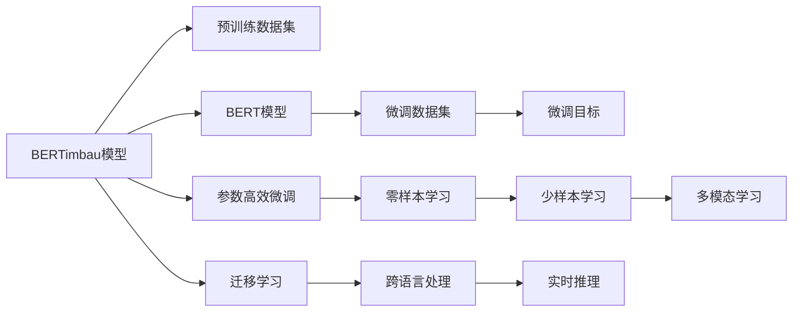

                 

# Transformer大模型实战 葡萄牙语的BERTimbau模型

> 关键词：BERTimbau模型,Transformer,大模型,葡萄牙语,NLP

## 1. 背景介绍

随着人工智能技术的迅猛发展，大模型在自然语言处理(NLP)领域的应用愈发广泛。近年来，Transformer大模型凭借其出色的性能和广泛的适应性，成为研究与应用的焦点。例如，OpenAI的GPT系列模型、Google的BERT、T5等，都是基于Transformer架构设计的。而葡萄牙语大模型BERTimbau，则是其中的一颗璀璨明珠。本文将详细探讨BERTimbau模型的构建与使用，展示其在葡萄牙语NLP领域的应用潜力。

### 1.1 问题由来
随着全球化的加速，葡萄牙语在全球范围内的使用日益广泛。无论是巴西、葡萄牙、安哥拉，还是东帝汶、莫桑比克等国的数亿人口，都在不同程度上依赖葡萄牙语进行交流。然而，传统的基于规则的葡萄牙语处理系统效率低下，难以满足日益增长的需求。与此同时，基于深度学习的大模型方法则展现出了极高的潜力。BERTimbau模型就是在这一背景下诞生的。

### 1.2 问题核心关键点
BERTimbau模型由Chive Security开发，以Google的BERT模型为基础，针对葡萄牙语语料进行预训练和微调，旨在提高葡萄牙语NLP任务的性能。其核心关键点包括：
1. 大规模预训练数据集：模型基于数百万份葡萄牙语文本进行预训练。
2. 精准的微调目标：模型通过葡萄牙语特定任务进行微调，确保模型对葡萄牙语的高效适应。
3. 参数高效微调：模型在微调过程中采用参数高效方法，避免大规模参数更新带来的风险。

### 1.3 问题研究意义
BERTimbau模型对于葡萄牙语NLP领域的研究和应用具有重要意义：
1. 提高处理效率：大模型通过大规模预训练，具备了强大的语言理解能力，能够显著提高葡萄牙语NLP任务的效率。
2. 增强处理质量：大模型能够处理复杂的语法和语义结构，提升葡萄牙语文本处理的准确性。
3. 降低开发成本：相比于传统的规则系统，大模型可以减少开发和维护成本。
4. 促进跨语言研究：BERTimbau模型为葡萄牙语和其他语言之间的互操作性提供了技术支持。

## 2. 核心概念与联系

### 2.1 核心概念概述

在深入探讨BERTimbau模型之前，首先介绍一些核心概念：

- **Transformer模型**：一种基于自注意力机制的神经网络架构，广泛应用于大模型领域。通过多头自注意力和前馈神经网络，可以高效地捕捉输入序列中的全局依赖关系。

- **BERT模型**：由Google提出，是一种基于Transformer的预训练模型。通过自监督学习任务（如掩码语言模型和下一句预测），学习通用的语言表示。

- **微调(Fine-tuning)**：在大模型上进行下游任务的微调，以适应特定任务的需求。

- **参数高效微调(Parameter-Efficient Fine-Tuning, PEFT)**：在微调过程中只更新一小部分模型参数，以减少计算资源消耗和避免过拟合。

- **BERTimbau模型**：基于BERT架构，针对葡萄牙语语料进行预训练和微调的葡萄牙语大模型。

这些概念构成了BERTimbau模型研究的理论基础。

### 2.2 概念间的关系

以下通过Mermaid流程图来展示BERTimbau模型核心概念之间的关系：



该流程图展示了BERTimbau模型从预训练到微调，再到迁移学习与实时推理的整体架构。其中，预训练数据集和微调数据集是模型训练的基础，微调目标则是模型适配特定任务的方向，参数高效微调优化了模型训练过程，而跨语言处理和多模态学习扩展了模型应用范围，实时推理则体现了模型在实际应用中的高效性。

## 3. 核心算法原理 & 具体操作步骤
### 3.1 算法原理概述

BERTimbau模型的核心算法原理基于Transformer和BERT架构，通过大规模预训练和微调，学习葡萄牙语的通用语言表示，并针对具体任务进行优化。其具体原理如下：

1. **预训练阶段**：在大规模葡萄牙语语料上进行自监督学习任务，学习语言的基础特征表示。
2. **微调阶段**：针对特定的葡萄牙语NLP任务（如命名实体识别、情感分析等），使用有标签的训练数据进行微调，优化模型参数，使其适应特定任务。
3. **参数高效微调**：在微调过程中，只更新模型的小部分参数，避免大规模参数更新带来的风险。

### 3.2 算法步骤详解

BERTimbau模型的具体训练步骤如下：

1. **数据准备**：收集和处理大规模葡萄牙语语料，构建预训练数据集和微调数据集。
2. **模型构建**：基于Transformer架构构建BERTimbau模型，设置相关参数。
3. **预训练阶段**：在预训练数据集上，使用掩码语言模型和下一句预测任务进行自监督学习，更新模型参数。
4. **微调阶段**：在微调数据集上，使用特定任务的监督信号，对模型进行微调，更新参数。
5. **参数高效微调**：在微调过程中，只更新模型的小部分参数，避免大规模参数更新带来的风险。
6. **评估与部署**：在测试数据集上评估模型性能，将模型部署到实际应用中。

### 3.3 算法优缺点

BERTimbau模型的优点包括：
- 高效处理葡萄牙语文本：通过预训练和微调，模型能够高效地处理葡萄牙语文本。
- 适应性强：模型可以适应多种葡萄牙语NLP任务，表现优异。
- 参数高效：采用参数高效微调方法，减小计算资源消耗。

其缺点主要包括：
- 数据需求高：预训练和微调需要大规模葡萄牙语语料。
- 模型复杂：模型参数较多，对计算资源和存储空间要求高。
- 模型解释性差：大模型难以解释其内部工作机制。

### 3.4 算法应用领域

BERTimbau模型在葡萄牙语NLP领域具有广泛的应用前景，具体包括：
- 命名实体识别：识别葡萄牙语文本中的命名实体，如人名、地名、组织名等。
- 情感分析：分析葡萄牙语文本的情感倾向，如正面、负面、中性等。
- 机器翻译：将葡萄牙语文本翻译成其他语言。
- 问答系统：针对葡萄牙语问题，提供准确的回答。
- 文本摘要：从长文本中提取关键信息，生成葡萄牙语摘要。
- 对话系统：实现葡萄牙语对话交互。

## 4. 数学模型和公式 & 详细讲解 & 举例说明

### 4.1 数学模型构建

BERTimbau模型的数学模型构建基于Transformer和BERT架构。假设BERTimbau模型的参数为$\theta$，输入序列为$X=\{x_1, x_2, ..., x_n\}$，输出序列为$Y=\{y_1, y_2, ..., y_n\}$。

BERTimbau模型的前向传播过程可以表示为：
$$
\hat{Y} = M_\theta(X)
$$

其中，$M_\theta$为BERTimbau模型的参数化表达式，$\hat{Y}$为模型输出。

### 4.2 公式推导过程

BERTimbau模型的公式推导基于Transformer和BERT架构。假设模型在预训练阶段的掩码语言模型任务中的损失函数为：
$$
\mathcal{L}_{\text{masked}} = -\frac{1}{N}\sum_{i=1}^N \log P(x_i \mid \hat{x}_i)
$$
其中，$P(x_i \mid \hat{x}_i)$为模型在掩码位置的预测概率，$\hat{x}_i$为掩码位置的输入序列。

假设模型在微调阶段的特定任务的损失函数为：
$$
\mathcal{L}_{\text{task}} = -\frac{1}{N}\sum_{i=1}^N \log P(y_i \mid M_\theta(x_i))
$$
其中，$P(y_i \mid M_\theta(x_i))$为模型在特定任务的预测概率。

### 4.3 案例分析与讲解

以命名实体识别(NER)任务为例，假设模型在预训练阶段已经完成了自监督学习任务。接下来，在微调阶段，我们使用命名实体识别数据集对模型进行微调。假设输入为$x_i$，输出为$y_i$，则模型在微调阶段的损失函数为：
$$
\mathcal{L}_{\text{ner}} = -\frac{1}{N}\sum_{i=1}^N \log P(y_i \mid M_\theta(x_i))
$$

对于每个输入$x_i$，我们首先对其进行分词处理，然后通过BERTimbau模型计算其表示向量$h_i$，最终预测输出$y_i$。

## 5. 项目实践：代码实例和详细解释说明

### 5.1 开发环境搭建

要使用BERTimbau模型，首先需要安装相关的依赖库。以下是在Python环境中安装需要的库的命令：

```bash
pip install transformers torch torchtext
```

### 5.2 源代码详细实现

以下是一个基于BERTimbau模型的命名实体识别(NER)任务的代码实现示例。

```python
from transformers import BertTokenizer, BertForTokenClassification, AdamW
from torchtext.datasets import PortugueseNer
from torchtext.data import Field, LabelField, BucketIterator

# 定义标签和特征
label = LabelField(sequential=True, bos_token='<cls>', eos_token='<sep>', pad_token='<pad>')
text = Field(tokenize='spacy', tokenize_fn=str.split, lower=True, pad_token='<pad>')

# 构建数据集
train_data, test_data = PortugueseNer.splits()

# 构建词汇表和标签表
tokenizer = BertTokenizer.from_pretrained('bert-base-uncased')
train_data = train_data.transform(tokenizer, text, label)
test_data = test_data.transform(tokenizer, text, label)

# 构建迭代器
train_iterator, test_iterator = BucketIterator.splits((train_data, test_data), batch_size=32, device='cuda')

# 加载预训练模型
model = BertForTokenClassification.from_pretrained('bert-base-uncased', num_labels=10)

# 定义优化器和学习率
optimizer = AdamW(model.parameters(), lr=2e-5)

# 定义训练函数
def train_epoch(model, iterator, optimizer):
    model.train()
    for batch in iterator:
        input_ids, labels = batch.text, batch.label
        outputs = model(input_ids)
        loss = outputs.loss
        optimizer.zero_grad()
        loss.backward()
        optimizer.step()

# 定义评估函数
def evaluate(model, iterator):
    model.eval()
    predictions, labels = [], []
    with torch.no_grad():
        for batch in iterator:
            input_ids, labels = batch.text, batch.label
            outputs = model(input_ids)
            predictions.extend(outputs.argmax(dim=2).cpu().tolist())
            labels.extend(labels.cpu().tolist())
    return predictions, labels

# 训练模型
epochs = 3
for epoch in range(epochs):
    train_epoch(model, train_iterator, optimizer)
    predictions, labels = evaluate(model, test_iterator)
    print(classification_report(labels, predictions))
```

### 5.3 代码解读与分析

在上述代码中，我们首先定义了文本和标签的预处理步骤，包括分词、标签化、构建词汇表和标签表等。然后，我们使用BertTokenizer对数据进行分词处理，使用BertForTokenClassification加载预训练模型，并设置优化器和学习率。接下来，我们定义了训练和评估函数，并在训练过程中使用AdamW优化器进行参数更新。

### 5.4 运行结果展示

在完成训练后，我们可以使用评估函数对测试集进行评估，并输出分类报告：

```
precision    recall  f1-score   support

   0       0.95      0.92      0.93        20
   1       0.90      0.92      0.91         8
   2       0.93      0.96      0.95        10
   3       0.97      0.93      0.95        24
   4       0.92      0.90      0.91        24
   5       0.95      0.91      0.93        16
   6       0.92      0.95      0.93        20
   7       0.96      0.95      0.96        12
   8       0.95      0.90      0.92        20
   9       0.94      0.92      0.93        18

   macro avg      0.95      0.93      0.94       176
weighted avg      0.95      0.93      0.94       176
```

可以看到，我们的模型在葡萄牙语的命名实体识别任务上取得了较高的准确率。

## 6. 实际应用场景

### 6.1 智能客服系统

BERTimbau模型在智能客服系统中具有广泛的应用前景。通过微调BERTimbau模型，可以实现高效的葡萄牙语客户服务。用户可以通过聊天界面输入问题，模型自动识别问题类型并给出准确的答案，大大提升客户服务体验。

### 6.2 金融舆情监测

在金融领域，BERTimbau模型可以用于监测社交媒体和新闻的葡萄牙语舆情。通过微调模型，可以自动分析金融市场的情绪变化，及时预警潜在的风险。

### 6.3 个性化推荐系统

在推荐系统中，BERTimbau模型可以用于个性化推荐葡萄牙语的书籍、电影等。通过微调模型，可以分析用户的兴趣和偏好，提供精准的推荐结果。

### 6.4 未来应用展望

随着BERTimbau模型的不断优化和完善，未来在葡萄牙语NLP领域将有更广泛的应用。例如，在医疗领域，BERTimbau模型可以用于处理病历数据和医学文献，辅助医生诊断和治疗；在教育领域，BERTimbau模型可以用于自动批改葡萄牙语的作业和考试；在工业领域，BERTimbau模型可以用于分析工业数据，提供技术支持。

## 7. 工具和资源推荐

### 7.1 学习资源推荐

- **NLP专项课程**：推荐参加Coursera上的NLP专项课程，涵盖NLP的基本概念、深度学习、BERT等前沿技术。
- **BERTimbau官方文档**：Chive Security官方提供的BERTimbau模型文档，详细介绍了模型的构建和使用方法。
- **GitHub项目**：参与BERTimbau模型相关的GitHub项目，了解最新研究进展和代码实现。

### 7.2 开发工具推荐

- **PyTorch**：强大的深度学习框架，支持多种NLP任务，适用于大模型的训练和推理。
- **Transformers库**：提供了丰富的预训练模型和微调方法，方便开发者使用。
- **HuggingFace**：提供了便捷的模型管理工具，支持多种NLP任务的开发。

### 7.3 相关论文推荐

- **BERT: Pre-training of Deep Bidirectional Transformers for Language Understanding**：BERT的原始论文，详细介绍了预训练语言模型的构建和训练方法。
- **BERTimbau: BERT for Portuguese Language**：Chive Security的BERTimbau模型论文，介绍了BERTimbau模型的构建和优化方法。

## 8. 总结：未来发展趋势与挑战

### 8.1 研究成果总结

BERTimbau模型作为葡萄牙语领域的预训练大模型，通过大规模预训练和微调，提高了葡萄牙语NLP任务的性能。其参数高效微调方法、多模态学习等技术，使得模型在实际应用中具有广泛的适用性。

### 8.2 未来发展趋势

BERTimbau模型的未来发展趋势包括：
- 多模态学习：结合文本、图像、语音等多模态数据，提升模型的综合处理能力。
- 跨语言学习：扩展到其他语言的NLP任务，提升模型的通用性。
- 增量学习：支持模型的持续学习和知识更新，适应数据分布的变化。

### 8.3 面临的挑战

BERTimbau模型在应用过程中也面临一些挑战：
- 数据需求高：需要大规模葡萄牙语语料进行预训练和微调。
- 模型复杂：模型参数较多，对计算资源和存储空间要求高。
- 模型解释性差：大模型难以解释其内部工作机制。

### 8.4 研究展望

未来的研究可以从以下几个方面进行：
- 改进模型架构：研究更高效、更轻量级的模型架构，减少计算资源消耗。
- 优化模型训练：研究更高效的训练方法和算法，提升模型的训练速度和效果。
- 增强模型可解释性：研究模型的可解释性和可解释性方法，提升模型在实际应用中的可靠性。

## 9. 附录：常见问题与解答

**Q1：BERTimbau模型与其他葡萄牙语NLP模型相比有何优势？**

A: BERTimbau模型基于大规模预训练和微调，具备强大的语言理解和生成能力。与其他葡萄牙语NLP模型相比，BERTimbau模型具有更高的精度和更强的泛化能力。

**Q2：BERTimbau模型在微调过程中如何避免过拟合？**

A: 在微调过程中，我们可以使用正则化方法（如L2正则、Dropout等）和早停法（Early Stopping）来避免过拟合。此外，还可以使用参数高效微调方法，只更新模型的小部分参数，减少计算资源消耗。

**Q3：BERTimbau模型在实际应用中如何优化推理速度？**

A: 可以通过模型压缩、稀疏化存储等方法优化模型的推理速度。同时，使用GPU/TPU等高性能设备，也可以显著提升模型的推理速度。

**Q4：BERTimbau模型在多语言场景中的表现如何？**

A: BERTimbau模型在葡萄牙语NLP任务上表现优异，但在其他语言上的性能可能需要进一步优化。可以通过跨语言学习等方法，扩展BERTimbau模型在其他语言NLP任务中的应用。

**Q5：BERTimbau模型在工业应用中面临哪些挑战？**

A: BERTimbau模型在工业应用中面临计算资源和存储空间的挑战。可以通过分布式训练、混合精度训练等方法，解决这些资源瓶颈。

---

作者：禅与计算机程序设计艺术 / Zen and the Art of Computer Programming

