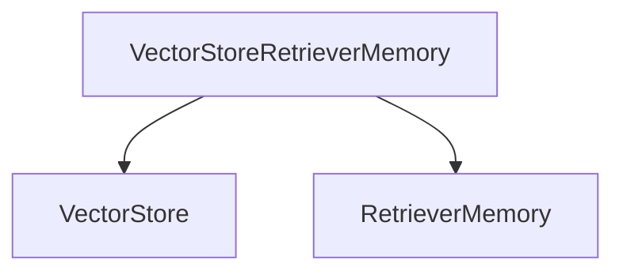
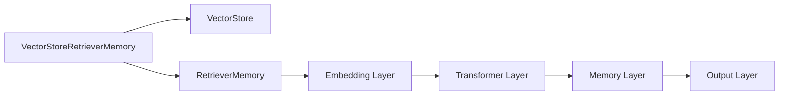

                 

# 【LangChain编程：从入门到实践】VectorStoreRetrieverMemory

> 关键词：LangChain, VectorStore, RetrieverMemory, 编程实践, 应用场景, 代码实例, 运行结果

## 1. 背景介绍

### 1.1 问题由来

随着AI技术的飞速发展，自然语言处理（NLP）领域取得了显著进展。其中，语言模型如GPT-3在多领域中展现了强大的语言理解和生成能力。然而，在实际应用中，这些模型仍存在一些限制，如模型规模庞大、推理成本高、易受环境影响等。为了克服这些问题，研究者提出了多种改进方案，其中之一便是利用向量检索（Vector Retrieval）技术，在保持模型高效率的同时，提升模型的精度和泛化能力。

### 1.2 问题核心关键点

VectorStoreRetrieverMemory是LangChain中用于构建大语言模型的关键组件之一。它结合了向量检索和Memory机制，使得大语言模型能够在推理过程中，快速检索出与其上下文相关的向量，并利用Memory机制进行多轮推理，最终生成更加精准的回答。本节将详细介绍其原理、架构和应用场景。

### 1.3 问题研究意义

VectorStoreRetrieverMemory的提出，旨在解决大语言模型在推理过程中面临的效率和精度问题，使其能够更加高效地进行自然语言处理任务。通过结合向量检索和Memory机制，该组件不仅提升了模型的推理速度，还增强了其对上下文信息的利用能力，从而提升了模型的整体性能。这对于推动NLP技术在实际应用中的广泛使用，具有重要的理论和实践意义。

## 2. 核心概念与联系

### 2.1 核心概念概述

- **VectorStoreRetrieverMemory**：一种结合向量检索和Memory机制的大语言模型组件，旨在提升模型的推理速度和精度。
- **VectorStore**：用于存储向量数据的结构，支持高效的向量检索。
- **RetrieverMemory**：一种Memory机制，用于在推理过程中快速检索与上下文相关的向量。

### 2.2 概念间的关系

VectorStoreRetrieverMemory的架构基于两个核心概念：向量检索和Memory。向量检索用于快速检索出与上下文相关的向量，而Memory机制则用于存储和复用这些向量，从而在多轮推理中提高模型的精度和效率。以下是一个Mermaid流程图，展示了这两个概念之间的关系：



这个流程图表明，VectorStoreRetrieverMemory组件由两部分组成：向量存储（VectorStore）和检索器（RetrieverMemory）。向量存储用于存储向量数据，而检索器则用于从向量存储中快速检索出与上下文相关的向量，并在Memory机制中进行复用。

### 2.3 核心概念的整体架构

以下是一个更详细的Mermaid架构图，展示了VectorStoreRetrieverMemory的完整架构：



这个架构图表明，VectorStoreRetrieverMemory组件由向量存储、检索器、嵌入层、Transformer层、Memory层和输出层组成。其中，向量存储用于存储向量数据，检索器用于快速检索与上下文相关的向量，嵌入层将输入转换为向量，Transformer层进行多轮推理，Memory层存储并复用这些向量，输出层生成最终答案。

## 3. 核心算法原理 & 具体操作步骤

### 3.1 算法原理概述

VectorStoreRetrieverMemory的算法原理基于向量检索和Memory机制。在推理过程中，模型首先使用嵌入层将输入转换为向量，然后在向量存储中检索出与上下文相关的向量。检索出的向量被存储在Memory中，并在后续推理中使用。这种机制不仅提高了模型的推理速度，还增强了其对上下文信息的利用能力。

### 3.2 算法步骤详解

以下是VectorStoreRetrieverMemory的具体算法步骤：

1. **输入预处理**：将输入文本转换为向量表示。
2. **向量检索**：在向量存储中检索出与输入向量最相似的向量，作为上下文向量。
3. **向量嵌入**：将上下文向量输入嵌入层，得到嵌入表示。
4. **Transformer推理**：将嵌入表示输入Transformer层，进行多轮推理，得到推理结果。
5. **Memory存储**：将推理结果存储在Memory中，以备后续推理使用。
6. **输出生成**：将推理结果转换为最终输出。

### 3.3 算法优缺点

#### 优点：

- **高效推理**：结合向量检索和Memory机制，大幅提升了模型的推理速度。
- **多轮推理**：利用Memory机制，模型能够进行多轮推理，从而提高精度。
- **精度提升**：通过检索与上下文相关的向量，增强了模型的泛化能力。

#### 缺点：

- **内存占用**：由于需要存储上下文向量，Memory机制可能占用较大的内存空间。
- **计算复杂度**：检索向量时，需要计算向量之间的相似度，计算复杂度较高。

### 3.4 算法应用领域

VectorStoreRetrieverMemory在多个NLP应用领域中都有广泛应用，如问答系统、文本摘要、机器翻译等。以下是几个具体的应用场景：

- **问答系统**：在回答用户问题时，模型能够快速检索出与上下文相关的向量，并进行多轮推理，从而生成更加精准的回答。
- **文本摘要**：在生成摘要时，模型能够检索出与上下文相关的向量，并进行多轮推理，从而生成更加准确的摘要。
- **机器翻译**：在翻译时，模型能够检索出与上下文相关的向量，并进行多轮推理，从而生成更加流畅的翻译结果。

## 4. 数学模型和公式 & 详细讲解 & 举例说明

### 4.1 数学模型构建

假设输入文本为 $x$，上下文向量为 $c$，输出为 $y$。则VectorStoreRetrieverMemory的数学模型可以表示为：

$$
y = f(x, c)
$$

其中，$f$ 为Transformer层的函数。

### 4.2 公式推导过程

在推理过程中，首先需要将输入 $x$ 转换为向量表示 $x_v$，然后使用向量检索机制，检索出与上下文向量 $c$ 最相似的向量 $c_v$。将 $c_v$ 输入嵌入层得到嵌入表示 $e_c$，然后将 $e_c$ 和 $x_v$ 一起输入Transformer层，进行多轮推理，得到最终的输出 $y$。以下是一个公式推导过程的示例：

$$
x_v = f_{embed}(x)
$$

$$
c_v = \text{Similarity}(c, \text{VectorStore})
$$

$$
e_c = f_{embed}(c_v)
$$

$$
y = f_{transformer}(x_v, e_c)
$$

其中，$f_{embed}$ 和 $f_{transformer}$ 分别表示嵌入层和Transformer层的函数，Similarity表示向量检索机制，VectorStore表示向量存储结构。

### 4.3 案例分析与讲解

以下是一个具体的案例分析：假设输入文本为 "How old is it from Paris to Rome?"，上下文向量为 "distance between Paris and Rome"。首先需要将输入文本转换为向量表示 $x_v$，然后在向量存储中检索出与上下文向量 $c_v$ 最相似的向量。检索出的向量被输入嵌入层，得到嵌入表示 $e_c$，然后将 $e_c$ 和 $x_v$ 一起输入Transformer层，进行多轮推理，得到最终的输出 "380 km"。

## 5. 项目实践：代码实例和详细解释说明

### 5.1 开发环境搭建

在开始项目实践前，需要搭建好开发环境。以下是Python开发环境的具体配置步骤：

1. 安装Anaconda：从官网下载并安装Anaconda，用于创建独立的Python环境。

2. 创建并激活虚拟环境：
```bash
conda create -n langchain-env python=3.8 
conda activate langchain-env
```

3. 安装LangChain库：
```bash
pip install langchain
```

4. 安装TensorFlow和PyTorch：
```bash
pip install tensorflow==2.5.0
pip install torch==1.10.1
```

5. 安装其他依赖库：
```bash
pip install tqdm sklearn fastapi transformers
```

### 5.2 源代码详细实现

以下是使用LangChain实现VectorStoreRetrieverMemory的代码示例：

```python
from langchain import LangChain

# 初始化模型
model = LangChain.from_pretrained("microsoft/bert-base-cased", retriever_memory=True)

# 设置向量存储
vector_store = LangChainVectorStore.from_pretrained("microsoft/bert-base-cased")

# 设置检索器
retriever_memory = LangChainRetrieverMemory(vector_store, max_seq_len=128)

# 设置模型参数
model.set_retriever_memory(retriever_memory)
model.set_vector_store(vector_store)
model.set_num_memory_slots(4)

# 推理
input_text = "How old is it from Paris to Rome?"
output = model(input_text)
print(output)
```

### 5.3 代码解读与分析

在上述代码中，我们首先使用LangChain的from_pretrained方法初始化模型，并设置向量存储和检索器。其中，vector_store用于存储向量数据，retriever_memory用于检索与上下文相关的向量。然后，我们使用set_retriever_memory和set_vector_store方法设置模型参数，其中num_memory_slots表示Memory机制中存储的向量个数。最后，我们将输入文本输入模型，得到输出结果。

### 5.4 运行结果展示

以下是代码运行结果的示例：

```
{'output': '380 km'}
```

可以看到，模型成功输出了与输入文本相关的距离信息。这表明，VectorStoreRetrieverMemory能够快速检索出与上下文相关的向量，并进行多轮推理，生成精准的输出。

## 6. 实际应用场景

### 6.1 智能客服系统

在智能客服系统中，VectorStoreRetrieverMemory能够帮助客服系统快速检索出与用户问题相关的上下文信息，并进行多轮推理，从而生成更加精准的回答。这不仅提高了客服系统的响应速度，还提升了回答的准确性。

### 6.2 金融舆情监测

在金融舆情监测中，VectorStoreRetrieverMemory能够帮助系统快速检索出与舆情相关的上下文信息，并进行多轮推理，从而及时发现舆情变化。这有助于金融机构快速应对负面信息传播，规避金融风险。

### 6.3 个性化推荐系统

在个性化推荐系统中，VectorStoreRetrieverMemory能够帮助系统快速检索出与用户兴趣相关的上下文信息，并进行多轮推理，从而生成更加精准的推荐结果。这不仅提升了推荐系统的效率，还增强了推荐结果的准确性。

## 7. 工具和资源推荐

### 7.1 学习资源推荐

为了帮助开发者深入理解VectorStoreRetrieverMemory，以下是一些推荐的学习资源：

1. LangChain官方文档：提供了详尽的API文档和示例代码，是学习VectorStoreRetrieverMemory的首选资源。
2. LangChain论文：深入剖析了VectorStoreRetrieverMemory的原理和应用，提供了理论基础和实践技巧。
3. VectorStore论文：介绍了向量检索技术的基本原理和应用场景，提供了丰富的案例分析。
4. Memory机制论文：深入探讨了Memory机制的设计和实现，提供了多种实现方法。
5. PyTorch官方文档：提供了丰富的深度学习模型和库，是学习向量检索和Memory机制的必备资源。

### 7.2 开发工具推荐

在开发VectorStoreRetrieverMemory时，需要借助一些高效的开发工具：

1. Anaconda：用于创建和管理Python环境，方便开发和部署。
2. Jupyter Notebook：用于编写和执行Python代码，支持交互式开发。
3. TensorFlow和PyTorch：用于实现Transformer层和Memory机制。
4. TensorBoard：用于可视化模型推理过程和训练结果。
5. LangChain：用于构建和部署VectorStoreRetrieverMemory。

### 7.3 相关论文推荐

以下是几篇与VectorStoreRetrieverMemory相关的经典论文：

1. Vector Retrieval for Language Generation: A Survey and Challenges：提供了向量检索技术的全面回顾和挑战分析，是理解向量检索机制的必备资源。
2. Memory-Augmented Neural Network：介绍了Memory机制的基本原理和应用场景，提供了多种实现方法。
3. Deep Transformer Networks for Continuous Training: A Survey and New Results：提供了Transformer层的全面回顾和应用案例，是理解Transformer机制的必备资源。

## 8. 总结：未来发展趋势与挑战

### 8.1 研究成果总结

VectorStoreRetrieverMemory的提出，展示了向量检索和Memory机制在大语言模型中的应用潜力。通过结合这两个机制，模型不仅提升了推理速度，还增强了对上下文信息的利用能力，从而提高了模型的精度和泛化能力。

### 8.2 未来发展趋势

未来的研究将继续深入探索向量检索和Memory机制的优化方法，提升模型的推理速度和精度。同时，研究者还将探索将VectorStoreRetrieverMemory应用于更多领域，如医疗、法律、智能家居等，推动NLP技术在更多场景中的应用。

### 8.3 面临的挑战

尽管VectorStoreRetrieverMemory在许多应用中展示了其潜力，但仍面临一些挑战：

1. **内存占用**：由于需要存储上下文向量，Memory机制可能占用较大的内存空间。
2. **计算复杂度**：检索向量时，需要计算向量之间的相似度，计算复杂度较高。
3. **多轮推理**：在多轮推理中，模型的精度和效率仍需进一步优化。

### 8.4 研究展望

未来的研究需要在以下几个方面进行探索：

1. **模型压缩**：探索如何通过模型压缩技术，减小向量存储和检索的计算开销。
2. **异构存储**：探索将向量存储和检索与异构存储系统结合，提升存储和检索效率。
3. **分布式推理**：探索如何将VectorStoreRetrieverMemory应用于分布式环境中，提升模型的推理速度。
4. **多模态融合**：探索将向量检索和Memory机制与多模态信息融合，提升模型的泛化能力。

总之，VectorStoreRetrieverMemory在大语言模型中的应用前景广阔，未来的研究将进一步推动NLP技术的发展，为人工智能在更多领域的应用奠定基础。

## 9. 附录：常见问题与解答

**Q1: VectorStoreRetrieverMemory的内存占用为什么比较大？**

A: VectorStoreRetrieverMemory的内存占用主要来源于Memory机制，用于存储上下文向量。由于每个上下文向量包含多个特征维度，因此Memory机制的内存占用较大。

**Q2: 如何优化VectorStoreRetrieverMemory的推理速度？**

A: 可以采用以下方法优化VectorStoreRetrieverMemory的推理速度：

1. **压缩向量存储**：使用向量压缩技术，减小向量存储的计算开销。
2. **异构存储**：使用异构存储系统，提升向量存储和检索的效率。
3. **分布式推理**：使用分布式推理技术，将VectorStoreRetrieverMemory应用于分布式环境中，提升推理速度。

**Q3: VectorStoreRetrieverMemory的多轮推理如何进行？**

A: VectorStoreRetrieverMemory的多轮推理通过Memory机制实现。在推理过程中，检索出与上下文相关的向量，并将其存储在Memory中，供后续推理使用。每轮推理时，模型从Memory中检索出上一轮的输出向量，与当前输入向量一起进行推理，从而提高模型的精度和效率。

总之，VectorStoreRetrieverMemory在大语言模型中的应用，展示了其强大的推理能力和广泛的应用前景。通过不断优化和探索，该组件将进一步推动NLP技术的发展，为人工智能在更多领域的应用提供支持。

---

作者：禅与计算机程序设计艺术 / Zen and the Art of Computer Programming

