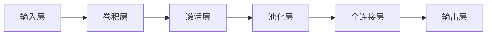

# 卷积层 (Convolutional Layer) 原理与代码实例讲解

关键词：卷积层, 卷积神经网络, 深度学习, 特征提取, 图像识别

## 1. 背景介绍
### 1.1 问题的由来
在当今人工智能和机器学习快速发展的时代,卷积神经网络(Convolutional Neural Networks, CNN)已经成为图像识别、计算机视觉等领域的主流技术之一。而卷积层作为CNN的核心组件,在特征提取和模式识别中扮演着至关重要的角色。深入理解卷积层的原理和实现,对于我们掌握现代AI技术具有重要意义。

### 1.2 研究现状
近年来,以CNN为代表的深度学习方法在图像分类、目标检测、语义分割等任务上取得了突破性进展,大大推动了人工智能的发展。从LeNet到AlexNet、VGGNet、GoogLeNet、ResNet等经典网络,卷积层的设计和应用也在不断演进。许多研究者致力于探索新的卷积结构和优化技术,以进一步提升模型性能。

### 1.3 研究意义
作为CNN的基本构建块,深入剖析卷积层的内在机制,对于我们设计出更加高效、鲁棒的神经网络架构具有重要的指导意义。通过理解卷积运算的数学原理,结合实际的代码实践,我们可以更好地掌握深度学习的核心技术,为解决实际问题提供有力的工具和思路。

### 1.4 本文结构
本文将从以下几个方面对卷积层展开详细讨论：首先介绍卷积层的核心概念与基本原理；然后重点阐述卷积运算的数学模型与具体算法步骤；接着通过代码实例来演示如何使用主流的深度学习框架实现卷积层；最后总结卷积层的特点、应用场景以及未来的发展方向。

## 2. 核心概念与联系
卷积层的核心思想是利用卷积运算对输入信号进行特征提取和下采样。它通过使用一组可学习的卷积核(也称为过滤器)在输入特征图上滑动,通过计算卷积核与局部区域的点积,得到输出特征图。这一过程可以提取输入信号的局部特征,同时减少特征图的空间维度。多个卷积层的堆叠,可以逐层提取出更加抽象和高级的特征表示。

卷积层与其他神经网络层(如全连接层、池化层等)的关系如下图所示:



## 3. 核心算法原理 & 具体操作步骤
### 3.1 算法原理概述
卷积运算是卷积层的数学基础。对于二维图像输入,卷积运算可以表示为:

$$
y(i,j) = \sum_{m}\sum_{n} x(i-m, j-n)w(m,n)
$$

其中,$x$为输入特征图,$w$为卷积核,$y$为输出特征图。卷积核在输入特征图上滑动,通过加权求和得到输出。

### 3.2 算法步骤详解
卷积层的前向传播过程可分为以下步骤:

1. 初始化卷积核参数(权重)
2. 对输入特征图进行填充(padding),使卷积后的输出尺寸与输入一致
3. 卷积核在输入特征图上滑动,与局部区域进行点积运算
4. 将点积结果作为输出特征图的对应位置的值
5. 重复步骤3-4,直到遍历完整个输入特征图

反向传播时,卷积层的梯度计算采用误差反向传播算法,通过链式法则求解损失函数对卷积核参数的梯度,并用梯度下降等优化算法更新参数。

### 3.3 算法优缺点
卷积层相比传统的全连接层,具有以下优点:
- 局部连接:每个神经元只与前一层的局部区域相连,减少了参数数量
- 权重共享:同一个卷积核在整个特征图上共享参数,进一步降低了参数量
- 平移不变性:卷积操作对于物体的平移具有一定的不变性

但卷积层也存在一定局限性,如卷积核大小和感受野的限制、缺乏对全局信息的建模能力等。

### 3.4 算法应用领域
卷积层广泛应用于以下领域:
- 图像分类与识别
- 目标检测与定位
- 语义分割
- 人脸识别
- 行为识别
- 医学图像分析
- 自然语言处理(如文本分类)

## 4. 数学模型和公式 & 详细讲解 & 举例说明
### 4.1 数学模型构建
考虑一个输入特征图 $X\in\mathbb{R}^{H\times W\times C}$,其中$H$、$W$、$C$分别表示高度、宽度和通道数。卷积核 $W\in\mathbb{R}^{K\times K\times C}$,其中$K$为卷积核大小。卷积层的输出特征图 $Y\in\mathbb{R}^{H'\times W'\times C'}$,其中

$$
\begin{aligned}
H' &= \lfloor\frac{H+2P-K}{S}\rfloor + 1 \
W' &= \lfloor\frac{W+2P-K}{S}\rfloor + 1 \
C' &= N
\end{aligned}
$$

$P$为padding大小,$S$为stride大小,$N$为卷积核个数(输出通道数)。

### 4.2 公式推导过程
对于输出特征图中的每个元素$y_{i,j,k}$,其计算公式为:

$$
y_{i,j,k} = \sum_{c=0}^{C-1}\sum_{m=0}^{K-1}\sum_{n=0}^{K-1} x_{i\cdot S+m,j\cdot S+n,c} \cdot w_{m,n,c,k}
$$

其中,$i\in[0,H'-1]$,$j\in[0,W'-1]$,$k\in[0,C'-1]$。

### 4.3 案例分析与讲解
以一个具体的例子来说明卷积层的计算过程。假设输入特征图 $X\in\mathbb{R}^{4\times 4\times 1}$,卷积核 $W\in\mathbb{R}^{3\times 3\times 1}$,padding=0,stride=1。

输入特征图 $X$:
$$
X = \begin{bmatrix}
1 & 2 & 3 & 4 \
5 & 6 & 7 & 8 \
9 & 10 & 11 & 12 \
13 & 14 & 15 & 16
\end{bmatrix}
$$

卷积核 $W$:
$$
W = \begin{bmatrix}
1 & 0 & -1 \
2 & 0 & -2 \
1 & 0 & -1
\end{bmatrix}
$$

则输出特征图 $Y\in\mathbb{R}^{2\times 2\times 1}$,其中每个元素的计算过程如下:

$$
\begin{aligned}
y_{0,0,0} &= \sum_{m=0}^{2}\sum_{n=0}^{2} x_{0+m,0+n,0} \cdot w_{m,n,0,0} \
&= 1\cdot1 + 2\cdot0 + 3\cdot(-1) + 5\cdot2 + 6\cdot0 + 7\cdot(-2) + 9\cdot1 + 10\cdot0 + 11\cdot(-1) \
&= -5
\end{aligned}
$$

类似地可以计算出:
$$
Y = \begin{bmatrix}
-5 & -4 \
-5 & -4
\end{bmatrix}
$$

### 4.4 常见问题解答
Q: 卷积层的感受野(Receptive Field)是什么?
A: 感受野指的是输出特征图上的一个神经元在原始输入图像上的对应区域大小。随着网络层数的加深,感受野会逐渐增大,使神经元可以捕捉到更大尺度的特征。

Q: 卷积层的参数量如何计算?
A: 设输入通道数为$C$,输出通道数为$C'$,卷积核大小为$K\times K$,则卷积层的参数量为$K^2CC'+C'$。相比全连接层,卷积层通过局部连接和权重共享显著减少了参数数量。

## 5. 项目实践：代码实例和详细解释说明
### 5.1 开发环境搭建
本节我们将使用Python语言和PyTorch深度学习框架来实现卷积层。首先需要安装以下依赖库:
- Python 3.x
- PyTorch
- NumPy

可以使用pip命令进行安装:

```bash
pip install torch numpy
```

### 5.2 源代码详细实现
下面给出了使用PyTorch实现二维卷积层的示例代码:

```python
import torch
import torch.nn as nn

class ConvLayer(nn.Module):
    def __init__(self, in_channels, out_channels, kernel_size, stride=1, padding=0):
        super(ConvLayer, self).__init__()
        self.conv = nn.Conv2d(in_channels, out_channels, kernel_size, stride, padding)

    def forward(self, x):
        return self.conv(x)

# 测试代码
x = torch.randn(1, 1, 4, 4)  # 输入特征图
conv_layer = ConvLayer(1, 1, 3, 1, 0)  # 卷积层
y = conv_layer(x)  # 前向传播
print(y.shape)  # 输出特征图尺寸
```

### 5.3 代码解读与分析
- `ConvLayer`类继承自`nn.Module`,是一个可学习的卷积层模块
- `__init__`方法定义了卷积层的超参数,包括输入/输出通道数、卷积核大小、步幅和填充
- `forward`方法定义了前向传播过程,调用`nn.Conv2d`对输入特征图进行卷积运算
- 测试代码中,我们随机生成一个4x4的输入特征图,然后创建一个卷积层实例,对输入进行前向传播,最后打印输出特征图的尺寸

### 5.4 运行结果展示
运行上述测试代码,输出结果为:

```
torch.Size([1, 1, 2, 2])
```

可以看到,经过卷积层后,输出特征图的尺寸变为2x2,与我们之前的理论分析一致。

## 6. 实际应用场景
卷积层在深度学习领域有着广泛的应用,下面列举几个典型场景:

- 图像分类:使用CNN对图像进行特征提取和分类,如识别手写数字、物体识别等
- 目标检测:通过卷积层提取图像特征,再结合区域建议网络(RPN)等方法实现目标的定位和识别
- 语义分割:利用全卷积网络(FCN)对图像进行像素级别的分类,实现场景理解和物体边界的精确划分
- 人脸识别:使用卷积层提取人脸特征,再通过度量学习等方法实现人脸验证和识别
- 医学图像分析:用卷积网络对医学影像(如CT、MRI等)进行病灶检测、器官分割等任务

### 6.4 未来应用展望
随着CNN的不断发展,卷积层的设计和应用也在不断演进。一些前沿的研究方向包括:

- 可变形卷积(Deformable Convolution):通过学习偏移量,使卷积核可以适应物体的形变,提高特征提取的精度
- 图卷积网络(Graph Convolutional Networks):将卷积操作推广到图结构数据,用于社交网络、分子结构等非欧几里得数据的建模
- 神经架构搜索(NAS):利用自动化方法搜索最优的卷积层配置,设计出更加高效的CNN架构
- 注意力机制与卷积层的结合:通过引入注意力模块,使卷积层可以自适应地关注到图像的重要区域,提升模型的表达能力

## 7. 工具和资源推荐
### 7.1 学习资源推荐
- 《深度学习》(Deep Learning) - Ian Goodfellow等著:深度学习领域的经典教材,系统介绍了CNN等模型的原理和实现
- CS231n课程 - 斯坦福大学:著名的深度学习与计算机视觉课程,对卷积层有详细的