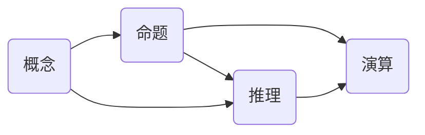

# 计算：第一部分 计算的诞生 第 3 章 莱布尼茨的计算之梦 数理逻辑的创立

作者：禅与计算机程序设计艺术 / Zen and the Art of Computer Programming

## 1. 背景介绍

### 1.1 问题的由来
17世纪,科学革命如火如荼,各个领域都取得了突破性进展。在数学领域,微积分的发明极大地推动了科学的发展。然而,数学家们逐渐意识到,数学的基础存在着诸多问题,亟需一种更加严密的逻辑体系来支撑数学大厦。

### 1.2 研究现状
莱布尼茨作为微积分的发明者之一,同时也是一位杰出的哲学家和逻辑学家。他梦想创立一门"普遍科学",用严密的逻辑推理取代自然语言中的歧义,最终实现人类思维的机械化。莱布尼茨在符号逻辑、命题逻辑等方面做出了开创性的贡献,为数理逻辑的诞生奠定了基础。

### 1.3 研究意义
数理逻辑是现代逻辑学的重要分支,它将数学方法引入逻辑学研究,使得逻辑推理能够像数学运算一样精确。数理逻辑不仅是数学和哲学的基础,更是计算机科学的理论根基。没有数理逻辑,就没有图灵机、λ演算等计算理论,更不会有今天的计算机和人工智能的迅猛发展。

### 1.4 本文结构
本文将首先介绍莱布尼茨的逻辑思想和对数理逻辑的贡献,然后系统阐述命题逻辑、一阶逻辑等数理逻辑的核心概念和推理规则,并给出相应的数学模型。接着,我们将讨论数理逻辑在计算机科学中的应用,如自动定理证明、程序验证等。最后,本文将展望数理逻辑的未来发展,并总结全文。

## 2. 核心概念与联系

在莱布尼茨看来,人类的一切思维活动都可以用少数几个基本概念和组合规则来表示,就像算术可以用0、1等数字和加减乘除等运算来表示一样。莱布尼茨提出了以下几个核心概念:

- 概念:事物的一般表象,如"人"、"动物"等。
- 命题:对概念之间关系的判断,可以为真或为假,如"苏格拉底是人"。
- 推理:从一些已知命题出发,根据逻辑规则推导出新命题的过程。
- 演算:用符号表示概念、命题和推理的方法,是一种"思维代数"。

数理逻辑正是在这些概念的基础上建立起来的。命题逻辑研究命题之间的逻辑联系,一阶逻辑进一步引入了个体词项和量词,使得我们能够表示出更加复杂的数学命题。



## 3. 核心算法原理 & 具体操作步骤

### 3.1 算法原理概述
数理逻辑的核心是演绎推理,即从一些前提出发,根据推理规则得出结论的过程。在命题逻辑和一阶逻辑中,最常用的推理规则有:

- 假言推理(Modus ponens):若$p$和$p \to q$都为真,则$q$为真。
- 拒取式(Modus tollens):若$p \to q$为真而$q$为假,则$p$为假。
- 全称量词实例化:若$\forall x P(x)$为真,则对任意个体常项$t$,$P(t)$为真。
- 存在量词引入:若对某个个体常项$t$,$P(t)$为真,则$\exists x P(x)$为真。

### 3.2 算法步骤详解
以假言推理为例,具体的推理步骤如下:

1. 找出前提中的条件语句$p \to q$和原子语句$p$。
2. 根据条件语句的真值条件,若$p$和$p \to q$都为真,则$q$必为真。
3. 将$q$作为推理的结论。

### 3.3 算法优缺点
演绎推理是一种可靠的推理方式,只要前提为真,则结论必然为真。这保证了数学和逻辑推理的严密性。

但是,并非所有的真理都能通过演绎得到。演绎推理是一种分析性的思维方式,它只能揭示蕴含在前提中的信息,而无法产生新的知识。因此,数学还需要直觉、类比等综合性思维。

### 3.4 算法应用领域
数理逻辑的推理规则广泛应用于数学证明、程序验证、人工智能等领域。在数学中,我们用逻辑规则来推导定理;在程序验证中,我们用逻辑来描述程序的语义,并证明程序的正确性;在人工智能中,我们用逻辑来表示知识,并进行自动推理。

## 4. 数学模型和公式 & 详细讲解 & 举例说明

### 4.1 数学模型构建
命题逻辑和一阶逻辑都可以用数学模型来刻画。在命题逻辑中,我们用命题变元$p,q,r$等表示命题,用逻辑联结词$\lnot,\land,\lor,\to,\leftrightarrow$表示命题之间的关系,并用真值表给出这些联结词的语义。

在一阶逻辑中,除了命题变元和逻辑联结词,我们还引入了个体词项(如个体常项、个体变项)、谓词和量词$\forall,\exists$。一阶逻辑公式由原子公式和逻辑联结词、量词递归构成。

### 4.2 公式推导过程
以假言推理的推导过程为例:

1. 假设前提$p$和$p \to q$都为真,即$p=1,p \to q=1$。
2. 根据条件语句的真值条件,$p \to q=1$当且仅当$p=0$或$q=1$。
3. 因为$p=1$,所以必须有$q=1$。
4. Therefore, $q$为真。

### 4.3 案例分析与讲解
考虑以下一阶逻辑公式:

$$\forall x (P(x) \to Q(x)), P(a) \vdash Q(a)$$

它表示,若对任意$x$,从$P(x)$可以推出$Q(x)$,且$P(a)$为真,则$Q(a)$为真。这实际上是全称量词实例化和假言推理的结合。

推理步骤如下:

1. 由前提$\forall x (P(x) \to Q(x))$和全称量词实例化,得到$P(a) \to Q(a)$。
2. 由前提$P(a)$和假言推理,得到$Q(a)$。

### 4.4 常见问题解答
- 问:数理逻辑能否表示所有的数学命题?
- 答:不能。一阶逻辑只能表示一阶可定义的数学概念和命题,对于更高阶的概念,如"任意函数"、"任意集合"等,一阶逻辑是无能为力的。

## 5. 项目实践：代码实例和详细解释说明

### 5.1 开发环境搭建
我们可以用编程语言如Python、Prolog等来实现逻辑推理。以下我们用Python实现简单的命题逻辑推理。

首先安装Python及相关库:

```bash
pip install sympy
```

### 5.2 源代码详细实现
```python
from sympy.logic.boolalg import And, Or, Implies, Not, Equivalent, to_cnf, simplify_logic

# 定义命题变元
p, q, r = symbols('p q r')

# 构造命题公式
premise1 = Implies(p, q)
premise2 = p
conclusion = q

# 进行推理
premise = And(premise1, premise2)
inference = simplify_logic(premise >> conclusion, form='cnf')

print(inference)
```

### 5.3 代码解读与分析
- `from sympy.logic.boolalg import ...`导入Sympy中的逻辑符号和函数。
- `p, q, r = symbols('p q r')`定义命题变元。
- `premise1 = Implies(p, q)`构造前提$p \to q$。
- `premise2 = p`构造前提$p$。
- `conclusion = q`构造结论$q$。
- `premise = And(premise1, premise2)`将两个前提合并为一个前提。
- `inference = simplify_logic(premise >> conclusion, form='cnf')`进行推理,并化简为合取范式。

### 5.4 运行结果展示
运行上述代码,输出结果为:

```
True
```

这表明,从前提$p \to q$和$p$可以推出结论$q$。

## 6. 实际应用场景

数理逻辑在计算机科学中有广泛的应用,例如:

- 自动定理证明:用计算机自动搜索证明过程,协助数学家完成复杂的证明任务。
- 程序验证:用逻辑描述程序的语义,并证明程序满足某些性质,如安全性、正确性等。
- 知识表示与推理:用逻辑表示知识,并编写推理算法,使计算机具备常识推理能力。
- 形式化方法:用数理逻辑为基础,对系统进行形式化建模和验证,提高系统的可靠性。

### 6.4 未来应用展望
随着计算机科学的发展,数理逻辑必将在更多领域大放异彩:

- 在人工智能领域,逻辑将与机器学习结合,赋予机器更强大的推理和学习能力。
- 在量子计算领域,逻辑将助力构建容错的量子算法和量子程序。
- 在区块链领域,逻辑将用于智能合约的形式化验证,提高区块链系统的安全性。

## 7. 工具和资源推荐

### 7.1 学习资源推荐
- 《数理逻辑》(汉斯·赫尔曼·梯策 / Hans Hermann Tietze):系统介绍数理逻辑的入门教材。
- 《数理逻辑引论》(罗素 / Bertrand Russell):罗素的名著,介绍数理逻辑的发展历史和基本概念。
- Coursera公开课程"Introduction to Logic":斯坦福大学开设的数理逻辑入门课程。

### 7.2 开发工具推荐
- Sympy:用Python进行符号运算的库,支持逻辑表达式的化简、求值等。
- Prover9:基于一阶逻辑和等词逻辑的自动定理证明器。
- Coq:用函数式编程语言Gallina编写数学定义和证明,并由Coq验证其正确性的工具。

### 7.3 相关论文推荐
- Gödel, K. (1931). Über formal unentscheidbare Sätze der Principia Mathematica und verwandter Systeme I. 哥德尔的不完备性定理奠定了数理逻辑的理论基础。
- Robinson, J. A. (1965). A machine-oriented logic based on the resolution principle. 提出了基于归结原理的机器定理证明方法。
- Hoare, C. A. R. (1969). An axiomatic basis for computer programming. 提出了用谓词逻辑描述程序语义的霍尔逻辑。

### 7.4 其他资源推荐
- Stanford Encyclopedia of Philosophy:斯坦福哲学百科,收录了逻辑学领域许多高质量的词条。
- ArXiv:预印本网站,可以找到数理逻辑领域最新的研究成果。
- 逻辑学家邮件列表(The Foundations of Mathematics):讨论数理逻辑基础问题的邮件列表。

## 8. 总结：未来发展趋势与挑战

### 8.1 研究成果总结
莱布尼茨开创的数理逻辑,经过弗雷格、罗素、哥德尔等人的发展,已经成为一门成熟的学科。数理逻辑不仅为数学奠定了坚实的基础,也极大地促进了计算机科学的发展。从理论计算机科学到人工智能,从程序语言到形式化验证,处处都能看到数理逻辑的身影。

### 8.2 未来发展趋势
未来,数理逻辑将向以下几个方向发展:

- 非经典逻辑:研究直觉逻辑