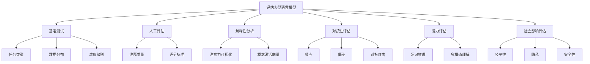

# 大语言模型原理基础与前沿 评估语言模型

## 1. 背景介绍

### 1.1 问题的由来

在自然语言处理(NLP)领域,评估语言模型的质量和性能一直是一个重要且具有挑战性的问题。随着深度学习技术的快速发展,大型语言模型(Large Language Models, LLMs)已经成为NLP任务的主导范式。这些模型通过在大规模语料库上进行预训练,学习到丰富的语言知识和上下文表示,从而在下游任务中表现出卓越的性能。

然而,评估这些大型语言模型的质量和性能存在诸多挑战。传统的评估方法,如困惑度(Perplexity)和精确度(Accuracy),往往无法全面捕捉模型的真实能力。此外,大型语言模型的黑盒性质也使得理解和解释它们的内部工作机制变得更加困难。

### 1.2 研究现状

近年来,研究人员提出了多种评估大型语言模型的新方法,旨在更准确地衡量模型的能力。这些方法包括:

1. **基准测试(Benchmarking)**:设计全面的基准测试集,涵盖不同的任务类型、数据分布和难度级别,以全面评估模型的泛化能力。

2. **人工评估(Human Evaluation)**:通过人工注释和评分,直接评估模型输出的质量和合理性,从而弥补自动评估指标的不足。

3. **解释性分析(Interpretability Analysis)**:通过可解释性技术,如注意力可视化和概念激活向量(Concept Activation Vectors, CAVs),探索模型内部的表示和决策过程。

4. **对抗性评估(Adversarial Evaluation)**:设计对抗性样本,测试模型在面对噪声、偏差和对抗攻击时的鲁棒性。

5. **能力评估(Capability Evaluation)**:评估模型在特定领域或任务上的能力,如常识推理、多模态理解等。

6. **社会影响评估(Social Impact Assessment)**:评估模型在公平性、隐私和安全性等社会层面的影响。

### 1.3 研究意义

评估大型语言模型的质量和性能对于NLP领域的发展至关重要,具有以下重要意义:

1. **模型选择和优化**:通过全面评估,可以比较不同模型的优缺点,选择最佳模型,并优化模型结构和训练策略。

2. **模型解释和可信赖性**:深入理解模型的内部工作机制,提高模型的可解释性和可信赖性,从而促进其在实际应用中的部署和采用。

3. **风险评估和缓解**:识别模型存在的潜在风险,如偏差、不公平和安全隐患,并采取相应的缓解措施。

4. **推动研究创新**:评估结果可以揭示模型的局限性,促进新的研究方向和创新技术的出现。

5. **社会影响和伦理考量**:评估模型在社会层面的影响,确保其符合伦理和道德准则,促进人工智能的可持续发展。

### 1.4 本文结构

本文将全面探讨评估大型语言模型的原理、方法和前沿发展。文章结构如下:

1. 背景介绍
2. 核心概念与联系
3. 核心算法原理与具体操作步骤
4. 数学模型和公式详细讲解与举例说明
5. 项目实践:代码实例和详细解释说明
6. 实际应用场景
7. 工具和资源推荐
8. 总结:未来发展趋势与挑战
9. 附录:常见问题与解答

## 2. 核心概念与联系

评估大型语言模型涉及多个核心概念,它们之间存在着紧密联系。下面将介绍这些核心概念及其相互关系。

1. **基准测试(Benchmarking)**:通过设计全面的基准测试集,可以评估模型在不同任务类型、数据分布和难度级别上的泛化能力。

2. **人工评估(Human Evaluation)**:通过人工注释和评分,可以直接评估模型输出的质量和合理性。注释质量和评分标准是关键因素。

3. **解释性分析(Interpretability Analysis)**:通过注意力可视化和概念激活向量等技术,可以探索模型内部的表示和决策过程,提高模型的可解释性。

4. **对抗性评估(Adversarial Evaluation)**:通过设计噪声、偏差和对抗攻击样本,可以测试模型在面对这些干扰时的鲁棚性。

5. **能力评估(Capability Evaluation)**:通过评估模型在特定领域或任务上的表现,如常识推理、多模态理解等,可以衡量模型的实际能力。

6. **社会影响评估(Social Impact Assessment)**:通过评估模型在公平性、隐私和安全性等方面的影响,可以确保模型符合伦理和道德准则。

这些核心概念相互关联,共同构成了评估大型语言模型的整体框架。只有综合运用多种评估方法,才能全面、准确地评估模型的质量和性能。

## 3. 核心算法原理与具体操作步骤

### 3.1 算法原理概述

评估大型语言模型的核心算法原理可以概括为以下几个方面:

1. **基准测试集构建**:设计全面的基准测试集,涵盖不同的任务类型、数据分布和难度级别,以评估模型的泛化能力。

2. **人工注释和评分**:通过人工注释和评分,直接评估模型输出的质量和合理性,弥补自动评估指标的不足。

3. **可解释性技术**:利用注意力可视化、概念激活向量等技术,探索模型内部的表示和决策过程,提高模型的可解释性。

4. **对抗样本生成**:通过添加噪声、引入偏差或构造对抗攻击样本,测试模型在面对这些干扰时的鲁棚性。

5. **能力测试**:设计特定的测试集,评估模型在常识推理、多模态理解等特定领域或任务上的能力。

6. **社会影响评估**:评估模型在公平性、隐私和安全性等方面的影响,确保其符合伦理和道德准则。

这些核心算法原理相互补充,共同构建了一个全面、系统的评估框架。

### 3.2 算法步骤详解

评估大型语言模型的具体操作步骤如下:

1. **确定评估目标**:明确评估的目的,是否侧重于模型的泛化能力、可解释性、鲁棚性、特定能力还是社会影响等方面。

2. **构建测试集**:根据评估目标,构建相应的测试集。对于基准测试,需要涵盖不同任务类型、数据分布和难度级别;对于能力评估,需要设计特定领域或任务的测试集;对于对抗性评估,需要生成噪声、偏差或对抗攻击样本。

3. **人工注释和评分(可选)**:如果需要人工评估,则需要设计注释指南和评分标准,并组织人工注释和评分过程。

4. **模型评估**:在构建好的测试集上运行待评估的语言模型,获取模型输出。

5. **结果分析**:根据评估目标,分析模型在测试集上的表现,计算相应的评估指标。对于可解释性分析,需要应用注意力可视化、概念激活向量等技术;对于社会影响评估,需要分析模型在公平性、隐私和安全性等方面的影响。

6. **结果报告**:总结评估结果,并提出模型优化或改进的建议。

7. **迭代优化**:根据评估结果,优化模型结构、训练策略或数据预处理方式,重复上述步骤,直至达到满意的性能。

### 3.3 算法优缺点

评估大型语言模型的算法具有以下优缺点:

**优点**:

1. 全面性:综合运用多种评估方法,可以全面评估模型的不同方面,包括泛化能力、可解释性、鲁棚性、特定能力和社会影响等。

2. 可解释性:通过可解释性技术,可以深入探索模型的内部工作机制,提高模型的透明度和可信赖性。

3. 发现缺陷:通过对抗性评估和能力评估,可以发现模型存在的缺陷和局限性,为后续优化提供依据。

4. 社会影响考量:评估模型在公平性、隐私和安全性等方面的影响,确保其符合伦理和道德准则。

**缺点**:

1. 评估成本高:构建全面的测试集、组织人工注释和评分过程,以及应用可解释性技术等,都需要大量的人力和计算资源。

2. 评估标准缺乏一致性:不同评估方法采用的指标和标准存在差异,难以进行横向比较和综合评判。

3. 评估结果解释困难:评估结果往往难以直接解释模型的内在机制,需要进一步的分析和研究。

4. 评估范围有限:当前的评估方法主要关注模型的语言能力,对于其他能力(如推理、多模态理解等)的评估仍有局限性。

### 3.4 算法应用领域

评估大型语言模型的算法可以广泛应用于以下领域:

1. **自然语言处理任务**:包括机器翻译、文本摘要、问答系统、情感分析等,评估模型在这些任务上的性能和泛化能力。

2. **对话系统**:评估模型在开放域对话、任务导向对话等场景下的自然语言交互能力。

3. **文本生成**:评估模型在新闻写作、故事创作、广告文案等文本生成任务上的表现。

4. **知识图谱构建**:评估模型在实体识别、关系抽取、知识推理等知识图谱构建任务上的能力。

5. **社会计算**:评估模型在检测虚假信息、有害内容等社会计算任务上的表现,以及对公平性、隐私和安全性的影响。

6. **人工智能伦理**:评估模型在伦理和道德方面的影响,确保其符合相关准则和原则。

7. **其他领域**:随着大型语言模型在更多领域的应用,评估算法也可以扩展到相应的领域,如医疗、法律、金融等。

通过全面评估,可以深入了解大型语言模型的优缺点,指导模型的优化和应用,促进人工智能技术的健康发展。

## 4. 数学模型和公式详细讲解与举例说明

### 4.1 数学模型构建

评估大型语言模型涉及多种数学模型和公式,用于量化模型的性能和特征。下面将介绍一些常见的数学模型。

**1. 困惑度(Perplexity)**

困惑度是评估语言模型质量的传统指标,反映了模型对语料库的拟合程度。困惑度的计算公式如下:

$$\text{Perplexity}(W) = \sqrt[N]{\prod_{i=1}^{N} \frac{1}{P(w_i|w_1,...,w_{i-1})}}$$

其中,$$W$$ 表示语料库,$$N$$ 表示语料库中的词数,$$P(w_i|w_1,...,w_{i-1})$$ 表示模型预测第 $$i$$ 个词 $$w_i$$ 的概率,给定前 $$i-1$$ 个词的上下文。

困惑度值越小,表示模型对语料库的拟合程度越高,预测能力越强。然而,困惑度只能反映模